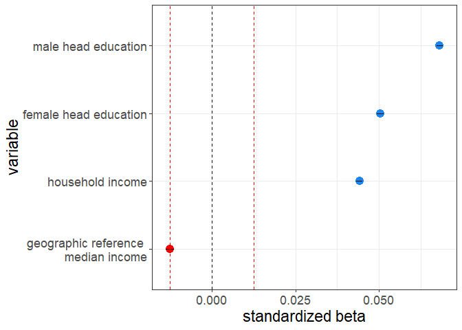

Nielsen Relative Status Regression Analysis
================
Daniel O’Leary
4/12/2021

  - [Setup](#setup)
      - [Load Packages](#load-packages)
      - [Load Data](#load-data)
  - [Analysis](#analysis)
      - [Demographic reference income](#demographic-reference-income)
          - [Outcome: % of monthly household calorie budget that goes to
            QFAHPD healthy
            categories](#outcome--of-monthly-household-calorie-budget-that-goes-to-qfahpd-healthy-categories)
              - [Fit model](#fit-model)
              - [Plot results](#plot-results)
          - [Outcome: % of monthly household food spend that goes to
            QFAHPD healthy
            categories](#outcome--of-monthly-household-food-spend-that-goes-to-qfahpd-healthy-categories)
              - [Fit model](#fit-model-1)
              - [Plot results](#plot-results-1)
      - [Geographic reference income](#geographic-reference-income)
          - [Outcome: % of monthly household calorie budget that goes to
            QFAHPD healthy
            categories](#outcome--of-monthly-household-calorie-budget-that-goes-to-qfahpd-healthy-categories-1)
              - [Fit model](#fit-model-2)
              - [Plot results](#plot-results-2)
          - [Outcome: % of monthly household food spend that goes to
            QFAHPD healthy
            categories](#outcome--of-monthly-household-food-spend-that-goes-to-qfahpd-healthy-categories-1)
              - [Fit model](#fit-model-3)
              - [Plot results](#plot-results-3)
      - [Regression Table](#regression-table)

# Setup

## Load Packages

## Load Data

``` r
qhc_isc_mo_sec_tp <-
  read_csv("D:/data/nielsen/calories_extracts/qfahpd_health_calories_imputed_sc_by_household_monthly/combined/qhc_isc_mo_sec_tp.csv") %>% 
  mutate(across(c(month, year, Race, Marital_Status), as.factor)) %>% 
  mutate(yes_cal = yes_scale) 
```

    ## 
    ## -- Column specification --------------------------------------------------------
    ## cols(
    ##   .default = col_double(),
    ##   Wic_Indicator_Current = col_logical(),
    ##   state_fips = col_character(),
    ##   cty_fips = col_character(),
    ##   fips_code = col_character(),
    ##   zip = col_character(),
    ##   dentists_scale = col_logical(),
    ##   therapists_scale = col_logical(),
    ##   Panel_Year_scale = col_logical()
    ## )
    ## i Use `spec()` for the full column specifications.

    ## Warning: 6438196 parsing failures.
    ##     row            col           expected              actual                                                                                                                      file
    ## 3219284 dentists_scale 1/0/T/F/TRUE/FALSE 0.04515308219498692 'D:/data/nielsen/calories_extracts/qfahpd_health_calories_imputed_sc_by_household_monthly/combined/qhc_isc_mo_sec_tp.csv'
    ## 3219285 dentists_scale 1/0/T/F/TRUE/FALSE 0.04515308219498692 'D:/data/nielsen/calories_extracts/qfahpd_health_calories_imputed_sc_by_household_monthly/combined/qhc_isc_mo_sec_tp.csv'
    ## 3219286 dentists_scale 1/0/T/F/TRUE/FALSE 0.04515308219498692 'D:/data/nielsen/calories_extracts/qfahpd_health_calories_imputed_sc_by_household_monthly/combined/qhc_isc_mo_sec_tp.csv'
    ## 3219287 dentists_scale 1/0/T/F/TRUE/FALSE 0.04515308219498692 'D:/data/nielsen/calories_extracts/qfahpd_health_calories_imputed_sc_by_household_monthly/combined/qhc_isc_mo_sec_tp.csv'
    ## 3219288 dentists_scale 1/0/T/F/TRUE/FALSE 0.04515308219498692 'D:/data/nielsen/calories_extracts/qfahpd_health_calories_imputed_sc_by_household_monthly/combined/qhc_isc_mo_sec_tp.csv'
    ## ....... .............. .................. ................... .........................................................................................................................
    ## See problems(...) for more details.

``` r
qhs_isc_mo_sec_tp  <-
  read_csv("D:/data/nielsen/spend_extracts/qfahpd_health_spend_by_household_monthly/combined/qhs_isc_mo_sec_tp.csv") %>% 
  mutate(across(c(month, year, Race, Marital_Status), as.factor)) %>% 
  mutate(yes_spend = yes_scale) 
```

    ## 
    ## -- Column specification --------------------------------------------------------
    ## cols(
    ##   .default = col_double(),
    ##   Wic_Indicator_Current = col_logical(),
    ##   state_fips = col_character(),
    ##   cty_fips = col_character(),
    ##   fips_code = col_character(),
    ##   zip = col_character(),
    ##   dentists_scale = col_logical(),
    ##   therapists_scale = col_logical(),
    ##   Panel_Year_scale = col_logical()
    ## )
    ## i Use `spec()` for the full column specifications.

    ## Warning: 6472163 parsing failures.
    ##     row            col           expected              actual                                                                                                     file
    ## 3231540 dentists_scale 1/0/T/F/TRUE/FALSE 0.04515308219498692 'D:/data/nielsen/spend_extracts/qfahpd_health_spend_by_household_monthly/combined/qhs_isc_mo_sec_tp.csv'
    ## 3231541 dentists_scale 1/0/T/F/TRUE/FALSE 0.04515308219498692 'D:/data/nielsen/spend_extracts/qfahpd_health_spend_by_household_monthly/combined/qhs_isc_mo_sec_tp.csv'
    ## 3231542 dentists_scale 1/0/T/F/TRUE/FALSE 0.04515308219498692 'D:/data/nielsen/spend_extracts/qfahpd_health_spend_by_household_monthly/combined/qhs_isc_mo_sec_tp.csv'
    ## 3231543 dentists_scale 1/0/T/F/TRUE/FALSE 0.04515308219498692 'D:/data/nielsen/spend_extracts/qfahpd_health_spend_by_household_monthly/combined/qhs_isc_mo_sec_tp.csv'
    ## 3231544 dentists_scale 1/0/T/F/TRUE/FALSE 0.04515308219498692 'D:/data/nielsen/spend_extracts/qfahpd_health_spend_by_household_monthly/combined/qhs_isc_mo_sec_tp.csv'
    ## ....... .............. .................. ................... ........................................................................................................
    ## See problems(...) for more details.

# Analysis

## Demographic reference income

### Outcome: % of monthly household calorie budget that goes to QFAHPD healthy categories

#### Fit model

``` r
lm_dri_cal <-
  lm(
    yes_cal ~
      income_demo_ranger_sar_scale +
      income_scale +
      Male_Head_Education_scale +
      Female_Head_Education_scale +
      Male_Head_Age_scale + 
      Female_Head_Age_scale +
      scale(Male_Head_Employment) +
      scale(Female_Head_Employment) +
      median_home_value_county_scale +
      land_area_2010_scale +
      total_pop_county_scale +
      physicians_scale +
      Race +
      Marital_Status +
      household_size_scale +
      month + 
      year,
    data = 
      qhc_isc_mo_sec_tp  %>% 
      filter(year %in% c(2004:2016)) 
  )

summary(lm_dri_cal)
```

    ## 
    ## Call:
    ## lm(formula = yes_cal ~ income_demo_ranger_sar_scale + income_scale + 
    ##     Male_Head_Education_scale + Female_Head_Education_scale + 
    ##     Male_Head_Age_scale + Female_Head_Age_scale + scale(Male_Head_Employment) + 
    ##     scale(Female_Head_Employment) + median_home_value_county_scale + 
    ##     land_area_2010_scale + total_pop_county_scale + physicians_scale + 
    ##     Race + Marital_Status + household_size_scale + month + year, 
    ##     data = qhc_isc_mo_sec_tp %>% filter(year %in% c(2004:2016)))
    ## 
    ## Residuals:
    ##     Min      1Q  Median      3Q     Max 
    ## -2.3979 -0.6965 -0.1859  0.4931  5.8441 
    ## 
    ## Coefficients:
    ##                                  Estimate Std. Error  t value Pr(>|t|)    
    ## (Intercept)                     0.1264500  0.0023845   53.030  < 2e-16 ***
    ## income_demo_ranger_sar_scale   -0.1320937  0.0010337 -127.785  < 2e-16 ***
    ## income_scale                    0.0493238  0.0004970   99.245  < 2e-16 ***
    ## Male_Head_Education_scale       0.0656894  0.0004890  134.342  < 2e-16 ***
    ## Female_Head_Education_scale     0.0509322  0.0004941  103.079  < 2e-16 ***
    ## Male_Head_Age_scale             0.0202984  0.0008910   22.781  < 2e-16 ***
    ## Female_Head_Age_scale           0.0245264  0.0009050   27.100  < 2e-16 ***
    ## scale(Male_Head_Employment)     0.0052026  0.0005155   10.093  < 2e-16 ***
    ## scale(Female_Head_Employment)   0.0128502  0.0004642   27.685  < 2e-16 ***
    ## median_home_value_county_scale  0.0091071  0.0005089   17.896  < 2e-16 ***
    ## land_area_2010_scale           -0.0095954  0.0004573  -20.984  < 2e-16 ***
    ## total_pop_county_scale         -0.0050549  0.0004988  -10.134  < 2e-16 ***
    ## physicians_scale                0.0053982  0.0005072   10.643  < 2e-16 ***
    ## Race2                           0.1271503  0.0016617   76.516  < 2e-16 ***
    ## Race3                           0.2479565  0.0024987   99.232  < 2e-16 ***
    ## Race4                           0.0177362  0.0020175    8.791  < 2e-16 ***
    ## Marital_Status2                -0.1278387  0.0046523  -27.478  < 2e-16 ***
    ## Marital_Status3                -0.1223626  0.0029134  -42.000  < 2e-16 ***
    ## Marital_Status4                -0.0974673  0.0030160  -32.317  < 2e-16 ***
    ## household_size_scale           -0.0519544  0.0004841 -107.312  < 2e-16 ***
    ## month2                         -0.0602175  0.0020804  -28.946  < 2e-16 ***
    ## month3                         -0.0666861  0.0020716  -32.190  < 2e-16 ***
    ## month4                         -0.0809148  0.0020726  -39.040  < 2e-16 ***
    ## month5                         -0.1512102  0.0020729  -72.948  < 2e-16 ***
    ## month6                         -0.1674383  0.0020762  -80.646  < 2e-16 ***
    ## month7                         -0.1711024  0.0020754  -82.442  < 2e-16 ***
    ## month8                         -0.1669018  0.0020753  -80.425  < 2e-16 ***
    ## month9                         -0.1335018  0.0020769  -64.279  < 2e-16 ***
    ## month10                        -0.1425425  0.0020762  -68.654  < 2e-16 ***
    ## month11                         0.0429696  0.0020796   20.663  < 2e-16 ***
    ## month12                        -0.1048951  0.0020837  -50.340  < 2e-16 ***
    ## year2005                       -0.0792839  0.0026927  -29.444  < 2e-16 ***
    ## year2006                        0.0160319  0.0026473    6.056  1.4e-09 ***
    ## year2007                        0.0404374  0.0023421   17.265  < 2e-16 ***
    ## year2008                        0.0418844  0.0023573   17.768  < 2e-16 ***
    ## year2009                        0.0430519  0.0023706   18.161  < 2e-16 ***
    ## year2010                        0.0433362  0.0023728   18.264  < 2e-16 ***
    ## year2011                        0.0430424  0.0023606   18.234  < 2e-16 ***
    ## year2012                        0.0215612  0.0023697    9.099  < 2e-16 ***
    ## year2013                        0.0226511  0.0023688    9.562  < 2e-16 ***
    ## year2014                        0.0372491  0.0023766   15.673  < 2e-16 ***
    ## year2015                        0.0483863  0.0023931   20.219  < 2e-16 ***
    ## year2016                        0.0556019  0.0023845   23.318  < 2e-16 ***
    ## ---
    ## Signif. codes:  0 '***' 0.001 '**' 0.01 '*' 0.05 '.' 0.1 ' ' 1
    ## 
    ## Residual standard error: 0.9828 on 5412427 degrees of freedom
    ##   (107454 observations deleted due to missingness)
    ## Multiple R-squared:  0.03431,    Adjusted R-squared:  0.0343 
    ## F-statistic:  4578 on 42 and 5412427 DF,  p-value: < 2.2e-16

``` r
tidy_lm_dri_cal <- tidy(lm_dri_cal)
```

#### Plot results

``` r
est <- 
  tidy_lm_dri_cal %>% 
  dplyr::filter(term == "income_demo_ranger_sar_scale") %>% 
  dplyr::select(estimate)

tidy_lm_dri_cal <-
  tidy_lm_dri_cal %>% 
  mutate(
    dot_color = ifelse(estimate < 0, "red1", ifelse(estimate > 0, "dodgerblue2", NA)),
    se = std.error
  )

tidy_lm_dri_cal <-
  tidy_lm_dri_cal %>% 
  filter(
    term == "income_demo_ranger_sar_scale" |
    term == "income_scale" |
    term == "Male_Head_Education_scale" | 
    term == "Female_Head_Education_scale" 
  ) %>% 
  mutate(
    variable = 
      case_when(
        term == "income_demo_ranger_sar_scale" ~ "demographic reference \n median income",
        term == "income_scale" ~ "household income",
        term == "Male_Head_Education_scale" ~ "male head education",
        term == "Female_Head_Education_scale" ~ "female head education"
      )
  ) 

col <- as.character(tidy_lm_dri_cal$dot_color)
names(col) <- as.character(tidy_lm_dri_cal$dot_color)

qh_dri_calories_monthly <-
  tidy_lm_dri_cal %>% 
  ggplot(aes(reorder(as.factor(variable), estimate), estimate)) +
  geom_point(aes(color = dot_color), size = 4) +
  geom_errorbar(aes(ymin = estimate - 2 * se, ymax = estimate + 2 * se), width = 0) + 
  scale_color_manual(values = col) +
  geom_hline(yintercept = -abs(est$estimate), linetype = "dashed", color = "red") +
  geom_hline(yintercept = 0, linetype = "dashed") +
  geom_hline(yintercept = abs(est$estimate), linetype = "dashed", color = "red") +
  scale_y_continuous(
    breaks = c( -0.3, -0.2, -0.1, 0, 0.1, 0.2, 0.3),
    limits = c(-0.35, 0.35)
  ) +
  labs(
    y = "standardized beta",
    x = "variable"
  ) +
  theme_bw() +
  theme(
    text = element_text(size = 17),
    plot.title = element_text(hjust = 0.5),
    legend.position = "none"
  ) +
  coord_flip()

qh_dri_calories_monthly
```

<!-- -->

``` r
ggsave(
  "G:/My Drive/research/projects/niel/nielsen_relative_income/plots/qh_dri_calories_monthly.png",
  qh_dri_calories_monthly,
  width = 4,
  height = 2,
  dpi = 750
)
```

### Outcome: % of monthly household food spend that goes to QFAHPD healthy categories

#### Fit model

``` r
lm_dri_spn <-
  lm(
    yes_spend ~
      income_demo_ranger_sar_scale +
      income_scale +
      Male_Head_Education_scale +
      Female_Head_Education_scale +
      Male_Head_Age_scale + 
      Female_Head_Age_scale +
      scale(Male_Head_Employment) +
      scale(Female_Head_Employment) +
      median_home_value_county_scale +
      land_area_2010_scale +
      total_pop_county_scale +
      physicians_scale +
      Race +
      Marital_Status +
      household_size_scale +
      month + 
      year,
    data = 
      qhs_isc_mo_sec_tp %>% 
      filter(year %in% c(2004:2016))
  )

summary(lm_dri_spn)
```

    ## 
    ## Call:
    ## lm(formula = yes_spend ~ income_demo_ranger_sar_scale + income_scale + 
    ##     Male_Head_Education_scale + Female_Head_Education_scale + 
    ##     Male_Head_Age_scale + Female_Head_Age_scale + scale(Male_Head_Employment) + 
    ##     scale(Female_Head_Employment) + median_home_value_county_scale + 
    ##     land_area_2010_scale + total_pop_county_scale + physicians_scale + 
    ##     Race + Marital_Status + household_size_scale + month + year, 
    ##     data = qhs_isc_mo_sec_tp %>% filter(year %in% c(2004:2016)))
    ## 
    ## Residuals:
    ##     Min      1Q  Median      3Q     Max 
    ## -3.3140 -0.6511 -0.0811  0.5564  8.3124 
    ## 
    ## Coefficients:
    ##                                  Estimate Std. Error  t value Pr(>|t|)    
    ## (Intercept)                     0.0714848  0.0023386   30.567  < 2e-16 ***
    ## income_demo_ranger_sar_scale   -0.1664541  0.0010121 -164.458  < 2e-16 ***
    ## income_scale                    0.0596990  0.0004868  122.636  < 2e-16 ***
    ## Male_Head_Education_scale       0.1018722  0.0004791  212.654  < 2e-16 ***
    ## Female_Head_Education_scale     0.0857702  0.0004841  177.183  < 2e-16 ***
    ## Male_Head_Age_scale             0.0249447  0.0008723   28.597  < 2e-16 ***
    ## Female_Head_Age_scale           0.0360813  0.0008860   40.723  < 2e-16 ***
    ## scale(Male_Head_Employment)    -0.0011020  0.0005050   -2.182  0.02909 *  
    ## scale(Female_Head_Employment)   0.0075088  0.0004547   16.513  < 2e-16 ***
    ## median_home_value_county_scale  0.0626317  0.0004986  125.620  < 2e-16 ***
    ## land_area_2010_scale            0.0012747  0.0004480    2.845  0.00443 ** 
    ## total_pop_county_scale         -0.0072091  0.0004883  -14.764  < 2e-16 ***
    ## physicians_scale                0.0273199  0.0004971   54.958  < 2e-16 ***
    ## Race2                           0.0140777  0.0016235    8.671  < 2e-16 ***
    ## Race3                           0.2328741  0.0024419   95.367  < 2e-16 ***
    ## Race4                          -0.0112461  0.0019735   -5.698 1.21e-08 ***
    ## Marital_Status2                -0.1668692  0.0045520  -36.659  < 2e-16 ***
    ## Marital_Status3                -0.1438145  0.0028512  -50.439  < 2e-16 ***
    ## Marital_Status4                -0.1121785  0.0029460  -38.078  < 2e-16 ***
    ## household_size_scale           -0.0656575  0.0004740 -138.509  < 2e-16 ***
    ## month2                          0.0018925  0.0020394    0.928  0.35342    
    ## month3                          0.0117906  0.0020311    5.805 6.43e-09 ***
    ## month4                          0.0100669  0.0020316    4.955 7.22e-07 ***
    ## month5                         -0.0084803  0.0020317   -4.174 2.99e-05 ***
    ## month6                         -0.0048036  0.0020346   -2.361  0.01823 *  
    ## month7                         -0.0431318  0.0020339  -21.207  < 2e-16 ***
    ## month8                         -0.0968745  0.0020337  -47.635  < 2e-16 ***
    ## month9                         -0.0724954  0.0020351  -35.622  < 2e-16 ***
    ## month10                        -0.0881747  0.0020346  -43.337  < 2e-16 ***
    ## month11                        -0.0217796  0.0020382  -10.686  < 2e-16 ***
    ## month12                        -0.1190674  0.0020416  -58.322  < 2e-16 ***
    ## year2005                       -0.1003740  0.0026409  -38.008  < 2e-16 ***
    ## year2006                        0.0203731  0.0025964    7.847 4.28e-15 ***
    ## year2007                        0.0478266  0.0022966   20.825  < 2e-16 ***
    ## year2008                        0.0492743  0.0023116   21.316  < 2e-16 ***
    ## year2009                        0.0513020  0.0023247   22.068  < 2e-16 ***
    ## year2010                        0.0521016  0.0023268   22.392  < 2e-16 ***
    ## year2011                        0.0518316  0.0023150   22.389  < 2e-16 ***
    ## year2012                        0.0267654  0.0023232   11.521  < 2e-16 ***
    ## year2013                        0.0317077  0.0023221   13.655  < 2e-16 ***
    ## year2014                        0.0495216  0.0023296   21.258  < 2e-16 ***
    ## year2015                        0.0640392  0.0023448   27.311  < 2e-16 ***
    ## year2016                        0.0725018  0.0023362   31.034  < 2e-16 ***
    ## ---
    ## Signif. codes:  0 '***' 0.001 '**' 0.01 '*' 0.05 '.' 0.1 ' ' 1
    ## 
    ## Residual standard error: 0.9663 on 5450543 degrees of freedom
    ##   (92416 observations deleted due to missingness)
    ## Multiple R-squared:  0.06662,    Adjusted R-squared:  0.06661 
    ## F-statistic:  9263 on 42 and 5450543 DF,  p-value: < 2.2e-16

``` r
tidy_lm_dri_spn <- tidy(lm_dri_spn)
```

#### Plot results

``` r
est <- 
  tidy_lm_dri_spn %>% 
  dplyr::filter(term == "income_demo_ranger_sar_scale") %>% 
  dplyr::select(estimate)

tidy_lm_dri_spn <-
  tidy_lm_dri_spn %>% 
  mutate(
    dot_color = ifelse(estimate < 0, "red1", ifelse(estimate > 0, "dodgerblue2", NA)),
    se = std.error
  )

tidy_lm_dri_spn <-
  tidy_lm_dri_spn %>% 
  filter(
    term == "income_demo_ranger_sar_scale" |
    term == "income_scale" |
    term == "Male_Head_Education_scale" | 
    term == "Female_Head_Education_scale" 
  ) %>% 
  mutate(
    variable = 
      case_when(
        term == "income_demo_ranger_sar_scale" ~ "demographic reference \n median income",
        term == "income_scale" ~ "household income",
        term == "Male_Head_Education_scale" ~ "male head education",
        term == "Female_Head_Education_scale" ~ "female head education"
      )
  ) 

col <- as.character(tidy_lm_dri_spn$dot_color)
names(col) <- as.character(tidy_lm_dri_spn$dot_color)

qh_dri_spend_monthly <-
  tidy_lm_dri_spn %>% 
  ggplot(aes(reorder(as.factor(variable), estimate), estimate)) +
  geom_point(aes(color = dot_color), size = 4) +
  geom_errorbar(aes(ymin = estimate - 2 * se, ymax = estimate + 2 * se), width = 0) + 
  scale_color_manual(values = col) +
  geom_hline(yintercept = -abs(est$estimate), linetype = "dashed", color = "red") +
  geom_hline(yintercept = 0, linetype = "dashed") +
  geom_hline(yintercept = abs(est$estimate), linetype = "dashed", color = "red") +
  scale_y_continuous(
    breaks = c( -0.3, -0.2, -0.1, 0, 0.1, 0.2, 0.3),
    limits = c(-0.35, 0.35)
  ) +
  labs(
    y = "standardized beta",
    x = "variable"
  ) +
  theme_bw() +
  theme(
    text = element_text(size = 17),
    plot.title = element_text(hjust = 0.5),
    legend.position = "none"
  ) +
  coord_flip()

qh_dri_calories_monthly
```

<!-- -->

``` r
ggsave(
  "G:/My Drive/research/projects/niel/nielsen_relative_income/plots/qh_dri_spend_monthly.png",
  qh_dri_spend_monthly,
  width = 6,
  height = 4,
  dpi = 750
)
```

## Geographic reference income

### Outcome: % of monthly household calorie budget that goes to QFAHPD healthy categories

#### Fit model

``` r
lm_gri_cal <-
  lm(
    yes_cal ~
      median_income_county_scale +
      income_scale +
      Male_Head_Education_scale +
      Female_Head_Education_scale +
      Male_Head_Age_scale + 
      Female_Head_Age_scale +
      scale(Male_Head_Employment) +
      scale(Female_Head_Employment) +
      median_home_value_county_scale +
      land_area_2010_scale +
      total_pop_county_scale +
      physicians_scale +
      Race +
      Marital_Status +
      household_size_scale +
      month + 
      year,
    data = 
      qhc_isc_mo_sec_tp %>% 
      filter(year %in% c(2004:2016)) 
  )

summary(lm_gri_cal)
```

    ## 
    ## Call:
    ## lm(formula = yes_cal ~ median_income_county_scale + income_scale + 
    ##     Male_Head_Education_scale + Female_Head_Education_scale + 
    ##     Male_Head_Age_scale + Female_Head_Age_scale + scale(Male_Head_Employment) + 
    ##     scale(Female_Head_Employment) + median_home_value_county_scale + 
    ##     land_area_2010_scale + total_pop_county_scale + physicians_scale + 
    ##     Race + Marital_Status + household_size_scale + month + year, 
    ##     data = qhc_isc_mo_sec_tp %>% filter(year %in% c(2004:2016)))
    ## 
    ## Residuals:
    ##     Min      1Q  Median      3Q     Max 
    ## -2.3175 -0.6987 -0.1863  0.4946  5.8157 
    ## 
    ## Coefficients:
    ##                                  Estimate Std. Error  t value Pr(>|t|)    
    ## (Intercept)                     0.0826519  0.0023541   35.110   <2e-16 ***
    ## median_income_county_scale     -0.0125624  0.0006300  -19.941   <2e-16 ***
    ## income_scale                    0.0441595  0.0004977   88.724   <2e-16 ***
    ## Male_Head_Education_scale       0.0682261  0.0004887  139.611   <2e-16 ***
    ## Female_Head_Education_scale     0.0504345  0.0004938  102.138   <2e-16 ***
    ## Male_Head_Age_scale             0.0234902  0.0008888   26.428   <2e-16 ***
    ## Female_Head_Age_scale           0.0321779  0.0009009   35.717   <2e-16 ***
    ## scale(Male_Head_Employment)     0.0215520  0.0004992   43.173   <2e-16 ***
    ## scale(Female_Head_Employment)   0.0234125  0.0004565   51.285   <2e-16 ***
    ## median_home_value_county_scale  0.0196853  0.0006956   28.299   <2e-16 ***
    ## land_area_2010_scale           -0.0095911  0.0004566  -21.006   <2e-16 ***
    ## total_pop_county_scale         -0.0067485  0.0005080  -13.285   <2e-16 ***
    ## physicians_scale                0.0065825  0.0005077   12.965   <2e-16 ***
    ## Race2                           0.1290725  0.0016622   77.653   <2e-16 ***
    ## Race3                           0.1690771  0.0024234   69.768   <2e-16 ***
    ## Race4                           0.0483855  0.0019930   24.278   <2e-16 ***
    ## Marital_Status2                -0.0670710  0.0046248  -14.502   <2e-16 ***
    ## Marital_Status3                -0.1122839  0.0029104  -38.581   <2e-16 ***
    ## Marital_Status4                -0.0707900  0.0030002  -23.595   <2e-16 ***
    ## household_size_scale           -0.0604209  0.0004783 -126.324   <2e-16 ***
    ## month2                         -0.0601127  0.0020798  -28.903   <2e-16 ***
    ## month3                         -0.0664170  0.0020710  -32.070   <2e-16 ***
    ## month4                         -0.0806343  0.0020720  -38.916   <2e-16 ***
    ## month5                         -0.1510190  0.0020723  -72.877   <2e-16 ***
    ## month6                         -0.1671609  0.0020756  -80.536   <2e-16 ***
    ## month7                         -0.1707926  0.0020748  -82.316   <2e-16 ***
    ## month8                         -0.1667441  0.0020747  -80.372   <2e-16 ***
    ## month9                         -0.1331805  0.0020763  -64.142   <2e-16 ***
    ## month10                        -0.1423973  0.0020756  -68.604   <2e-16 ***
    ## month11                         0.0430158  0.0020790   20.690   <2e-16 ***
    ## month12                        -0.1047042  0.0020831  -50.263   <2e-16 ***
    ## year2005                        0.0002065  0.0026095    0.079   0.9369    
    ## year2006                       -0.0003083  0.0026274   -0.117   0.9066    
    ## year2007                        0.0043326  0.0023223    1.866   0.0621 .  
    ## year2008                        0.0048467  0.0023364    2.074   0.0380 *  
    ## year2009                        0.0036456  0.0023474    1.553   0.1204    
    ## year2010                        0.0021455  0.0023478    0.914   0.3608    
    ## year2011                        0.0006718  0.0023336    0.288   0.7734    
    ## year2012                       -0.0019641  0.0023591   -0.833   0.4051    
    ## year2013                       -0.0022367  0.0023575   -0.949   0.3427    
    ## year2014                       -0.0021502  0.0023541   -0.913   0.3610    
    ## year2015                       -0.0028056  0.0023573   -1.190   0.2340    
    ## year2016                       -0.0019177  0.0023398   -0.820   0.4124    
    ## ---
    ## Signif. codes:  0 '***' 0.001 '**' 0.01 '*' 0.05 '.' 0.1 ' ' 1
    ## 
    ## Residual standard error: 0.9842 on 5430874 degrees of freedom
    ##   (89007 observations deleted due to missingness)
    ## Multiple R-squared:  0.03149,    Adjusted R-squared:  0.03149 
    ## F-statistic:  4205 on 42 and 5430874 DF,  p-value: < 2.2e-16

``` r
tidy_lm_gri_cal <- tidy(lm_gri_cal)
```

#### Plot results

``` r
est <- 
  tidy_lm_gri_cal %>% 
  dplyr::filter(term == "median_income_county_scale") %>% 
  dplyr::select(estimate)

tidy_lm_gri_cal <-
  tidy_lm_gri_cal %>% 
  mutate(
    dot_color = ifelse(estimate < 0, "red1", ifelse(estimate > 0, "dodgerblue2", NA)),
    se = std.error
  )

tidy_lm_gri_cal <-
  tidy_lm_gri_cal %>% 
  filter(
    term == "median_income_county_scale" |
    term == "income_scale" |
    term == "Male_Head_Education_scale" | 
    term == "Female_Head_Education_scale" 
  ) %>% 
  mutate(
    variable = 
      case_when(
        term == "median_income_county_scale" ~ "geographic reference \n median income",
        term == "income_scale" ~ "household income",
        term == "Male_Head_Education_scale" ~ "male head education",
        term == "Female_Head_Education_scale" ~ "female head education"
      )
  ) 

col <- as.character(tidy_lm_gri_cal$dot_color)
names(col) <- as.character(tidy_lm_gri_cal$dot_color)

qh_gri_calories_monthly <-
  tidy_lm_gri_cal %>% 
  ggplot(aes(reorder(as.factor(variable), estimate), estimate)) +
  geom_point(aes(color = dot_color), size = 4) +
  geom_errorbar(aes(ymin = estimate - 2 * se, ymax = estimate + 2 * se), width = 0) + 
  scale_color_manual(values = col) +
  geom_hline(yintercept = -abs(est$estimate), linetype = "dashed", color = "red") +
  geom_hline(yintercept = 0, linetype = "dashed") +
  geom_hline(yintercept = abs(est$estimate), linetype = "dashed", color = "red") +
  # scale_y_continuous(
  #   breaks = c( -0.3, -0.2, -0.1, 0, 0.1, 0.2, 0.3),
  #   limits = c(-0.35, 0.35)
  # ) +
  labs(
    y = "standardized beta",
    x = "variable"
  ) +
  theme_bw() +
  theme(
    text = element_text(size = 17),
    plot.title = element_text(hjust = 0.5),
    legend.position = "none"
  ) +
  coord_flip()

qh_gri_calories_monthly
```

<!-- -->

``` r
ggsave(
  "G:/My Drive/research/projects/niel/nielsen_relative_income/plots/qh_gri_calories_monthly.png",
  qh_gri_calories_monthly,
  width = 6,
  height = 4,
  dpi = 750
)
```

### Outcome: % of monthly household food spend that goes to QFAHPD healthy categories

#### Fit model

``` r
lm_gri_spn <-
  lm(
    yes_spend ~
      median_income_county_scale +
      income_scale +
      Male_Head_Education_scale +
      Female_Head_Education_scale +
      Male_Head_Age_scale + 
      Female_Head_Age_scale +
      scale(Male_Head_Employment) +
      scale(Female_Head_Employment) +
      median_home_value_county_scale +
      land_area_2010_scale +
      total_pop_county_scale +
      physicians_scale +
      Race +
      Marital_Status +
      household_size_scale +
      month + 
      year,
    data = 
      qhs_isc_mo_sec_tp %>% 
      filter(year %in% c(2004:2016)) 
  )

summary(lm_gri_spn)
```

    ## 
    ## Call:
    ## lm(formula = yes_spend ~ median_income_county_scale + income_scale + 
    ##     Male_Head_Education_scale + Female_Head_Education_scale + 
    ##     Male_Head_Age_scale + Female_Head_Age_scale + scale(Male_Head_Employment) + 
    ##     scale(Female_Head_Employment) + median_home_value_county_scale + 
    ##     land_area_2010_scale + total_pop_county_scale + physicians_scale + 
    ##     Race + Marital_Status + household_size_scale + month + year, 
    ##     data = qhs_isc_mo_sec_tp %>% filter(year %in% c(2004:2016)))
    ## 
    ## Residuals:
    ##     Min      1Q  Median      3Q     Max 
    ## -3.2069 -0.6538 -0.0825  0.5579  8.2815 
    ## 
    ## Coefficients:
    ##                                  Estimate Std. Error  t value Pr(>|t|)    
    ## (Intercept)                     1.520e-02  2.311e-03    6.578 4.76e-11 ***
    ## median_income_county_scale      1.602e-02  6.176e-04   25.943  < 2e-16 ***
    ## income_scale                    5.005e-02  4.879e-04  102.571  < 2e-16 ***
    ## Male_Head_Education_scale       1.042e-01  4.792e-04  217.557  < 2e-16 ***
    ## Female_Head_Education_scale     8.553e-02  4.842e-04  176.660  < 2e-16 ***
    ## Male_Head_Age_scale             2.979e-02  8.709e-04   34.210  < 2e-16 ***
    ## Female_Head_Age_scale           4.568e-02  8.827e-04   51.754  < 2e-16 ***
    ## scale(Male_Head_Employment)     1.971e-02  4.895e-04   40.268  < 2e-16 ***
    ## scale(Female_Head_Employment)   2.097e-02  4.476e-04   46.855  < 2e-16 ***
    ## median_home_value_county_scale  5.191e-02  6.819e-04   76.128  < 2e-16 ***
    ## land_area_2010_scale            3.036e-03  4.477e-04    6.781 1.19e-11 ***
    ## total_pop_county_scale         -3.798e-03  4.977e-04   -7.630 2.35e-14 ***
    ## physicians_scale                2.741e-02  4.980e-04   55.040  < 2e-16 ***
    ## Race2                           1.943e-02  1.625e-03   11.952  < 2e-16 ***
    ## Race3                           1.372e-01  2.370e-03   57.905  < 2e-16 ***
    ## Race4                           3.095e-02  1.951e-03   15.860  < 2e-16 ***
    ## Marital_Status2                -8.707e-02  4.529e-03  -19.227  < 2e-16 ***
    ## Marital_Status3                -1.302e-01  2.851e-03  -45.689  < 2e-16 ***
    ## Marital_Status4                -7.696e-02  2.933e-03  -26.239  < 2e-16 ***
    ## household_size_scale           -7.693e-02  4.687e-04 -164.146  < 2e-16 ***
    ## month2                          1.782e-03  2.040e-03    0.873   0.3826    
    ## month3                          1.192e-02  2.032e-03    5.865 4.50e-09 ***
    ## month4                          1.008e-02  2.033e-03    4.958 7.11e-07 ***
    ## month5                         -8.398e-03  2.033e-03   -4.131 3.61e-05 ***
    ## month6                         -4.698e-03  2.036e-03   -2.308   0.0210 *  
    ## month7                         -4.311e-02  2.035e-03  -21.184  < 2e-16 ***
    ## month8                         -9.683e-02  2.035e-03  -47.588  < 2e-16 ***
    ## month9                         -7.240e-02  2.036e-03  -35.557  < 2e-16 ***
    ## month10                        -8.810e-02  2.036e-03  -43.276  < 2e-16 ***
    ## month11                        -2.170e-02  2.039e-03  -10.640  < 2e-16 ***
    ## month12                        -1.191e-01  2.043e-03  -58.283  < 2e-16 ***
    ## year2005                        2.871e-04  2.562e-03    0.112   0.9108    
    ## year2006                       -1.427e-04  2.579e-03   -0.055   0.9559    
    ## year2007                        3.721e-03  2.279e-03    1.633   0.1026    
    ## year2008                        4.225e-03  2.293e-03    1.842   0.0654 .  
    ## year2009                        3.197e-03  2.304e-03    1.387   0.1653    
    ## year2010                        1.725e-03  2.304e-03    0.749   0.4540    
    ## year2011                       -6.096e-05  2.291e-03   -0.027   0.9788    
    ## year2012                       -1.567e-03  2.315e-03   -0.677   0.4984    
    ## year2013                        1.697e-03  2.313e-03    0.734   0.4630    
    ## year2014                        1.210e-03  2.309e-03    0.524   0.6004    
    ## year2015                        8.718e-04  2.312e-03    0.377   0.7061    
    ## year2016                        1.441e-03  2.294e-03    0.628   0.5300    
    ## ---
    ## Signif. codes:  0 '***' 0.001 '**' 0.01 '*' 0.05 '.' 0.1 ' ' 1
    ## 
    ## Residual standard error: 0.9684 on 5469184 degrees of freedom
    ##   (73775 observations deleted due to missingness)
    ## Multiple R-squared:  0.0622, Adjusted R-squared:  0.06219 
    ## F-statistic:  8637 on 42 and 5469184 DF,  p-value: < 2.2e-16

``` r
tidy_lm_gri_spn <- tidy(lm_gri_spn)
```

#### Plot results

``` r
est <- 
  tidy_lm_gri_spn %>% 
  dplyr::filter(term == "median_income_county_scale") %>% 
  dplyr::select(estimate)

tidy_lm_gri_spn <-
  tidy_lm_gri_spn %>% 
  mutate(
    dot_color = ifelse(estimate < 0, "red1", ifelse(estimate > 0, "dodgerblue2", NA)),
    se = std.error
  )

tidy_lm_gri_spn <-
  tidy_lm_gri_spn %>% 
  filter(
    term == "median_income_county_scale" |
    term == "income_scale" |
    term == "Male_Head_Education_scale" | 
    term == "Female_Head_Education_scale" 
  ) %>% 
  mutate(
    variable = 
      case_when(
        term == "median_income_county_scale" ~ "geographic reference \n median income",
        term == "income_scale" ~ "household income",
        term == "Male_Head_Education_scale" ~ "male head education",
        term == "Female_Head_Education_scale" ~ "female head education"
      )
  ) 

col <- as.character(tidy_lm_gri_spn$dot_color)
names(col) <- as.character(tidy_lm_gri_spn$dot_color)

qh_gri_spend_monthly <-
  tidy_lm_gri_spn %>% 
  ggplot(aes(reorder(as.factor(variable), estimate), estimate)) +
  geom_point(aes(color = dot_color), size = 4) +
  geom_errorbar(aes(ymin = estimate - 2 * se, ymax = estimate + 2 * se), width = 0) + 
  scale_color_manual(values = col) +
  geom_hline(yintercept = -abs(est$estimate), linetype = "dashed", color = "red") +
  geom_hline(yintercept = 0, linetype = "dashed") +
  geom_hline(yintercept = abs(est$estimate), linetype = "dashed", color = "red") +
  # scale_y_continuous(
  #   breaks = c( -0.3, -0.2, -0.1, 0, 0.1, 0.2, 0.3),
  #   limits = c(-0.35, 0.35)
  # ) +
  labs(
    y = "standardized beta",
    x = "variable"
  ) +
  theme_bw() +
  theme(
    text = element_text(size = 17),
    plot.title = element_text(hjust = 0.5),
    legend.position = "none"
  ) +
  coord_flip()

qh_gri_spend_monthly
```

<!-- -->

``` r
ggsave(
  "G:/My Drive/research/projects/niel/nielsen_relative_income/plots/qh_gri_spend_monthly.png",
  qh_gri_spend_monthly,
  width = 6,
  height = 4,
  dpi = 750
)
```

## Regression Table

``` r
stargazer(
  lm_dri_cal, lm_dri_spn, lm_gri_cal, lm_gri_spn,
  ci = TRUE,
  type="html", digits = 2,
  #out="df_risk_all_bin.doc",
  dep.var.labels = c("% of calorie budget for healthy foods", "% of food spend for healthy foods"),
  covariate.labels =
    c(
      "demographic ref. income",
      "geographic ref. income",
      "income",
      "male education",
      "female education",
      "male age",
      "female age",
      "male employment",
      "female employment",
      "median home value",
      "county land area",
      "county population",
      "black/ african american",
      "asian",
      "other",
      "widowed",
      "divorced/separated",
      "single",
      "household size"
    ),
  omit = c("month", "year"),
  star.char = c("*", "**", "***"),
  star.cutoffs = c(0.05, 0.01, 0.001),
  notes = c("* p<0.05; ** p<0.01; *** p<0.001")
)
```

<table style="text-align:center">

<tr>

<td colspan="5" style="border-bottom: 1px solid black">

</td>

</tr>

<tr>

<td style="text-align:left">

</td>

<td colspan="4">

<em>Dependent variable:</em>

</td>

</tr>

<tr>

<td>

</td>

<td colspan="4" style="border-bottom: 1px solid black">

</td>

</tr>

<tr>

<td style="text-align:left">

</td>

<td>

% of calorie budget for healthy foods

</td>

<td>

% of food spend for healthy foods

</td>

<td>

yes\_cal

</td>

<td>

yes\_spend

</td>

</tr>

<tr>

<td style="text-align:left">

</td>

<td>

(1)

</td>

<td>

(2)

</td>

<td>

(3)

</td>

<td>

(4)

</td>

</tr>

<tr>

<td colspan="5" style="border-bottom: 1px solid black">

</td>

</tr>

<tr>

<td style="text-align:left">

demographic ref. income

</td>

<td>

\-0.13<sup>\*\*\*</sup>

</td>

<td>

\-0.17<sup>\*\*\*</sup>

</td>

<td>

</td>

<td>

</td>

</tr>

<tr>

<td style="text-align:left">

</td>

<td>

(-0.13, -0.13)

</td>

<td>

(-0.17, -0.16)

</td>

<td>

</td>

<td>

</td>

</tr>

<tr>

<td style="text-align:left">

</td>

<td>

</td>

<td>

</td>

<td>

</td>

<td>

</td>

</tr>

<tr>

<td style="text-align:left">

geographic ref. income

</td>

<td>

</td>

<td>

</td>

<td>

\-0.01<sup>\*\*\*</sup>

</td>

<td>

0.02<sup>\*\*\*</sup>

</td>

</tr>

<tr>

<td style="text-align:left">

</td>

<td>

</td>

<td>

</td>

<td>

(-0.01, -0.01)

</td>

<td>

(0.01, 0.02)

</td>

</tr>

<tr>

<td style="text-align:left">

</td>

<td>

</td>

<td>

</td>

<td>

</td>

<td>

</td>

</tr>

<tr>

<td style="text-align:left">

income

</td>

<td>

0.05<sup>\*\*\*</sup>

</td>

<td>

0.06<sup>\*\*\*</sup>

</td>

<td>

0.04<sup>\*\*\*</sup>

</td>

<td>

0.05<sup>\*\*\*</sup>

</td>

</tr>

<tr>

<td style="text-align:left">

</td>

<td>

(0.05, 0.05)

</td>

<td>

(0.06, 0.06)

</td>

<td>

(0.04, 0.05)

</td>

<td>

(0.05, 0.05)

</td>

</tr>

<tr>

<td style="text-align:left">

</td>

<td>

</td>

<td>

</td>

<td>

</td>

<td>

</td>

</tr>

<tr>

<td style="text-align:left">

male education

</td>

<td>

0.07<sup>\*\*\*</sup>

</td>

<td>

0.10<sup>\*\*\*</sup>

</td>

<td>

0.07<sup>\*\*\*</sup>

</td>

<td>

0.10<sup>\*\*\*</sup>

</td>

</tr>

<tr>

<td style="text-align:left">

</td>

<td>

(0.06, 0.07)

</td>

<td>

(0.10, 0.10)

</td>

<td>

(0.07, 0.07)

</td>

<td>

(0.10, 0.11)

</td>

</tr>

<tr>

<td style="text-align:left">

</td>

<td>

</td>

<td>

</td>

<td>

</td>

<td>

</td>

</tr>

<tr>

<td style="text-align:left">

female education

</td>

<td>

0.05<sup>\*\*\*</sup>

</td>

<td>

0.09<sup>\*\*\*</sup>

</td>

<td>

0.05<sup>\*\*\*</sup>

</td>

<td>

0.09<sup>\*\*\*</sup>

</td>

</tr>

<tr>

<td style="text-align:left">

</td>

<td>

(0.05, 0.05)

</td>

<td>

(0.08, 0.09)

</td>

<td>

(0.05, 0.05)

</td>

<td>

(0.08, 0.09)

</td>

</tr>

<tr>

<td style="text-align:left">

</td>

<td>

</td>

<td>

</td>

<td>

</td>

<td>

</td>

</tr>

<tr>

<td style="text-align:left">

male age

</td>

<td>

0.02<sup>\*\*\*</sup>

</td>

<td>

0.02<sup>\*\*\*</sup>

</td>

<td>

0.02<sup>\*\*\*</sup>

</td>

<td>

0.03<sup>\*\*\*</sup>

</td>

</tr>

<tr>

<td style="text-align:left">

</td>

<td>

(0.02, 0.02)

</td>

<td>

(0.02, 0.03)

</td>

<td>

(0.02, 0.03)

</td>

<td>

(0.03, 0.03)

</td>

</tr>

<tr>

<td style="text-align:left">

</td>

<td>

</td>

<td>

</td>

<td>

</td>

<td>

</td>

</tr>

<tr>

<td style="text-align:left">

female age

</td>

<td>

0.02<sup>\*\*\*</sup>

</td>

<td>

0.04<sup>\*\*\*</sup>

</td>

<td>

0.03<sup>\*\*\*</sup>

</td>

<td>

0.05<sup>\*\*\*</sup>

</td>

</tr>

<tr>

<td style="text-align:left">

</td>

<td>

(0.02, 0.03)

</td>

<td>

(0.03, 0.04)

</td>

<td>

(0.03, 0.03)

</td>

<td>

(0.04, 0.05)

</td>

</tr>

<tr>

<td style="text-align:left">

</td>

<td>

</td>

<td>

</td>

<td>

</td>

<td>

</td>

</tr>

<tr>

<td style="text-align:left">

male employment

</td>

<td>

0.01<sup>\*\*\*</sup>

</td>

<td>

\-0.001<sup>\*</sup>

</td>

<td>

0.02<sup>\*\*\*</sup>

</td>

<td>

0.02<sup>\*\*\*</sup>

</td>

</tr>

<tr>

<td style="text-align:left">

</td>

<td>

(0.004, 0.01)

</td>

<td>

(-0.002, -0.0001)

</td>

<td>

(0.02, 0.02)

</td>

<td>

(0.02, 0.02)

</td>

</tr>

<tr>

<td style="text-align:left">

</td>

<td>

</td>

<td>

</td>

<td>

</td>

<td>

</td>

</tr>

<tr>

<td style="text-align:left">

female employment

</td>

<td>

0.01<sup>\*\*\*</sup>

</td>

<td>

0.01<sup>\*\*\*</sup>

</td>

<td>

0.02<sup>\*\*\*</sup>

</td>

<td>

0.02<sup>\*\*\*</sup>

</td>

</tr>

<tr>

<td style="text-align:left">

</td>

<td>

(0.01, 0.01)

</td>

<td>

(0.01, 0.01)

</td>

<td>

(0.02, 0.02)

</td>

<td>

(0.02, 0.02)

</td>

</tr>

<tr>

<td style="text-align:left">

</td>

<td>

</td>

<td>

</td>

<td>

</td>

<td>

</td>

</tr>

<tr>

<td style="text-align:left">

median home value

</td>

<td>

0.01<sup>\*\*\*</sup>

</td>

<td>

0.06<sup>\*\*\*</sup>

</td>

<td>

0.02<sup>\*\*\*</sup>

</td>

<td>

0.05<sup>\*\*\*</sup>

</td>

</tr>

<tr>

<td style="text-align:left">

</td>

<td>

(0.01, 0.01)

</td>

<td>

(0.06, 0.06)

</td>

<td>

(0.02, 0.02)

</td>

<td>

(0.05, 0.05)

</td>

</tr>

<tr>

<td style="text-align:left">

</td>

<td>

</td>

<td>

</td>

<td>

</td>

<td>

</td>

</tr>

<tr>

<td style="text-align:left">

county land area

</td>

<td>

\-0.01<sup>\*\*\*</sup>

</td>

<td>

0.001<sup>\*\*</sup>

</td>

<td>

\-0.01<sup>\*\*\*</sup>

</td>

<td>

0.003<sup>\*\*\*</sup>

</td>

</tr>

<tr>

<td style="text-align:left">

</td>

<td>

(-0.01, -0.01)

</td>

<td>

(0.0004, 0.002)

</td>

<td>

(-0.01, -0.01)

</td>

<td>

(0.002, 0.004)

</td>

</tr>

<tr>

<td style="text-align:left">

</td>

<td>

</td>

<td>

</td>

<td>

</td>

<td>

</td>

</tr>

<tr>

<td style="text-align:left">

county population

</td>

<td>

\-0.01<sup>\*\*\*</sup>

</td>

<td>

\-0.01<sup>\*\*\*</sup>

</td>

<td>

\-0.01<sup>\*\*\*</sup>

</td>

<td>

\-0.004<sup>\*\*\*</sup>

</td>

</tr>

<tr>

<td style="text-align:left">

</td>

<td>

(-0.01, -0.004)

</td>

<td>

(-0.01, -0.01)

</td>

<td>

(-0.01, -0.01)

</td>

<td>

(-0.005, -0.003)

</td>

</tr>

<tr>

<td style="text-align:left">

</td>

<td>

</td>

<td>

</td>

<td>

</td>

<td>

</td>

</tr>

<tr>

<td style="text-align:left">

black/ african american

</td>

<td>

0.01<sup>\*\*\*</sup>

</td>

<td>

0.03<sup>\*\*\*</sup>

</td>

<td>

0.01<sup>\*\*\*</sup>

</td>

<td>

0.03<sup>\*\*\*</sup>

</td>

</tr>

<tr>

<td style="text-align:left">

</td>

<td>

(0.004, 0.01)

</td>

<td>

(0.03, 0.03)

</td>

<td>

(0.01, 0.01)

</td>

<td>

(0.03, 0.03)

</td>

</tr>

<tr>

<td style="text-align:left">

</td>

<td>

</td>

<td>

</td>

<td>

</td>

<td>

</td>

</tr>

<tr>

<td style="text-align:left">

asian

</td>

<td>

0.13<sup>\*\*\*</sup>

</td>

<td>

0.01<sup>\*\*\*</sup>

</td>

<td>

0.13<sup>\*\*\*</sup>

</td>

<td>

0.02<sup>\*\*\*</sup>

</td>

</tr>

<tr>

<td style="text-align:left">

</td>

<td>

(0.12, 0.13)

</td>

<td>

(0.01, 0.02)

</td>

<td>

(0.13, 0.13)

</td>

<td>

(0.02, 0.02)

</td>

</tr>

<tr>

<td style="text-align:left">

</td>

<td>

</td>

<td>

</td>

<td>

</td>

<td>

</td>

</tr>

<tr>

<td style="text-align:left">

other

</td>

<td>

0.25<sup>\*\*\*</sup>

</td>

<td>

0.23<sup>\*\*\*</sup>

</td>

<td>

0.17<sup>\*\*\*</sup>

</td>

<td>

0.14<sup>\*\*\*</sup>

</td>

</tr>

<tr>

<td style="text-align:left">

</td>

<td>

(0.24, 0.25)

</td>

<td>

(0.23, 0.24)

</td>

<td>

(0.16, 0.17)

</td>

<td>

(0.13, 0.14)

</td>

</tr>

<tr>

<td style="text-align:left">

</td>

<td>

</td>

<td>

</td>

<td>

</td>

<td>

</td>

</tr>

<tr>

<td style="text-align:left">

widowed

</td>

<td>

0.02<sup>\*\*\*</sup>

</td>

<td>

\-0.01<sup>\*\*\*</sup>

</td>

<td>

0.05<sup>\*\*\*</sup>

</td>

<td>

0.03<sup>\*\*\*</sup>

</td>

</tr>

<tr>

<td style="text-align:left">

</td>

<td>

(0.01, 0.02)

</td>

<td>

(-0.02, -0.01)

</td>

<td>

(0.04, 0.05)

</td>

<td>

(0.03, 0.03)

</td>

</tr>

<tr>

<td style="text-align:left">

</td>

<td>

</td>

<td>

</td>

<td>

</td>

<td>

</td>

</tr>

<tr>

<td style="text-align:left">

divorced/separated

</td>

<td>

\-0.13<sup>\*\*\*</sup>

</td>

<td>

\-0.17<sup>\*\*\*</sup>

</td>

<td>

\-0.07<sup>\*\*\*</sup>

</td>

<td>

\-0.09<sup>\*\*\*</sup>

</td>

</tr>

<tr>

<td style="text-align:left">

</td>

<td>

(-0.14, -0.12)

</td>

<td>

(-0.18, -0.16)

</td>

<td>

(-0.08, -0.06)

</td>

<td>

(-0.10, -0.08)

</td>

</tr>

<tr>

<td style="text-align:left">

</td>

<td>

</td>

<td>

</td>

<td>

</td>

<td>

</td>

</tr>

<tr>

<td style="text-align:left">

single

</td>

<td>

\-0.12<sup>\*\*\*</sup>

</td>

<td>

\-0.14<sup>\*\*\*</sup>

</td>

<td>

\-0.11<sup>\*\*\*</sup>

</td>

<td>

\-0.13<sup>\*\*\*</sup>

</td>

</tr>

<tr>

<td style="text-align:left">

</td>

<td>

(-0.13, -0.12)

</td>

<td>

(-0.15, -0.14)

</td>

<td>

(-0.12, -0.11)

</td>

<td>

(-0.14, -0.12)

</td>

</tr>

<tr>

<td style="text-align:left">

</td>

<td>

</td>

<td>

</td>

<td>

</td>

<td>

</td>

</tr>

<tr>

<td style="text-align:left">

household size

</td>

<td>

\-0.10<sup>\*\*\*</sup>

</td>

<td>

\-0.11<sup>\*\*\*</sup>

</td>

<td>

\-0.07<sup>\*\*\*</sup>

</td>

<td>

\-0.08<sup>\*\*\*</sup>

</td>

</tr>

<tr>

<td style="text-align:left">

</td>

<td>

(-0.10, -0.09)

</td>

<td>

(-0.12, -0.11)

</td>

<td>

(-0.08, -0.06)

</td>

<td>

(-0.08, -0.07)

</td>

</tr>

<tr>

<td style="text-align:left">

</td>

<td>

</td>

<td>

</td>

<td>

</td>

<td>

</td>

</tr>

<tr>

<td style="text-align:left">

household\_size\_scale

</td>

<td>

\-0.05<sup>\*\*\*</sup>

</td>

<td>

\-0.07<sup>\*\*\*</sup>

</td>

<td>

\-0.06<sup>\*\*\*</sup>

</td>

<td>

\-0.08<sup>\*\*\*</sup>

</td>

</tr>

<tr>

<td style="text-align:left">

</td>

<td>

(-0.05, -0.05)

</td>

<td>

(-0.07, -0.06)

</td>

<td>

(-0.06, -0.06)

</td>

<td>

(-0.08, -0.08)

</td>

</tr>

<tr>

<td style="text-align:left">

</td>

<td>

</td>

<td>

</td>

<td>

</td>

<td>

</td>

</tr>

<tr>

<td style="text-align:left">

Constant

</td>

<td>

0.13<sup>\*\*\*</sup>

</td>

<td>

0.07<sup>\*\*\*</sup>

</td>

<td>

0.08<sup>\*\*\*</sup>

</td>

<td>

0.02<sup>\*\*\*</sup>

</td>

</tr>

<tr>

<td style="text-align:left">

</td>

<td>

(0.12, 0.13)

</td>

<td>

(0.07, 0.08)

</td>

<td>

(0.08, 0.09)

</td>

<td>

(0.01, 0.02)

</td>

</tr>

<tr>

<td style="text-align:left">

</td>

<td>

</td>

<td>

</td>

<td>

</td>

<td>

</td>

</tr>

<tr>

<td colspan="5" style="border-bottom: 1px solid black">

</td>

</tr>

<tr>

<td style="text-align:left">

Observations

</td>

<td>

5,412,470

</td>

<td>

5,450,586

</td>

<td>

5,430,917

</td>

<td>

5,469,227

</td>

</tr>

<tr>

<td style="text-align:left">

R<sup>2</sup>

</td>

<td>

0.03

</td>

<td>

0.07

</td>

<td>

0.03

</td>

<td>

0.06

</td>

</tr>

<tr>

<td style="text-align:left">

Adjusted R<sup>2</sup>

</td>

<td>

0.03

</td>

<td>

0.07

</td>

<td>

0.03

</td>

<td>

0.06

</td>

</tr>

<tr>

<td style="text-align:left">

Residual Std. Error

</td>

<td>

0.98 (df = 5412427)

</td>

<td>

0.97 (df = 5450543)

</td>

<td>

0.98 (df = 5430874)

</td>

<td>

0.97 (df = 5469184)

</td>

</tr>

<tr>

<td style="text-align:left">

F Statistic

</td>

<td>

4,578.32<sup>\*\*\*</sup> (df = 42; 5412427)

</td>

<td>

9,262.72<sup>\*\*\*</sup> (df = 42; 5450543)

</td>

<td>

4,204.85<sup>\*\*\*</sup> (df = 42; 5430874)

</td>

<td>

8,636.90<sup>\*\*\*</sup> (df = 42; 5469184)

</td>

</tr>

<tr>

<td colspan="5" style="border-bottom: 1px solid black">

</td>

</tr>

<tr>

<td style="text-align:left">

<em>Note:</em>

</td>

<td colspan="4" style="text-align:right">

<sup>*</sup>p\<0.05; <sup>**</sup>p\<0.01; <sup>***</sup>p\<0.001

</td>

</tr>

<tr>

<td style="text-align:left">

</td>

<td colspan="4" style="text-align:right">

  - p\<0.05; \*\* p\<0.01; \*\*\* p\<0.001
    </td>
    </tr>
    </table>
