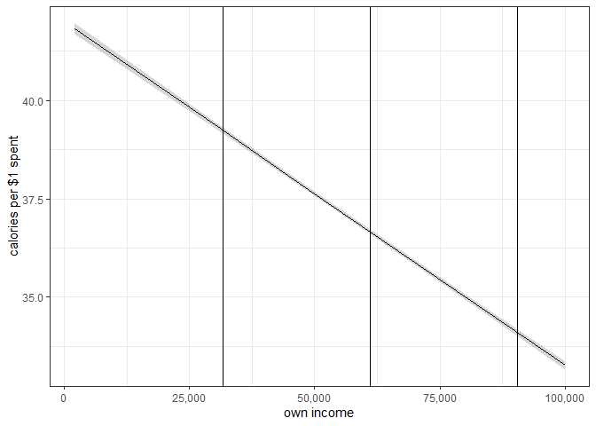
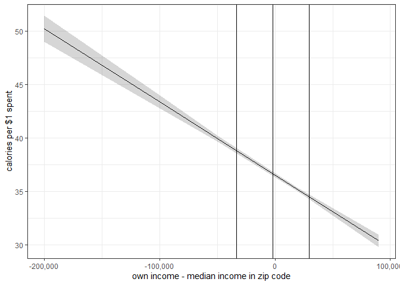
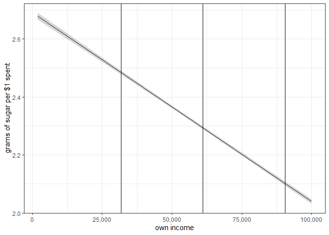
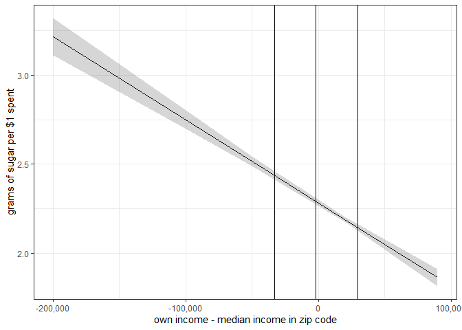
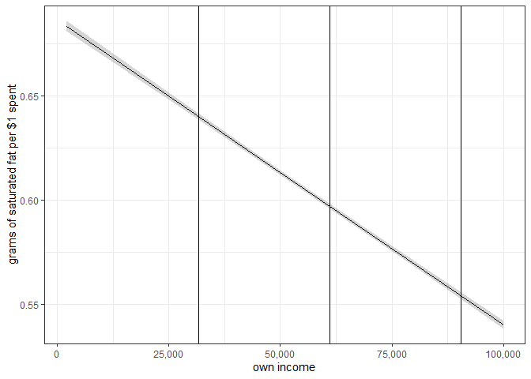
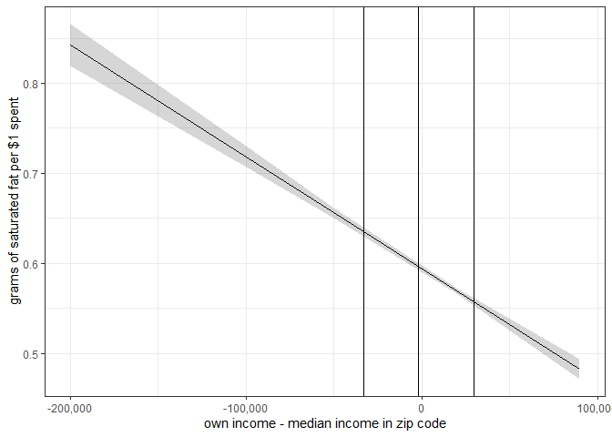

Nielsen Secondary Data Analysis
================
Daniel O’Leary
10/15/2020

  - [Setup](#setup)
      - [Load packages](#load-packages)
      - [Set path](#set-path)
      - [Load functions](#load-functions)
      - [Load data](#load-data)
  - [Analysis](#analysis)
      - [Calories](#calories)
          - [Income](#income)
          - [Income and median income](#income-and-median-income)
          - [Income difference score](#income-difference-score)
          - [Regression table](#regression-table)
          - [Own income](#own-income)
          - [Own income minus median income in your zip
            code](#own-income-minus-median-income-in-your-zip-code)
      - [Sugar content](#sugar-content)
          - [Income](#income-1)
          - [Income and median income](#income-and-median-income-1)
          - [Income difference score](#income-difference-score-1)
          - [Regression table](#regression-table-1)
          - [Own income](#own-income-1)
          - [Own income minus median income in your zip
            code](#own-income-minus-median-income-in-your-zip-code-1)
      - [Saturated fat content](#saturated-fat-content)
          - [Income](#income-2)
          - [Income and median income](#income-and-median-income-2)
          - [Income difference score](#income-difference-score-2)
          - [Regression table](#regression-table-2)
          - [Own income](#own-income-2)
          - [Own income minus median income in your zip
            code](#own-income-minus-median-income-in-your-zip-code-2)

# Setup

## Load packages

``` r
if (!require("pacman")) install.packages("pacman")
```

    ## Loading required package: pacman

``` r
pacman::p_load(
  tidyverse, 
  haven,
  lubridate,
  readr,
  lme4,
  sjPlot,
  effects,
  stargazer
)
```

## Set path

``` r
sinfo <- data.frame(Sys.info())
machine <- sinfo$Sys.info..[4]

machine_path <- 
  ifelse(
    machine %in% c("sussman-rp-mbpro.local", "sussman-rp-mbpro.lan"), 
    "/Users/djolear/Google Drive/", 
    "G:/My Drive/"
  )
```

## Load functions

``` r
lm.beta.lmer <- function(mod) {
   b <- fixef(mod)[-1]
   sd.x <- apply(getME(mod,"X")[,-1],2,sd)
   sd.y <- sd(getME(mod,"y"))
   b*sd.x/sd.y
}
```

## Load data

``` r
source(paste0(machine_path, "research/projects/niel/nielsen_analysis/calculate_nutrition_per_spend_fn.R"))
```

    ## Parsed with column specification:
    ## cols(
    ##   .default = col_character(),
    ##   `Added Sugars` = col_double(),
    ##   Calories = col_double(),
    ##   `Calories from Fat` = col_double(),
    ##   `Calories From Fat %` = col_double(),
    ##   `Calories From Saturated Fat %` = col_double(),
    ##   `Calories From Sugar %` = col_double(),
    ##   Cholesterol = col_double(),
    ##   `Dietary Fiber` = col_double(),
    ##   Protein = col_double(),
    ##   `Saturated Fat` = col_double(),
    ##   Sodium = col_double(),
    ##   Sugars = col_double(),
    ##   `Total Carbohydrate` = col_double(),
    ##   `Total Fat` = col_double(),
    ##   `Total Sugars` = col_logical(),
    ##   `Total Sugars UOM` = col_logical(),
    ##   `Trans Fat` = col_double(),
    ##   `Added Sugars Per 100` = col_double(),
    ##   `Calories From Fat % Per 100` = col_double(),
    ##   `Calories From Sugar % Per 100` = col_double()
    ##   # ... with 1 more columns
    ## )

    ## See spec(...) for full column specifications.

    ## Warning: 399308 parsing failures.
    ## row col   expected     actual                                                       file
    ##   1  -- 44 columns 51 columns 'G:/My Drive/research/projects/niel/label_insight_upc.csv'
    ##   2  -- 44 columns 51 columns 'G:/My Drive/research/projects/niel/label_insight_upc.csv'
    ##   3  -- 44 columns 51 columns 'G:/My Drive/research/projects/niel/label_insight_upc.csv'
    ##   4  -- 44 columns 51 columns 'G:/My Drive/research/projects/niel/label_insight_upc.csv'
    ##   5  -- 44 columns 51 columns 'G:/My Drive/research/projects/niel/label_insight_upc.csv'
    ## ... ... .......... .......... ..........................................................
    ## See problems(...) for more details.

``` r
source(paste0(machine_path, "research/projects/niel/nielsen_analysis/bind_nps_to_zip_code_census_fn.R"))

year = "2017"

nps_2017 <- 
  nutrition_per_spend_fn(year)
```

    ## Parsed with column specification:
    ## cols(
    ##   trip_code_uc = col_double(),
    ##   upc = col_character(),
    ##   upc_ver_uc = col_double(),
    ##   quantity = col_double(),
    ##   total_price_paid = col_double(),
    ##   coupon_value = col_double(),
    ##   deal_flag_uc = col_double()
    ## )

    ## Parsed with column specification:
    ## cols(
    ##   trip_code_uc = col_double(),
    ##   household_code = col_double(),
    ##   purchase_date = col_date(format = ""),
    ##   retailer_code = col_double(),
    ##   store_code_uc = col_double(),
    ##   panel_year = col_double(),
    ##   store_zip3 = col_character(),
    ##   total_spent = col_double(),
    ##   method_of_payment_cd = col_character()
    ## )

    ## Joining, by = "trip_code_uc"

    ## Parsed with column specification:
    ## cols(
    ##   .default = col_double(),
    ##   Panelist_ZipCd = col_character(),
    ##   Fips_State_Desc = col_character(),
    ##   Fips_County_Desc = col_character(),
    ##   Scantrack_Market_Identifier_Desc = col_character(),
    ##   DMA_Name = col_character(),
    ##   Member_5_Employment = col_logical(),
    ##   Member_6_Employment = col_logical(),
    ##   Member_7_Birth = col_logical(),
    ##   Member_7_Relationship_Sex = col_logical(),
    ##   Member_7_Employment = col_logical()
    ## )

    ## See spec(...) for full column specifications.

    ## Warning: 157 parsing failures.
    ##  row                       col           expected actual                                                                                                                                                 file
    ## 1843 Member_7_Birth            1/0/T/F/TRUE/FALSE   1990 'G:/Shared drives/SPL-Nielsen/Consumer_Panel_Data_2004_2017/Consumer_Panel_Data_2004_2017/nielsen_extracts/HMS/2017/Annual_Files/panelists_2017.tsv'
    ## 1843 Member_7_Relationship_Sex 1/0/T/F/TRUE/FALSE   6    'G:/Shared drives/SPL-Nielsen/Consumer_Panel_Data_2004_2017/Consumer_Panel_Data_2004_2017/nielsen_extracts/HMS/2017/Annual_Files/panelists_2017.tsv'
    ## 3132 Member_7_Birth            1/0/T/F/TRUE/FALSE   2003 'G:/Shared drives/SPL-Nielsen/Consumer_Panel_Data_2004_2017/Consumer_Panel_Data_2004_2017/nielsen_extracts/HMS/2017/Annual_Files/panelists_2017.tsv'
    ## 3132 Member_7_Relationship_Sex 1/0/T/F/TRUE/FALSE   2    'G:/Shared drives/SPL-Nielsen/Consumer_Panel_Data_2004_2017/Consumer_Panel_Data_2004_2017/nielsen_extracts/HMS/2017/Annual_Files/panelists_2017.tsv'
    ## 3150 Member_7_Birth            1/0/T/F/TRUE/FALSE   2004 'G:/Shared drives/SPL-Nielsen/Consumer_Panel_Data_2004_2017/Consumer_Panel_Data_2004_2017/nielsen_extracts/HMS/2017/Annual_Files/panelists_2017.tsv'
    ## .... ......................... .................. ...... ....................................................................................................................................................
    ## See problems(...) for more details.

    ## `summarise()` ungrouping output (override with `.groups` argument)

    ## `summarise()` ungrouping output (override with `.groups` argument)

    ## Joining, by = "household_code"

    ## `summarise()` ungrouping output (override with `.groups` argument)
    ## `summarise()` ungrouping output (override with `.groups` argument)

    ## Joining, by = "household_code"

    ## `summarise()` ungrouping output (override with `.groups` argument)
    ## `summarise()` ungrouping output (override with `.groups` argument)

    ## Joining, by = "household_code"
    ## Joining, by = "household_code"
    ## Joining, by = "household_code"
    ## Joining, by = "household_code"

``` r
nps_2017 <-
  bind_zip_code_census_data_function(nps_2017)  
```

    ## Joining, by = "zip"

    ## Parsed with column specification:
    ## cols(
    ##   .default = col_double(),
    ##   zip = col_character()
    ## )

    ## See spec(...) for full column specifications.

    ## Parsed with column specification:
    ## cols(
    ##   ZIP = col_character(),
    ##   county1 = col_double(),
    ##   county2 = col_double(),
    ##   county3 = col_double(),
    ##   county4 = col_double(),
    ##   county5 = col_double(),
    ##   county6 = col_double(),
    ##   county7 = col_double(),
    ##   county1_ratio = col_double(),
    ##   county2_ratio = col_double(),
    ##   county3_ratio = col_double(),
    ##   county4_ratio = col_double(),
    ##   county5_ratio = col_double(),
    ##   county6_ratio = col_double(),
    ##   county7_ratio = col_double(),
    ##   n = col_double()
    ## )

    ## Warning: Missing column names filled in: 'X24' [24]

    ## Parsed with column specification:
    ## cols(
    ##   .default = col_double(),
    ##   `County Name` = col_character(),
    ##   `Commuting Zone Name` = col_character(),
    ##   State = col_character(),
    ##   X24 = col_logical()
    ## )

    ## See spec(...) for full column specifications.

    ## Parsed with column specification:
    ## cols(
    ##   cty = col_character(),
    ##   Name = col_character(),
    ##   Household_Income_rP_gP_p50 = col_double()
    ## )

    ## Joining, by = "zip"
    ## Joining, by = "zip"
    ## Joining, by = "zip"

# Analysis

## Calories

### Income

``` r
lm_inc <-
  lmer(
    cal_per ~
      inc_mid +
      Household_Size +
      Male_Head_Education +
      Female_Head_Education +
      Race +
      Marital_Status +
      Male_Head_Employment +
      Female_Head_Employment +
      Male_Head_Age +
      Female_Head_Age +
      (1|zip), 
    data = nps_2017
  )
```

    ## Warning: Some predictor variables are on very different scales: consider
    ## rescaling

``` r
summary(lm_inc)
```

    ## Linear mixed model fit by REML ['lmerMod']
    ## Formula: 
    ## cal_per ~ inc_mid + Household_Size + Male_Head_Education + Female_Head_Education +  
    ##     Race + Marital_Status + Male_Head_Employment + Female_Head_Employment +  
    ##     Male_Head_Age + Female_Head_Age + (1 | zip)
    ##    Data: nps_2017
    ## 
    ## REML criterion at convergence: 487986.4
    ## 
    ## Scaled residuals: 
    ##     Min      1Q  Median      3Q     Max 
    ## -3.4652 -0.6463 -0.0881  0.5407 17.0628 
    ## 
    ## Random effects:
    ##  Groups   Name        Variance Std.Dev.
    ##  zip      (Intercept)   6.656   2.58   
    ##  Residual             132.603  11.52   
    ## Number of obs: 62811, groups:  zip, 15751
    ## 
    ## Fixed effects:
    ##                           Estimate Std. Error t value
    ## (Intercept)              4.162e+01  4.274e-01  97.371
    ## inc_mid                 -8.724e-05  2.052e-06 -42.518
    ## Household_Size          -6.721e-03  4.535e-02  -0.148
    ## Male_Head_Education     -6.368e-01  5.416e-02 -11.758
    ## Female_Head_Education   -7.326e-01  5.360e-02 -13.669
    ## Race2                    1.267e+00  1.599e-01   7.923
    ## Race3                   -3.047e+00  2.551e-01 -11.946
    ## Race4                   -1.483e+00  2.203e-01  -6.734
    ## Marital_Status2          2.086e+00  2.774e-01   7.519
    ## Marital_Status3          1.774e+00  2.372e-01   7.480
    ## Marital_Status4          2.260e+00  2.342e-01   9.649
    ## Male_Head_Employment1    4.765e+00  4.939e-01   9.648
    ## Male_Head_Employment2    5.003e+00  5.234e-01   9.559
    ## Male_Head_Employment3    5.520e+00  4.263e-01  12.950
    ## Male_Head_Employment9    4.193e+00  4.596e-01   9.123
    ## Female_Head_Employment1  3.085e+00  4.569e-01   6.751
    ## Female_Head_Employment2  3.515e+00  4.825e-01   7.284
    ## Female_Head_Employment3  3.830e+00  4.381e-01   8.741
    ## Female_Head_Employment9  2.726e+00  4.469e-01   6.099
    ## Male_Head_Age           -2.453e-01  4.269e-02  -5.745
    ## Female_Head_Age         -1.369e-01  3.797e-02  -3.606

    ## 
    ## Correlation matrix not shown by default, as p = 21 > 12.
    ## Use print(x, correlation=TRUE)  or
    ##     vcov(x)        if you need it

    ## fit warnings:
    ## Some predictor variables are on very different scales: consider rescaling

``` r
lm.beta.lmer(lm_inc)
```

    ##                 inc_mid          Household_Size     Male_Head_Education 
    ##           -0.2080624029           -0.0007252703           -0.1077523180 
    ##   Female_Head_Education                   Race2                   Race3 
    ##           -0.0961372662            0.0316193307           -0.0465523418 
    ##                   Race4         Marital_Status2         Marital_Status3 
    ##           -0.0259054370            0.0428096234            0.0502550525 
    ##         Marital_Status4   Male_Head_Employment1   Male_Head_Employment2 
    ##            0.0638503509            0.0784812161            0.0621823361 
    ##   Male_Head_Employment3   Male_Head_Employment9 Female_Head_Employment1 
    ##            0.2225500954            0.1421104760            0.0819064738 
    ## Female_Head_Employment2 Female_Head_Employment3 Female_Head_Employment9 
    ##            0.0600151555            0.1487285020            0.1073585499 
    ##           Male_Head_Age         Female_Head_Age 
    ##           -0.0700261760           -0.0313819727

### Income and median income

``` r
lm_med_inc <-
  lmer(
    cal_per ~
      median_income + 
      inc_mid + 
      median_monthly_housing_cost + 
      pov_status_below_per +
      Household_Size +
      Male_Head_Education +
      Female_Head_Education +
      Race +
      Marital_Status +
      Male_Head_Employment +
      Female_Head_Employment +
      Male_Head_Age +
      Female_Head_Age +
      (1|zip), 
    data = nps_2017
  )
```

    ## Warning: Some predictor variables are on very different scales: consider
    ## rescaling

``` r
summary(lm_med_inc)
```

    ## Linear mixed model fit by REML ['lmerMod']
    ## Formula: cal_per ~ median_income + inc_mid + median_monthly_housing_cost +  
    ##     pov_status_below_per + Household_Size + Male_Head_Education +  
    ##     Female_Head_Education + Race + Marital_Status + Male_Head_Employment +  
    ##     Female_Head_Employment + Male_Head_Age + Female_Head_Age +      (1 | zip)
    ##    Data: nps_2017
    ## 
    ## REML criterion at convergence: 484276.7
    ## 
    ## Scaled residuals: 
    ##     Min      1Q  Median      3Q     Max 
    ## -3.4991 -0.6477 -0.0872  0.5419 17.4846 
    ## 
    ## Random effects:
    ##  Groups   Name        Variance Std.Dev.
    ##  zip      (Intercept)   4.626   2.151  
    ##  Residual             132.530  11.512  
    ## Number of obs: 62429, groups:  zip, 15431
    ## 
    ## Fixed effects:
    ##                               Estimate Std. Error t value
    ## (Intercept)                  4.262e+01  5.368e-01  79.392
    ## median_income                6.855e-05  6.202e-06  11.052
    ## inc_mid                     -7.587e-05  2.100e-06 -36.135
    ## median_monthly_housing_cost -5.947e-03  2.706e-04 -21.979
    ## pov_status_below_per         6.159e+00  1.051e+00   5.858
    ## Household_Size               3.719e-03  4.525e-02   0.082
    ## Male_Head_Education         -5.638e-01  5.422e-02 -10.398
    ## Female_Head_Education       -6.767e-01  5.354e-02 -12.639
    ## Race2                        1.403e+00  1.628e-01   8.621
    ## Race3                       -2.128e+00  2.571e-01  -8.277
    ## Race4                       -1.069e+00  2.214e-01  -4.828
    ## Marital_Status2              2.109e+00  2.767e-01   7.620
    ## Marital_Status3              1.889e+00  2.369e-01   7.976
    ## Marital_Status4              2.508e+00  2.341e-01  10.715
    ## Male_Head_Employment1        4.389e+00  4.933e-01   8.898
    ## Male_Head_Employment2        4.617e+00  5.229e-01   8.830
    ## Male_Head_Employment3        4.961e+00  4.262e-01  11.641
    ## Male_Head_Employment9        3.737e+00  4.594e-01   8.134
    ## Female_Head_Employment1      2.699e+00  4.561e-01   5.917
    ## Female_Head_Employment2      3.109e+00  4.819e-01   6.452
    ## Female_Head_Employment3      3.305e+00  4.377e-01   7.553
    ## Female_Head_Employment9      2.290e+00  4.462e-01   5.133
    ## Male_Head_Age               -2.500e-01  4.258e-02  -5.872
    ## Female_Head_Age             -1.330e-01  3.787e-02  -3.512

    ## 
    ## Correlation matrix not shown by default, as p = 24 > 12.
    ## Use print(x, correlation=TRUE)  or
    ##     vcov(x)        if you need it

    ## fit warnings:
    ## Some predictor variables are on very different scales: consider rescaling

``` r
lm.beta.lmer(lm_med_inc)
```

    ##               median_income                     inc_mid 
    ##                0.1278950908               -0.1809580907 
    ## median_monthly_housing_cost        pov_status_below_per 
    ##               -0.2026004868                0.0391014677 
    ##              Household_Size         Male_Head_Education 
    ##                0.0004013596               -0.0954070407 
    ##       Female_Head_Education                       Race2 
    ##               -0.0887190186                0.0349827342 
    ##                       Race3                       Race4 
    ##               -0.0325156933               -0.0186457096 
    ##             Marital_Status2             Marital_Status3 
    ##                0.0433162907                0.0534925355 
    ##             Marital_Status4       Male_Head_Employment1 
    ##                0.0708169023                0.0722663792 
    ##       Male_Head_Employment2       Male_Head_Employment3 
    ##                0.0573880118                0.2000668693 
    ##       Male_Head_Employment9     Female_Head_Employment1 
    ##                0.1266016201                0.0717565541 
    ##     Female_Head_Employment2     Female_Head_Employment3 
    ##                0.0530610486                0.1283998836 
    ##     Female_Head_Employment9               Male_Head_Age 
    ##                0.0902358731               -0.0713879273 
    ##             Female_Head_Age 
    ##               -0.0304777813

### Income difference score

``` r
lm_inc_diff <-
  lmer(
    cal_per ~
      inc_mid +     
      inc_diff + 
      Household_Size +
      pov_status_below_per +
      median_monthly_housing_cost + 
      Male_Head_Education +
      Female_Head_Education +
      Race +
      Marital_Status +
      Male_Head_Employment +
      Female_Head_Employment +
      Male_Head_Age +
      Female_Head_Age +
      (1|zip), 
    data = nps_2017
  )
```

    ## Warning: Some predictor variables are on very different scales: consider
    ## rescaling

``` r
summary(lm_inc_diff)
```

    ## Linear mixed model fit by REML ['lmerMod']
    ## Formula: 
    ## cal_per ~ inc_mid + inc_diff + Household_Size + pov_status_below_per +  
    ##     median_monthly_housing_cost + Male_Head_Education + Female_Head_Education +  
    ##     Race + Marital_Status + Male_Head_Employment + Female_Head_Employment +  
    ##     Male_Head_Age + Female_Head_Age + (1 | zip)
    ##    Data: nps_2017
    ## 
    ## REML criterion at convergence: 484276.7
    ## 
    ## Scaled residuals: 
    ##     Min      1Q  Median      3Q     Max 
    ## -3.4991 -0.6477 -0.0872  0.5419 17.4846 
    ## 
    ## Random effects:
    ##  Groups   Name        Variance Std.Dev.
    ##  zip      (Intercept)   4.626   2.151  
    ##  Residual             132.530  11.512  
    ## Number of obs: 62429, groups:  zip, 15431
    ## 
    ## Fixed effects:
    ##                               Estimate Std. Error t value
    ## (Intercept)                  4.262e+01  5.368e-01  79.392
    ## inc_mid                     -7.323e-06  6.526e-06  -1.122
    ## inc_diff                    -6.855e-05  6.202e-06 -11.052
    ## Household_Size               3.719e-03  4.525e-02   0.082
    ## pov_status_below_per         6.159e+00  1.051e+00   5.858
    ## median_monthly_housing_cost -5.947e-03  2.706e-04 -21.979
    ## Male_Head_Education         -5.638e-01  5.422e-02 -10.398
    ## Female_Head_Education       -6.767e-01  5.354e-02 -12.639
    ## Race2                        1.403e+00  1.628e-01   8.621
    ## Race3                       -2.128e+00  2.571e-01  -8.277
    ## Race4                       -1.069e+00  2.214e-01  -4.828
    ## Marital_Status2              2.109e+00  2.767e-01   7.620
    ## Marital_Status3              1.889e+00  2.369e-01   7.976
    ## Marital_Status4              2.508e+00  2.341e-01  10.715
    ## Male_Head_Employment1        4.389e+00  4.933e-01   8.898
    ## Male_Head_Employment2        4.617e+00  5.229e-01   8.830
    ## Male_Head_Employment3        4.961e+00  4.262e-01  11.641
    ## Male_Head_Employment9        3.737e+00  4.594e-01   8.134
    ## Female_Head_Employment1      2.699e+00  4.561e-01   5.917
    ## Female_Head_Employment2      3.109e+00  4.819e-01   6.452
    ## Female_Head_Employment3      3.305e+00  4.377e-01   7.553
    ## Female_Head_Employment9      2.290e+00  4.462e-01   5.133
    ## Male_Head_Age               -2.500e-01  4.258e-02  -5.872
    ## Female_Head_Age             -1.330e-01  3.787e-02  -3.512

    ## 
    ## Correlation matrix not shown by default, as p = 24 > 12.
    ## Use print(x, correlation=TRUE)  or
    ##     vcov(x)        if you need it

    ## fit warnings:
    ## Some predictor variables are on very different scales: consider rescaling

``` r
lm.beta.lmer(lm_inc_diff)
```

    ##                     inc_mid                    inc_diff 
    ##               -0.0174664160               -0.1744616420 
    ##              Household_Size        pov_status_below_per 
    ##                0.0004013596                0.0391014677 
    ## median_monthly_housing_cost         Male_Head_Education 
    ##               -0.2026004868               -0.0954070407 
    ##       Female_Head_Education                       Race2 
    ##               -0.0887190186                0.0349827342 
    ##                       Race3                       Race4 
    ##               -0.0325156933               -0.0186457096 
    ##             Marital_Status2             Marital_Status3 
    ##                0.0433162907                0.0534925355 
    ##             Marital_Status4       Male_Head_Employment1 
    ##                0.0708169023                0.0722663792 
    ##       Male_Head_Employment2       Male_Head_Employment3 
    ##                0.0573880118                0.2000668693 
    ##       Male_Head_Employment9     Female_Head_Employment1 
    ##                0.1266016201                0.0717565541 
    ##     Female_Head_Employment2     Female_Head_Employment3 
    ##                0.0530610486                0.1283998836 
    ##     Female_Head_Employment9               Male_Head_Age 
    ##                0.0902358731               -0.0713879273 
    ##             Female_Head_Age 
    ##               -0.0304777813

### Regression table

``` r
stargazer(
  lm_inc, lm_med_inc, lm_inc_diff,
  coef = 
    list(
      lm.beta.lmer(lm_inc), 
      lm.beta.lmer(lm_med_inc), 
      lm.beta.lmer(lm_inc_diff)
    ),
  type = "html"
)
```

<table style="text-align:center">

<tr>

<td colspan="4" style="border-bottom: 1px solid black">

</td>

</tr>

<tr>

<td style="text-align:left">

</td>

<td colspan="3">

<em>Dependent variable:</em>

</td>

</tr>

<tr>

<td>

</td>

<td colspan="3" style="border-bottom: 1px solid black">

</td>

</tr>

<tr>

<td style="text-align:left">

</td>

<td colspan="3">

cal\_per

</td>

</tr>

<tr>

<td style="text-align:left">

</td>

<td>

(1)

</td>

<td>

(2)

</td>

<td>

(3)

</td>

</tr>

<tr>

<td colspan="4" style="border-bottom: 1px solid black">

</td>

</tr>

<tr>

<td style="text-align:left">

median\_income

</td>

<td>

</td>

<td>

0.128<sup>\*\*\*</sup>

</td>

<td>

</td>

</tr>

<tr>

<td style="text-align:left">

</td>

<td>

</td>

<td>

(0.00001)

</td>

<td>

</td>

</tr>

<tr>

<td style="text-align:left">

</td>

<td>

</td>

<td>

</td>

<td>

</td>

</tr>

<tr>

<td style="text-align:left">

inc\_mid

</td>

<td>

\-0.208

</td>

<td>

\-0.181<sup>\*\*\*</sup>

</td>

<td>

\-0.017<sup>\*\*\*</sup>

</td>

</tr>

<tr>

<td style="text-align:left">

</td>

<td>

(0.00000)

</td>

<td>

(0.00000)

</td>

<td>

(0.00001)

</td>

</tr>

<tr>

<td style="text-align:left">

</td>

<td>

</td>

<td>

</td>

<td>

</td>

</tr>

<tr>

<td style="text-align:left">

inc\_diff

</td>

<td>

</td>

<td>

</td>

<td>

\-0.174<sup>\*\*\*</sup>

</td>

</tr>

<tr>

<td style="text-align:left">

</td>

<td>

</td>

<td>

</td>

<td>

(0.00001)

</td>

</tr>

<tr>

<td style="text-align:left">

</td>

<td>

</td>

<td>

</td>

<td>

</td>

</tr>

<tr>

<td style="text-align:left">

median\_monthly\_housing\_cost

</td>

<td>

</td>

<td>

\-0.203<sup>\*\*\*</sup>

</td>

<td>

\-0.203<sup>\*\*\*</sup>

</td>

</tr>

<tr>

<td style="text-align:left">

</td>

<td>

</td>

<td>

(0.0003)

</td>

<td>

(0.0003)

</td>

</tr>

<tr>

<td style="text-align:left">

</td>

<td>

</td>

<td>

</td>

<td>

</td>

</tr>

<tr>

<td style="text-align:left">

pov\_status\_below\_per

</td>

<td>

</td>

<td>

0.039

</td>

<td>

0.039

</td>

</tr>

<tr>

<td style="text-align:left">

</td>

<td>

</td>

<td>

(1.051)

</td>

<td>

(1.051)

</td>

</tr>

<tr>

<td style="text-align:left">

</td>

<td>

</td>

<td>

</td>

<td>

</td>

</tr>

<tr>

<td style="text-align:left">

Household\_Size

</td>

<td>

\-0.001<sup>\*\*\*</sup>

</td>

<td>

0.0004

</td>

<td>

0.0004

</td>

</tr>

<tr>

<td style="text-align:left">

</td>

<td>

(0.045)

</td>

<td>

(0.045)

</td>

<td>

(0.045)

</td>

</tr>

<tr>

<td style="text-align:left">

</td>

<td>

</td>

<td>

</td>

<td>

</td>

</tr>

<tr>

<td style="text-align:left">

Male\_Head\_Education

</td>

<td>

\-0.108<sup>\*\*</sup>

</td>

<td>

\-0.095<sup>\*</sup>

</td>

<td>

\-0.095<sup>\*</sup>

</td>

</tr>

<tr>

<td style="text-align:left">

</td>

<td>

(0.054)

</td>

<td>

(0.054)

</td>

<td>

(0.054)

</td>

</tr>

<tr>

<td style="text-align:left">

</td>

<td>

</td>

<td>

</td>

<td>

</td>

</tr>

<tr>

<td style="text-align:left">

Female\_Head\_Education

</td>

<td>

\-0.096<sup>\*</sup>

</td>

<td>

\-0.089<sup>\*</sup>

</td>

<td>

\-0.089<sup>\*</sup>

</td>

</tr>

<tr>

<td style="text-align:left">

</td>

<td>

(0.054)

</td>

<td>

(0.054)

</td>

<td>

(0.054)

</td>

</tr>

<tr>

<td style="text-align:left">

</td>

<td>

</td>

<td>

</td>

<td>

</td>

</tr>

<tr>

<td style="text-align:left">

Race2

</td>

<td>

0.032

</td>

<td>

0.035

</td>

<td>

0.035

</td>

</tr>

<tr>

<td style="text-align:left">

</td>

<td>

(0.160)

</td>

<td>

(0.163)

</td>

<td>

(0.163)

</td>

</tr>

<tr>

<td style="text-align:left">

</td>

<td>

</td>

<td>

</td>

<td>

</td>

</tr>

<tr>

<td style="text-align:left">

Race3

</td>

<td>

\-0.047

</td>

<td>

\-0.033

</td>

<td>

\-0.033

</td>

</tr>

<tr>

<td style="text-align:left">

</td>

<td>

(0.255)

</td>

<td>

(0.257)

</td>

<td>

(0.257)

</td>

</tr>

<tr>

<td style="text-align:left">

</td>

<td>

</td>

<td>

</td>

<td>

</td>

</tr>

<tr>

<td style="text-align:left">

Race4

</td>

<td>

\-0.026

</td>

<td>

\-0.019

</td>

<td>

\-0.019

</td>

</tr>

<tr>

<td style="text-align:left">

</td>

<td>

(0.220)

</td>

<td>

(0.221)

</td>

<td>

(0.221)

</td>

</tr>

<tr>

<td style="text-align:left">

</td>

<td>

</td>

<td>

</td>

<td>

</td>

</tr>

<tr>

<td style="text-align:left">

Marital\_Status2

</td>

<td>

0.043

</td>

<td>

0.043

</td>

<td>

0.043

</td>

</tr>

<tr>

<td style="text-align:left">

</td>

<td>

(0.277)

</td>

<td>

(0.277)

</td>

<td>

(0.277)

</td>

</tr>

<tr>

<td style="text-align:left">

</td>

<td>

</td>

<td>

</td>

<td>

</td>

</tr>

<tr>

<td style="text-align:left">

Marital\_Status3

</td>

<td>

0.050

</td>

<td>

0.053

</td>

<td>

0.053

</td>

</tr>

<tr>

<td style="text-align:left">

</td>

<td>

(0.237)

</td>

<td>

(0.237)

</td>

<td>

(0.237)

</td>

</tr>

<tr>

<td style="text-align:left">

</td>

<td>

</td>

<td>

</td>

<td>

</td>

</tr>

<tr>

<td style="text-align:left">

Marital\_Status4

</td>

<td>

0.064

</td>

<td>

0.071

</td>

<td>

0.071

</td>

</tr>

<tr>

<td style="text-align:left">

</td>

<td>

(0.234)

</td>

<td>

(0.234)

</td>

<td>

(0.234)

</td>

</tr>

<tr>

<td style="text-align:left">

</td>

<td>

</td>

<td>

</td>

<td>

</td>

</tr>

<tr>

<td style="text-align:left">

Male\_Head\_Employment1

</td>

<td>

0.078

</td>

<td>

0.072

</td>

<td>

0.072

</td>

</tr>

<tr>

<td style="text-align:left">

</td>

<td>

(0.494)

</td>

<td>

(0.493)

</td>

<td>

(0.493)

</td>

</tr>

<tr>

<td style="text-align:left">

</td>

<td>

</td>

<td>

</td>

<td>

</td>

</tr>

<tr>

<td style="text-align:left">

Male\_Head\_Employment2

</td>

<td>

0.062

</td>

<td>

0.057

</td>

<td>

0.057

</td>

</tr>

<tr>

<td style="text-align:left">

</td>

<td>

(0.523)

</td>

<td>

(0.523)

</td>

<td>

(0.523)

</td>

</tr>

<tr>

<td style="text-align:left">

</td>

<td>

</td>

<td>

</td>

<td>

</td>

</tr>

<tr>

<td style="text-align:left">

Male\_Head\_Employment3

</td>

<td>

0.223

</td>

<td>

0.200

</td>

<td>

0.200

</td>

</tr>

<tr>

<td style="text-align:left">

</td>

<td>

(0.426)

</td>

<td>

(0.426)

</td>

<td>

(0.426)

</td>

</tr>

<tr>

<td style="text-align:left">

</td>

<td>

</td>

<td>

</td>

<td>

</td>

</tr>

<tr>

<td style="text-align:left">

Male\_Head\_Employment9

</td>

<td>

0.142

</td>

<td>

0.127

</td>

<td>

0.127

</td>

</tr>

<tr>

<td style="text-align:left">

</td>

<td>

(0.460)

</td>

<td>

(0.459)

</td>

<td>

(0.459)

</td>

</tr>

<tr>

<td style="text-align:left">

</td>

<td>

</td>

<td>

</td>

<td>

</td>

</tr>

<tr>

<td style="text-align:left">

Female\_Head\_Employment1

</td>

<td>

0.082

</td>

<td>

0.072

</td>

<td>

0.072

</td>

</tr>

<tr>

<td style="text-align:left">

</td>

<td>

(0.457)

</td>

<td>

(0.456)

</td>

<td>

(0.456)

</td>

</tr>

<tr>

<td style="text-align:left">

</td>

<td>

</td>

<td>

</td>

<td>

</td>

</tr>

<tr>

<td style="text-align:left">

Female\_Head\_Employment2

</td>

<td>

0.060

</td>

<td>

0.053

</td>

<td>

0.053

</td>

</tr>

<tr>

<td style="text-align:left">

</td>

<td>

(0.483)

</td>

<td>

(0.482)

</td>

<td>

(0.482)

</td>

</tr>

<tr>

<td style="text-align:left">

</td>

<td>

</td>

<td>

</td>

<td>

</td>

</tr>

<tr>

<td style="text-align:left">

Female\_Head\_Employment3

</td>

<td>

0.149

</td>

<td>

0.128

</td>

<td>

0.128

</td>

</tr>

<tr>

<td style="text-align:left">

</td>

<td>

(0.438)

</td>

<td>

(0.438)

</td>

<td>

(0.438)

</td>

</tr>

<tr>

<td style="text-align:left">

</td>

<td>

</td>

<td>

</td>

<td>

</td>

</tr>

<tr>

<td style="text-align:left">

Female\_Head\_Employment9

</td>

<td>

0.107

</td>

<td>

0.090

</td>

<td>

0.090

</td>

</tr>

<tr>

<td style="text-align:left">

</td>

<td>

(0.447)

</td>

<td>

(0.446)

</td>

<td>

(0.446)

</td>

</tr>

<tr>

<td style="text-align:left">

</td>

<td>

</td>

<td>

</td>

<td>

</td>

</tr>

<tr>

<td style="text-align:left">

Male\_Head\_Age

</td>

<td>

\-0.070

</td>

<td>

\-0.071<sup>\*</sup>

</td>

<td>

\-0.071<sup>\*</sup>

</td>

</tr>

<tr>

<td style="text-align:left">

</td>

<td>

(0.043)

</td>

<td>

(0.043)

</td>

<td>

(0.043)

</td>

</tr>

<tr>

<td style="text-align:left">

</td>

<td>

</td>

<td>

</td>

<td>

</td>

</tr>

<tr>

<td style="text-align:left">

Female\_Head\_Age

</td>

<td>

\-0.031

</td>

<td>

\-0.030

</td>

<td>

\-0.030

</td>

</tr>

<tr>

<td style="text-align:left">

</td>

<td>

(0.038)

</td>

<td>

(0.038)

</td>

<td>

(0.038)

</td>

</tr>

<tr>

<td style="text-align:left">

</td>

<td>

</td>

<td>

</td>

<td>

</td>

</tr>

<tr>

<td style="text-align:left">

Constant

</td>

<td>

</td>

<td>

</td>

<td>

</td>

</tr>

<tr>

<td style="text-align:left">

</td>

<td>

(0.427)

</td>

<td>

(0.537)

</td>

<td>

(0.537)

</td>

</tr>

<tr>

<td style="text-align:left">

</td>

<td>

</td>

<td>

</td>

<td>

</td>

</tr>

<tr>

<td colspan="4" style="border-bottom: 1px solid black">

</td>

</tr>

<tr>

<td style="text-align:left">

Observations

</td>

<td>

62,811

</td>

<td>

62,429

</td>

<td>

62,429

</td>

</tr>

<tr>

<td style="text-align:left">

Log Likelihood

</td>

<td>

\-243,993.200

</td>

<td>

\-242,138.300

</td>

<td>

\-242,138.300

</td>

</tr>

<tr>

<td style="text-align:left">

Akaike Inf. Crit.

</td>

<td>

488,032.400

</td>

<td>

484,328.700

</td>

<td>

484,328.700

</td>

</tr>

<tr>

<td style="text-align:left">

Bayesian Inf. Crit.

</td>

<td>

488,240.500

</td>

<td>

484,563.700

</td>

<td>

484,563.700

</td>

</tr>

<tr>

<td colspan="4" style="border-bottom: 1px solid black">

</td>

</tr>

<tr>

<td style="text-align:left">

<em>Note:</em>

</td>

<td colspan="3" style="text-align:right">

<sup>*</sup>p\<0.1; <sup>**</sup>p\<0.05; <sup>***</sup>p\<0.01

</td>

</tr>

</table>

### Own income

``` r
effect("inc_mid", lm_inc) %>% 
  as_tibble() %>% 
  ggplot(aes(inc_mid, fit)) +
  geom_line() +
  geom_ribbon(aes(ymin = fit - se, ymax = fit + se), alpha  = 0.2) +
  scale_x_continuous(labels = scales::comma) +
  geom_vline(xintercept = mean(nps_2017$inc_mid, na.rm = TRUE)) +
  geom_vline(xintercept = mean(nps_2017$inc_mid, na.rm = TRUE) + sd(nps_2017$inc_mid, na.rm = TRUE)) +
  geom_vline(xintercept = mean(nps_2017$inc_mid, na.rm = TRUE) - sd(nps_2017$inc_mid, na.rm = TRUE)) +
  labs(
    x = "own income",
    y = "calories per $1 spent"
  ) +
  theme_bw()
```

<!-- -->

### Own income minus median income in your zip code

``` r
effect("inc_diff", lm_inc_diff) %>% 
  as_tibble() %>% 
  ggplot(aes(inc_diff, fit)) +
  geom_line() +
  geom_ribbon(aes(ymin = fit - se, ymax = fit + se), alpha  = 0.2) +
  scale_x_continuous(labels = scales::comma) +
  geom_vline(xintercept = mean(nps_2017$inc_diff, na.rm = TRUE)) +
  geom_vline(xintercept = mean(nps_2017$inc_diff, na.rm = TRUE) + sd(nps_2017$inc_diff, na.rm = TRUE)) +
  geom_vline(xintercept = mean(nps_2017$inc_diff, na.rm = TRUE) - sd(nps_2017$inc_diff, na.rm = TRUE)) +
  labs(
    x = "own income - median income in zip code",
    y = "calories per $1 spent"
  ) + 
  theme_bw()
```

<!-- -->

## Sugar content

### Income

``` r
lm_inc <-
  lmer(
    sug_per ~
      inc_mid +
      Household_Size +
      Male_Head_Education +
      Female_Head_Education +
      Race +
      Marital_Status +
      Male_Head_Employment +
      Female_Head_Employment +
      Male_Head_Age +
      Female_Head_Age +
      (1|zip), 
    data = nps_2017
  )
```

    ## Warning: Some predictor variables are on very different scales: consider
    ## rescaling

``` r
summary(lm_inc)
```

    ## Linear mixed model fit by REML ['lmerMod']
    ## Formula: 
    ## sug_per ~ inc_mid + Household_Size + Male_Head_Education + Female_Head_Education +  
    ##     Race + Marital_Status + Male_Head_Employment + Female_Head_Employment +  
    ##     Male_Head_Age + Female_Head_Age + (1 | zip)
    ##    Data: nps_2017
    ## 
    ## REML criterion at convergence: 180465.2
    ## 
    ## Scaled residuals: 
    ##    Min     1Q Median     3Q    Max 
    ## -2.619 -0.637 -0.126  0.479 38.321 
    ## 
    ## Random effects:
    ##  Groups   Name        Variance Std.Dev.
    ##  zip      (Intercept) 0.02951  0.1718  
    ##  Residual             1.00629  1.0031  
    ## Number of obs: 62809, groups:  zip, 15751
    ## 
    ## Fixed effects:
    ##                           Estimate Std. Error t value
    ## (Intercept)              2.540e+00  3.694e-02  68.757
    ## inc_mid                 -6.507e-06  1.771e-07 -36.744
    ## Household_Size           3.122e-02  3.922e-03   7.960
    ## Male_Head_Education     -4.581e-02  4.682e-03  -9.784
    ## Female_Head_Education   -6.312e-02  4.635e-03 -13.619
    ## Race2                    3.745e-01  1.371e-02  27.308
    ## Race3                   -1.377e-01  2.201e-02  -6.259
    ## Race4                    1.930e-02  1.904e-02   1.014
    ## Marital_Status2          1.413e-01  2.400e-02   5.887
    ## Marital_Status3          1.193e-01  2.052e-02   5.812
    ## Marital_Status4          1.563e-01  2.026e-02   7.714
    ## Male_Head_Employment1    3.474e-01  4.272e-02   8.132
    ## Male_Head_Employment2    3.600e-01  4.528e-02   7.951
    ## Male_Head_Employment3    3.817e-01  3.687e-02  10.355
    ## Male_Head_Employment9    3.225e-01  3.975e-02   8.112
    ## Female_Head_Employment1  2.753e-01  3.953e-02   6.965
    ## Female_Head_Employment2  3.127e-01  4.174e-02   7.491
    ## Female_Head_Employment3  2.887e-01  3.789e-02   7.620
    ## Female_Head_Employment9  2.639e-01  3.866e-02   6.826
    ## Male_Head_Age           -1.969e-02  3.693e-03  -5.331
    ## Female_Head_Age         -5.958e-03  3.284e-03  -1.814

    ## 
    ## Correlation matrix not shown by default, as p = 21 > 12.
    ## Use print(x, correlation=TRUE)  or
    ##     vcov(x)        if you need it

    ## fit warnings:
    ## Some predictor variables are on very different scales: consider rescaling

``` r
lm.beta.lmer(lm_inc)
```

    ##                 inc_mid          Household_Size     Male_Head_Education 
    ##            -0.181147909             0.039323985            -0.090469833 
    ##   Female_Head_Education                   Race2                   Race3 
    ##            -0.096684084             0.109086155            -0.024557384 
    ##                   Race4         Marital_Status2         Marital_Status3 
    ##             0.003934108             0.033842542             0.039426482 
    ##         Marital_Status4   Male_Head_Employment1   Male_Head_Employment2 
    ##             0.051539838             0.066780959             0.052227289 
    ##   Male_Head_Employment3   Male_Head_Employment9 Female_Head_Employment1 
    ##             0.179636256             0.127566912             0.085318306 
    ## Female_Head_Employment2 Female_Head_Employment3 Female_Head_Employment9 
    ##             0.062317314             0.130885875             0.121323053 
    ##           Male_Head_Age         Female_Head_Age 
    ##            -0.065615697            -0.015938271

### Income and median income

``` r
lm_med_inc <-
  lmer(
    sug_per ~
      median_income + 
      inc_mid + 
      median_monthly_housing_cost + 
      pov_status_below_per +
      Household_Size +
      Male_Head_Education +
      Female_Head_Education +
      Race +
      Marital_Status +
      Male_Head_Employment +
      Female_Head_Employment +
      Male_Head_Age +
      Female_Head_Age +
      (1|zip), 
    data = nps_2017
  )
```

    ## Warning: Some predictor variables are on very different scales: consider
    ## rescaling

``` r
summary(lm_med_inc)
```

    ## Linear mixed model fit by REML ['lmerMod']
    ## Formula: sug_per ~ median_income + inc_mid + median_monthly_housing_cost +  
    ##     pov_status_below_per + Household_Size + Male_Head_Education +  
    ##     Female_Head_Education + Race + Marital_Status + Male_Head_Employment +  
    ##     Female_Head_Employment + Male_Head_Age + Female_Head_Age +      (1 | zip)
    ##    Data: nps_2017
    ## 
    ## REML criterion at convergence: 178824.4
    ## 
    ## Scaled residuals: 
    ##    Min     1Q Median     3Q    Max 
    ## -2.639 -0.633 -0.128  0.474 38.844 
    ## 
    ## Random effects:
    ##  Groups   Name        Variance Std.Dev.
    ##  zip      (Intercept) 0.02006  0.1416  
    ##  Residual             1.00477  1.0024  
    ## Number of obs: 62427, groups:  zip, 15431
    ## 
    ## Fixed effects:
    ##                               Estimate Std. Error t value
    ## (Intercept)                  2.594e+00  4.598e-02  56.411
    ## median_income                4.658e-06  5.210e-07   8.942
    ## inc_mid                     -5.615e-06  1.817e-07 -30.897
    ## median_monthly_housing_cost -4.092e-04  2.275e-05 -17.988
    ## pov_status_below_per         5.104e-01  8.862e-02   5.759
    ## Household_Size               3.208e-02  3.917e-03   8.189
    ## Male_Head_Education         -4.042e-02  4.692e-03  -8.614
    ## Female_Head_Education       -5.936e-02  4.635e-03 -12.808
    ## Race2                        3.780e-01  1.400e-02  26.996
    ## Race3                       -6.805e-02  2.222e-02  -3.062
    ## Race4                        4.852e-02  1.917e-02   2.531
    ## Marital_Status2              1.438e-01  2.396e-02   6.000
    ## Marital_Status3              1.275e-01  2.051e-02   6.216
    ## Marital_Status4              1.760e-01  2.027e-02   8.684
    ## Male_Head_Employment1        3.211e-01  4.271e-02   7.520
    ## Male_Head_Employment2        3.340e-01  4.528e-02   7.376
    ## Male_Head_Employment3        3.415e-01  3.689e-02   9.256
    ## Male_Head_Employment9        2.899e-01  3.977e-02   7.290
    ## Female_Head_Employment1      2.478e-01  3.949e-02   6.273
    ## Female_Head_Employment2      2.838e-01  4.172e-02   6.802
    ## Female_Head_Employment3      2.509e-01  3.789e-02   6.621
    ## Female_Head_Employment9      2.325e-01  3.864e-02   6.019
    ## Male_Head_Age               -2.011e-02  3.687e-03  -5.455
    ## Female_Head_Age             -5.419e-03  3.279e-03  -1.653

    ## 
    ## Correlation matrix not shown by default, as p = 24 > 12.
    ## Use print(x, correlation=TRUE)  or
    ##     vcov(x)        if you need it

    ## fit warnings:
    ## Some predictor variables are on very different scales: consider rescaling

``` r
lm.beta.lmer(lm_med_inc)
```

    ##               median_income                     inc_mid 
    ##                 0.101465135                -0.156350388 
    ## median_monthly_housing_cost        pov_status_below_per 
    ##                -0.162757449                 0.037828794 
    ##              Household_Size         Male_Head_Education 
    ##                 0.040412671                -0.079850783 
    ##       Female_Head_Education                       Race2 
    ##                -0.090861191                 0.110032073 
    ##                       Race3                       Race4 
    ##                -0.012141115                 0.009878395 
    ##             Marital_Status2             Marital_Status3 
    ##                 0.034479340                 0.042141618 
    ##             Marital_Status4       Male_Head_Employment1 
    ##                 0.058013591                 0.061729647 
    ##       Male_Head_Employment2       Male_Head_Employment3 
    ##                 0.048458567                 0.160784223 
    ##       Male_Head_Employment9     Female_Head_Employment1 
    ##                 0.114681671                 0.076906017 
    ##     Female_Head_Employment2     Female_Head_Employment3 
    ##                 0.056539996                 0.113768236 
    ##     Female_Head_Employment9               Male_Head_Age 
    ##                 0.106956875                -0.067041015 
    ##             Female_Head_Age 
    ##                -0.014496522

### Income difference score

``` r
lm_inc_diff <-
  lmer(
    sug_per ~
      inc_mid +     
      inc_diff + 
      Household_Size +
      pov_status_below_per +
      median_monthly_housing_cost + 
      Male_Head_Education +
      Female_Head_Education +
      Race +
      Marital_Status +
      Male_Head_Employment +
      Female_Head_Employment +
      Male_Head_Age +
      Female_Head_Age +
      (1|zip), 
    data = nps_2017
  )
```

    ## Warning: Some predictor variables are on very different scales: consider
    ## rescaling

``` r
summary(lm_inc_diff)
```

    ## Linear mixed model fit by REML ['lmerMod']
    ## Formula: 
    ## sug_per ~ inc_mid + inc_diff + Household_Size + pov_status_below_per +  
    ##     median_monthly_housing_cost + Male_Head_Education + Female_Head_Education +  
    ##     Race + Marital_Status + Male_Head_Employment + Female_Head_Employment +  
    ##     Male_Head_Age + Female_Head_Age + (1 | zip)
    ##    Data: nps_2017
    ## 
    ## REML criterion at convergence: 178824.4
    ## 
    ## Scaled residuals: 
    ##    Min     1Q Median     3Q    Max 
    ## -2.639 -0.633 -0.128  0.474 38.844 
    ## 
    ## Random effects:
    ##  Groups   Name        Variance Std.Dev.
    ##  zip      (Intercept) 0.02006  0.1416  
    ##  Residual             1.00477  1.0024  
    ## Number of obs: 62427, groups:  zip, 15431
    ## 
    ## Fixed effects:
    ##                               Estimate Std. Error t value
    ## (Intercept)                  2.594e+00  4.598e-02  56.411
    ## inc_mid                     -9.569e-07  5.497e-07  -1.741
    ## inc_diff                    -4.658e-06  5.210e-07  -8.942
    ## Household_Size               3.208e-02  3.917e-03   8.189
    ## pov_status_below_per         5.104e-01  8.862e-02   5.759
    ## median_monthly_housing_cost -4.092e-04  2.275e-05 -17.988
    ## Male_Head_Education         -4.042e-02  4.692e-03  -8.614
    ## Female_Head_Education       -5.936e-02  4.635e-03 -12.808
    ## Race2                        3.780e-01  1.400e-02  26.996
    ## Race3                       -6.805e-02  2.222e-02  -3.062
    ## Race4                        4.852e-02  1.917e-02   2.531
    ## Marital_Status2              1.438e-01  2.396e-02   6.000
    ## Marital_Status3              1.275e-01  2.051e-02   6.216
    ## Marital_Status4              1.760e-01  2.027e-02   8.684
    ## Male_Head_Employment1        3.211e-01  4.271e-02   7.520
    ## Male_Head_Employment2        3.340e-01  4.528e-02   7.376
    ## Male_Head_Employment3        3.415e-01  3.689e-02   9.256
    ## Male_Head_Employment9        2.899e-01  3.977e-02   7.290
    ## Female_Head_Employment1      2.478e-01  3.949e-02   6.273
    ## Female_Head_Employment2      2.838e-01  4.172e-02   6.802
    ## Female_Head_Employment3      2.509e-01  3.789e-02   6.621
    ## Female_Head_Employment9      2.325e-01  3.864e-02   6.019
    ## Male_Head_Age               -2.011e-02  3.687e-03  -5.455
    ## Female_Head_Age             -5.419e-03  3.279e-03  -1.653

    ## 
    ## Correlation matrix not shown by default, as p = 24 > 12.
    ## Use print(x, correlation=TRUE)  or
    ##     vcov(x)        if you need it

    ## fit warnings:
    ## Some predictor variables are on very different scales: consider rescaling

``` r
lm.beta.lmer(lm_inc_diff)
```

    ##                     inc_mid                    inc_diff 
    ##                -0.026644323                -0.138408836 
    ##              Household_Size        pov_status_below_per 
    ##                 0.040412671                 0.037828794 
    ## median_monthly_housing_cost         Male_Head_Education 
    ##                -0.162757449                -0.079850783 
    ##       Female_Head_Education                       Race2 
    ##                -0.090861191                 0.110032073 
    ##                       Race3                       Race4 
    ##                -0.012141115                 0.009878395 
    ##             Marital_Status2             Marital_Status3 
    ##                 0.034479340                 0.042141618 
    ##             Marital_Status4       Male_Head_Employment1 
    ##                 0.058013591                 0.061729647 
    ##       Male_Head_Employment2       Male_Head_Employment3 
    ##                 0.048458567                 0.160784223 
    ##       Male_Head_Employment9     Female_Head_Employment1 
    ##                 0.114681671                 0.076906017 
    ##     Female_Head_Employment2     Female_Head_Employment3 
    ##                 0.056539996                 0.113768236 
    ##     Female_Head_Employment9               Male_Head_Age 
    ##                 0.106956875                -0.067041015 
    ##             Female_Head_Age 
    ##                -0.014496522

### Regression table

``` r
stargazer(
  lm_inc, lm_med_inc, lm_inc_diff,
  coef = 
    list(
      lm.beta.lmer(lm_inc), 
      lm.beta.lmer(lm_med_inc), 
      lm.beta.lmer(lm_inc_diff)
    ),
  type = "html"
)
```

<table style="text-align:center">

<tr>

<td colspan="4" style="border-bottom: 1px solid black">

</td>

</tr>

<tr>

<td style="text-align:left">

</td>

<td colspan="3">

<em>Dependent variable:</em>

</td>

</tr>

<tr>

<td>

</td>

<td colspan="3" style="border-bottom: 1px solid black">

</td>

</tr>

<tr>

<td style="text-align:left">

</td>

<td colspan="3">

sug\_per

</td>

</tr>

<tr>

<td style="text-align:left">

</td>

<td>

(1)

</td>

<td>

(2)

</td>

<td>

(3)

</td>

</tr>

<tr>

<td colspan="4" style="border-bottom: 1px solid black">

</td>

</tr>

<tr>

<td style="text-align:left">

median\_income

</td>

<td>

</td>

<td>

0.101<sup>\*\*\*</sup>

</td>

<td>

</td>

</tr>

<tr>

<td style="text-align:left">

</td>

<td>

</td>

<td>

(0.00000)

</td>

<td>

</td>

</tr>

<tr>

<td style="text-align:left">

</td>

<td>

</td>

<td>

</td>

<td>

</td>

</tr>

<tr>

<td style="text-align:left">

inc\_mid

</td>

<td>

\-0.181<sup>\*\*\*</sup>

</td>

<td>

\-0.156<sup>\*\*\*</sup>

</td>

<td>

\-0.027<sup>\*\*\*</sup>

</td>

</tr>

<tr>

<td style="text-align:left">

</td>

<td>

(0.00000)

</td>

<td>

(0.00000)

</td>

<td>

(0.00000)

</td>

</tr>

<tr>

<td style="text-align:left">

</td>

<td>

</td>

<td>

</td>

<td>

</td>

</tr>

<tr>

<td style="text-align:left">

inc\_diff

</td>

<td>

</td>

<td>

</td>

<td>

\-0.138<sup>\*\*\*</sup>

</td>

</tr>

<tr>

<td style="text-align:left">

</td>

<td>

</td>

<td>

</td>

<td>

(0.00000)

</td>

</tr>

<tr>

<td style="text-align:left">

</td>

<td>

</td>

<td>

</td>

<td>

</td>

</tr>

<tr>

<td style="text-align:left">

median\_monthly\_housing\_cost

</td>

<td>

</td>

<td>

\-0.163<sup>\*\*\*</sup>

</td>

<td>

\-0.163<sup>\*\*\*</sup>

</td>

</tr>

<tr>

<td style="text-align:left">

</td>

<td>

</td>

<td>

(0.00002)

</td>

<td>

(0.00002)

</td>

</tr>

<tr>

<td style="text-align:left">

</td>

<td>

</td>

<td>

</td>

<td>

</td>

</tr>

<tr>

<td style="text-align:left">

pov\_status\_below\_per

</td>

<td>

</td>

<td>

0.038

</td>

<td>

0.038

</td>

</tr>

<tr>

<td style="text-align:left">

</td>

<td>

</td>

<td>

(0.089)

</td>

<td>

(0.089)

</td>

</tr>

<tr>

<td style="text-align:left">

</td>

<td>

</td>

<td>

</td>

<td>

</td>

</tr>

<tr>

<td style="text-align:left">

Household\_Size

</td>

<td>

0.039<sup>\*\*\*</sup>

</td>

<td>

0.040<sup>\*\*\*</sup>

</td>

<td>

0.040<sup>\*\*\*</sup>

</td>

</tr>

<tr>

<td style="text-align:left">

</td>

<td>

(0.004)

</td>

<td>

(0.004)

</td>

<td>

(0.004)

</td>

</tr>

<tr>

<td style="text-align:left">

</td>

<td>

</td>

<td>

</td>

<td>

</td>

</tr>

<tr>

<td style="text-align:left">

Male\_Head\_Education

</td>

<td>

\-0.090<sup>\*\*\*</sup>

</td>

<td>

\-0.080<sup>\*\*\*</sup>

</td>

<td>

\-0.080<sup>\*\*\*</sup>

</td>

</tr>

<tr>

<td style="text-align:left">

</td>

<td>

(0.005)

</td>

<td>

(0.005)

</td>

<td>

(0.005)

</td>

</tr>

<tr>

<td style="text-align:left">

</td>

<td>

</td>

<td>

</td>

<td>

</td>

</tr>

<tr>

<td style="text-align:left">

Female\_Head\_Education

</td>

<td>

\-0.097<sup>\*\*\*</sup>

</td>

<td>

\-0.091<sup>\*\*\*</sup>

</td>

<td>

\-0.091<sup>\*\*\*</sup>

</td>

</tr>

<tr>

<td style="text-align:left">

</td>

<td>

(0.005)

</td>

<td>

(0.005)

</td>

<td>

(0.005)

</td>

</tr>

<tr>

<td style="text-align:left">

</td>

<td>

</td>

<td>

</td>

<td>

</td>

</tr>

<tr>

<td style="text-align:left">

Race2

</td>

<td>

0.109<sup>\*\*\*</sup>

</td>

<td>

0.110<sup>\*\*\*</sup>

</td>

<td>

0.110<sup>\*\*\*</sup>

</td>

</tr>

<tr>

<td style="text-align:left">

</td>

<td>

(0.014)

</td>

<td>

(0.014)

</td>

<td>

(0.014)

</td>

</tr>

<tr>

<td style="text-align:left">

</td>

<td>

</td>

<td>

</td>

<td>

</td>

</tr>

<tr>

<td style="text-align:left">

Race3

</td>

<td>

\-0.025<sup>\*</sup>

</td>

<td>

\-0.012

</td>

<td>

\-0.012

</td>

</tr>

<tr>

<td style="text-align:left">

</td>

<td>

(0.022)

</td>

<td>

(0.022)

</td>

<td>

(0.022)

</td>

</tr>

<tr>

<td style="text-align:left">

</td>

<td>

</td>

<td>

</td>

<td>

</td>

</tr>

<tr>

<td style="text-align:left">

Race4

</td>

<td>

0.004

</td>

<td>

0.010

</td>

<td>

0.010

</td>

</tr>

<tr>

<td style="text-align:left">

</td>

<td>

(0.019)

</td>

<td>

(0.019)

</td>

<td>

(0.019)

</td>

</tr>

<tr>

<td style="text-align:left">

</td>

<td>

</td>

<td>

</td>

<td>

</td>

</tr>

<tr>

<td style="text-align:left">

Marital\_Status2

</td>

<td>

0.034<sup>\*</sup>

</td>

<td>

0.034

</td>

<td>

0.034

</td>

</tr>

<tr>

<td style="text-align:left">

</td>

<td>

(0.024)

</td>

<td>

(0.024)

</td>

<td>

(0.024)

</td>

</tr>

<tr>

<td style="text-align:left">

</td>

<td>

</td>

<td>

</td>

<td>

</td>

</tr>

<tr>

<td style="text-align:left">

Marital\_Status3

</td>

<td>

0.039

</td>

<td>

0.042<sup>\*\*</sup>

</td>

<td>

0.042<sup>\*\*</sup>

</td>

</tr>

<tr>

<td style="text-align:left">

</td>

<td>

(0.021)

</td>

<td>

(0.021)

</td>

<td>

(0.021)

</td>

</tr>

<tr>

<td style="text-align:left">

</td>

<td>

</td>

<td>

</td>

<td>

</td>

</tr>

<tr>

<td style="text-align:left">

Marital\_Status4

</td>

<td>

0.052<sup>\*\*</sup>

</td>

<td>

0.058<sup>\*\*\*</sup>

</td>

<td>

0.058<sup>\*\*\*</sup>

</td>

</tr>

<tr>

<td style="text-align:left">

</td>

<td>

(0.020)

</td>

<td>

(0.020)

</td>

<td>

(0.020)

</td>

</tr>

<tr>

<td style="text-align:left">

</td>

<td>

</td>

<td>

</td>

<td>

</td>

</tr>

<tr>

<td style="text-align:left">

Male\_Head\_Employment1

</td>

<td>

0.067<sup>\*\*\*</sup>

</td>

<td>

0.062

</td>

<td>

0.062

</td>

</tr>

<tr>

<td style="text-align:left">

</td>

<td>

(0.043)

</td>

<td>

(0.043)

</td>

<td>

(0.043)

</td>

</tr>

<tr>

<td style="text-align:left">

</td>

<td>

</td>

<td>

</td>

<td>

</td>

</tr>

<tr>

<td style="text-align:left">

Male\_Head\_Employment2

</td>

<td>

0.052

</td>

<td>

0.048

</td>

<td>

0.048

</td>

</tr>

<tr>

<td style="text-align:left">

</td>

<td>

(0.045)

</td>

<td>

(0.045)

</td>

<td>

(0.045)

</td>

</tr>

<tr>

<td style="text-align:left">

</td>

<td>

</td>

<td>

</td>

<td>

</td>

</tr>

<tr>

<td style="text-align:left">

Male\_Head\_Employment3

</td>

<td>

0.180<sup>\*\*\*</sup>

</td>

<td>

0.161<sup>\*\*\*</sup>

</td>

<td>

0.161<sup>\*\*\*</sup>

</td>

</tr>

<tr>

<td style="text-align:left">

</td>

<td>

(0.037)

</td>

<td>

(0.037)

</td>

<td>

(0.037)

</td>

</tr>

<tr>

<td style="text-align:left">

</td>

<td>

</td>

<td>

</td>

<td>

</td>

</tr>

<tr>

<td style="text-align:left">

Male\_Head\_Employment9

</td>

<td>

0.128<sup>\*\*\*</sup>

</td>

<td>

0.115<sup>\*\*\*</sup>

</td>

<td>

0.115<sup>\*\*\*</sup>

</td>

</tr>

<tr>

<td style="text-align:left">

</td>

<td>

(0.040)

</td>

<td>

(0.040)

</td>

<td>

(0.040)

</td>

</tr>

<tr>

<td style="text-align:left">

</td>

<td>

</td>

<td>

</td>

<td>

</td>

</tr>

<tr>

<td style="text-align:left">

Female\_Head\_Employment1

</td>

<td>

0.085<sup>\*\*</sup>

</td>

<td>

0.077<sup>\*</sup>

</td>

<td>

0.077<sup>\*</sup>

</td>

</tr>

<tr>

<td style="text-align:left">

</td>

<td>

(0.040)

</td>

<td>

(0.039)

</td>

<td>

(0.039)

</td>

</tr>

<tr>

<td style="text-align:left">

</td>

<td>

</td>

<td>

</td>

<td>

</td>

</tr>

<tr>

<td style="text-align:left">

Female\_Head\_Employment2

</td>

<td>

0.062

</td>

<td>

0.057

</td>

<td>

0.057

</td>

</tr>

<tr>

<td style="text-align:left">

</td>

<td>

(0.042)

</td>

<td>

(0.042)

</td>

<td>

(0.042)

</td>

</tr>

<tr>

<td style="text-align:left">

</td>

<td>

</td>

<td>

</td>

<td>

</td>

</tr>

<tr>

<td style="text-align:left">

Female\_Head\_Employment3

</td>

<td>

0.131<sup>\*\*\*</sup>

</td>

<td>

0.114<sup>\*\*\*</sup>

</td>

<td>

0.114<sup>\*\*\*</sup>

</td>

</tr>

<tr>

<td style="text-align:left">

</td>

<td>

(0.038)

</td>

<td>

(0.038)

</td>

<td>

(0.038)

</td>

</tr>

<tr>

<td style="text-align:left">

</td>

<td>

</td>

<td>

</td>

<td>

</td>

</tr>

<tr>

<td style="text-align:left">

Female\_Head\_Employment9

</td>

<td>

0.121<sup>\*\*\*</sup>

</td>

<td>

0.107<sup>\*\*\*</sup>

</td>

<td>

0.107<sup>\*\*\*</sup>

</td>

</tr>

<tr>

<td style="text-align:left">

</td>

<td>

(0.039)

</td>

<td>

(0.039)

</td>

<td>

(0.039)

</td>

</tr>

<tr>

<td style="text-align:left">

</td>

<td>

</td>

<td>

</td>

<td>

</td>

</tr>

<tr>

<td style="text-align:left">

Male\_Head\_Age

</td>

<td>

\-0.066<sup>\*</sup>

</td>

<td>

\-0.067<sup>\*\*\*</sup>

</td>

<td>

\-0.067<sup>\*\*\*</sup>

</td>

</tr>

<tr>

<td style="text-align:left">

</td>

<td>

(0.004)

</td>

<td>

(0.004)

</td>

<td>

(0.004)

</td>

</tr>

<tr>

<td style="text-align:left">

</td>

<td>

</td>

<td>

</td>

<td>

</td>

</tr>

<tr>

<td style="text-align:left">

Female\_Head\_Age

</td>

<td>

\-0.016<sup>\*\*\*</sup>

</td>

<td>

\-0.014<sup>\*\*\*</sup>

</td>

<td>

\-0.014<sup>\*\*\*</sup>

</td>

</tr>

<tr>

<td style="text-align:left">

</td>

<td>

(0.003)

</td>

<td>

(0.003)

</td>

<td>

(0.003)

</td>

</tr>

<tr>

<td style="text-align:left">

</td>

<td>

</td>

<td>

</td>

<td>

</td>

</tr>

<tr>

<td style="text-align:left">

Constant

</td>

<td>

</td>

<td>

</td>

<td>

</td>

</tr>

<tr>

<td style="text-align:left">

</td>

<td>

(0.037)

</td>

<td>

(0.046)

</td>

<td>

(0.046)

</td>

</tr>

<tr>

<td style="text-align:left">

</td>

<td>

</td>

<td>

</td>

<td>

</td>

</tr>

<tr>

<td colspan="4" style="border-bottom: 1px solid black">

</td>

</tr>

<tr>

<td style="text-align:left">

Observations

</td>

<td>

62,809

</td>

<td>

62,427

</td>

<td>

62,427

</td>

</tr>

<tr>

<td style="text-align:left">

Log Likelihood

</td>

<td>

\-90,232.620

</td>

<td>

\-89,412.190

</td>

<td>

\-89,412.190

</td>

</tr>

<tr>

<td style="text-align:left">

Akaike Inf. Crit.

</td>

<td>

180,511.200

</td>

<td>

178,876.400

</td>

<td>

178,876.400

</td>

</tr>

<tr>

<td style="text-align:left">

Bayesian Inf. Crit.

</td>

<td>

180,719.400

</td>

<td>

179,111.500

</td>

<td>

179,111.500

</td>

</tr>

<tr>

<td colspan="4" style="border-bottom: 1px solid black">

</td>

</tr>

<tr>

<td style="text-align:left">

<em>Note:</em>

</td>

<td colspan="3" style="text-align:right">

<sup>*</sup>p\<0.1; <sup>**</sup>p\<0.05; <sup>***</sup>p\<0.01

</td>

</tr>

</table>

### Own income

``` r
effect("inc_mid", lm_inc) %>% 
  as_tibble() %>% 
  ggplot(aes(inc_mid, fit)) +
  geom_line() +
  geom_ribbon(aes(ymin = fit - se, ymax = fit + se), alpha  = 0.2) +
  scale_x_continuous(labels = scales::comma) +
  geom_vline(xintercept = mean(nps_2017$inc_mid, na.rm = TRUE)) +
  geom_vline(xintercept = mean(nps_2017$inc_mid, na.rm = TRUE) + sd(nps_2017$inc_mid, na.rm = TRUE)) +
  geom_vline(xintercept = mean(nps_2017$inc_mid, na.rm = TRUE) - sd(nps_2017$inc_mid, na.rm = TRUE)) +
  labs(
    x = "own income",
    y = "grams of sugar per $1 spent"
  ) +
  theme_bw()
```

<!-- -->

### Own income minus median income in your zip code

``` r
effect("inc_diff", lm_inc_diff) %>% 
  as_tibble() %>% 
  ggplot(aes(inc_diff, fit)) +
  geom_line() +
  geom_ribbon(aes(ymin = fit - se, ymax = fit + se), alpha  = 0.2) +
  scale_x_continuous(labels = scales::comma) +
  geom_vline(xintercept = mean(nps_2017$inc_diff, na.rm = TRUE)) +
  geom_vline(xintercept = mean(nps_2017$inc_diff, na.rm = TRUE) + sd(nps_2017$inc_diff, na.rm = TRUE)) +
  geom_vline(xintercept = mean(nps_2017$inc_diff, na.rm = TRUE) - sd(nps_2017$inc_diff, na.rm = TRUE)) +
  labs(
    x = "own income - median income in zip code",
    y = "grams of sugar per $1 spent"
  ) + 
  theme_bw()
```

<!-- -->

## Saturated fat content

### Income

``` r
lm_inc <-
  lmer(
    sf_per ~
      inc_mid +
      Household_Size +
      Male_Head_Education +
      Female_Head_Education +
      Race +
      Marital_Status +
      Male_Head_Employment +
      Female_Head_Employment +
      Male_Head_Age +
      Female_Head_Age +
      (1|zip), 
    data = nps_2017
  )
```

    ## Warning: Some predictor variables are on very different scales: consider
    ## rescaling

``` r
summary(lm_inc)
```

    ## Linear mixed model fit by REML ['lmerMod']
    ## Formula: 
    ## sf_per ~ inc_mid + Household_Size + Male_Head_Education + Female_Head_Education +  
    ##     Race + Marital_Status + Male_Head_Employment + Female_Head_Employment +  
    ##     Male_Head_Age + Female_Head_Age + (1 | zip)
    ##    Data: nps_2017
    ## 
    ## REML criterion at convergence: -10120.4
    ## 
    ## Scaled residuals: 
    ##     Min      1Q  Median      3Q     Max 
    ## -3.1545 -0.6422 -0.0914  0.5279 27.6069 
    ## 
    ## Random effects:
    ##  Groups   Name        Variance Std.Dev.
    ##  zip      (Intercept) 0.002368 0.04866 
    ##  Residual             0.047586 0.21814 
    ## Number of obs: 62807, groups:  zip, 15751
    ## 
    ## Fixed effects:
    ##                           Estimate Std. Error t value
    ## (Intercept)              7.012e-01  8.096e-03  86.616
    ## inc_mid                 -1.460e-06  3.886e-08 -37.560
    ## Household_Size          -6.499e-03  8.590e-04  -7.566
    ## Male_Head_Education     -1.639e-02  1.026e-03 -15.978
    ## Female_Head_Education   -1.521e-02  1.015e-03 -14.985
    ## Race2                    1.092e-03  3.029e-03   0.361
    ## Race3                   -4.585e-02  4.833e-03  -9.487
    ## Race4                   -2.778e-02  4.173e-03  -6.658
    ## Marital_Status2          3.199e-02  5.254e-03   6.088
    ## Marital_Status3          3.540e-02  4.493e-03   7.879
    ## Marital_Status4          3.947e-02  4.436e-03   8.899
    ## Male_Head_Employment1    7.912e-02  9.355e-03   8.458
    ## Male_Head_Employment2    8.123e-02  9.914e-03   8.193
    ## Male_Head_Employment3    9.226e-02  8.074e-03  11.426
    ## Male_Head_Employment9    6.888e-02  8.706e-03   7.911
    ## Female_Head_Employment1  5.188e-02  8.655e-03   5.993
    ## Female_Head_Employment2  5.784e-02  9.140e-03   6.329
    ## Female_Head_Employment3  6.719e-02  8.299e-03   8.096
    ## Female_Head_Employment9  4.900e-02  8.466e-03   5.788
    ## Male_Head_Age           -1.130e-03  8.087e-04  -1.398
    ## Female_Head_Age         -1.038e-03  7.192e-04  -1.443

    ## 
    ## Correlation matrix not shown by default, as p = 21 > 12.
    ## Use print(x, correlation=TRUE)  or
    ##     vcov(x)        if you need it

    ## fit warnings:
    ## Some predictor variables are on very different scales: consider rescaling

``` r
lm.beta.lmer(lm_inc)
```

    ##                 inc_mid          Household_Size     Male_Head_Education 
    ##            -0.184137396            -0.037096696            -0.146698791 
    ##   Female_Head_Education                   Race2                   Race3 
    ##            -0.105586601             0.001441549            -0.037037589 
    ##                   Race4         Marital_Status2         Marital_Status3 
    ##            -0.025661253             0.034727720             0.053028091 
    ##         Marital_Status4   Male_Head_Employment1   Male_Head_Employment2 
    ##             0.058990661             0.068929649             0.053402200 
    ##   Male_Head_Employment3   Male_Head_Employment9 Female_Head_Employment1 
    ##             0.196736553             0.123468217             0.072856921 
    ## Female_Head_Employment2 Female_Head_Employment3 Female_Head_Employment9 
    ##             0.052245415             0.138015455             0.102077502 
    ##           Male_Head_Age         Female_Head_Age 
    ##            -0.017071344            -0.012578058

### Income and median income

``` r
lm_med_inc <-
  lmer(
    sf_per ~
      median_income + 
      inc_mid + 
      median_monthly_housing_cost + 
      pov_status_below_per +
      Household_Size +
      Male_Head_Education +
      Female_Head_Education +
      Race +
      Marital_Status +
      Male_Head_Employment +
      Female_Head_Employment +
      Male_Head_Age +
      Female_Head_Age +
      (1|zip), 
    data = nps_2017
  )
```

    ## Warning: Some predictor variables are on very different scales: consider
    ## rescaling

``` r
summary(lm_med_inc)
```

    ## Linear mixed model fit by REML ['lmerMod']
    ## Formula: sf_per ~ median_income + inc_mid + median_monthly_housing_cost +  
    ##     pov_status_below_per + Household_Size + Male_Head_Education +  
    ##     Female_Head_Education + Race + Marital_Status + Male_Head_Employment +  
    ##     Female_Head_Employment + Male_Head_Age + Female_Head_Age +      (1 | zip)
    ##    Data: nps_2017
    ## 
    ## REML criterion at convergence: -10851
    ## 
    ## Scaled residuals: 
    ##     Min      1Q  Median      3Q     Max 
    ## -3.1678 -0.6457 -0.0914  0.5283 28.1899 
    ## 
    ## Random effects:
    ##  Groups   Name        Variance Std.Dev.
    ##  zip      (Intercept) 0.001671 0.04087 
    ##  Residual             0.047476 0.21789 
    ## Number of obs: 62425, groups:  zip, 15431
    ## 
    ## Fixed effects:
    ##                               Estimate Std. Error t value
    ## (Intercept)                  7.198e-01  1.016e-02  70.824
    ## median_income                1.239e-06  1.175e-07  10.550
    ## inc_mid                     -1.231e-06  3.975e-08 -30.980
    ## median_monthly_housing_cost -1.112e-04  5.124e-06 -21.696
    ## pov_status_below_per         1.354e-01  1.991e-02   6.799
    ## Household_Size              -6.351e-03  8.566e-04  -7.414
    ## Male_Head_Education         -1.485e-02  1.026e-03 -14.474
    ## Female_Head_Education       -1.414e-02  1.013e-03 -13.949
    ## Race2                        2.529e-03  3.081e-03   0.821
    ## Race3                       -2.824e-02  4.867e-03  -5.802
    ## Race4                       -2.026e-02  4.192e-03  -4.834
    ## Marital_Status2              3.229e-02  5.238e-03   6.165
    ## Marital_Status3              3.721e-02  4.484e-03   8.298
    ## Marital_Status4              4.383e-02  4.431e-03   9.892
    ## Male_Head_Employment1        7.158e-02  9.337e-03   7.667
    ## Male_Head_Employment2        7.260e-02  9.898e-03   7.334
    ## Male_Head_Employment3        8.082e-02  8.067e-03  10.019
    ## Male_Head_Employment9        5.943e-02  8.696e-03   6.834
    ## Female_Head_Employment1      4.419e-02  8.634e-03   5.118
    ## Female_Head_Employment2      4.986e-02  9.122e-03   5.465
    ## Female_Head_Employment3      5.676e-02  8.285e-03   6.850
    ## Female_Head_Employment9      4.019e-02  8.447e-03   4.758
    ## Male_Head_Age               -1.213e-03  8.060e-04  -1.505
    ## Female_Head_Age             -9.805e-04  7.169e-04  -1.368

    ## 
    ## Correlation matrix not shown by default, as p = 24 > 12.
    ## Use print(x, correlation=TRUE)  or
    ##     vcov(x)        if you need it

    ## fit warnings:
    ## Some predictor variables are on very different scales: consider rescaling

``` r
lm.beta.lmer(lm_med_inc)
```

    ##               median_income                     inc_mid 
    ##                 0.122302470                -0.155334395 
    ## median_monthly_housing_cost        pov_status_below_per 
    ##                -0.200335285                 0.045464993 
    ##              Household_Size         Male_Head_Education 
    ##                -0.036248451                -0.132954664 
    ##       Female_Head_Education                       Race2 
    ##                -0.098033927                 0.003335185 
    ##                       Race3                       Race4 
    ##                -0.022820466                -0.018690868 
    ##             Marital_Status2             Marital_Status3 
    ##                 0.035089822                 0.055716972 
    ##             Marital_Status4       Male_Head_Employment1 
    ##                 0.065445711                 0.062345857 
    ##       Male_Head_Employment2       Male_Head_Employment3 
    ##                 0.047726265                 0.172405775 
    ##       Male_Head_Employment9     Female_Head_Employment1 
    ##                 0.106503425                 0.062149895 
    ##     Female_Head_Employment2     Female_Head_Employment3 
    ##                 0.045001073                 0.116612116 
    ##     Female_Head_Employment9               Male_Head_Age 
    ##                 0.083757253                -0.018317965 
    ##             Female_Head_Age 
    ##                -0.011883305

### Income difference score

``` r
lm_inc_diff <-
  lmer(
    sf_per ~
      inc_mid +     
      inc_diff + 
      Household_Size +
      pov_status_below_per +
      median_monthly_housing_cost + 
      Male_Head_Education +
      Female_Head_Education +
      Race +
      Marital_Status +
      Male_Head_Employment +
      Female_Head_Employment +
      Male_Head_Age +
      Female_Head_Age +
      (1|zip), 
    data = nps_2017
  )
```

    ## Warning: Some predictor variables are on very different scales: consider
    ## rescaling

``` r
summary(lm_inc_diff)
```

    ## Linear mixed model fit by REML ['lmerMod']
    ## Formula: sf_per ~ inc_mid + inc_diff + Household_Size + pov_status_below_per +  
    ##     median_monthly_housing_cost + Male_Head_Education + Female_Head_Education +  
    ##     Race + Marital_Status + Male_Head_Employment + Female_Head_Employment +  
    ##     Male_Head_Age + Female_Head_Age + (1 | zip)
    ##    Data: nps_2017
    ## 
    ## REML criterion at convergence: -10851
    ## 
    ## Scaled residuals: 
    ##     Min      1Q  Median      3Q     Max 
    ## -3.1678 -0.6457 -0.0914  0.5283 28.1899 
    ## 
    ## Random effects:
    ##  Groups   Name        Variance Std.Dev.
    ##  zip      (Intercept) 0.001671 0.04087 
    ##  Residual             0.047476 0.21789 
    ## Number of obs: 62425, groups:  zip, 15431
    ## 
    ## Fixed effects:
    ##                               Estimate Std. Error t value
    ## (Intercept)                  7.198e-01  1.016e-02  70.824
    ## inc_mid                      8.009e-09  1.236e-07   0.065
    ## inc_diff                    -1.239e-06  1.175e-07 -10.550
    ## Household_Size              -6.351e-03  8.566e-04  -7.414
    ## pov_status_below_per         1.354e-01  1.991e-02   6.799
    ## median_monthly_housing_cost -1.112e-04  5.124e-06 -21.696
    ## Male_Head_Education         -1.485e-02  1.026e-03 -14.474
    ## Female_Head_Education       -1.414e-02  1.013e-03 -13.949
    ## Race2                        2.529e-03  3.081e-03   0.821
    ## Race3                       -2.824e-02  4.867e-03  -5.802
    ## Race4                       -2.026e-02  4.192e-03  -4.834
    ## Marital_Status2              3.229e-02  5.238e-03   6.165
    ## Marital_Status3              3.721e-02  4.484e-03   8.298
    ## Marital_Status4              4.383e-02  4.431e-03   9.892
    ## Male_Head_Employment1        7.158e-02  9.337e-03   7.667
    ## Male_Head_Employment2        7.260e-02  9.898e-03   7.334
    ## Male_Head_Employment3        8.082e-02  8.067e-03  10.019
    ## Male_Head_Employment9        5.943e-02  8.696e-03   6.834
    ## Female_Head_Employment1      4.419e-02  8.634e-03   5.118
    ## Female_Head_Employment2      4.986e-02  9.122e-03   5.465
    ## Female_Head_Employment3      5.676e-02  8.285e-03   6.850
    ## Female_Head_Employment9      4.019e-02  8.447e-03   4.758
    ## Male_Head_Age               -1.213e-03  8.060e-04  -1.505
    ## Female_Head_Age             -9.805e-04  7.169e-04  -1.368

    ## 
    ## Correlation matrix not shown by default, as p = 24 > 12.
    ## Use print(x, correlation=TRUE)  or
    ##     vcov(x)        if you need it

    ## fit warnings:
    ## Some predictor variables are on very different scales: consider rescaling

``` r
lm.beta.lmer(lm_inc_diff)
```

    ##                     inc_mid                    inc_diff 
    ##                 0.001010414                -0.166834652 
    ##              Household_Size        pov_status_below_per 
    ##                -0.036248451                 0.045464993 
    ## median_monthly_housing_cost         Male_Head_Education 
    ##                -0.200335286                -0.132954664 
    ##       Female_Head_Education                       Race2 
    ##                -0.098033927                 0.003335185 
    ##                       Race3                       Race4 
    ##                -0.022820466                -0.018690868 
    ##             Marital_Status2             Marital_Status3 
    ##                 0.035089822                 0.055716971 
    ##             Marital_Status4       Male_Head_Employment1 
    ##                 0.065445710                 0.062345857 
    ##       Male_Head_Employment2       Male_Head_Employment3 
    ##                 0.047726265                 0.172405775 
    ##       Male_Head_Employment9     Female_Head_Employment1 
    ##                 0.106503425                 0.062149895 
    ##     Female_Head_Employment2     Female_Head_Employment3 
    ##                 0.045001073                 0.116612116 
    ##     Female_Head_Employment9               Male_Head_Age 
    ##                 0.083757254                -0.018317966 
    ##             Female_Head_Age 
    ##                -0.011883306

### Regression table

``` r
stargazer(
  lm_inc, lm_med_inc, lm_inc_diff,
  coef = 
    list(
      lm.beta.lmer(lm_inc), 
      lm.beta.lmer(lm_med_inc), 
      lm.beta.lmer(lm_inc_diff)
    ),
  type = "html"
)
```

<table style="text-align:center">

<tr>

<td colspan="4" style="border-bottom: 1px solid black">

</td>

</tr>

<tr>

<td style="text-align:left">

</td>

<td colspan="3">

<em>Dependent variable:</em>

</td>

</tr>

<tr>

<td>

</td>

<td colspan="3" style="border-bottom: 1px solid black">

</td>

</tr>

<tr>

<td style="text-align:left">

</td>

<td colspan="3">

sf\_per

</td>

</tr>

<tr>

<td style="text-align:left">

</td>

<td>

(1)

</td>

<td>

(2)

</td>

<td>

(3)

</td>

</tr>

<tr>

<td colspan="4" style="border-bottom: 1px solid black">

</td>

</tr>

<tr>

<td style="text-align:left">

median\_income

</td>

<td>

</td>

<td>

0.122<sup>\*\*\*</sup>

</td>

<td>

</td>

</tr>

<tr>

<td style="text-align:left">

</td>

<td>

</td>

<td>

(0.00000)

</td>

<td>

</td>

</tr>

<tr>

<td style="text-align:left">

</td>

<td>

</td>

<td>

</td>

<td>

</td>

</tr>

<tr>

<td style="text-align:left">

inc\_mid

</td>

<td>

\-0.184<sup>\*\*\*</sup>

</td>

<td>

\-0.155<sup>\*\*\*</sup>

</td>

<td>

0.001<sup>\*\*\*</sup>

</td>

</tr>

<tr>

<td style="text-align:left">

</td>

<td>

(0.00000)

</td>

<td>

(0.00000)

</td>

<td>

(0.00000)

</td>

</tr>

<tr>

<td style="text-align:left">

</td>

<td>

</td>

<td>

</td>

<td>

</td>

</tr>

<tr>

<td style="text-align:left">

inc\_diff

</td>

<td>

</td>

<td>

</td>

<td>

\-0.167<sup>\*\*\*</sup>

</td>

</tr>

<tr>

<td style="text-align:left">

</td>

<td>

</td>

<td>

</td>

<td>

(0.00000)

</td>

</tr>

<tr>

<td style="text-align:left">

</td>

<td>

</td>

<td>

</td>

<td>

</td>

</tr>

<tr>

<td style="text-align:left">

median\_monthly\_housing\_cost

</td>

<td>

</td>

<td>

\-0.200<sup>\*\*\*</sup>

</td>

<td>

\-0.200<sup>\*\*\*</sup>

</td>

</tr>

<tr>

<td style="text-align:left">

</td>

<td>

</td>

<td>

(0.00001)

</td>

<td>

(0.00001)

</td>

</tr>

<tr>

<td style="text-align:left">

</td>

<td>

</td>

<td>

</td>

<td>

</td>

</tr>

<tr>

<td style="text-align:left">

pov\_status\_below\_per

</td>

<td>

</td>

<td>

0.045<sup>\*\*</sup>

</td>

<td>

0.045<sup>\*\*</sup>

</td>

</tr>

<tr>

<td style="text-align:left">

</td>

<td>

</td>

<td>

(0.020)

</td>

<td>

(0.020)

</td>

</tr>

<tr>

<td style="text-align:left">

</td>

<td>

</td>

<td>

</td>

<td>

</td>

</tr>

<tr>

<td style="text-align:left">

Household\_Size

</td>

<td>

\-0.037<sup>\*\*\*</sup>

</td>

<td>

\-0.036<sup>\*\*\*</sup>

</td>

<td>

\-0.036<sup>\*\*\*</sup>

</td>

</tr>

<tr>

<td style="text-align:left">

</td>

<td>

(0.001)

</td>

<td>

(0.001)

</td>

<td>

(0.001)

</td>

</tr>

<tr>

<td style="text-align:left">

</td>

<td>

</td>

<td>

</td>

<td>

</td>

</tr>

<tr>

<td style="text-align:left">

Male\_Head\_Education

</td>

<td>

\-0.147<sup>\*\*\*</sup>

</td>

<td>

\-0.133<sup>\*\*\*</sup>

</td>

<td>

\-0.133<sup>\*\*\*</sup>

</td>

</tr>

<tr>

<td style="text-align:left">

</td>

<td>

(0.001)

</td>

<td>

(0.001)

</td>

<td>

(0.001)

</td>

</tr>

<tr>

<td style="text-align:left">

</td>

<td>

</td>

<td>

</td>

<td>

</td>

</tr>

<tr>

<td style="text-align:left">

Female\_Head\_Education

</td>

<td>

\-0.106<sup>\*\*\*</sup>

</td>

<td>

\-0.098<sup>\*\*\*</sup>

</td>

<td>

\-0.098<sup>\*\*\*</sup>

</td>

</tr>

<tr>

<td style="text-align:left">

</td>

<td>

(0.001)

</td>

<td>

(0.001)

</td>

<td>

(0.001)

</td>

</tr>

<tr>

<td style="text-align:left">

</td>

<td>

</td>

<td>

</td>

<td>

</td>

</tr>

<tr>

<td style="text-align:left">

Race2

</td>

<td>

0.001

</td>

<td>

0.003

</td>

<td>

0.003

</td>

</tr>

<tr>

<td style="text-align:left">

</td>

<td>

(0.003)

</td>

<td>

(0.003)

</td>

<td>

(0.003)

</td>

</tr>

<tr>

<td style="text-align:left">

</td>

<td>

</td>

<td>

</td>

<td>

</td>

</tr>

<tr>

<td style="text-align:left">

Race3

</td>

<td>

\-0.037<sup>\*\*\*</sup>

</td>

<td>

\-0.023<sup>\*\*\*</sup>

</td>

<td>

\-0.023<sup>\*\*\*</sup>

</td>

</tr>

<tr>

<td style="text-align:left">

</td>

<td>

(0.005)

</td>

<td>

(0.005)

</td>

<td>

(0.005)

</td>

</tr>

<tr>

<td style="text-align:left">

</td>

<td>

</td>

<td>

</td>

<td>

</td>

</tr>

<tr>

<td style="text-align:left">

Race4

</td>

<td>

\-0.026<sup>\*\*\*</sup>

</td>

<td>

\-0.019<sup>\*\*\*</sup>

</td>

<td>

\-0.019<sup>\*\*\*</sup>

</td>

</tr>

<tr>

<td style="text-align:left">

</td>

<td>

(0.004)

</td>

<td>

(0.004)

</td>

<td>

(0.004)

</td>

</tr>

<tr>

<td style="text-align:left">

</td>

<td>

</td>

<td>

</td>

<td>

</td>

</tr>

<tr>

<td style="text-align:left">

Marital\_Status2

</td>

<td>

0.035<sup>\*\*\*</sup>

</td>

<td>

0.035<sup>\*\*\*</sup>

</td>

<td>

0.035<sup>\*\*\*</sup>

</td>

</tr>

<tr>

<td style="text-align:left">

</td>

<td>

(0.005)

</td>

<td>

(0.005)

</td>

<td>

(0.005)

</td>

</tr>

<tr>

<td style="text-align:left">

</td>

<td>

</td>

<td>

</td>

<td>

</td>

</tr>

<tr>

<td style="text-align:left">

Marital\_Status3

</td>

<td>

0.053<sup>\*\*\*</sup>

</td>

<td>

0.056<sup>\*\*\*</sup>

</td>

<td>

0.056<sup>\*\*\*</sup>

</td>

</tr>

<tr>

<td style="text-align:left">

</td>

<td>

(0.004)

</td>

<td>

(0.004)

</td>

<td>

(0.004)

</td>

</tr>

<tr>

<td style="text-align:left">

</td>

<td>

</td>

<td>

</td>

<td>

</td>

</tr>

<tr>

<td style="text-align:left">

Marital\_Status4

</td>

<td>

0.059<sup>\*\*\*</sup>

</td>

<td>

0.065<sup>\*\*\*</sup>

</td>

<td>

0.065<sup>\*\*\*</sup>

</td>

</tr>

<tr>

<td style="text-align:left">

</td>

<td>

(0.004)

</td>

<td>

(0.004)

</td>

<td>

(0.004)

</td>

</tr>

<tr>

<td style="text-align:left">

</td>

<td>

</td>

<td>

</td>

<td>

</td>

</tr>

<tr>

<td style="text-align:left">

Male\_Head\_Employment1

</td>

<td>

0.069<sup>\*\*\*</sup>

</td>

<td>

0.062<sup>\*\*\*</sup>

</td>

<td>

0.062<sup>\*\*\*</sup>

</td>

</tr>

<tr>

<td style="text-align:left">

</td>

<td>

(0.009)

</td>

<td>

(0.009)

</td>

<td>

(0.009)

</td>

</tr>

<tr>

<td style="text-align:left">

</td>

<td>

</td>

<td>

</td>

<td>

</td>

</tr>

<tr>

<td style="text-align:left">

Male\_Head\_Employment2

</td>

<td>

0.053<sup>\*\*\*</sup>

</td>

<td>

0.048<sup>\*\*\*</sup>

</td>

<td>

0.048<sup>\*\*\*</sup>

</td>

</tr>

<tr>

<td style="text-align:left">

</td>

<td>

(0.010)

</td>

<td>

(0.010)

</td>

<td>

(0.010)

</td>

</tr>

<tr>

<td style="text-align:left">

</td>

<td>

</td>

<td>

</td>

<td>

</td>

</tr>

<tr>

<td style="text-align:left">

Male\_Head\_Employment3

</td>

<td>

0.197<sup>\*\*\*</sup>

</td>

<td>

0.172<sup>\*\*\*</sup>

</td>

<td>

0.172<sup>\*\*\*</sup>

</td>

</tr>

<tr>

<td style="text-align:left">

</td>

<td>

(0.008)

</td>

<td>

(0.008)

</td>

<td>

(0.008)

</td>

</tr>

<tr>

<td style="text-align:left">

</td>

<td>

</td>

<td>

</td>

<td>

</td>

</tr>

<tr>

<td style="text-align:left">

Male\_Head\_Employment9

</td>

<td>

0.123<sup>\*\*\*</sup>

</td>

<td>

0.107<sup>\*\*\*</sup>

</td>

<td>

0.107<sup>\*\*\*</sup>

</td>

</tr>

<tr>

<td style="text-align:left">

</td>

<td>

(0.009)

</td>

<td>

(0.009)

</td>

<td>

(0.009)

</td>

</tr>

<tr>

<td style="text-align:left">

</td>

<td>

</td>

<td>

</td>

<td>

</td>

</tr>

<tr>

<td style="text-align:left">

Female\_Head\_Employment1

</td>

<td>

0.073<sup>\*\*\*</sup>

</td>

<td>

0.062<sup>\*\*\*</sup>

</td>

<td>

0.062<sup>\*\*\*</sup>

</td>

</tr>

<tr>

<td style="text-align:left">

</td>

<td>

(0.009)

</td>

<td>

(0.009)

</td>

<td>

(0.009)

</td>

</tr>

<tr>

<td style="text-align:left">

</td>

<td>

</td>

<td>

</td>

<td>

</td>

</tr>

<tr>

<td style="text-align:left">

Female\_Head\_Employment2

</td>

<td>

0.052<sup>\*\*\*</sup>

</td>

<td>

0.045<sup>\*\*\*</sup>

</td>

<td>

0.045<sup>\*\*\*</sup>

</td>

</tr>

<tr>

<td style="text-align:left">

</td>

<td>

(0.009)

</td>

<td>

(0.009)

</td>

<td>

(0.009)

</td>

</tr>

<tr>

<td style="text-align:left">

</td>

<td>

</td>

<td>

</td>

<td>

</td>

</tr>

<tr>

<td style="text-align:left">

Female\_Head\_Employment3

</td>

<td>

0.138<sup>\*\*\*</sup>

</td>

<td>

0.117<sup>\*\*\*</sup>

</td>

<td>

0.117<sup>\*\*\*</sup>

</td>

</tr>

<tr>

<td style="text-align:left">

</td>

<td>

(0.008)

</td>

<td>

(0.008)

</td>

<td>

(0.008)

</td>

</tr>

<tr>

<td style="text-align:left">

</td>

<td>

</td>

<td>

</td>

<td>

</td>

</tr>

<tr>

<td style="text-align:left">

Female\_Head\_Employment9

</td>

<td>

0.102<sup>\*\*\*</sup>

</td>

<td>

0.084<sup>\*\*\*</sup>

</td>

<td>

0.084<sup>\*\*\*</sup>

</td>

</tr>

<tr>

<td style="text-align:left">

</td>

<td>

(0.008)

</td>

<td>

(0.008)

</td>

<td>

(0.008)

</td>

</tr>

<tr>

<td style="text-align:left">

</td>

<td>

</td>

<td>

</td>

<td>

</td>

</tr>

<tr>

<td style="text-align:left">

Male\_Head\_Age

</td>

<td>

\-0.017<sup>\*\*</sup>

</td>

<td>

\-0.018<sup>\*\*\*</sup>

</td>

<td>

\-0.018<sup>\*\*\*</sup>

</td>

</tr>

<tr>

<td style="text-align:left">

</td>

<td>

(0.001)

</td>

<td>

(0.001)

</td>

<td>

(0.001)

</td>

</tr>

<tr>

<td style="text-align:left">

</td>

<td>

</td>

<td>

</td>

<td>

</td>

</tr>

<tr>

<td style="text-align:left">

Female\_Head\_Age

</td>

<td>

\-0.013<sup>\*\*\*</sup>

</td>

<td>

\-0.012<sup>\*\*\*</sup>

</td>

<td>

\-0.012<sup>\*\*\*</sup>

</td>

</tr>

<tr>

<td style="text-align:left">

</td>

<td>

(0.001)

</td>

<td>

(0.001)

</td>

<td>

(0.001)

</td>

</tr>

<tr>

<td style="text-align:left">

</td>

<td>

</td>

<td>

</td>

<td>

</td>

</tr>

<tr>

<td style="text-align:left">

Constant

</td>

<td>

</td>

<td>

</td>

<td>

</td>

</tr>

<tr>

<td style="text-align:left">

</td>

<td>

(0.008)

</td>

<td>

(0.010)

</td>

<td>

(0.010)

</td>

</tr>

<tr>

<td style="text-align:left">

</td>

<td>

</td>

<td>

</td>

<td>

</td>

</tr>

<tr>

<td colspan="4" style="border-bottom: 1px solid black">

</td>

</tr>

<tr>

<td style="text-align:left">

Observations

</td>

<td>

62,807

</td>

<td>

62,425

</td>

<td>

62,425

</td>

</tr>

<tr>

<td style="text-align:left">

Log Likelihood

</td>

<td>

5,060.199

</td>

<td>

5,425.518

</td>

<td>

5,425.518

</td>

</tr>

<tr>

<td style="text-align:left">

Akaike Inf. Crit.

</td>

<td>

\-10,074.400

</td>

<td>

\-10,799.040

</td>

<td>

\-10,799.040

</td>

</tr>

<tr>

<td style="text-align:left">

Bayesian Inf. Crit.

</td>

<td>

\-9,866.299

</td>

<td>

\-10,563.950

</td>

<td>

\-10,563.950

</td>

</tr>

<tr>

<td colspan="4" style="border-bottom: 1px solid black">

</td>

</tr>

<tr>

<td style="text-align:left">

<em>Note:</em>

</td>

<td colspan="3" style="text-align:right">

<sup>*</sup>p\<0.1; <sup>**</sup>p\<0.05; <sup>***</sup>p\<0.01

</td>

</tr>

</table>

### Own income

``` r
effect("inc_mid", lm_inc) %>% 
  as_tibble() %>% 
  ggplot(aes(inc_mid, fit)) +
  geom_line() +
  geom_ribbon(aes(ymin = fit - se, ymax = fit + se), alpha  = 0.2) +
  scale_x_continuous(labels = scales::comma) +
  geom_vline(xintercept = mean(nps_2017$inc_mid, na.rm = TRUE)) +
  geom_vline(xintercept = mean(nps_2017$inc_mid, na.rm = TRUE) + sd(nps_2017$inc_mid, na.rm = TRUE)) +
  geom_vline(xintercept = mean(nps_2017$inc_mid, na.rm = TRUE) - sd(nps_2017$inc_mid, na.rm = TRUE)) +
  labs(
    x = "own income",
    y = "grams of saturated fat per $1 spent"
  ) +
  theme_bw()
```

<!-- -->

### Own income minus median income in your zip code

``` r
effect("inc_diff", lm_inc_diff) %>% 
  as_tibble() %>% 
  ggplot(aes(inc_diff, fit)) +
  geom_line() +
  geom_ribbon(aes(ymin = fit - se, ymax = fit + se), alpha  = 0.2) +
  scale_x_continuous(labels = scales::comma) +
  geom_vline(xintercept = mean(nps_2017$inc_diff, na.rm = TRUE)) +
  geom_vline(xintercept = mean(nps_2017$inc_diff, na.rm = TRUE) + sd(nps_2017$inc_diff, na.rm = TRUE)) +
  geom_vline(xintercept = mean(nps_2017$inc_diff, na.rm = TRUE) - sd(nps_2017$inc_diff, na.rm = TRUE)) +
  labs(
    x = "own income - median income in zip code",
    y = "grams of saturated fat per $1 spent"
  ) + 
  theme_bw()
```

<!-- -->
