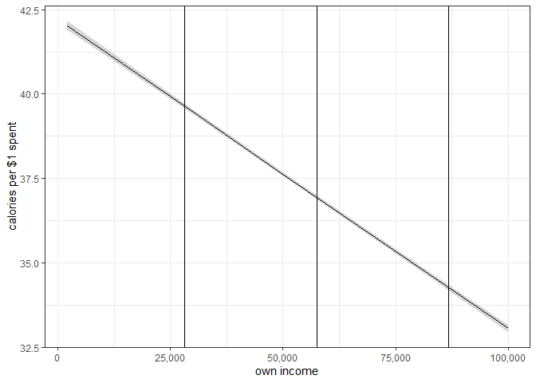
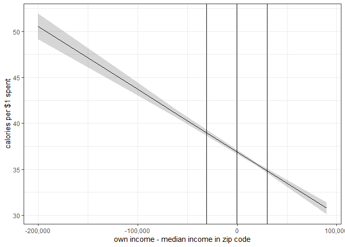
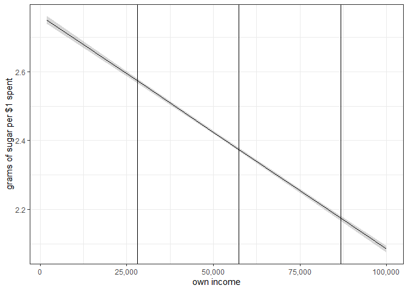
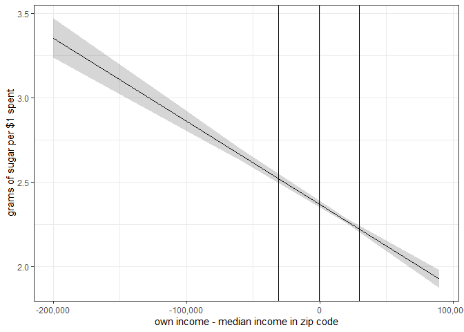
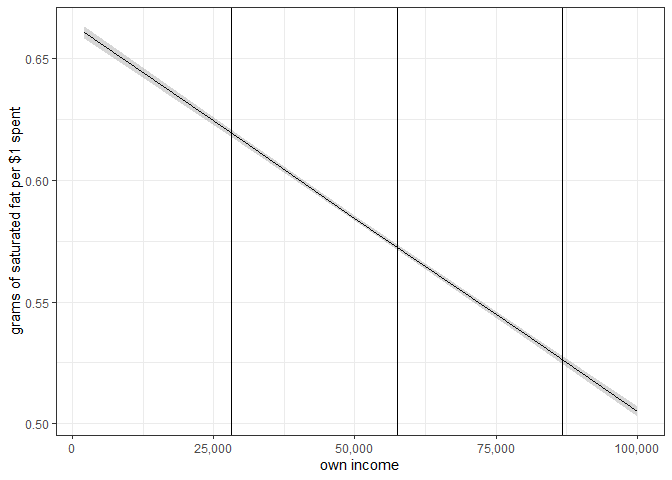
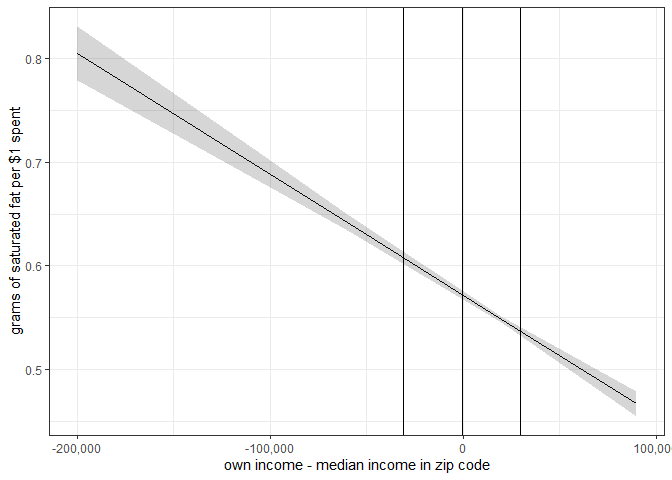

Nielsen Secondary Data Analysis - Nutrition
================
Daniel O’Leary
10/15/2020

  - [Setup](#setup)
      - [Load packages](#load-packages)
      - [Set path](#set-path)
      - [Load functions](#load-functions)
      - [Load data](#load-data)
  - [Analysis](#analysis)
      - [Calories](#calories)
          - [Income](#income)
          - [Income and median income](#income-and-median-income)
          - [Income difference score](#income-difference-score)
          - [Regression table](#regression-table)
          - [Own income](#own-income)
          - [Own income minus median income in your zip
            code](#own-income-minus-median-income-in-your-zip-code)
      - [Sugar content](#sugar-content)
          - [Income](#income-1)
          - [Income and median income](#income-and-median-income-1)
          - [Income difference score](#income-difference-score-1)
          - [Regression table](#regression-table-1)
          - [Own income](#own-income-1)
          - [Own income minus median income in your zip
            code](#own-income-minus-median-income-in-your-zip-code-1)
      - [Saturated fat content](#saturated-fat-content)
          - [Income](#income-2)
          - [Income and median income](#income-and-median-income-2)
          - [Income difference score](#income-difference-score-2)
          - [Regression table](#regression-table-2)
          - [Own income](#own-income-2)
          - [Own income minus median income in your zip
            code](#own-income-minus-median-income-in-your-zip-code-2)

# Setup

## Load packages

``` r
if (!require("pacman")) install.packages("pacman")
```

    ## Loading required package: pacman

``` r
pacman::p_load(
  tidyverse, 
  haven,
  lubridate,
  readr,
  lme4,
  sjPlot,
  effects,
  stargazer
)
```

## Set path

``` r
sinfo <- data.frame(Sys.info())
machine <- sinfo$Sys.info..[4]

machine_path <- 
  ifelse(
    machine %in% c("sussman-rp-mbpro.local", "sussman-rp-mbpro.lan"), 
    "/Users/djolear/Google Drive/", 
    "G:/My Drive/"
  )
```

## Load functions

``` r
lm.beta.lmer <- function(mod) {
   b <- fixef(mod)[-1]
   sd.x <- apply(getME(mod,"X")[,-1],2,sd)
   sd.y <- sd(getME(mod,"y"))
   b*sd.x/sd.y
}
```

## Load data

``` r
source(paste0(machine_path, "research/projects/niel/nielsen_analysis/calculate_nutrition_per_spend_fn.R"))
```

    ## Parsed with column specification:
    ## cols(
    ##   .default = col_character(),
    ##   `Added Sugars` = col_double(),
    ##   Calories = col_double(),
    ##   `Calories from Fat` = col_double(),
    ##   `Calories From Fat %` = col_double(),
    ##   `Calories From Saturated Fat %` = col_double(),
    ##   `Calories From Sugar %` = col_double(),
    ##   Cholesterol = col_double(),
    ##   `Dietary Fiber` = col_double(),
    ##   Protein = col_double(),
    ##   `Saturated Fat` = col_double(),
    ##   Sodium = col_double(),
    ##   Sugars = col_double(),
    ##   `Total Carbohydrate` = col_double(),
    ##   `Total Fat` = col_double(),
    ##   `Total Sugars` = col_logical(),
    ##   `Total Sugars UOM` = col_logical(),
    ##   `Trans Fat` = col_double(),
    ##   `Added Sugars Per 100` = col_double(),
    ##   `Calories From Fat % Per 100` = col_double(),
    ##   `Calories From Sugar % Per 100` = col_double()
    ##   # ... with 1 more columns
    ## )

    ## See spec(...) for full column specifications.

    ## Warning: 399308 parsing failures.
    ## row col   expected     actual                                                       file
    ##   1  -- 44 columns 51 columns 'G:/My Drive/research/projects/niel/label_insight_upc.csv'
    ##   2  -- 44 columns 51 columns 'G:/My Drive/research/projects/niel/label_insight_upc.csv'
    ##   3  -- 44 columns 51 columns 'G:/My Drive/research/projects/niel/label_insight_upc.csv'
    ##   4  -- 44 columns 51 columns 'G:/My Drive/research/projects/niel/label_insight_upc.csv'
    ##   5  -- 44 columns 51 columns 'G:/My Drive/research/projects/niel/label_insight_upc.csv'
    ## ... ... .......... .......... ..........................................................
    ## See problems(...) for more details.

``` r
source(paste0(machine_path, "research/projects/niel/nielsen_analysis/bind_nps_to_zip_code_census_fn.R"))

year = "2014"

nps_2014 <- 
  nutrition_per_spend_fn(year)
```

    ## Parsed with column specification:
    ## cols(
    ##   trip_code_uc = col_double(),
    ##   upc = col_character(),
    ##   upc_ver_uc = col_double(),
    ##   quantity = col_double(),
    ##   total_price_paid = col_double(),
    ##   coupon_value = col_double(),
    ##   deal_flag_uc = col_double()
    ## )

    ## Parsed with column specification:
    ## cols(
    ##   trip_code_uc = col_double(),
    ##   household_code = col_double(),
    ##   purchase_date = col_date(format = ""),
    ##   retailer_code = col_double(),
    ##   store_code_uc = col_double(),
    ##   panel_year = col_double(),
    ##   store_zip3 = col_character(),
    ##   total_spent = col_double(),
    ##   method_of_payment_cd = col_character()
    ## )

    ## Joining, by = "trip_code_uc"

    ## Parsed with column specification:
    ## cols(
    ##   .default = col_double(),
    ##   Panelist_ZipCd = col_character(),
    ##   Fips_State_Desc = col_character(),
    ##   Fips_County_Desc = col_character(),
    ##   Scantrack_Market_Identifier_Desc = col_character(),
    ##   DMA_Name = col_character(),
    ##   Member_6_Employment = col_logical(),
    ##   Member_7_Birth = col_logical(),
    ##   Member_7_Relationship_Sex = col_logical(),
    ##   Member_7_Employment = col_logical()
    ## )

    ## See spec(...) for full column specifications.

    ## Warning: 117 parsing failures.
    ##  row                       col           expected actual                                                                                                                                                 file
    ## 1241 Member_7_Birth            1/0/T/F/TRUE/FALSE   2006 'G:/Shared drives/SPL-Nielsen/Consumer_Panel_Data_2004_2017/Consumer_Panel_Data_2004_2017/nielsen_extracts/HMS/2014/Annual_Files/panelists_2014.tsv'
    ## 1241 Member_7_Relationship_Sex 1/0/T/F/TRUE/FALSE   2    'G:/Shared drives/SPL-Nielsen/Consumer_Panel_Data_2004_2017/Consumer_Panel_Data_2004_2017/nielsen_extracts/HMS/2014/Annual_Files/panelists_2014.tsv'
    ## 2027 Member_7_Birth            1/0/T/F/TRUE/FALSE   2006 'G:/Shared drives/SPL-Nielsen/Consumer_Panel_Data_2004_2017/Consumer_Panel_Data_2004_2017/nielsen_extracts/HMS/2014/Annual_Files/panelists_2014.tsv'
    ## 2027 Member_7_Relationship_Sex 1/0/T/F/TRUE/FALSE   3    'G:/Shared drives/SPL-Nielsen/Consumer_Panel_Data_2004_2017/Consumer_Panel_Data_2004_2017/nielsen_extracts/HMS/2014/Annual_Files/panelists_2014.tsv'
    ## 2200 Member_7_Birth            1/0/T/F/TRUE/FALSE   1990 'G:/Shared drives/SPL-Nielsen/Consumer_Panel_Data_2004_2017/Consumer_Panel_Data_2004_2017/nielsen_extracts/HMS/2014/Annual_Files/panelists_2014.tsv'
    ## .... ......................... .................. ...... ....................................................................................................................................................
    ## See problems(...) for more details.

    ## `summarise()` ungrouping output (override with `.groups` argument)

    ## `summarise()` ungrouping output (override with `.groups` argument)

    ## Joining, by = "household_code"

    ## `summarise()` ungrouping output (override with `.groups` argument)
    ## `summarise()` ungrouping output (override with `.groups` argument)

    ## Joining, by = "household_code"

    ## `summarise()` ungrouping output (override with `.groups` argument)
    ## `summarise()` ungrouping output (override with `.groups` argument)

    ## Joining, by = "household_code"
    ## Joining, by = "household_code"
    ## Joining, by = "household_code"
    ## Joining, by = "household_code"

``` r
nps_2014 <-
  bind_zip_code_census_data_function(nps_2014, year)  
```

    ## Joining, by = "zip"

    ## Parsed with column specification:
    ## cols(
    ##   .default = col_double(),
    ##   zip = col_character()
    ## )

    ## See spec(...) for full column specifications.

    ## Parsed with column specification:
    ## cols(
    ##   ZIP = col_character(),
    ##   county1 = col_double(),
    ##   county2 = col_double(),
    ##   county3 = col_double(),
    ##   county4 = col_double(),
    ##   county5 = col_double(),
    ##   county6 = col_double(),
    ##   county7 = col_double(),
    ##   county1_ratio = col_double(),
    ##   county2_ratio = col_double(),
    ##   county3_ratio = col_double(),
    ##   county4_ratio = col_double(),
    ##   county5_ratio = col_double(),
    ##   county6_ratio = col_double(),
    ##   county7_ratio = col_double(),
    ##   n = col_double()
    ## )

    ## Warning: Missing column names filled in: 'X24' [24]

    ## Parsed with column specification:
    ## cols(
    ##   .default = col_double(),
    ##   `County Name` = col_character(),
    ##   `Commuting Zone Name` = col_character(),
    ##   State = col_character(),
    ##   X24 = col_logical()
    ## )

    ## See spec(...) for full column specifications.

    ## Parsed with column specification:
    ## cols(
    ##   cty = col_character(),
    ##   Name = col_character(),
    ##   Household_Income_rP_gP_p50 = col_double()
    ## )

    ## Joining, by = "zip"
    ## Joining, by = "zip"
    ## Joining, by = "zip"

# Analysis

## Calories

### Income

``` r
lm_inc <-
  lmer(
    cal_per ~
      inc_mid +
      Household_Size +
      Male_Head_Education +
      Female_Head_Education +
      Race +
      Marital_Status +
      Male_Head_Employment +
      Female_Head_Employment +
      Male_Head_Age +
      Female_Head_Age +
      (1|zip), 
    data = nps_2014
  )
```

    ## Warning: Some predictor variables are on very different scales: consider
    ## rescaling

``` r
summary(lm_inc)
```

    ## Linear mixed model fit by REML ['lmerMod']
    ## Formula: 
    ## cal_per ~ inc_mid + Household_Size + Male_Head_Education + Female_Head_Education +  
    ##     Race + Marital_Status + Male_Head_Employment + Female_Head_Employment +  
    ##     Male_Head_Age + Female_Head_Age + (1 | zip)
    ##    Data: nps_2014
    ## 
    ## REML criterion at convergence: 480139
    ## 
    ## Scaled residuals: 
    ##     Min      1Q  Median      3Q     Max 
    ## -3.6347 -0.6498 -0.0996  0.5295 18.1608 
    ## 
    ## Random effects:
    ##  Groups   Name        Variance Std.Dev.
    ##  zip      (Intercept)   5.315   2.305  
    ##  Residual             138.568  11.772  
    ## Number of obs: 61524, groups:  zip, 15970
    ## 
    ## Fixed effects:
    ##                           Estimate Std. Error t value
    ## (Intercept)              4.154e+01  4.519e-01  91.925
    ## inc_mid                 -9.150e-05  2.132e-06 -42.924
    ## Household_Size          -5.224e-02  4.923e-02  -1.061
    ## Male_Head_Education     -5.398e-01  5.553e-02  -9.719
    ## Female_Head_Education   -7.682e-01  5.529e-02 -13.893
    ## Race2                    1.595e+00  1.664e-01   9.585
    ## Race3                   -2.824e+00  2.843e-01  -9.932
    ## Race4                   -9.765e-01  2.379e-01  -4.105
    ## Marital_Status2          2.817e+00  2.831e-01   9.948
    ## Marital_Status3          2.205e+00  2.470e-01   8.928
    ## Marital_Status4          2.596e+00  2.495e-01  10.407
    ## Male_Head_Employment1    3.932e+00  5.193e-01   7.572
    ## Male_Head_Employment2    4.515e+00  5.515e-01   8.187
    ## Male_Head_Employment3    5.012e+00  4.584e-01  10.934
    ## Male_Head_Employment9    3.601e+00  4.894e-01   7.358
    ## Female_Head_Employment1  4.105e+00  4.841e-01   8.480
    ## Female_Head_Employment2  4.433e+00  5.131e-01   8.641
    ## Female_Head_Employment3  4.895e+00  4.657e-01  10.510
    ## Female_Head_Employment9  3.442e+00  4.726e-01   7.283
    ## Male_Head_Age           -2.129e-01  4.619e-02  -4.610
    ## Female_Head_Age         -2.253e-01  4.141e-02  -5.439

    ## 
    ## Correlation matrix not shown by default, as p = 21 > 12.
    ## Use print(x, correlation=TRUE)  or
    ##     vcov(x)        if you need it

    ## fit warnings:
    ## Some predictor variables are on very different scales: consider rescaling

``` r
lm.beta.lmer(lm_inc)
```

    ##                 inc_mid          Household_Size     Male_Head_Education 
    ##            -0.213583630            -0.005294853            -0.088731461 
    ##   Female_Head_Education                   Race2                   Race3 
    ##            -0.099686591             0.038489952            -0.038946748 
    ##                   Race4         Marital_Status2         Marital_Status3 
    ##            -0.015923962             0.059416271             0.062646982 
    ##         Marital_Status4   Male_Head_Employment1   Male_Head_Employment2 
    ##             0.070531951             0.066030270             0.055807733 
    ##   Male_Head_Employment3   Male_Head_Employment9 Female_Head_Employment1 
    ##             0.196927070             0.124184833             0.107256814 
    ## Female_Head_Employment2 Female_Head_Employment3 Female_Head_Employment9 
    ##             0.072421065             0.182707734             0.134407889 
    ##           Male_Head_Age         Female_Head_Age 
    ##            -0.059627705            -0.050380347

### Income and median income

``` r
lm_med_inc <-
  lmer(
    cal_per ~
      median_income + 
      inc_mid + 
      median_monthly_housing_cost + 
      pov_status_below_per +
      Household_Size +
      Male_Head_Education +
      Female_Head_Education +
      Race +
      Marital_Status +
      Male_Head_Employment +
      Female_Head_Employment +
      Male_Head_Age +
      Female_Head_Age +
      (1|zip), 
    data = nps_2014
  )
```

    ## Warning: Some predictor variables are on very different scales: consider
    ## rescaling

``` r
summary(lm_med_inc)
```

    ## Linear mixed model fit by REML ['lmerMod']
    ## Formula: cal_per ~ median_income + inc_mid + median_monthly_housing_cost +  
    ##     pov_status_below_per + Household_Size + Male_Head_Education +  
    ##     Female_Head_Education + Race + Marital_Status + Male_Head_Employment +  
    ##     Female_Head_Employment + Male_Head_Age + Female_Head_Age +      (1 | zip)
    ##    Data: nps_2014
    ## 
    ## REML criterion at convergence: 477032.4
    ## 
    ## Scaled residuals: 
    ##     Min      1Q  Median      3Q     Max 
    ## -3.6646 -0.6524 -0.0992  0.5277 18.2167 
    ## 
    ## Random effects:
    ##  Groups   Name        Variance Std.Dev.
    ##  zip      (Intercept)   3.852   1.963  
    ##  Residual             138.430  11.766  
    ## Number of obs: 61197, groups:  zip, 15673
    ## 
    ## Fixed effects:
    ##                               Estimate Std. Error t value
    ## (Intercept)                  4.151e+01  5.641e-01  73.586
    ## median_income                6.810e-05  6.946e-06   9.805
    ## inc_mid                     -8.133e-05  2.186e-06 -37.203
    ## median_monthly_housing_cost -5.060e-03  2.839e-04 -17.825
    ## pov_status_below_per         7.169e+00  1.015e+00   7.063
    ## Household_Size              -2.857e-02  4.916e-02  -0.581
    ## Male_Head_Education         -4.810e-01  5.562e-02  -8.647
    ## Female_Head_Education       -7.293e-01  5.526e-02 -13.198
    ## Race2                        1.601e+00  1.704e-01   9.394
    ## Race3                       -2.120e+00  2.860e-01  -7.412
    ## Race4                       -7.411e-01  2.394e-01  -3.096
    ## Marital_Status2              2.874e+00  2.828e-01  10.164
    ## Marital_Status3              2.353e+00  2.468e-01   9.532
    ## Marital_Status4              2.821e+00  2.495e-01  11.307
    ## Male_Head_Employment1        3.624e+00  5.189e-01   6.984
    ## Male_Head_Employment2        4.198e+00  5.515e-01   7.611
    ## Male_Head_Employment3        4.585e+00  4.585e-01  10.001
    ## Male_Head_Employment9        3.235e+00  4.893e-01   6.611
    ## Female_Head_Employment1      3.877e+00  4.835e-01   8.020
    ## Female_Head_Employment2      4.189e+00  5.125e-01   8.175
    ## Female_Head_Employment3      4.564e+00  4.653e-01   9.809
    ## Female_Head_Employment9      3.197e+00  4.720e-01   6.773
    ## Male_Head_Age               -2.147e-01  4.612e-02  -4.656
    ## Female_Head_Age             -2.211e-01  4.136e-02  -5.346

    ## 
    ## Correlation matrix not shown by default, as p = 24 > 12.
    ## Use print(x, correlation=TRUE)  or
    ##     vcov(x)        if you need it

    ## fit warnings:
    ## Some predictor variables are on very different scales: consider rescaling

``` r
lm.beta.lmer(lm_med_inc)
```

    ##               median_income                     inc_mid 
    ##                 0.114460667                -0.189912312 
    ## median_monthly_housing_cost        pov_status_below_per 
    ##                -0.165043094                 0.047688559 
    ##              Household_Size         Male_Head_Education 
    ##                -0.002897621                -0.079090330 
    ##       Female_Head_Education                       Race2 
    ##                -0.094598673                 0.038605217 
    ##                       Race3                       Race4 
    ##                -0.029275710                -0.012064207 
    ##             Marital_Status2             Marital_Status3 
    ##                 0.060681496                 0.066822234 
    ##             Marital_Status4       Male_Head_Employment1 
    ##                 0.076593877                 0.060921556 
    ##       Male_Head_Employment2       Male_Head_Employment3 
    ##                 0.051796845                 0.180254299 
    ##       Male_Head_Employment9     Female_Head_Employment1 
    ##                 0.111597304                 0.101435353 
    ##     Female_Head_Employment2     Female_Head_Employment3 
    ##                 0.068470104                 0.170467936 
    ##     Female_Head_Employment9               Male_Head_Age 
    ##                 0.124904555                -0.060157879 
    ##             Female_Head_Age 
    ##                -0.049442375

### Income difference score

``` r
lm_inc_diff <-
  lmer(
    cal_per ~
      inc_mid +     
      inc_diff + 
      Household_Size +
      pov_status_below_per +
      median_monthly_housing_cost + 
      Male_Head_Education +
      Female_Head_Education +
      Race +
      Marital_Status +
      Male_Head_Employment +
      Female_Head_Employment +
      Male_Head_Age +
      Female_Head_Age +
      (1|zip), 
    data = nps_2014
  )
```

    ## Warning: Some predictor variables are on very different scales: consider
    ## rescaling

``` r
summary(lm_inc_diff)
```

    ## Linear mixed model fit by REML ['lmerMod']
    ## Formula: 
    ## cal_per ~ inc_mid + inc_diff + Household_Size + pov_status_below_per +  
    ##     median_monthly_housing_cost + Male_Head_Education + Female_Head_Education +  
    ##     Race + Marital_Status + Male_Head_Employment + Female_Head_Employment +  
    ##     Male_Head_Age + Female_Head_Age + (1 | zip)
    ##    Data: nps_2014
    ## 
    ## REML criterion at convergence: 477032.4
    ## 
    ## Scaled residuals: 
    ##     Min      1Q  Median      3Q     Max 
    ## -3.6646 -0.6524 -0.0992  0.5277 18.2167 
    ## 
    ## Random effects:
    ##  Groups   Name        Variance Std.Dev.
    ##  zip      (Intercept)   3.852   1.963  
    ##  Residual             138.430  11.766  
    ## Number of obs: 61197, groups:  zip, 15673
    ## 
    ## Fixed effects:
    ##                               Estimate Std. Error t value
    ## (Intercept)                  4.151e+01  5.641e-01  73.586
    ## inc_mid                     -1.323e-05  7.253e-06  -1.824
    ## inc_diff                    -6.810e-05  6.946e-06  -9.805
    ## Household_Size              -2.857e-02  4.916e-02  -0.581
    ## pov_status_below_per         7.169e+00  1.015e+00   7.063
    ## median_monthly_housing_cost -5.060e-03  2.839e-04 -17.825
    ## Male_Head_Education         -4.810e-01  5.562e-02  -8.647
    ## Female_Head_Education       -7.293e-01  5.526e-02 -13.198
    ## Race2                        1.601e+00  1.704e-01   9.394
    ## Race3                       -2.120e+00  2.860e-01  -7.412
    ## Race4                       -7.411e-01  2.394e-01  -3.096
    ## Marital_Status2              2.874e+00  2.828e-01  10.164
    ## Marital_Status3              2.353e+00  2.468e-01   9.532
    ## Marital_Status4              2.821e+00  2.495e-01  11.307
    ## Male_Head_Employment1        3.624e+00  5.189e-01   6.984
    ## Male_Head_Employment2        4.198e+00  5.515e-01   7.611
    ## Male_Head_Employment3        4.585e+00  4.585e-01  10.001
    ## Male_Head_Employment9        3.235e+00  4.893e-01   6.611
    ## Female_Head_Employment1      3.877e+00  4.835e-01   8.020
    ## Female_Head_Employment2      4.189e+00  5.125e-01   8.175
    ## Female_Head_Employment3      4.564e+00  4.653e-01   9.809
    ## Female_Head_Employment9      3.197e+00  4.720e-01   6.773
    ## Male_Head_Age               -2.147e-01  4.612e-02  -4.656
    ## Female_Head_Age             -2.211e-01  4.136e-02  -5.346

    ## 
    ## Correlation matrix not shown by default, as p = 24 > 12.
    ## Use print(x, correlation=TRUE)  or
    ##     vcov(x)        if you need it

    ## fit warnings:
    ## Some predictor variables are on very different scales: consider rescaling

``` r
lm.beta.lmer(lm_inc_diff)
```

    ##                     inc_mid                    inc_diff 
    ##                -0.030887943                -0.165022815 
    ##              Household_Size        pov_status_below_per 
    ##                -0.002897621                 0.047688559 
    ## median_monthly_housing_cost         Male_Head_Education 
    ##                -0.165043093                -0.079090330 
    ##       Female_Head_Education                       Race2 
    ##                -0.094598673                 0.038605217 
    ##                       Race3                       Race4 
    ##                -0.029275710                -0.012064207 
    ##             Marital_Status2             Marital_Status3 
    ##                 0.060681496                 0.066822234 
    ##             Marital_Status4       Male_Head_Employment1 
    ##                 0.076593877                 0.060921556 
    ##       Male_Head_Employment2       Male_Head_Employment3 
    ##                 0.051796845                 0.180254299 
    ##       Male_Head_Employment9     Female_Head_Employment1 
    ##                 0.111597304                 0.101435352 
    ##     Female_Head_Employment2     Female_Head_Employment3 
    ##                 0.068470104                 0.170467936 
    ##     Female_Head_Employment9               Male_Head_Age 
    ##                 0.124904555                -0.060157879 
    ##             Female_Head_Age 
    ##                -0.049442375

### Regression table

``` r
stargazer(
  lm_inc, lm_med_inc, lm_inc_diff,
  coef = 
    list(
      lm.beta.lmer(lm_inc), 
      lm.beta.lmer(lm_med_inc), 
      lm.beta.lmer(lm_inc_diff)
    ),
  type = "html"
)
```

<table style="text-align:center">

<tr>

<td colspan="4" style="border-bottom: 1px solid black">

</td>

</tr>

<tr>

<td style="text-align:left">

</td>

<td colspan="3">

<em>Dependent variable:</em>

</td>

</tr>

<tr>

<td>

</td>

<td colspan="3" style="border-bottom: 1px solid black">

</td>

</tr>

<tr>

<td style="text-align:left">

</td>

<td colspan="3">

cal\_per

</td>

</tr>

<tr>

<td style="text-align:left">

</td>

<td>

(1)

</td>

<td>

(2)

</td>

<td>

(3)

</td>

</tr>

<tr>

<td colspan="4" style="border-bottom: 1px solid black">

</td>

</tr>

<tr>

<td style="text-align:left">

median\_income

</td>

<td>

</td>

<td>

0.114<sup>\*\*\*</sup>

</td>

<td>

</td>

</tr>

<tr>

<td style="text-align:left">

</td>

<td>

</td>

<td>

(0.00001)

</td>

<td>

</td>

</tr>

<tr>

<td style="text-align:left">

</td>

<td>

</td>

<td>

</td>

<td>

</td>

</tr>

<tr>

<td style="text-align:left">

inc\_mid

</td>

<td>

\-0.214

</td>

<td>

\-0.190<sup>\*\*\*</sup>

</td>

<td>

\-0.031<sup>\*\*\*</sup>

</td>

</tr>

<tr>

<td style="text-align:left">

</td>

<td>

(0.00000)

</td>

<td>

(0.00000)

</td>

<td>

(0.00001)

</td>

</tr>

<tr>

<td style="text-align:left">

</td>

<td>

</td>

<td>

</td>

<td>

</td>

</tr>

<tr>

<td style="text-align:left">

inc\_diff

</td>

<td>

</td>

<td>

</td>

<td>

\-0.165<sup>\*\*\*</sup>

</td>

</tr>

<tr>

<td style="text-align:left">

</td>

<td>

</td>

<td>

</td>

<td>

(0.00001)

</td>

</tr>

<tr>

<td style="text-align:left">

</td>

<td>

</td>

<td>

</td>

<td>

</td>

</tr>

<tr>

<td style="text-align:left">

median\_monthly\_housing\_cost

</td>

<td>

</td>

<td>

\-0.165<sup>\*\*\*</sup>

</td>

<td>

\-0.165<sup>\*\*\*</sup>

</td>

</tr>

<tr>

<td style="text-align:left">

</td>

<td>

</td>

<td>

(0.0003)

</td>

<td>

(0.0003)

</td>

</tr>

<tr>

<td style="text-align:left">

</td>

<td>

</td>

<td>

</td>

<td>

</td>

</tr>

<tr>

<td style="text-align:left">

pov\_status\_below\_per

</td>

<td>

</td>

<td>

0.048

</td>

<td>

0.048

</td>

</tr>

<tr>

<td style="text-align:left">

</td>

<td>

</td>

<td>

(1.015)

</td>

<td>

(1.015)

</td>

</tr>

<tr>

<td style="text-align:left">

</td>

<td>

</td>

<td>

</td>

<td>

</td>

</tr>

<tr>

<td style="text-align:left">

Household\_Size

</td>

<td>

\-0.005<sup>\*\*\*</sup>

</td>

<td>

\-0.003

</td>

<td>

\-0.003

</td>

</tr>

<tr>

<td style="text-align:left">

</td>

<td>

(0.049)

</td>

<td>

(0.049)

</td>

<td>

(0.049)

</td>

</tr>

<tr>

<td style="text-align:left">

</td>

<td>

</td>

<td>

</td>

<td>

</td>

</tr>

<tr>

<td style="text-align:left">

Male\_Head\_Education

</td>

<td>

\-0.089<sup>\*</sup>

</td>

<td>

\-0.079

</td>

<td>

\-0.079

</td>

</tr>

<tr>

<td style="text-align:left">

</td>

<td>

(0.056)

</td>

<td>

(0.056)

</td>

<td>

(0.056)

</td>

</tr>

<tr>

<td style="text-align:left">

</td>

<td>

</td>

<td>

</td>

<td>

</td>

</tr>

<tr>

<td style="text-align:left">

Female\_Head\_Education

</td>

<td>

\-0.100<sup>\*</sup>

</td>

<td>

\-0.095<sup>\*</sup>

</td>

<td>

\-0.095<sup>\*</sup>

</td>

</tr>

<tr>

<td style="text-align:left">

</td>

<td>

(0.055)

</td>

<td>

(0.055)

</td>

<td>

(0.055)

</td>

</tr>

<tr>

<td style="text-align:left">

</td>

<td>

</td>

<td>

</td>

<td>

</td>

</tr>

<tr>

<td style="text-align:left">

Race2

</td>

<td>

0.038

</td>

<td>

0.039

</td>

<td>

0.039

</td>

</tr>

<tr>

<td style="text-align:left">

</td>

<td>

(0.166)

</td>

<td>

(0.170)

</td>

<td>

(0.170)

</td>

</tr>

<tr>

<td style="text-align:left">

</td>

<td>

</td>

<td>

</td>

<td>

</td>

</tr>

<tr>

<td style="text-align:left">

Race3

</td>

<td>

\-0.039

</td>

<td>

\-0.029

</td>

<td>

\-0.029

</td>

</tr>

<tr>

<td style="text-align:left">

</td>

<td>

(0.284)

</td>

<td>

(0.286)

</td>

<td>

(0.286)

</td>

</tr>

<tr>

<td style="text-align:left">

</td>

<td>

</td>

<td>

</td>

<td>

</td>

</tr>

<tr>

<td style="text-align:left">

Race4

</td>

<td>

\-0.016

</td>

<td>

\-0.012

</td>

<td>

\-0.012

</td>

</tr>

<tr>

<td style="text-align:left">

</td>

<td>

(0.238)

</td>

<td>

(0.239)

</td>

<td>

(0.239)

</td>

</tr>

<tr>

<td style="text-align:left">

</td>

<td>

</td>

<td>

</td>

<td>

</td>

</tr>

<tr>

<td style="text-align:left">

Marital\_Status2

</td>

<td>

0.059

</td>

<td>

0.061

</td>

<td>

0.061

</td>

</tr>

<tr>

<td style="text-align:left">

</td>

<td>

(0.283)

</td>

<td>

(0.283)

</td>

<td>

(0.283)

</td>

</tr>

<tr>

<td style="text-align:left">

</td>

<td>

</td>

<td>

</td>

<td>

</td>

</tr>

<tr>

<td style="text-align:left">

Marital\_Status3

</td>

<td>

0.063

</td>

<td>

0.067

</td>

<td>

0.067

</td>

</tr>

<tr>

<td style="text-align:left">

</td>

<td>

(0.247)

</td>

<td>

(0.247)

</td>

<td>

(0.247)

</td>

</tr>

<tr>

<td style="text-align:left">

</td>

<td>

</td>

<td>

</td>

<td>

</td>

</tr>

<tr>

<td style="text-align:left">

Marital\_Status4

</td>

<td>

0.071

</td>

<td>

0.077

</td>

<td>

0.077

</td>

</tr>

<tr>

<td style="text-align:left">

</td>

<td>

(0.249)

</td>

<td>

(0.250)

</td>

<td>

(0.250)

</td>

</tr>

<tr>

<td style="text-align:left">

</td>

<td>

</td>

<td>

</td>

<td>

</td>

</tr>

<tr>

<td style="text-align:left">

Male\_Head\_Employment1

</td>

<td>

0.066

</td>

<td>

0.061

</td>

<td>

0.061

</td>

</tr>

<tr>

<td style="text-align:left">

</td>

<td>

(0.519)

</td>

<td>

(0.519)

</td>

<td>

(0.519)

</td>

</tr>

<tr>

<td style="text-align:left">

</td>

<td>

</td>

<td>

</td>

<td>

</td>

</tr>

<tr>

<td style="text-align:left">

Male\_Head\_Employment2

</td>

<td>

0.056

</td>

<td>

0.052

</td>

<td>

0.052

</td>

</tr>

<tr>

<td style="text-align:left">

</td>

<td>

(0.551)

</td>

<td>

(0.552)

</td>

<td>

(0.552)

</td>

</tr>

<tr>

<td style="text-align:left">

</td>

<td>

</td>

<td>

</td>

<td>

</td>

</tr>

<tr>

<td style="text-align:left">

Male\_Head\_Employment3

</td>

<td>

0.197

</td>

<td>

0.180

</td>

<td>

0.180

</td>

</tr>

<tr>

<td style="text-align:left">

</td>

<td>

(0.458)

</td>

<td>

(0.458)

</td>

<td>

(0.458)

</td>

</tr>

<tr>

<td style="text-align:left">

</td>

<td>

</td>

<td>

</td>

<td>

</td>

</tr>

<tr>

<td style="text-align:left">

Male\_Head\_Employment9

</td>

<td>

0.124

</td>

<td>

0.112

</td>

<td>

0.112

</td>

</tr>

<tr>

<td style="text-align:left">

</td>

<td>

(0.489)

</td>

<td>

(0.489)

</td>

<td>

(0.489)

</td>

</tr>

<tr>

<td style="text-align:left">

</td>

<td>

</td>

<td>

</td>

<td>

</td>

</tr>

<tr>

<td style="text-align:left">

Female\_Head\_Employment1

</td>

<td>

0.107

</td>

<td>

0.101

</td>

<td>

0.101

</td>

</tr>

<tr>

<td style="text-align:left">

</td>

<td>

(0.484)

</td>

<td>

(0.483)

</td>

<td>

(0.483)

</td>

</tr>

<tr>

<td style="text-align:left">

</td>

<td>

</td>

<td>

</td>

<td>

</td>

</tr>

<tr>

<td style="text-align:left">

Female\_Head\_Employment2

</td>

<td>

0.072

</td>

<td>

0.068

</td>

<td>

0.068

</td>

</tr>

<tr>

<td style="text-align:left">

</td>

<td>

(0.513)

</td>

<td>

(0.512)

</td>

<td>

(0.512)

</td>

</tr>

<tr>

<td style="text-align:left">

</td>

<td>

</td>

<td>

</td>

<td>

</td>

</tr>

<tr>

<td style="text-align:left">

Female\_Head\_Employment3

</td>

<td>

0.183

</td>

<td>

0.170

</td>

<td>

0.170

</td>

</tr>

<tr>

<td style="text-align:left">

</td>

<td>

(0.466)

</td>

<td>

(0.465)

</td>

<td>

(0.465)

</td>

</tr>

<tr>

<td style="text-align:left">

</td>

<td>

</td>

<td>

</td>

<td>

</td>

</tr>

<tr>

<td style="text-align:left">

Female\_Head\_Employment9

</td>

<td>

0.134

</td>

<td>

0.125

</td>

<td>

0.125

</td>

</tr>

<tr>

<td style="text-align:left">

</td>

<td>

(0.473)

</td>

<td>

(0.472)

</td>

<td>

(0.472)

</td>

</tr>

<tr>

<td style="text-align:left">

</td>

<td>

</td>

<td>

</td>

<td>

</td>

</tr>

<tr>

<td style="text-align:left">

Male\_Head\_Age

</td>

<td>

\-0.060

</td>

<td>

\-0.060

</td>

<td>

\-0.060

</td>

</tr>

<tr>

<td style="text-align:left">

</td>

<td>

(0.046)

</td>

<td>

(0.046)

</td>

<td>

(0.046)

</td>

</tr>

<tr>

<td style="text-align:left">

</td>

<td>

</td>

<td>

</td>

<td>

</td>

</tr>

<tr>

<td style="text-align:left">

Female\_Head\_Age

</td>

<td>

\-0.050

</td>

<td>

\-0.049

</td>

<td>

\-0.049

</td>

</tr>

<tr>

<td style="text-align:left">

</td>

<td>

(0.041)

</td>

<td>

(0.041)

</td>

<td>

(0.041)

</td>

</tr>

<tr>

<td style="text-align:left">

</td>

<td>

</td>

<td>

</td>

<td>

</td>

</tr>

<tr>

<td style="text-align:left">

Constant

</td>

<td>

</td>

<td>

</td>

<td>

</td>

</tr>

<tr>

<td style="text-align:left">

</td>

<td>

(0.452)

</td>

<td>

(0.564)

</td>

<td>

(0.564)

</td>

</tr>

<tr>

<td style="text-align:left">

</td>

<td>

</td>

<td>

</td>

<td>

</td>

</tr>

<tr>

<td colspan="4" style="border-bottom: 1px solid black">

</td>

</tr>

<tr>

<td style="text-align:left">

Observations

</td>

<td>

61,524

</td>

<td>

61,197

</td>

<td>

61,197

</td>

</tr>

<tr>

<td style="text-align:left">

Log Likelihood

</td>

<td>

\-240,069.500

</td>

<td>

\-238,516.200

</td>

<td>

\-238,516.200

</td>

</tr>

<tr>

<td style="text-align:left">

Akaike Inf. Crit.

</td>

<td>

480,185.000

</td>

<td>

477,084.400

</td>

<td>

477,084.400

</td>

</tr>

<tr>

<td style="text-align:left">

Bayesian Inf. Crit.

</td>

<td>

480,392.600

</td>

<td>

477,319.000

</td>

<td>

477,319.000

</td>

</tr>

<tr>

<td colspan="4" style="border-bottom: 1px solid black">

</td>

</tr>

<tr>

<td style="text-align:left">

<em>Note:</em>

</td>

<td colspan="3" style="text-align:right">

<sup>*</sup>p\<0.1; <sup>**</sup>p\<0.05; <sup>***</sup>p\<0.01

</td>

</tr>

</table>

### Own income

``` r
effect("inc_mid", lm_inc) %>% 
  as_tibble() %>% 
  ggplot(aes(inc_mid, fit)) +
  geom_line() +
  geom_ribbon(aes(ymin = fit - se, ymax = fit + se), alpha  = 0.2) +
  scale_x_continuous(labels = scales::comma) +
  geom_vline(xintercept = mean(nps_2014$inc_mid, na.rm = TRUE)) +
  geom_vline(xintercept = mean(nps_2014$inc_mid, na.rm = TRUE) + sd(nps_2014$inc_mid, na.rm = TRUE)) +
  geom_vline(xintercept = mean(nps_2014$inc_mid, na.rm = TRUE) - sd(nps_2014$inc_mid, na.rm = TRUE)) +
  labs(
    x = "own income",
    y = "calories per $1 spent"
  ) +
  theme_bw()
```

<!-- -->

### Own income minus median income in your zip code

``` r
effect("inc_diff", lm_inc_diff) %>% 
  as_tibble() %>% 
  ggplot(aes(inc_diff, fit)) +
  geom_line() +
  geom_ribbon(aes(ymin = fit - se, ymax = fit + se), alpha  = 0.2) +
  scale_x_continuous(labels = scales::comma) +
  geom_vline(xintercept = mean(nps_2014$inc_diff, na.rm = TRUE)) +
  geom_vline(xintercept = mean(nps_2014$inc_diff, na.rm = TRUE) + sd(nps_2014$inc_diff, na.rm = TRUE)) +
  geom_vline(xintercept = mean(nps_2014$inc_diff, na.rm = TRUE) - sd(nps_2014$inc_diff, na.rm = TRUE)) +
  labs(
    x = "own income - median income in zip code",
    y = "calories per $1 spent"
  ) + 
  theme_bw()
```

<!-- -->

## Sugar content

### Income

``` r
lm_inc <-
  lmer(
    sug_per ~
      inc_mid +
      Household_Size +
      Male_Head_Education +
      Female_Head_Education +
      Race +
      Marital_Status +
      Male_Head_Employment +
      Female_Head_Employment +
      Male_Head_Age +
      Female_Head_Age +
      (1|zip), 
    data = nps_2014
  )
```

    ## Warning: Some predictor variables are on very different scales: consider
    ## rescaling

``` r
summary(lm_inc)
```

    ## Linear mixed model fit by REML ['lmerMod']
    ## Formula: 
    ## sug_per ~ inc_mid + Household_Size + Male_Head_Education + Female_Head_Education +  
    ##     Race + Marital_Status + Male_Head_Employment + Female_Head_Employment +  
    ##     Male_Head_Age + Female_Head_Age + (1 | zip)
    ##    Data: nps_2014
    ## 
    ## REML criterion at convergence: 177926.2
    ## 
    ## Scaled residuals: 
    ##    Min     1Q Median     3Q    Max 
    ## -2.808 -0.630 -0.120  0.472 47.323 
    ## 
    ## Random effects:
    ##  Groups   Name        Variance Std.Dev.
    ##  zip      (Intercept) 0.02539  0.1593  
    ##  Residual             1.02943  1.0146  
    ## Number of obs: 61521, groups:  zip, 15969
    ## 
    ## Fixed effects:
    ##                           Estimate Std. Error t value
    ## (Intercept)              2.583e+00  3.874e-02  66.664
    ## inc_mid                 -6.790e-06  1.825e-07 -37.195
    ## Household_Size           3.005e-02  4.222e-03   7.118
    ## Male_Head_Education     -3.746e-02  4.760e-03  -7.870
    ## Female_Head_Education   -5.180e-02  4.740e-03 -10.927
    ## Race2                    4.018e-01  1.417e-02  28.349
    ## Race3                   -9.551e-02  2.435e-02  -3.922
    ## Race4                    9.203e-02  2.039e-02   4.514
    ## Marital_Status2          1.739e-01  2.428e-02   7.160
    ## Marital_Status3          1.309e-01  2.119e-02   6.177
    ## Marital_Status4          1.678e-01  2.140e-02   7.841
    ## Male_Head_Employment1    3.025e-01  4.453e-02   6.794
    ## Male_Head_Employment2    3.642e-01  4.729e-02   7.701
    ## Male_Head_Employment3    3.450e-01  3.931e-02   8.777
    ## Male_Head_Employment9    2.717e-01  4.197e-02   6.474
    ## Female_Head_Employment1  3.064e-01  4.151e-02   7.381
    ## Female_Head_Employment2  3.237e-01  4.400e-02   7.357
    ## Female_Head_Employment3  3.216e-01  3.994e-02   8.052
    ## Female_Head_Employment9  2.757e-01  4.053e-02   6.801
    ## Male_Head_Age           -1.850e-02  3.962e-03  -4.670
    ## Female_Head_Age         -1.289e-02  3.552e-03  -3.631

    ## 
    ## Correlation matrix not shown by default, as p = 21 > 12.
    ## Use print(x, correlation=TRUE)  or
    ##     vcov(x)        if you need it

    ## fit warnings:
    ## Some predictor variables are on very different scales: consider rescaling

``` r
lm.beta.lmer(lm_inc)
```

    ##                 inc_mid          Household_Size     Male_Head_Education 
    ##             -0.18680277              0.03589918             -0.07259232 
    ##   Female_Head_Education                   Race2                   Race3 
    ##             -0.07922621              0.11430284             -0.01552096 
    ##                   Race4         Marital_Status2         Marital_Status3 
    ##              0.01768902              0.04323409              0.04382276 
    ##         Marital_Status4   Male_Head_Employment1   Male_Head_Employment2 
    ##              0.05371007              0.05987441              0.05306521 
    ##   Male_Head_Employment3   Male_Head_Employment9 Female_Head_Employment1 
    ##              0.15977517              0.11044361              0.09436901 
    ## Female_Head_Employment2 Female_Head_Employment3 Female_Head_Employment9 
    ##              0.06232478              0.14147896              0.12687308 
    ##           Male_Head_Age         Female_Head_Age 
    ##             -0.06106390             -0.03398958

### Income and median income

``` r
lm_med_inc <-
  lmer(
    sug_per ~
      median_income + 
      inc_mid + 
      median_monthly_housing_cost + 
      pov_status_below_per +
      Household_Size +
      Male_Head_Education +
      Female_Head_Education +
      Race +
      Marital_Status +
      Male_Head_Employment +
      Female_Head_Employment +
      Male_Head_Age +
      Female_Head_Age +
      (1|zip), 
    data = nps_2014
  )
```

    ## Warning: Some predictor variables are on very different scales: consider
    ## rescaling

``` r
summary(lm_med_inc)
```

    ## Linear mixed model fit by REML ['lmerMod']
    ## Formula: sug_per ~ median_income + inc_mid + median_monthly_housing_cost +  
    ##     pov_status_below_per + Household_Size + Male_Head_Education +  
    ##     Female_Head_Education + Race + Marital_Status + Male_Head_Employment +  
    ##     Female_Head_Employment + Male_Head_Age + Female_Head_Age +      (1 | zip)
    ##    Data: nps_2014
    ## 
    ## REML criterion at convergence: 176509.2
    ## 
    ## Scaled residuals: 
    ##    Min     1Q Median     3Q    Max 
    ## -2.846 -0.631 -0.120  0.475 47.738 
    ## 
    ## Random effects:
    ##  Groups   Name        Variance Std.Dev.
    ##  zip      (Intercept) 0.01817  0.1348  
    ##  Residual             1.02694  1.0134  
    ## Number of obs: 61194, groups:  zip, 15672
    ## 
    ## Fixed effects:
    ##                               Estimate Std. Error t value
    ## (Intercept)                  2.566e+00  4.806e-02  53.385
    ## median_income                4.925e-06  5.841e-07   8.432
    ## inc_mid                     -6.003e-06  1.875e-07 -32.018
    ## median_monthly_housing_cost -3.648e-04  2.388e-05 -15.276
    ## pov_status_below_per         5.688e-01  8.552e-02   6.650
    ## Household_Size               3.233e-02  4.217e-03   7.666
    ## Male_Head_Education         -3.302e-02  4.770e-03  -6.923
    ## Female_Head_Education       -4.926e-02  4.740e-03 -10.394
    ## Race2                        3.993e-01  1.455e-02  27.445
    ## Race3                       -3.856e-02  2.451e-02  -1.573
    ## Race4                        1.074e-01  2.053e-02   5.234
    ## Marital_Status2              1.788e-01  2.426e-02   7.369
    ## Marital_Status3              1.408e-01  2.118e-02   6.650
    ## Marital_Status4              1.876e-01  2.141e-02   8.763
    ## Male_Head_Employment1        2.810e-01  4.451e-02   6.313
    ## Male_Head_Employment2        3.417e-01  4.731e-02   7.223
    ## Male_Head_Employment3        3.156e-01  3.933e-02   8.026
    ## Male_Head_Employment9        2.468e-01  4.197e-02   5.879
    ## Female_Head_Employment1      2.889e-01  4.147e-02   6.965
    ## Female_Head_Employment2      3.051e-01  4.396e-02   6.941
    ## Female_Head_Employment3      2.963e-01  3.992e-02   7.421
    ## Female_Head_Employment9      2.569e-01  4.050e-02   6.344
    ## Male_Head_Age               -1.882e-02  3.957e-03  -4.755
    ## Female_Head_Age             -1.217e-02  3.548e-03  -3.429

    ## 
    ## Correlation matrix not shown by default, as p = 24 > 12.
    ## Use print(x, correlation=TRUE)  or
    ##     vcov(x)        if you need it

    ## fit warnings:
    ## Some predictor variables are on very different scales: consider rescaling

``` r
lm.beta.lmer(lm_med_inc)
```

    ##               median_income                     inc_mid 
    ##                  0.09760970                 -0.16531438 
    ## median_monthly_housing_cost        pov_status_below_per 
    ##                 -0.14031052                  0.04460829 
    ##              Household_Size         Male_Head_Education 
    ##                  0.03866170                 -0.06404003 
    ##       Female_Head_Education                       Race2 
    ##                 -0.07534905                  0.11357238 
    ##                       Race3                       Race4 
    ##                 -0.00627986                  0.02062536 
    ##             Marital_Status2             Marital_Status3 
    ##                  0.04450839                  0.04716249 
    ##             Marital_Status4       Male_Head_Employment1 
    ##                  0.06004359                  0.05569503 
    ##       Male_Head_Employment2       Male_Head_Employment3 
    ##                  0.04972525                  0.14631276 
    ##       Male_Head_Employment9     Female_Head_Employment1 
    ##                  0.10040319                  0.08912230 
    ##     Female_Head_Employment2     Female_Head_Employment3 
    ##                  0.05880868                  0.13047754 
    ##     Female_Head_Employment9               Male_Head_Age 
    ##                  0.11836010                 -0.06215840 
    ##             Female_Head_Age 
    ##                 -0.03207584

### Income difference score

``` r
lm_inc_diff <-
  lmer(
    sug_per ~
      inc_mid +     
      inc_diff + 
      Household_Size +
      pov_status_below_per +
      median_monthly_housing_cost + 
      Male_Head_Education +
      Female_Head_Education +
      Race +
      Marital_Status +
      Male_Head_Employment +
      Female_Head_Employment +
      Male_Head_Age +
      Female_Head_Age +
      (1|zip), 
    data = nps_2014
  )
```

    ## Warning: Some predictor variables are on very different scales: consider
    ## rescaling

``` r
summary(lm_inc_diff)
```

    ## Linear mixed model fit by REML ['lmerMod']
    ## Formula: 
    ## sug_per ~ inc_mid + inc_diff + Household_Size + pov_status_below_per +  
    ##     median_monthly_housing_cost + Male_Head_Education + Female_Head_Education +  
    ##     Race + Marital_Status + Male_Head_Employment + Female_Head_Employment +  
    ##     Male_Head_Age + Female_Head_Age + (1 | zip)
    ##    Data: nps_2014
    ## 
    ## REML criterion at convergence: 176509.2
    ## 
    ## Scaled residuals: 
    ##    Min     1Q Median     3Q    Max 
    ## -2.846 -0.631 -0.120  0.475 47.738 
    ## 
    ## Random effects:
    ##  Groups   Name        Variance Std.Dev.
    ##  zip      (Intercept) 0.01817  0.1348  
    ##  Residual             1.02694  1.0134  
    ## Number of obs: 61194, groups:  zip, 15672
    ## 
    ## Fixed effects:
    ##                               Estimate Std. Error t value
    ## (Intercept)                  2.566e+00  4.806e-02  53.385
    ## inc_mid                     -1.079e-06  6.109e-07  -1.765
    ## inc_diff                    -4.925e-06  5.841e-07  -8.432
    ## Household_Size               3.233e-02  4.217e-03   7.666
    ## pov_status_below_per         5.688e-01  8.552e-02   6.650
    ## median_monthly_housing_cost -3.648e-04  2.388e-05 -15.276
    ## Male_Head_Education         -3.302e-02  4.770e-03  -6.923
    ## Female_Head_Education       -4.926e-02  4.740e-03 -10.394
    ## Race2                        3.993e-01  1.455e-02  27.445
    ## Race3                       -3.856e-02  2.451e-02  -1.573
    ## Race4                        1.074e-01  2.053e-02   5.234
    ## Marital_Status2              1.788e-01  2.426e-02   7.369
    ## Marital_Status3              1.408e-01  2.118e-02   6.650
    ## Marital_Status4              1.876e-01  2.141e-02   8.763
    ## Male_Head_Employment1        2.810e-01  4.451e-02   6.313
    ## Male_Head_Employment2        3.417e-01  4.731e-02   7.223
    ## Male_Head_Employment3        3.156e-01  3.933e-02   8.026
    ## Male_Head_Employment9        2.468e-01  4.197e-02   5.879
    ## Female_Head_Employment1      2.889e-01  4.147e-02   6.965
    ## Female_Head_Employment2      3.051e-01  4.396e-02   6.941
    ## Female_Head_Employment3      2.963e-01  3.992e-02   7.421
    ## Female_Head_Employment9      2.569e-01  4.050e-02   6.344
    ## Male_Head_Age               -1.882e-02  3.957e-03  -4.755
    ## Female_Head_Age             -1.217e-02  3.548e-03  -3.429

    ## 
    ## Correlation matrix not shown by default, as p = 24 > 12.
    ## Use print(x, correlation=TRUE)  or
    ##     vcov(x)        if you need it

    ## fit warnings:
    ## Some predictor variables are on very different scales: consider rescaling

``` r
lm.beta.lmer(lm_inc_diff)
```

    ##                     inc_mid                    inc_diff 
    ##                 -0.02970221                 -0.14072832 
    ##              Household_Size        pov_status_below_per 
    ##                  0.03866170                  0.04460829 
    ## median_monthly_housing_cost         Male_Head_Education 
    ##                 -0.14031052                 -0.06404003 
    ##       Female_Head_Education                       Race2 
    ##                 -0.07534905                  0.11357238 
    ##                       Race3                       Race4 
    ##                 -0.00627986                  0.02062536 
    ##             Marital_Status2             Marital_Status3 
    ##                  0.04450839                  0.04716249 
    ##             Marital_Status4       Male_Head_Employment1 
    ##                  0.06004359                  0.05569503 
    ##       Male_Head_Employment2       Male_Head_Employment3 
    ##                  0.04972525                  0.14631276 
    ##       Male_Head_Employment9     Female_Head_Employment1 
    ##                  0.10040319                  0.08912230 
    ##     Female_Head_Employment2     Female_Head_Employment3 
    ##                  0.05880868                  0.13047754 
    ##     Female_Head_Employment9               Male_Head_Age 
    ##                  0.11836010                 -0.06215840 
    ##             Female_Head_Age 
    ##                 -0.03207584

### Regression table

``` r
stargazer(
  lm_inc, lm_med_inc, lm_inc_diff,
  coef = 
    list(
      lm.beta.lmer(lm_inc), 
      lm.beta.lmer(lm_med_inc), 
      lm.beta.lmer(lm_inc_diff)
    ),
  type = "html"
)
```

<table style="text-align:center">

<tr>

<td colspan="4" style="border-bottom: 1px solid black">

</td>

</tr>

<tr>

<td style="text-align:left">

</td>

<td colspan="3">

<em>Dependent variable:</em>

</td>

</tr>

<tr>

<td>

</td>

<td colspan="3" style="border-bottom: 1px solid black">

</td>

</tr>

<tr>

<td style="text-align:left">

</td>

<td colspan="3">

sug\_per

</td>

</tr>

<tr>

<td style="text-align:left">

</td>

<td>

(1)

</td>

<td>

(2)

</td>

<td>

(3)

</td>

</tr>

<tr>

<td colspan="4" style="border-bottom: 1px solid black">

</td>

</tr>

<tr>

<td style="text-align:left">

median\_income

</td>

<td>

</td>

<td>

0.098<sup>\*\*\*</sup>

</td>

<td>

</td>

</tr>

<tr>

<td style="text-align:left">

</td>

<td>

</td>

<td>

(0.00000)

</td>

<td>

</td>

</tr>

<tr>

<td style="text-align:left">

</td>

<td>

</td>

<td>

</td>

<td>

</td>

</tr>

<tr>

<td style="text-align:left">

inc\_mid

</td>

<td>

\-0.187<sup>\*\*\*</sup>

</td>

<td>

\-0.165<sup>\*\*\*</sup>

</td>

<td>

\-0.030<sup>\*\*\*</sup>

</td>

</tr>

<tr>

<td style="text-align:left">

</td>

<td>

(0.00000)

</td>

<td>

(0.00000)

</td>

<td>

(0.00000)

</td>

</tr>

<tr>

<td style="text-align:left">

</td>

<td>

</td>

<td>

</td>

<td>

</td>

</tr>

<tr>

<td style="text-align:left">

inc\_diff

</td>

<td>

</td>

<td>

</td>

<td>

\-0.141<sup>\*\*\*</sup>

</td>

</tr>

<tr>

<td style="text-align:left">

</td>

<td>

</td>

<td>

</td>

<td>

(0.00000)

</td>

</tr>

<tr>

<td style="text-align:left">

</td>

<td>

</td>

<td>

</td>

<td>

</td>

</tr>

<tr>

<td style="text-align:left">

median\_monthly\_housing\_cost

</td>

<td>

</td>

<td>

\-0.140<sup>\*\*\*</sup>

</td>

<td>

\-0.140<sup>\*\*\*</sup>

</td>

</tr>

<tr>

<td style="text-align:left">

</td>

<td>

</td>

<td>

(0.00002)

</td>

<td>

(0.00002)

</td>

</tr>

<tr>

<td style="text-align:left">

</td>

<td>

</td>

<td>

</td>

<td>

</td>

</tr>

<tr>

<td style="text-align:left">

pov\_status\_below\_per

</td>

<td>

</td>

<td>

0.045

</td>

<td>

0.045

</td>

</tr>

<tr>

<td style="text-align:left">

</td>

<td>

</td>

<td>

(0.086)

</td>

<td>

(0.086)

</td>

</tr>

<tr>

<td style="text-align:left">

</td>

<td>

</td>

<td>

</td>

<td>

</td>

</tr>

<tr>

<td style="text-align:left">

Household\_Size

</td>

<td>

0.036<sup>\*\*\*</sup>

</td>

<td>

0.039<sup>\*\*\*</sup>

</td>

<td>

0.039<sup>\*\*\*</sup>

</td>

</tr>

<tr>

<td style="text-align:left">

</td>

<td>

(0.004)

</td>

<td>

(0.004)

</td>

<td>

(0.004)

</td>

</tr>

<tr>

<td style="text-align:left">

</td>

<td>

</td>

<td>

</td>

<td>

</td>

</tr>

<tr>

<td style="text-align:left">

Male\_Head\_Education

</td>

<td>

\-0.073<sup>\*\*\*</sup>

</td>

<td>

\-0.064<sup>\*\*\*</sup>

</td>

<td>

\-0.064<sup>\*\*\*</sup>

</td>

</tr>

<tr>

<td style="text-align:left">

</td>

<td>

(0.005)

</td>

<td>

(0.005)

</td>

<td>

(0.005)

</td>

</tr>

<tr>

<td style="text-align:left">

</td>

<td>

</td>

<td>

</td>

<td>

</td>

</tr>

<tr>

<td style="text-align:left">

Female\_Head\_Education

</td>

<td>

\-0.079<sup>\*\*\*</sup>

</td>

<td>

\-0.075<sup>\*\*\*</sup>

</td>

<td>

\-0.075<sup>\*\*\*</sup>

</td>

</tr>

<tr>

<td style="text-align:left">

</td>

<td>

(0.005)

</td>

<td>

(0.005)

</td>

<td>

(0.005)

</td>

</tr>

<tr>

<td style="text-align:left">

</td>

<td>

</td>

<td>

</td>

<td>

</td>

</tr>

<tr>

<td style="text-align:left">

Race2

</td>

<td>

0.114<sup>\*\*\*</sup>

</td>

<td>

0.114<sup>\*\*\*</sup>

</td>

<td>

0.114<sup>\*\*\*</sup>

</td>

</tr>

<tr>

<td style="text-align:left">

</td>

<td>

(0.014)

</td>

<td>

(0.015)

</td>

<td>

(0.015)

</td>

</tr>

<tr>

<td style="text-align:left">

</td>

<td>

</td>

<td>

</td>

<td>

</td>

</tr>

<tr>

<td style="text-align:left">

Race3

</td>

<td>

\-0.016

</td>

<td>

\-0.006

</td>

<td>

\-0.006

</td>

</tr>

<tr>

<td style="text-align:left">

</td>

<td>

(0.024)

</td>

<td>

(0.025)

</td>

<td>

(0.025)

</td>

</tr>

<tr>

<td style="text-align:left">

</td>

<td>

</td>

<td>

</td>

<td>

</td>

</tr>

<tr>

<td style="text-align:left">

Race4

</td>

<td>

0.018

</td>

<td>

0.021

</td>

<td>

0.021

</td>

</tr>

<tr>

<td style="text-align:left">

</td>

<td>

(0.020)

</td>

<td>

(0.021)

</td>

<td>

(0.021)

</td>

</tr>

<tr>

<td style="text-align:left">

</td>

<td>

</td>

<td>

</td>

<td>

</td>

</tr>

<tr>

<td style="text-align:left">

Marital\_Status2

</td>

<td>

0.043<sup>\*\*</sup>

</td>

<td>

0.045<sup>\*</sup>

</td>

<td>

0.045<sup>\*</sup>

</td>

</tr>

<tr>

<td style="text-align:left">

</td>

<td>

(0.024)

</td>

<td>

(0.024)

</td>

<td>

(0.024)

</td>

</tr>

<tr>

<td style="text-align:left">

</td>

<td>

</td>

<td>

</td>

<td>

</td>

</tr>

<tr>

<td style="text-align:left">

Marital\_Status3

</td>

<td>

0.044<sup>\*</sup>

</td>

<td>

0.047<sup>\*\*</sup>

</td>

<td>

0.047<sup>\*\*</sup>

</td>

</tr>

<tr>

<td style="text-align:left">

</td>

<td>

(0.021)

</td>

<td>

(0.021)

</td>

<td>

(0.021)

</td>

</tr>

<tr>

<td style="text-align:left">

</td>

<td>

</td>

<td>

</td>

<td>

</td>

</tr>

<tr>

<td style="text-align:left">

Marital\_Status4

</td>

<td>

0.054<sup>\*\*</sup>

</td>

<td>

0.060<sup>\*\*\*</sup>

</td>

<td>

0.060<sup>\*\*\*</sup>

</td>

</tr>

<tr>

<td style="text-align:left">

</td>

<td>

(0.021)

</td>

<td>

(0.021)

</td>

<td>

(0.021)

</td>

</tr>

<tr>

<td style="text-align:left">

</td>

<td>

</td>

<td>

</td>

<td>

</td>

</tr>

<tr>

<td style="text-align:left">

Male\_Head\_Employment1

</td>

<td>

0.060<sup>\*\*\*</sup>

</td>

<td>

0.056

</td>

<td>

0.056

</td>

</tr>

<tr>

<td style="text-align:left">

</td>

<td>

(0.045)

</td>

<td>

(0.045)

</td>

<td>

(0.045)

</td>

</tr>

<tr>

<td style="text-align:left">

</td>

<td>

</td>

<td>

</td>

<td>

</td>

</tr>

<tr>

<td style="text-align:left">

Male\_Head\_Employment2

</td>

<td>

0.053

</td>

<td>

0.050

</td>

<td>

0.050

</td>

</tr>

<tr>

<td style="text-align:left">

</td>

<td>

(0.047)

</td>

<td>

(0.047)

</td>

<td>

(0.047)

</td>

</tr>

<tr>

<td style="text-align:left">

</td>

<td>

</td>

<td>

</td>

<td>

</td>

</tr>

<tr>

<td style="text-align:left">

Male\_Head\_Employment3

</td>

<td>

0.160<sup>\*\*\*</sup>

</td>

<td>

0.146<sup>\*\*\*</sup>

</td>

<td>

0.146<sup>\*\*\*</sup>

</td>

</tr>

<tr>

<td style="text-align:left">

</td>

<td>

(0.039)

</td>

<td>

(0.039)

</td>

<td>

(0.039)

</td>

</tr>

<tr>

<td style="text-align:left">

</td>

<td>

</td>

<td>

</td>

<td>

</td>

</tr>

<tr>

<td style="text-align:left">

Male\_Head\_Employment9

</td>

<td>

0.110<sup>\*\*\*</sup>

</td>

<td>

0.100<sup>\*\*</sup>

</td>

<td>

0.100<sup>\*\*</sup>

</td>

</tr>

<tr>

<td style="text-align:left">

</td>

<td>

(0.042)

</td>

<td>

(0.042)

</td>

<td>

(0.042)

</td>

</tr>

<tr>

<td style="text-align:left">

</td>

<td>

</td>

<td>

</td>

<td>

</td>

</tr>

<tr>

<td style="text-align:left">

Female\_Head\_Employment1

</td>

<td>

0.094<sup>\*\*</sup>

</td>

<td>

0.089<sup>\*\*</sup>

</td>

<td>

0.089<sup>\*\*</sup>

</td>

</tr>

<tr>

<td style="text-align:left">

</td>

<td>

(0.042)

</td>

<td>

(0.041)

</td>

<td>

(0.041)

</td>

</tr>

<tr>

<td style="text-align:left">

</td>

<td>

</td>

<td>

</td>

<td>

</td>

</tr>

<tr>

<td style="text-align:left">

Female\_Head\_Employment2

</td>

<td>

0.062

</td>

<td>

0.059

</td>

<td>

0.059

</td>

</tr>

<tr>

<td style="text-align:left">

</td>

<td>

(0.044)

</td>

<td>

(0.044)

</td>

<td>

(0.044)

</td>

</tr>

<tr>

<td style="text-align:left">

</td>

<td>

</td>

<td>

</td>

<td>

</td>

</tr>

<tr>

<td style="text-align:left">

Female\_Head\_Employment3

</td>

<td>

0.141<sup>\*\*\*</sup>

</td>

<td>

0.130<sup>\*\*\*</sup>

</td>

<td>

0.130<sup>\*\*\*</sup>

</td>

</tr>

<tr>

<td style="text-align:left">

</td>

<td>

(0.040)

</td>

<td>

(0.040)

</td>

<td>

(0.040)

</td>

</tr>

<tr>

<td style="text-align:left">

</td>

<td>

</td>

<td>

</td>

<td>

</td>

</tr>

<tr>

<td style="text-align:left">

Female\_Head\_Employment9

</td>

<td>

0.127<sup>\*\*\*</sup>

</td>

<td>

0.118<sup>\*\*\*</sup>

</td>

<td>

0.118<sup>\*\*\*</sup>

</td>

</tr>

<tr>

<td style="text-align:left">

</td>

<td>

(0.041)

</td>

<td>

(0.040)

</td>

<td>

(0.040)

</td>

</tr>

<tr>

<td style="text-align:left">

</td>

<td>

</td>

<td>

</td>

<td>

</td>

</tr>

<tr>

<td style="text-align:left">

Male\_Head\_Age

</td>

<td>

\-0.061

</td>

<td>

\-0.062<sup>\*\*\*</sup>

</td>

<td>

\-0.062<sup>\*\*\*</sup>

</td>

</tr>

<tr>

<td style="text-align:left">

</td>

<td>

(0.004)

</td>

<td>

(0.004)

</td>

<td>

(0.004)

</td>

</tr>

<tr>

<td style="text-align:left">

</td>

<td>

</td>

<td>

</td>

<td>

</td>

</tr>

<tr>

<td style="text-align:left">

Female\_Head\_Age

</td>

<td>

\-0.034<sup>\*\*\*</sup>

</td>

<td>

\-0.032<sup>\*\*\*</sup>

</td>

<td>

\-0.032<sup>\*\*\*</sup>

</td>

</tr>

<tr>

<td style="text-align:left">

</td>

<td>

(0.004)

</td>

<td>

(0.004)

</td>

<td>

(0.004)

</td>

</tr>

<tr>

<td style="text-align:left">

</td>

<td>

</td>

<td>

</td>

<td>

</td>

</tr>

<tr>

<td style="text-align:left">

Constant

</td>

<td>

</td>

<td>

</td>

<td>

</td>

</tr>

<tr>

<td style="text-align:left">

</td>

<td>

(0.039)

</td>

<td>

(0.048)

</td>

<td>

(0.048)

</td>

</tr>

<tr>

<td style="text-align:left">

</td>

<td>

</td>

<td>

</td>

<td>

</td>

</tr>

<tr>

<td colspan="4" style="border-bottom: 1px solid black">

</td>

</tr>

<tr>

<td style="text-align:left">

Observations

</td>

<td>

61,521

</td>

<td>

61,194

</td>

<td>

61,194

</td>

</tr>

<tr>

<td style="text-align:left">

Log Likelihood

</td>

<td>

\-88,963.080

</td>

<td>

\-88,254.600

</td>

<td>

\-88,254.600

</td>

</tr>

<tr>

<td style="text-align:left">

Akaike Inf. Crit.

</td>

<td>

177,972.200

</td>

<td>

176,561.200

</td>

<td>

176,561.200

</td>

</tr>

<tr>

<td style="text-align:left">

Bayesian Inf. Crit.

</td>

<td>

178,179.800

</td>

<td>

176,795.800

</td>

<td>

176,795.800

</td>

</tr>

<tr>

<td colspan="4" style="border-bottom: 1px solid black">

</td>

</tr>

<tr>

<td style="text-align:left">

<em>Note:</em>

</td>

<td colspan="3" style="text-align:right">

<sup>*</sup>p\<0.1; <sup>**</sup>p\<0.05; <sup>***</sup>p\<0.01

</td>

</tr>

</table>

### Own income

``` r
effect("inc_mid", lm_inc) %>% 
  as_tibble() %>% 
  ggplot(aes(inc_mid, fit)) +
  geom_line() +
  geom_ribbon(aes(ymin = fit - se, ymax = fit + se), alpha  = 0.2) +
  scale_x_continuous(labels = scales::comma) +
  geom_vline(xintercept = mean(nps_2014$inc_mid, na.rm = TRUE)) +
  geom_vline(xintercept = mean(nps_2014$inc_mid, na.rm = TRUE) + sd(nps_2014$inc_mid, na.rm = TRUE)) +
  geom_vline(xintercept = mean(nps_2014$inc_mid, na.rm = TRUE) - sd(nps_2014$inc_mid, na.rm = TRUE)) +
  labs(
    x = "own income",
    y = "grams of sugar per $1 spent"
  ) +
  theme_bw()
```

<!-- -->

### Own income minus median income in your zip code

``` r
effect("inc_diff", lm_inc_diff) %>% 
  as_tibble() %>% 
  ggplot(aes(inc_diff, fit)) +
  geom_line() +
  geom_ribbon(aes(ymin = fit - se, ymax = fit + se), alpha  = 0.2) +
  scale_x_continuous(labels = scales::comma) +
  geom_vline(xintercept = mean(nps_2014$inc_diff, na.rm = TRUE)) +
  geom_vline(xintercept = mean(nps_2014$inc_diff, na.rm = TRUE) + sd(nps_2014$inc_diff, na.rm = TRUE)) +
  geom_vline(xintercept = mean(nps_2014$inc_diff, na.rm = TRUE) - sd(nps_2014$inc_diff, na.rm = TRUE)) +
  labs(
    x = "own income - median income in zip code",
    y = "grams of sugar per $1 spent"
  ) + 
  theme_bw()
```

<!-- -->

## Saturated fat content

### Income

``` r
lm_inc <-
  lmer(
    sf_per ~
      inc_mid +
      Household_Size +
      Male_Head_Education +
      Female_Head_Education +
      Race +
      Marital_Status +
      Male_Head_Employment +
      Female_Head_Employment +
      Male_Head_Age +
      Female_Head_Age +
      (1|zip), 
    data = nps_2014
  )
```

    ## Warning: Some predictor variables are on very different scales: consider
    ## rescaling

``` r
summary(lm_inc)
```

    ## Linear mixed model fit by REML ['lmerMod']
    ## Formula: 
    ## sf_per ~ inc_mid + Household_Size + Male_Head_Education + Female_Head_Education +  
    ##     Race + Marital_Status + Male_Head_Employment + Female_Head_Employment +  
    ##     Male_Head_Age + Female_Head_Age + (1 | zip)
    ##    Data: nps_2014
    ## 
    ## REML criterion at convergence: -9953
    ## 
    ## Scaled residuals: 
    ##     Min      1Q  Median      3Q     Max 
    ## -3.1066 -0.6453 -0.1030  0.5114 18.2042 
    ## 
    ## Random effects:
    ##  Groups   Name        Variance Std.Dev.
    ##  zip      (Intercept) 0.001845 0.04296 
    ##  Residual             0.047963 0.21900 
    ## Number of obs: 61517, groups:  zip, 15969
    ## 
    ## Fixed effects:
    ##                           Estimate Std. Error t value
    ## (Intercept)              6.705e-01  8.409e-03  79.734
    ## inc_mid                 -1.587e-06  3.967e-08 -40.007
    ## Household_Size          -5.822e-03  9.160e-04  -6.356
    ## Male_Head_Education     -1.536e-02  1.033e-03 -14.867
    ## Female_Head_Education   -1.717e-02  1.029e-03 -16.693
    ## Race2                    8.648e-03  3.096e-03   2.793
    ## Race3                   -3.684e-02  5.292e-03  -6.962
    ## Race4                   -1.664e-02  4.427e-03  -3.759
    ## Marital_Status2          4.009e-02  5.268e-03   7.609
    ## Marital_Status3          3.944e-02  4.596e-03   8.580
    ## Marital_Status4          4.131e-02  4.643e-03   8.898
    ## Male_Head_Employment1    7.696e-02  9.662e-03   7.965
    ## Male_Head_Employment2    8.992e-02  1.026e-02   8.764
    ## Male_Head_Employment3    9.485e-02  8.530e-03  11.119
    ## Male_Head_Employment9    7.275e-02  9.107e-03   7.988
    ## Female_Head_Employment1  6.008e-02  9.007e-03   6.670
    ## Female_Head_Employment2  6.956e-02  9.547e-03   7.286
    ## Female_Head_Employment3  7.737e-02  8.666e-03   8.929
    ## Female_Head_Employment9  5.480e-02  8.795e-03   6.231
    ## Male_Head_Age           -1.707e-03  8.594e-04  -1.986
    ## Female_Head_Age         -1.048e-03  7.706e-04  -1.360

    ## 
    ## Correlation matrix not shown by default, as p = 21 > 12.
    ## Use print(x, correlation=TRUE)  or
    ##     vcov(x)        if you need it

    ## fit warnings:
    ## Some predictor variables are on very different scales: consider rescaling

``` r
lm.beta.lmer(lm_inc)
```

    ##                 inc_mid          Household_Size     Male_Head_Education 
    ##             -0.19911398             -0.03172026             -0.13576035 
    ##   Female_Head_Education                   Race2                   Race3 
    ##             -0.11978913              0.01121950             -0.02730698 
    ##                   Race4         Marital_Status2         Marital_Status3 
    ##             -0.01458579              0.04546000              0.06022530 
    ##         Marital_Status4   Male_Head_Employment1   Male_Head_Employment2 
    ##              0.06031034              0.06946673              0.05975941 
    ##   Male_Head_Employment3   Male_Head_Employment9 Female_Head_Employment1 
    ##              0.20032402              0.13485444              0.08439747 
    ## Female_Head_Employment2 Female_Head_Employment3 Female_Head_Employment9 
    ##              0.06108298              0.15525834              0.11502316 
    ##           Male_Head_Age         Female_Head_Age 
    ##             -0.02569503             -0.01259923

### Income and median income

``` r
lm_med_inc <-
  lmer(
    sf_per ~
      median_income + 
      inc_mid + 
      median_monthly_housing_cost + 
      pov_status_below_per +
      Household_Size +
      Male_Head_Education +
      Female_Head_Education +
      Race +
      Marital_Status +
      Male_Head_Employment +
      Female_Head_Employment +
      Male_Head_Age +
      Female_Head_Age +
      (1|zip), 
    data = nps_2014
  )
```

    ## Warning: Some predictor variables are on very different scales: consider
    ## rescaling

``` r
summary(lm_med_inc)
```

    ## Linear mixed model fit by REML ['lmerMod']
    ## Formula: sf_per ~ median_income + inc_mid + median_monthly_housing_cost +  
    ##     pov_status_below_per + Household_Size + Male_Head_Education +  
    ##     Female_Head_Education + Race + Marital_Status + Male_Head_Employment +  
    ##     Female_Head_Employment + Male_Head_Age + Female_Head_Age +      (1 | zip)
    ##    Data: nps_2014
    ## 
    ## REML criterion at convergence: -10514.4
    ## 
    ## Scaled residuals: 
    ##     Min      1Q  Median      3Q     Max 
    ## -3.1387 -0.6424 -0.1053  0.5114 18.5116 
    ## 
    ## Random effects:
    ##  Groups   Name        Variance Std.Dev.
    ##  zip      (Intercept) 0.001345 0.03668 
    ##  Residual             0.047841 0.21873 
    ## Number of obs: 61190, groups:  zip, 15672
    ## 
    ## Fixed effects:
    ##                               Estimate Std. Error t value
    ## (Intercept)                  6.707e-01  1.049e-02  63.932
    ## median_income                1.167e-06  1.292e-07   9.031
    ## inc_mid                     -1.374e-06  4.065e-08 -33.811
    ## median_monthly_housing_cost -9.358e-05  5.282e-06 -17.718
    ## pov_status_below_per         1.536e-01  1.888e-02   8.135
    ## Household_Size              -5.350e-03  9.140e-04  -5.854
    ## Male_Head_Education         -1.405e-02  1.034e-03 -13.582
    ## Female_Head_Education       -1.637e-02  1.027e-03 -15.929
    ## Race2                        6.935e-03  3.169e-03   2.188
    ## Race3                       -2.285e-02  5.318e-03  -4.296
    ## Race4                       -1.270e-02  4.451e-03  -2.853
    ## Marital_Status2              4.142e-02  5.258e-03   7.879
    ## Marital_Status3              4.230e-02  4.589e-03   9.217
    ## Marital_Status4              4.572e-02  4.640e-03   9.854
    ## Male_Head_Employment1        7.093e-02  9.648e-03   7.351
    ## Male_Head_Employment2        8.340e-02  1.025e-02   8.133
    ## Male_Head_Employment3        8.643e-02  8.525e-03  10.139
    ## Male_Head_Employment9        6.561e-02  9.098e-03   7.212
    ## Female_Head_Employment1      5.547e-02  8.990e-03   6.170
    ## Female_Head_Employment2      6.467e-02  9.529e-03   6.787
    ## Female_Head_Employment3      7.046e-02  8.652e-03   8.144
    ## Female_Head_Employment9      4.958e-02  8.777e-03   5.649
    ## Male_Head_Age               -1.779e-03  8.575e-04  -2.074
    ## Female_Head_Age             -9.477e-04  7.691e-04  -1.232

    ## 
    ## Correlation matrix not shown by default, as p = 24 > 12.
    ## Use print(x, correlation=TRUE)  or
    ##     vcov(x)        if you need it

    ## fit warnings:
    ## Some predictor variables are on very different scales: consider rescaling

``` r
lm.beta.lmer(lm_med_inc)
```

    ##               median_income                     inc_mid 
    ##                 0.105420886                -0.172465531 
    ## median_monthly_housing_cost        pov_status_below_per 
    ##                -0.164041222                 0.054910300 
    ##              Household_Size         Male_Head_Education 
    ##                -0.029162185                -0.124134881 
    ##       Female_Head_Education                       Race2 
    ##                -0.114073941                 0.008987839 
    ##                       Race3                       Race4 
    ##                -0.016954274                -0.011107058 
    ##             Marital_Status2             Marital_Status3 
    ##                 0.047003262                 0.064569399 
    ##             Marital_Status4       Male_Head_Employment1 
    ##                 0.066694127                 0.064072670 
    ##       Male_Head_Employment2       Male_Head_Employment3 
    ##                 0.055311720                 0.182601443 
    ##       Male_Head_Employment9     Female_Head_Employment1 
    ##                 0.121664533                 0.077986229 
    ##     Female_Head_Employment2     Female_Head_Employment3 
    ##                 0.056810820                 0.141431975 
    ##     Female_Head_Employment9               Male_Head_Age 
    ##                 0.104100132                -0.026778909 
    ##             Female_Head_Age 
    ##                -0.011386133

### Income difference score

``` r
lm_inc_diff <-
  lmer(
    sf_per ~
      inc_mid +     
      inc_diff + 
      Household_Size +
      pov_status_below_per +
      median_monthly_housing_cost + 
      Male_Head_Education +
      Female_Head_Education +
      Race +
      Marital_Status +
      Male_Head_Employment +
      Female_Head_Employment +
      Male_Head_Age +
      Female_Head_Age +
      (1|zip), 
    data = nps_2014
  )
```

    ## Warning: Some predictor variables are on very different scales: consider
    ## rescaling

``` r
summary(lm_inc_diff)
```

    ## Linear mixed model fit by REML ['lmerMod']
    ## Formula: sf_per ~ inc_mid + inc_diff + Household_Size + pov_status_below_per +  
    ##     median_monthly_housing_cost + Male_Head_Education + Female_Head_Education +  
    ##     Race + Marital_Status + Male_Head_Employment + Female_Head_Employment +  
    ##     Male_Head_Age + Female_Head_Age + (1 | zip)
    ##    Data: nps_2014
    ## 
    ## REML criterion at convergence: -10514.4
    ## 
    ## Scaled residuals: 
    ##     Min      1Q  Median      3Q     Max 
    ## -3.1387 -0.6424 -0.1053  0.5114 18.5116 
    ## 
    ## Random effects:
    ##  Groups   Name        Variance Std.Dev.
    ##  zip      (Intercept) 0.001345 0.03668 
    ##  Residual             0.047841 0.21873 
    ## Number of obs: 61190, groups:  zip, 15672
    ## 
    ## Fixed effects:
    ##                               Estimate Std. Error t value
    ## (Intercept)                  6.707e-01  1.049e-02  63.932
    ## inc_mid                     -2.072e-07  1.350e-07  -1.535
    ## inc_diff                    -1.167e-06  1.292e-07  -9.031
    ## Household_Size              -5.350e-03  9.140e-04  -5.854
    ## pov_status_below_per         1.536e-01  1.888e-02   8.135
    ## median_monthly_housing_cost -9.358e-05  5.282e-06 -17.718
    ## Male_Head_Education         -1.405e-02  1.034e-03 -13.582
    ## Female_Head_Education       -1.637e-02  1.027e-03 -15.929
    ## Race2                        6.935e-03  3.169e-03   2.188
    ## Race3                       -2.285e-02  5.318e-03  -4.296
    ## Race4                       -1.270e-02  4.451e-03  -2.853
    ## Marital_Status2              4.142e-02  5.258e-03   7.879
    ## Marital_Status3              4.230e-02  4.589e-03   9.217
    ## Marital_Status4              4.572e-02  4.640e-03   9.854
    ## Male_Head_Employment1        7.093e-02  9.648e-03   7.351
    ## Male_Head_Employment2        8.340e-02  1.025e-02   8.133
    ## Male_Head_Employment3        8.643e-02  8.525e-03  10.139
    ## Male_Head_Employment9        6.561e-02  9.098e-03   7.212
    ## Female_Head_Employment1      5.547e-02  8.990e-03   6.170
    ## Female_Head_Employment2      6.467e-02  9.529e-03   6.787
    ## Female_Head_Employment3      7.046e-02  8.652e-03   8.144
    ## Female_Head_Employment9      4.958e-02  8.777e-03   5.649
    ## Male_Head_Age               -1.779e-03  8.575e-04  -2.074
    ## Female_Head_Age             -9.477e-04  7.691e-04  -1.232

    ## 
    ## Correlation matrix not shown by default, as p = 24 > 12.
    ## Use print(x, correlation=TRUE)  or
    ##     vcov(x)        if you need it

    ## fit warnings:
    ## Some predictor variables are on very different scales: consider rescaling

``` r
lm.beta.lmer(lm_inc_diff)
```

    ##                     inc_mid                    inc_diff 
    ##                -0.025999908                -0.151983786 
    ##              Household_Size        pov_status_below_per 
    ##                -0.029162185                 0.054910300 
    ## median_monthly_housing_cost         Male_Head_Education 
    ##                -0.164041222                -0.124134881 
    ##       Female_Head_Education                       Race2 
    ##                -0.114073941                 0.008987839 
    ##                       Race3                       Race4 
    ##                -0.016954274                -0.011107058 
    ##             Marital_Status2             Marital_Status3 
    ##                 0.047003262                 0.064569399 
    ##             Marital_Status4       Male_Head_Employment1 
    ##                 0.066694127                 0.064072670 
    ##       Male_Head_Employment2       Male_Head_Employment3 
    ##                 0.055311720                 0.182601443 
    ##       Male_Head_Employment9     Female_Head_Employment1 
    ##                 0.121664533                 0.077986229 
    ##     Female_Head_Employment2     Female_Head_Employment3 
    ##                 0.056810820                 0.141431975 
    ##     Female_Head_Employment9               Male_Head_Age 
    ##                 0.104100132                -0.026778909 
    ##             Female_Head_Age 
    ##                -0.011386133

### Regression table

``` r
stargazer(
  lm_inc, lm_med_inc, lm_inc_diff,
  coef = 
    list(
      lm.beta.lmer(lm_inc), 
      lm.beta.lmer(lm_med_inc), 
      lm.beta.lmer(lm_inc_diff)
    ),
  type = "html"
)
```

<table style="text-align:center">

<tr>

<td colspan="4" style="border-bottom: 1px solid black">

</td>

</tr>

<tr>

<td style="text-align:left">

</td>

<td colspan="3">

<em>Dependent variable:</em>

</td>

</tr>

<tr>

<td>

</td>

<td colspan="3" style="border-bottom: 1px solid black">

</td>

</tr>

<tr>

<td style="text-align:left">

</td>

<td colspan="3">

sf\_per

</td>

</tr>

<tr>

<td style="text-align:left">

</td>

<td>

(1)

</td>

<td>

(2)

</td>

<td>

(3)

</td>

</tr>

<tr>

<td colspan="4" style="border-bottom: 1px solid black">

</td>

</tr>

<tr>

<td style="text-align:left">

median\_income

</td>

<td>

</td>

<td>

0.105<sup>\*\*\*</sup>

</td>

<td>

</td>

</tr>

<tr>

<td style="text-align:left">

</td>

<td>

</td>

<td>

(0.00000)

</td>

<td>

</td>

</tr>

<tr>

<td style="text-align:left">

</td>

<td>

</td>

<td>

</td>

<td>

</td>

</tr>

<tr>

<td style="text-align:left">

inc\_mid

</td>

<td>

\-0.199<sup>\*\*\*</sup>

</td>

<td>

\-0.172<sup>\*\*\*</sup>

</td>

<td>

\-0.026<sup>\*\*\*</sup>

</td>

</tr>

<tr>

<td style="text-align:left">

</td>

<td>

(0.00000)

</td>

<td>

(0.00000)

</td>

<td>

(0.00000)

</td>

</tr>

<tr>

<td style="text-align:left">

</td>

<td>

</td>

<td>

</td>

<td>

</td>

</tr>

<tr>

<td style="text-align:left">

inc\_diff

</td>

<td>

</td>

<td>

</td>

<td>

\-0.152<sup>\*\*\*</sup>

</td>

</tr>

<tr>

<td style="text-align:left">

</td>

<td>

</td>

<td>

</td>

<td>

(0.00000)

</td>

</tr>

<tr>

<td style="text-align:left">

</td>

<td>

</td>

<td>

</td>

<td>

</td>

</tr>

<tr>

<td style="text-align:left">

median\_monthly\_housing\_cost

</td>

<td>

</td>

<td>

\-0.164<sup>\*\*\*</sup>

</td>

<td>

\-0.164<sup>\*\*\*</sup>

</td>

</tr>

<tr>

<td style="text-align:left">

</td>

<td>

</td>

<td>

(0.00001)

</td>

<td>

(0.00001)

</td>

</tr>

<tr>

<td style="text-align:left">

</td>

<td>

</td>

<td>

</td>

<td>

</td>

</tr>

<tr>

<td style="text-align:left">

pov\_status\_below\_per

</td>

<td>

</td>

<td>

0.055<sup>\*\*\*</sup>

</td>

<td>

0.055<sup>\*\*\*</sup>

</td>

</tr>

<tr>

<td style="text-align:left">

</td>

<td>

</td>

<td>

(0.019)

</td>

<td>

(0.019)

</td>

</tr>

<tr>

<td style="text-align:left">

</td>

<td>

</td>

<td>

</td>

<td>

</td>

</tr>

<tr>

<td style="text-align:left">

Household\_Size

</td>

<td>

\-0.032<sup>\*\*\*</sup>

</td>

<td>

\-0.029<sup>\*\*\*</sup>

</td>

<td>

\-0.029<sup>\*\*\*</sup>

</td>

</tr>

<tr>

<td style="text-align:left">

</td>

<td>

(0.001)

</td>

<td>

(0.001)

</td>

<td>

(0.001)

</td>

</tr>

<tr>

<td style="text-align:left">

</td>

<td>

</td>

<td>

</td>

<td>

</td>

</tr>

<tr>

<td style="text-align:left">

Male\_Head\_Education

</td>

<td>

\-0.136<sup>\*\*\*</sup>

</td>

<td>

\-0.124<sup>\*\*\*</sup>

</td>

<td>

\-0.124<sup>\*\*\*</sup>

</td>

</tr>

<tr>

<td style="text-align:left">

</td>

<td>

(0.001)

</td>

<td>

(0.001)

</td>

<td>

(0.001)

</td>

</tr>

<tr>

<td style="text-align:left">

</td>

<td>

</td>

<td>

</td>

<td>

</td>

</tr>

<tr>

<td style="text-align:left">

Female\_Head\_Education

</td>

<td>

\-0.120<sup>\*\*\*</sup>

</td>

<td>

\-0.114<sup>\*\*\*</sup>

</td>

<td>

\-0.114<sup>\*\*\*</sup>

</td>

</tr>

<tr>

<td style="text-align:left">

</td>

<td>

(0.001)

</td>

<td>

(0.001)

</td>

<td>

(0.001)

</td>

</tr>

<tr>

<td style="text-align:left">

</td>

<td>

</td>

<td>

</td>

<td>

</td>

</tr>

<tr>

<td style="text-align:left">

Race2

</td>

<td>

0.011<sup>\*\*\*</sup>

</td>

<td>

0.009<sup>\*\*\*</sup>

</td>

<td>

0.009<sup>\*\*\*</sup>

</td>

</tr>

<tr>

<td style="text-align:left">

</td>

<td>

(0.003)

</td>

<td>

(0.003)

</td>

<td>

(0.003)

</td>

</tr>

<tr>

<td style="text-align:left">

</td>

<td>

</td>

<td>

</td>

<td>

</td>

</tr>

<tr>

<td style="text-align:left">

Race3

</td>

<td>

\-0.027<sup>\*\*\*</sup>

</td>

<td>

\-0.017<sup>\*\*\*</sup>

</td>

<td>

\-0.017<sup>\*\*\*</sup>

</td>

</tr>

<tr>

<td style="text-align:left">

</td>

<td>

(0.005)

</td>

<td>

(0.005)

</td>

<td>

(0.005)

</td>

</tr>

<tr>

<td style="text-align:left">

</td>

<td>

</td>

<td>

</td>

<td>

</td>

</tr>

<tr>

<td style="text-align:left">

Race4

</td>

<td>

\-0.015<sup>\*\*\*</sup>

</td>

<td>

\-0.011<sup>\*\*</sup>

</td>

<td>

\-0.011<sup>\*\*</sup>

</td>

</tr>

<tr>

<td style="text-align:left">

</td>

<td>

(0.004)

</td>

<td>

(0.004)

</td>

<td>

(0.004)

</td>

</tr>

<tr>

<td style="text-align:left">

</td>

<td>

</td>

<td>

</td>

<td>

</td>

</tr>

<tr>

<td style="text-align:left">

Marital\_Status2

</td>

<td>

0.045<sup>\*\*\*</sup>

</td>

<td>

0.047<sup>\*\*\*</sup>

</td>

<td>

0.047<sup>\*\*\*</sup>

</td>

</tr>

<tr>

<td style="text-align:left">

</td>

<td>

(0.005)

</td>

<td>

(0.005)

</td>

<td>

(0.005)

</td>

</tr>

<tr>

<td style="text-align:left">

</td>

<td>

</td>

<td>

</td>

<td>

</td>

</tr>

<tr>

<td style="text-align:left">

Marital\_Status3

</td>

<td>

0.060<sup>\*\*\*</sup>

</td>

<td>

0.065<sup>\*\*\*</sup>

</td>

<td>

0.065<sup>\*\*\*</sup>

</td>

</tr>

<tr>

<td style="text-align:left">

</td>

<td>

(0.005)

</td>

<td>

(0.005)

</td>

<td>

(0.005)

</td>

</tr>

<tr>

<td style="text-align:left">

</td>

<td>

</td>

<td>

</td>

<td>

</td>

</tr>

<tr>

<td style="text-align:left">

Marital\_Status4

</td>

<td>

0.060<sup>\*\*\*</sup>

</td>

<td>

0.067<sup>\*\*\*</sup>

</td>

<td>

0.067<sup>\*\*\*</sup>

</td>

</tr>

<tr>

<td style="text-align:left">

</td>

<td>

(0.005)

</td>

<td>

(0.005)

</td>

<td>

(0.005)

</td>

</tr>

<tr>

<td style="text-align:left">

</td>

<td>

</td>

<td>

</td>

<td>

</td>

</tr>

<tr>

<td style="text-align:left">

Male\_Head\_Employment1

</td>

<td>

0.069<sup>\*\*\*</sup>

</td>

<td>

0.064<sup>\*\*\*</sup>

</td>

<td>

0.064<sup>\*\*\*</sup>

</td>

</tr>

<tr>

<td style="text-align:left">

</td>

<td>

(0.010)

</td>

<td>

(0.010)

</td>

<td>

(0.010)

</td>

</tr>

<tr>

<td style="text-align:left">

</td>

<td>

</td>

<td>

</td>

<td>

</td>

</tr>

<tr>

<td style="text-align:left">

Male\_Head\_Employment2

</td>

<td>

0.060<sup>\*\*\*</sup>

</td>

<td>

0.055<sup>\*\*\*</sup>

</td>

<td>

0.055<sup>\*\*\*</sup>

</td>

</tr>

<tr>

<td style="text-align:left">

</td>

<td>

(0.010)

</td>

<td>

(0.010)

</td>

<td>

(0.010)

</td>

</tr>

<tr>

<td style="text-align:left">

</td>

<td>

</td>

<td>

</td>

<td>

</td>

</tr>

<tr>

<td style="text-align:left">

Male\_Head\_Employment3

</td>

<td>

0.200<sup>\*\*\*</sup>

</td>

<td>

0.183<sup>\*\*\*</sup>

</td>

<td>

0.183<sup>\*\*\*</sup>

</td>

</tr>

<tr>

<td style="text-align:left">

</td>

<td>

(0.009)

</td>

<td>

(0.009)

</td>

<td>

(0.009)

</td>

</tr>

<tr>

<td style="text-align:left">

</td>

<td>

</td>

<td>

</td>

<td>

</td>

</tr>

<tr>

<td style="text-align:left">

Male\_Head\_Employment9

</td>

<td>

0.135<sup>\*\*\*</sup>

</td>

<td>

0.122<sup>\*\*\*</sup>

</td>

<td>

0.122<sup>\*\*\*</sup>

</td>

</tr>

<tr>

<td style="text-align:left">

</td>

<td>

(0.009)

</td>

<td>

(0.009)

</td>

<td>

(0.009)

</td>

</tr>

<tr>

<td style="text-align:left">

</td>

<td>

</td>

<td>

</td>

<td>

</td>

</tr>

<tr>

<td style="text-align:left">

Female\_Head\_Employment1

</td>

<td>

0.084<sup>\*\*\*</sup>

</td>

<td>

0.078<sup>\*\*\*</sup>

</td>

<td>

0.078<sup>\*\*\*</sup>

</td>

</tr>

<tr>

<td style="text-align:left">

</td>

<td>

(0.009)

</td>

<td>

(0.009)

</td>

<td>

(0.009)

</td>

</tr>

<tr>

<td style="text-align:left">

</td>

<td>

</td>

<td>

</td>

<td>

</td>

</tr>

<tr>

<td style="text-align:left">

Female\_Head\_Employment2

</td>

<td>

0.061<sup>\*\*\*</sup>

</td>

<td>

0.057<sup>\*\*\*</sup>

</td>

<td>

0.057<sup>\*\*\*</sup>

</td>

</tr>

<tr>

<td style="text-align:left">

</td>

<td>

(0.010)

</td>

<td>

(0.010)

</td>

<td>

(0.010)

</td>

</tr>

<tr>

<td style="text-align:left">

</td>

<td>

</td>

<td>

</td>

<td>

</td>

</tr>

<tr>

<td style="text-align:left">

Female\_Head\_Employment3

</td>

<td>

0.155<sup>\*\*\*</sup>

</td>

<td>

0.141<sup>\*\*\*</sup>

</td>

<td>

0.141<sup>\*\*\*</sup>

</td>

</tr>

<tr>

<td style="text-align:left">

</td>

<td>

(0.009)

</td>

<td>

(0.009)

</td>

<td>

(0.009)

</td>

</tr>

<tr>

<td style="text-align:left">

</td>

<td>

</td>

<td>

</td>

<td>

</td>

</tr>

<tr>

<td style="text-align:left">

Female\_Head\_Employment9

</td>

<td>

0.115<sup>\*\*\*</sup>

</td>

<td>

0.104<sup>\*\*\*</sup>

</td>

<td>

0.104<sup>\*\*\*</sup>

</td>

</tr>

<tr>

<td style="text-align:left">

</td>

<td>

(0.009)

</td>

<td>

(0.009)

</td>

<td>

(0.009)

</td>

</tr>

<tr>

<td style="text-align:left">

</td>

<td>

</td>

<td>

</td>

<td>

</td>

</tr>

<tr>

<td style="text-align:left">

Male\_Head\_Age

</td>

<td>

\-0.026<sup>\*\*\*</sup>

</td>

<td>

\-0.027<sup>\*\*\*</sup>

</td>

<td>

\-0.027<sup>\*\*\*</sup>

</td>

</tr>

<tr>

<td style="text-align:left">

</td>

<td>

(0.001)

</td>

<td>

(0.001)

</td>

<td>

(0.001)

</td>

</tr>

<tr>

<td style="text-align:left">

</td>

<td>

</td>

<td>

</td>

<td>

</td>

</tr>

<tr>

<td style="text-align:left">

Female\_Head\_Age

</td>

<td>

\-0.013<sup>\*\*\*</sup>

</td>

<td>

\-0.011<sup>\*\*\*</sup>

</td>

<td>

\-0.011<sup>\*\*\*</sup>

</td>

</tr>

<tr>

<td style="text-align:left">

</td>

<td>

(0.001)

</td>

<td>

(0.001)

</td>

<td>

(0.001)

</td>

</tr>

<tr>

<td style="text-align:left">

</td>

<td>

</td>

<td>

</td>

<td>

</td>

</tr>

<tr>

<td style="text-align:left">

Constant

</td>

<td>

</td>

<td>

</td>

<td>

</td>

</tr>

<tr>

<td style="text-align:left">

</td>

<td>

(0.008)

</td>

<td>

(0.010)

</td>

<td>

(0.010)

</td>

</tr>

<tr>

<td style="text-align:left">

</td>

<td>

</td>

<td>

</td>

<td>

</td>

</tr>

<tr>

<td colspan="4" style="border-bottom: 1px solid black">

</td>

</tr>

<tr>

<td style="text-align:left">

Observations

</td>

<td>

61,517

</td>

<td>

61,190

</td>

<td>

61,190

</td>

</tr>

<tr>

<td style="text-align:left">

Log Likelihood

</td>

<td>

4,976.486

</td>

<td>

5,257.191

</td>

<td>

5,257.191

</td>

</tr>

<tr>

<td style="text-align:left">

Akaike Inf. Crit.

</td>

<td>

\-9,906.972

</td>

<td>

\-10,462.380

</td>

<td>

\-10,462.380

</td>

</tr>

<tr>

<td style="text-align:left">

Bayesian Inf. Crit.

</td>

<td>

\-9,699.349

</td>

<td>

\-10,227.820

</td>

<td>

\-10,227.820

</td>

</tr>

<tr>

<td colspan="4" style="border-bottom: 1px solid black">

</td>

</tr>

<tr>

<td style="text-align:left">

<em>Note:</em>

</td>

<td colspan="3" style="text-align:right">

<sup>*</sup>p\<0.1; <sup>**</sup>p\<0.05; <sup>***</sup>p\<0.01

</td>

</tr>

</table>

### Own income

``` r
effect("inc_mid", lm_inc) %>% 
  as_tibble() %>% 
  ggplot(aes(inc_mid, fit)) +
  geom_line() +
  geom_ribbon(aes(ymin = fit - se, ymax = fit + se), alpha  = 0.2) +
  scale_x_continuous(labels = scales::comma) +
  geom_vline(xintercept = mean(nps_2014$inc_mid, na.rm = TRUE)) +
  geom_vline(xintercept = mean(nps_2014$inc_mid, na.rm = TRUE) + sd(nps_2014$inc_mid, na.rm = TRUE)) +
  geom_vline(xintercept = mean(nps_2014$inc_mid, na.rm = TRUE) - sd(nps_2014$inc_mid, na.rm = TRUE)) +
  labs(
    x = "own income",
    y = "grams of saturated fat per $1 spent"
  ) +
  theme_bw()
```

<!-- -->

### Own income minus median income in your zip code

``` r
effect("inc_diff", lm_inc_diff) %>% 
  as_tibble() %>% 
  ggplot(aes(inc_diff, fit)) +
  geom_line() +
  geom_ribbon(aes(ymin = fit - se, ymax = fit + se), alpha  = 0.2) +
  scale_x_continuous(labels = scales::comma) +
  geom_vline(xintercept = mean(nps_2014$inc_diff, na.rm = TRUE)) +
  geom_vline(xintercept = mean(nps_2014$inc_diff, na.rm = TRUE) + sd(nps_2014$inc_diff, na.rm = TRUE)) +
  geom_vline(xintercept = mean(nps_2014$inc_diff, na.rm = TRUE) - sd(nps_2014$inc_diff, na.rm = TRUE)) +
  labs(
    x = "own income - median income in zip code",
    y = "grams of saturated fat per $1 spent"
  ) + 
  theme_bw()
```

<!-- -->
