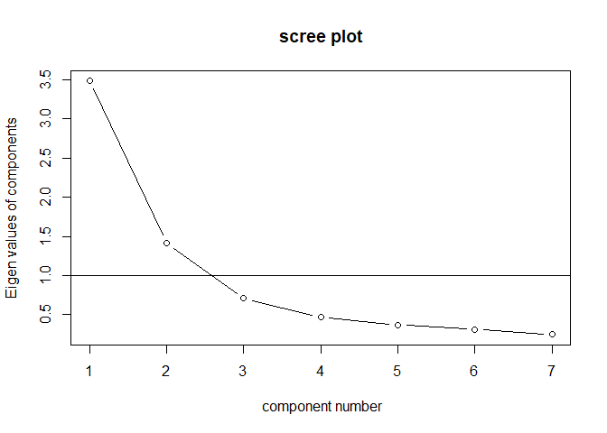
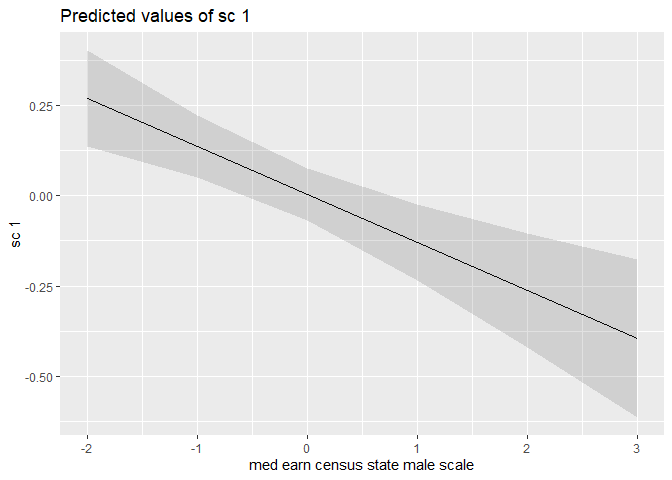
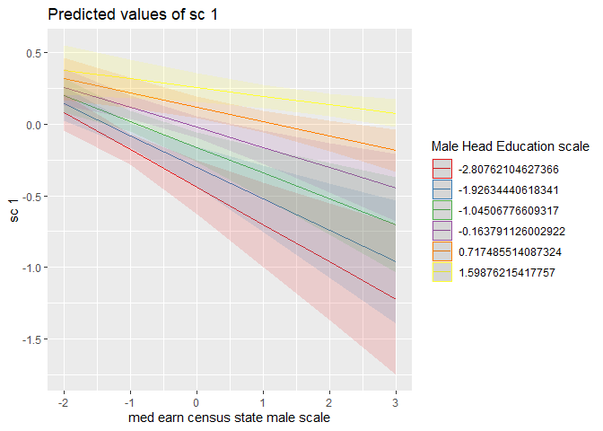
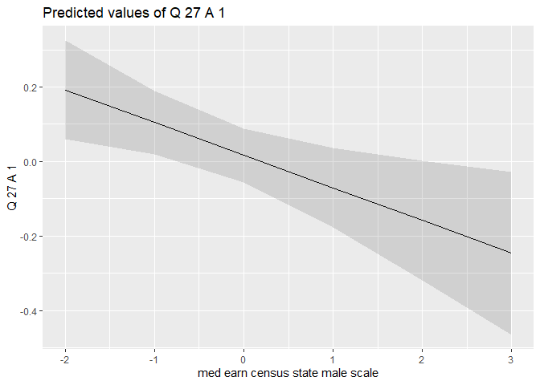
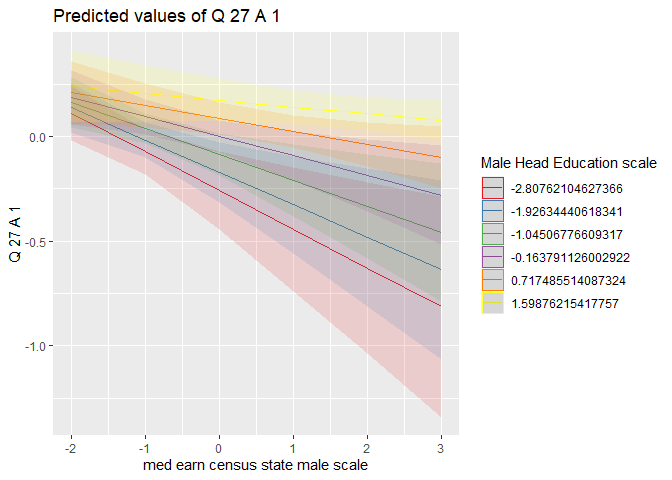

Beverage Survey Analysis
================
Daniel O’Leary
1/11/2021

  - [Analysis](#analysis)
      - [Factor analysis of individual
        items](#factor-analysis-of-individual-items)
      - [Regression](#regression)
          - [SC 1](#sc-1)
              - [Plot data](#plot-data)
          - [SC 2](#sc-2)
          - [Importance of staying
            healthy](#importance-of-staying-healthy)
              - [Plot data](#plot-data-1)

# Analysis

## Factor analysis of individual items

``` r
items <-
  survey %>% 
  dplyr::select(
    starts_with("Q10")
  )

items_mat <-
  items %>% 
  mutate(across(starts_with("Q10"), as.numeric)) %>% 
  filter_all(all_vars(!is.na(.))) %>% 
  as.matrix() %>% 
  scale()

VSS.scree(items_mat)
```

<!-- -->

``` r
res_fa <- fa(items_mat, nfactors = 2, rotate = "promax", fm = "mle")
```

    ## Loading required namespace: GPArotation

``` r
res_fa
```

    ## Factor Analysis using method =  ml
    ## Call: fa(r = items_mat, nfactors = 2, rotate = "promax", fm = "mle")
    ## Standardized loadings (pattern matrix) based upon correlation matrix
    ##           ML2   ML1   h2   u2 com
    ## Q10_A_1 -0.14  0.99 0.90 0.10 1.0
    ## Q10_A_2  0.83 -0.10 0.63 0.37 1.0
    ## Q10_A_3  0.13  0.73 0.62 0.38 1.1
    ## Q10_A_4  0.72  0.01 0.53 0.47 1.0
    ## Q10_A_5  0.78  0.08 0.66 0.34 1.0
    ## Q10_A_6  0.83 -0.03 0.67 0.33 1.0
    ## Q10_A_7  0.50  0.03 0.26 0.74 1.0
    ## 
    ##                        ML2  ML1
    ## SS loadings           2.76 1.51
    ## Proportion Var        0.39 0.22
    ## Cumulative Var        0.39 0.61
    ## Proportion Explained  0.65 0.35
    ## Cumulative Proportion 0.65 1.00
    ## 
    ##  With factor correlations of 
    ##      ML2  ML1
    ## ML2 1.00 0.38
    ## ML1 0.38 1.00
    ## 
    ## Mean item complexity =  1
    ## Test of the hypothesis that 2 factors are sufficient.
    ## 
    ## The degrees of freedom for the null model are  21  and the objective function was  3.06 with Chi Square of  54376.98
    ## The degrees of freedom for the model are 8  and the objective function was  0.04 
    ## 
    ## The root mean square of the residuals (RMSR) is  0.02 
    ## The df corrected root mean square of the residuals is  0.03 
    ## 
    ## The harmonic number of observations is  17761 with the empirical chi square  222.64  with prob <  1.1e-43 
    ## The total number of observations was  17761  with Likelihood Chi Square =  751.19  with prob <  6.8e-157 
    ## 
    ## Tucker Lewis Index of factoring reliability =  0.964
    ## RMSEA index =  0.072  and the 90 % confidence intervals are  0.068 0.077
    ## BIC =  672.91
    ## Fit based upon off diagonal values = 1
    ## Measures of factor score adequacy             
    ##                                                    ML2  ML1
    ## Correlation of (regression) scores with factors   0.94 0.96
    ## Multiple R square of scores with factors          0.88 0.92
    ## Minimum correlation of possible factor scores     0.76 0.84

``` r
survey <-
  survey %>% 
  mutate(
    sc1 = scale((Q10_A_1 + Q10_A_3) / 2),
    sc2 = scale((Q10_A_2 + Q10_A_4 + Q10_A_5 + Q10_A_6 + Q10_A_7) / 5)
  )
```

## Regression

### SC 1

``` r
lm1 <-
  lm(
    sc1 ~
      income_scale +
      med_earn_census_state_male_scale * Male_Head_Education_scale +
      Household_Size_scale +
      Household_Composition +
      Male_Head_Age_scale +
      Female_Head_Age_scale +
      Male_Head_Education_scale +
      Female_Head_Education_scale +
      Male_Head_Employment +
      Female_Head_Employment +
      Marital_Status +
      Race +
      total_pop_county_scale +
      land_area_2010_scale +
      median_monthly_housing_cost_county_scale,
    data = survey
  )

summary(lm1)
```

    ## 
    ## Call:
    ## lm(formula = sc1 ~ income_scale + med_earn_census_state_male_scale * 
    ##     Male_Head_Education_scale + Household_Size_scale + Household_Composition + 
    ##     Male_Head_Age_scale + Female_Head_Age_scale + Male_Head_Education_scale + 
    ##     Female_Head_Education_scale + Male_Head_Employment + Female_Head_Employment + 
    ##     Marital_Status + Race + total_pop_county_scale + land_area_2010_scale + 
    ##     median_monthly_housing_cost_county_scale, data = survey)
    ## 
    ## Residuals:
    ##     Min      1Q  Median      3Q     Max 
    ## -2.8575 -0.4410  0.1133  0.6356  1.7691 
    ## 
    ## Coefficients:
    ##                                                             Estimate Std. Error
    ## (Intercept)                                                 0.003843   0.036882
    ## income_scale                                                0.024857   0.008773
    ## med_earn_census_state_male_scale                           -0.133156   0.032423
    ## Male_Head_Education_scale                                   0.157808   0.028692
    ## Household_Size_scale                                        0.003615   0.008515
    ## Household_Composition3                                     -0.046686   0.107169
    ## Household_Composition8                                     -0.013011   0.106977
    ## Male_Head_Age_scale                                         0.015699   0.017733
    ## Female_Head_Age_scale                                      -0.015082   0.017822
    ## Female_Head_Education_scale                                 0.072763   0.008746
    ## Male_Head_Employment2                                      -0.043303   0.054049
    ## Male_Head_Employment3                                      -0.051628   0.033307
    ## Male_Head_Employment9                                      -0.077828   0.033189
    ## Female_Head_Employment2                                     0.054891   0.040655
    ## Female_Head_Employment3                                    -0.026185   0.024660
    ## Female_Head_Employment9                                     0.028385   0.023403
    ## Marital_Status2                                             0.055394   0.137985
    ## Marital_Status3                                             0.056306   0.112346
    ## Marital_Status4                                             0.040168   0.103699
    ## Race2                                                       0.080710   0.031861
    ## Race3                                                      -0.053328   0.040385
    ## Race4                                                       0.015003   0.037912
    ## total_pop_county_scale                                     -0.001827   0.008534
    ## land_area_2010_scale                                        0.005958   0.007986
    ## median_monthly_housing_cost_county_scale                    0.009631   0.009043
    ## med_earn_census_state_male_scale:Male_Head_Education_scale  0.045567   0.011531
    ##                                                            t value Pr(>|t|)    
    ## (Intercept)                                                  0.104  0.91702    
    ## income_scale                                                 2.833  0.00461 ** 
    ## med_earn_census_state_male_scale                            -4.107 4.03e-05 ***
    ## Male_Head_Education_scale                                    5.500 3.85e-08 ***
    ## Household_Size_scale                                         0.425  0.67115    
    ## Household_Composition3                                      -0.436  0.66311    
    ## Household_Composition8                                      -0.122  0.90320    
    ## Male_Head_Age_scale                                          0.885  0.37601    
    ## Female_Head_Age_scale                                       -0.846  0.39742    
    ## Female_Head_Education_scale                                  8.319  < 2e-16 ***
    ## Male_Head_Employment2                                       -0.801  0.42304    
    ## Male_Head_Employment3                                       -1.550  0.12114    
    ## Male_Head_Employment9                                       -2.345  0.01904 *  
    ## Female_Head_Employment2                                      1.350  0.17698    
    ## Female_Head_Employment3                                     -1.062  0.28833    
    ## Female_Head_Employment9                                      1.213  0.22521    
    ## Marital_Status2                                              0.401  0.68810    
    ## Marital_Status3                                              0.501  0.61625    
    ## Marital_Status4                                              0.387  0.69850    
    ## Race2                                                        2.533  0.01131 *  
    ## Race3                                                       -1.320  0.18670    
    ## Race4                                                        0.396  0.69230    
    ## total_pop_county_scale                                      -0.214  0.83047    
    ## land_area_2010_scale                                         0.746  0.45566    
    ## median_monthly_housing_cost_county_scale                     1.065  0.28689    
    ## med_earn_census_state_male_scale:Male_Head_Education_scale   3.952 7.79e-05 ***
    ## ---
    ## Signif. codes:  0 '***' 0.001 '**' 0.01 '*' 0.05 '.' 0.1 ' ' 1
    ## 
    ## Residual standard error: 0.9932 on 17735 degrees of freedom
    ## Multiple R-squared:  0.01486,    Adjusted R-squared:  0.01347 
    ## F-statistic:  10.7 on 25 and 17735 DF,  p-value: < 2.2e-16

#### Plot data

``` r
plot_model(lm1, type = "pred", terms = c("med_earn_census_state_male_scale"))
```

<!-- -->

``` r
plot_model(lm1, type = "pred", terms = c("med_earn_census_state_male_scale", "Male_Head_Education_scale"))
```

<!-- -->

### SC 2

``` r
lm1 <-
  lm(
    sc2 ~
      income_scale +
      med_earn_census_state_male_scale * Male_Head_Education_scale +
      Household_Size_scale +
      Household_Composition +
      Male_Head_Age_scale +
      Female_Head_Age_scale +
      Male_Head_Education_scale +
      Female_Head_Education_scale +
      Male_Head_Employment +
      Female_Head_Employment +
      Marital_Status +
      Race +
      total_pop_county_scale +
      land_area_2010_scale +
      median_monthly_housing_cost_county_scale,
    data = survey
  )

summary(lm1)
```

    ## 
    ## Call:
    ## lm(formula = sc2 ~ income_scale + med_earn_census_state_male_scale * 
    ##     Male_Head_Education_scale + Household_Size_scale + Household_Composition + 
    ##     Male_Head_Age_scale + Female_Head_Age_scale + Male_Head_Education_scale + 
    ##     Female_Head_Education_scale + Male_Head_Employment + Female_Head_Employment + 
    ##     Marital_Status + Race + total_pop_county_scale + land_area_2010_scale + 
    ##     median_monthly_housing_cost_county_scale, data = survey)
    ## 
    ## Residuals:
    ##      Min       1Q   Median       3Q      Max 
    ## -2.88123 -0.44951  0.02548  0.58711  2.95985 
    ## 
    ## Coefficients:
    ##                                                              Estimate
    ## (Intercept)                                                 0.0340540
    ## income_scale                                                0.0052485
    ## med_earn_census_state_male_scale                           -0.0273178
    ## Male_Head_Education_scale                                  -0.0237410
    ## Household_Size_scale                                        0.0302661
    ## Household_Composition3                                     -0.0367548
    ## Household_Composition8                                      0.0269594
    ## Male_Head_Age_scale                                        -0.0460906
    ## Female_Head_Age_scale                                      -0.1040493
    ## Female_Head_Education_scale                                 0.0303156
    ## Male_Head_Employment2                                       0.0435345
    ## Male_Head_Employment3                                      -0.0078870
    ## Male_Head_Employment9                                      -0.0759486
    ## Female_Head_Employment2                                     0.0147565
    ## Female_Head_Employment3                                     0.0118107
    ## Female_Head_Employment9                                    -0.0002384
    ## Marital_Status2                                             0.1534085
    ## Marital_Status3                                             0.2148604
    ## Marital_Status4                                             0.0806367
    ## Race2                                                      -0.0706308
    ## Race3                                                      -0.1327881
    ## Race4                                                      -0.0784033
    ## total_pop_county_scale                                     -0.0139758
    ## land_area_2010_scale                                       -0.0027067
    ## median_monthly_housing_cost_county_scale                   -0.0444867
    ## med_earn_census_state_male_scale:Male_Head_Education_scale  0.0029177
    ##                                                            Std. Error t value
    ## (Intercept)                                                 0.0363888   0.936
    ## income_scale                                                0.0086560   0.606
    ## med_earn_census_state_male_scale                            0.0319893  -0.854
    ## Male_Head_Education_scale                                   0.0283088  -0.839
    ## Household_Size_scale                                        0.0084014   3.602
    ## Household_Composition3                                      0.1057362  -0.348
    ## Household_Composition8                                      0.1055462   0.255
    ## Male_Head_Age_scale                                         0.0174958  -2.634
    ## Female_Head_Age_scale                                       0.0175838  -5.917
    ## Female_Head_Education_scale                                 0.0086293   3.513
    ## Male_Head_Employment2                                       0.0533263   0.816
    ## Male_Head_Employment3                                       0.0328616  -0.240
    ## Male_Head_Employment9                                       0.0327456  -2.319
    ## Female_Head_Employment2                                     0.0401118   0.368
    ## Female_Head_Employment3                                     0.0243300   0.485
    ## Female_Head_Employment9                                     0.0230905  -0.010
    ## Marital_Status2                                             0.1361397   1.127
    ## Marital_Status3                                             0.1108444   1.938
    ## Marital_Status4                                             0.1023130   0.788
    ## Race2                                                       0.0314355  -2.247
    ## Race3                                                       0.0398455  -3.333
    ## Race4                                                       0.0374047  -2.096
    ## total_pop_county_scale                                      0.0084197  -1.660
    ## land_area_2010_scale                                        0.0078788  -0.344
    ## median_monthly_housing_cost_county_scale                    0.0089221  -4.986
    ## med_earn_census_state_male_scale:Male_Head_Education_scale  0.0113773   0.256
    ##                                                            Pr(>|t|)    
    ## (Intercept)                                                0.349369    
    ## income_scale                                               0.544299    
    ## med_earn_census_state_male_scale                           0.393134    
    ## Male_Head_Education_scale                                  0.401681    
    ## Household_Size_scale                                       0.000316 ***
    ## Household_Composition3                                     0.728138    
    ## Household_Composition8                                     0.798396    
    ## Male_Head_Age_scale                                        0.008436 ** 
    ## Female_Head_Age_scale                                      3.33e-09 ***
    ## Female_Head_Education_scale                                0.000444 ***
    ## Male_Head_Employment2                                      0.414294    
    ## Male_Head_Employment3                                      0.810328    
    ## Male_Head_Employment9                                      0.020387 *  
    ## Female_Head_Employment2                                    0.712964    
    ## Female_Head_Employment3                                    0.627372    
    ## Female_Head_Employment9                                    0.991761    
    ## Marital_Status2                                            0.259823    
    ## Marital_Status3                                            0.052591 .  
    ## Marital_Status4                                            0.430627    
    ## Race2                                                      0.024662 *  
    ## Race3                                                      0.000862 ***
    ## Race4                                                      0.036089 *  
    ## total_pop_county_scale                                     0.096957 .  
    ## land_area_2010_scale                                       0.731200    
    ## median_monthly_housing_cost_county_scale                   6.22e-07 ***
    ## med_earn_census_state_male_scale:Male_Head_Education_scale 0.797608    
    ## ---
    ## Signif. codes:  0 '***' 0.001 '**' 0.01 '*' 0.05 '.' 0.1 ' ' 1
    ## 
    ## Residual standard error: 0.98 on 17735 degrees of freedom
    ## Multiple R-squared:  0.04103,    Adjusted R-squared:  0.03968 
    ## F-statistic: 30.35 on 25 and 17735 DF,  p-value: < 2.2e-16

### Importance of staying healthy

``` r
lm1 <-
  lm(
    scale(Q27_A_1) ~
      income_scale +
      med_earn_census_state_male_scale * Male_Head_Education_scale +
      Household_Size_scale +
      Household_Composition +
      Male_Head_Age_scale +
      Female_Head_Age_scale +
      Male_Head_Education_scale +
      Female_Head_Education_scale +
      Male_Head_Employment +
      Female_Head_Employment +
      Marital_Status +
      Race +
      total_pop_county_scale +
      land_area_2010_scale +
      median_monthly_housing_cost_county_scale,
    data = survey
  )

summary(lm1)
```

    ## 
    ## Call:
    ## lm(formula = scale(Q27_A_1) ~ income_scale + med_earn_census_state_male_scale * 
    ##     Male_Head_Education_scale + Household_Size_scale + Household_Composition + 
    ##     Male_Head_Age_scale + Female_Head_Age_scale + Male_Head_Education_scale + 
    ##     Female_Head_Education_scale + Male_Head_Employment + Female_Head_Employment + 
    ##     Marital_Status + Race + total_pop_county_scale + land_area_2010_scale + 
    ##     median_monthly_housing_cost_county_scale, data = survey)
    ## 
    ## Residuals:
    ##     Min      1Q  Median      3Q     Max 
    ## -3.0810 -0.1872  0.3379  0.6748  1.0757 
    ## 
    ## Coefficients:
    ##                                                             Estimate Std. Error
    ## (Intercept)                                                 0.016648   0.036975
    ## income_scale                                                0.041764   0.008796
    ## med_earn_census_state_male_scale                           -0.087644   0.032505
    ## Male_Head_Education_scale                                   0.097974   0.028765
    ## Household_Size_scale                                        0.005251   0.008537
    ## Household_Composition3                                      0.015921   0.107441
    ## Household_Composition8                                      0.097664   0.107248
    ## Male_Head_Age_scale                                         0.004084   0.017778
    ## Female_Head_Age_scale                                       0.012701   0.017867
    ## Female_Head_Education_scale                                 0.053688   0.008768
    ## Male_Head_Employment2                                      -0.047651   0.054186
    ## Male_Head_Employment3                                      -0.027263   0.033391
    ## Male_Head_Employment9                                      -0.050474   0.033274
    ## Female_Head_Employment2                                    -0.016263   0.040758
    ## Female_Head_Employment3                                    -0.061172   0.024722
    ## Female_Head_Employment9                                     0.005105   0.023463
    ## Marital_Status2                                            -0.017028   0.138335
    ## Marital_Status3                                            -0.011737   0.112631
    ## Marital_Status4                                            -0.034334   0.103963
    ## Race2                                                       0.095258   0.031942
    ## Race3                                                      -0.044222   0.040488
    ## Race4                                                      -0.030578   0.038008
    ## total_pop_county_scale                                     -0.002005   0.008555
    ## land_area_2010_scale                                       -0.003319   0.008006
    ## median_monthly_housing_cost_county_scale                    0.003918   0.009066
    ## med_earn_census_state_male_scale:Male_Head_Education_scale  0.034792   0.011561
    ##                                                            t value Pr(>|t|)    
    ## (Intercept)                                                  0.450 0.652533    
    ## income_scale                                                 4.748 2.07e-06 ***
    ## med_earn_census_state_male_scale                            -2.696 0.007018 ** 
    ## Male_Head_Education_scale                                    3.406 0.000661 ***
    ## Household_Size_scale                                         0.615 0.538488    
    ## Household_Composition3                                       0.148 0.882201    
    ## Household_Composition8                                       0.911 0.362500    
    ## Male_Head_Age_scale                                          0.230 0.818323    
    ## Female_Head_Age_scale                                        0.711 0.477191    
    ## Female_Head_Education_scale                                  6.123 9.38e-10 ***
    ## Male_Head_Employment2                                       -0.879 0.379199    
    ## Male_Head_Employment3                                       -0.816 0.414238    
    ## Male_Head_Employment9                                       -1.517 0.129304    
    ## Female_Head_Employment2                                     -0.399 0.689899    
    ## Female_Head_Employment3                                     -2.474 0.013356 *  
    ## Female_Head_Employment9                                      0.218 0.827749    
    ## Marital_Status2                                             -0.123 0.902033    
    ## Marital_Status3                                             -0.104 0.917004    
    ## Marital_Status4                                             -0.330 0.741210    
    ## Race2                                                        2.982 0.002866 ** 
    ## Race3                                                       -1.092 0.274750    
    ## Race4                                                       -0.805 0.421107    
    ## total_pop_county_scale                                      -0.234 0.814693    
    ## land_area_2010_scale                                        -0.415 0.678480    
    ## median_monthly_housing_cost_county_scale                     0.432 0.665600    
    ## med_earn_census_state_male_scale:Male_Head_Education_scale   3.010 0.002620 ** 
    ## ---
    ## Signif. codes:  0 '***' 0.001 '**' 0.01 '*' 0.05 '.' 0.1 ' ' 1
    ## 
    ## Residual standard error: 0.9958 on 17735 degrees of freedom
    ## Multiple R-squared:  0.009856,   Adjusted R-squared:  0.00846 
    ## F-statistic: 7.061 on 25 and 17735 DF,  p-value: < 2.2e-16

#### Plot data

``` r
plot_model(lm1, type = "pred", terms = c("med_earn_census_state_male_scale"))
```

<!-- -->

``` r
plot_model(lm1, type = "pred", terms = c("med_earn_census_state_male_scale", "Male_Head_Education_scale"))
```

<!-- -->
