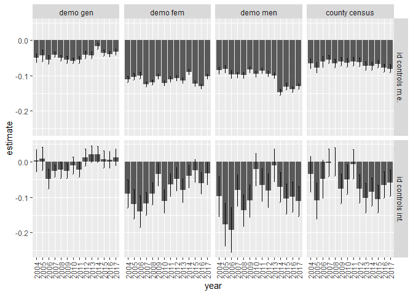
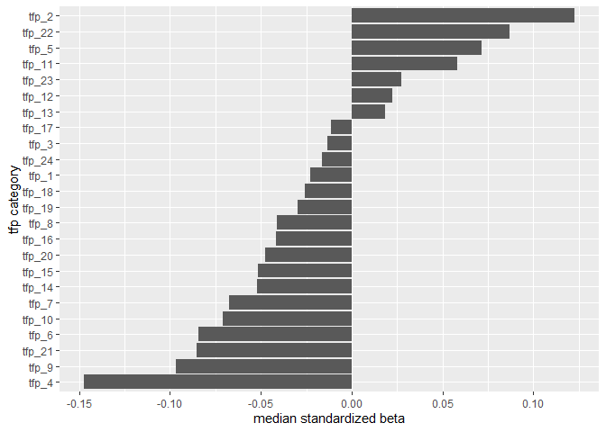
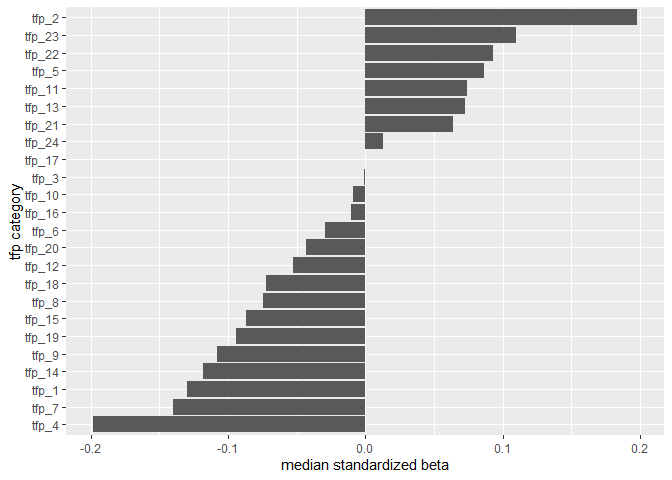
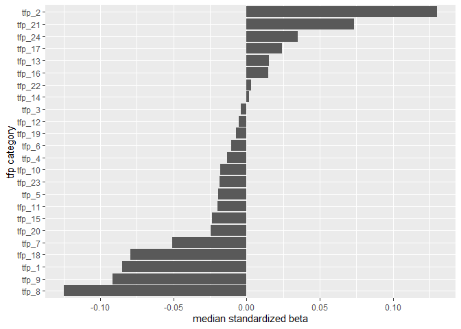
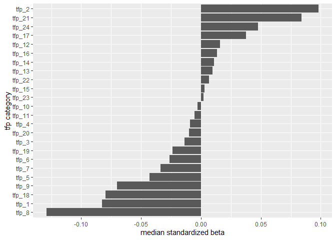
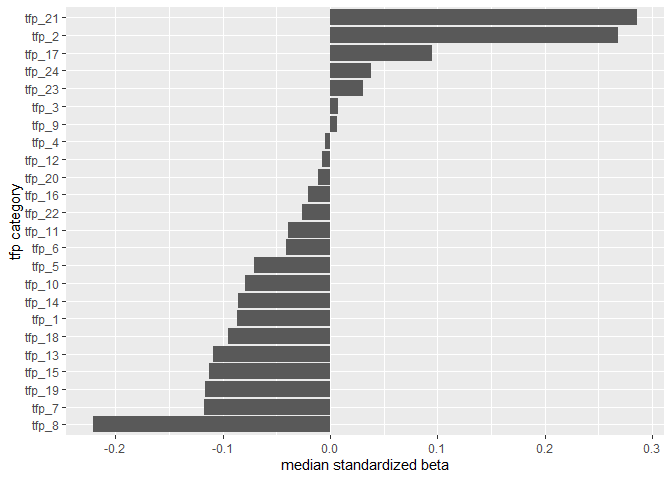
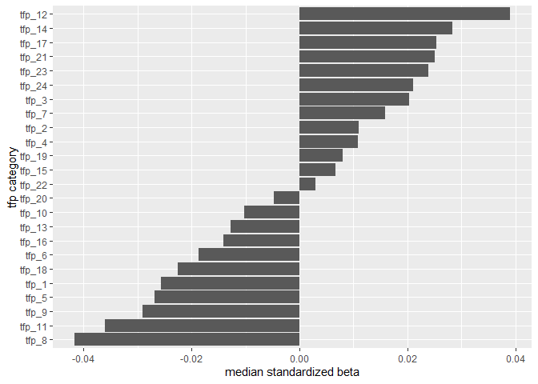
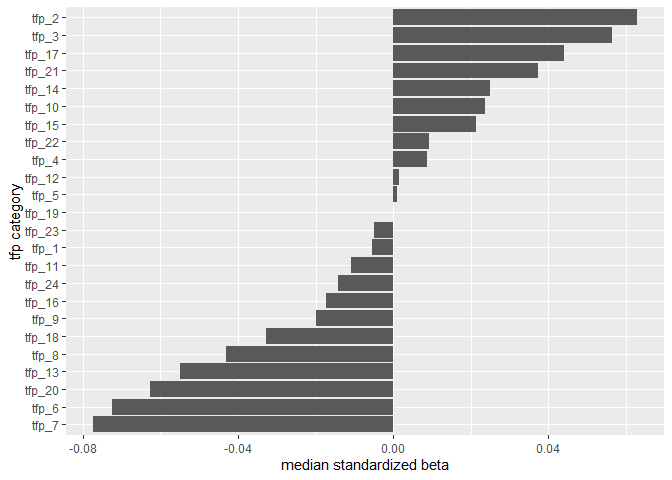

Nielsen Relative Status Food Spend Analysis
================
Daniel O’Leary
2/17/2021

  - [Analysis](#analysis)
      - [Standardized beta for effect of relative income on percentage
        of grocery spend that goes to QFAHPD healthful
        categories](#standardized-beta-for-effect-of-relative-income-on-percentage-of-grocery-spend-that-goes-to-qfahpd-healthful-categories)
      - [Median (across 2004 to 2017) standardized betas for regression
        models fit to TFP
        categories](#median-across-2004-to-2017-standardized-betas-for-regression-models-fit-to-tfp-categories)
          - [Median income computed county-level census
            data](#median-income-computed-county-level-census-data)
              - [Main effect controls
                model](#main-effect-controls-model)
              - [Interactive model](#interactive-model)
          - [Median income computed from demographics for
            women](#median-income-computed-from-demographics-for-women)
              - [Main effect controls
                model](#main-effect-controls-model-1)
              - [Interactive model](#interactive-model-1)
          - [Median income computed from demographics for
            men](#median-income-computed-from-demographics-for-men)
              - [Main effect controls
                model](#main-effect-controls-model-2)
              - [Interactive model](#interactive-model-2)
          - [Median income computed from demographics for women and
            men](#median-income-computed-from-demographics-for-women-and-men)
              - [Main effect controls
                model](#main-effect-controls-model-3)
              - [Interactive model](#interactive-model-3)

# Analysis

## Standardized beta for effect of relative income on percentage of grocery spend that goes to QFAHPD healthful categories

``` r
qh_spend_terms %>% 
  filter(term == "median_income_var_scale") %>% 
  filter(median_income_var %in% c("med_inc_niel_female_scale", "med_inc_niel_male_scale", "med_inc_gen_niel_scale", "median_income_county_scale")) %>% 
  mutate(median_income_var = factor(median_income_var, labels = c("demo gen", "demo fem", "demo men", "county census"))) %>%
  mutate(id_controls = factor(id_controls, labels = c("id controls m.e.", "id controls int."))) %>%
  ggplot(aes(year, estimate)) +
  geom_col() + 
  geom_errorbar(aes(ymin = estimate - std.error, ymax = estimate + std.error), width = 0.1) +
  theme(axis.text.x = element_text(angle = 90, vjust = 0.5, hjust = 1)) +
  facet_grid(id_controls ~ median_income_var)
```

<!-- -->

## Median (across 2004 to 2017) standardized betas for regression models fit to TFP categories

### Median income computed county-level census data

#### Main effect controls model

``` r
res %>% 
  ungroup() %>% 
  filter(med_inc_var == "median_income_county_scale" & int == "no") %>% 
  dplyr::select(key, median_income_var_scale) %>% 
  group_by(key) %>% 
  summarise(
    median = median(median_income_var_scale, na.rm = TRUE)
  ) %>% 
  ggplot(aes(fct_reorder(key, median), median)) +
  geom_col() + labs(y = "median standardized beta", x = "tfp category") +
  coord_flip()
```

    ## `summarise()` ungrouping output (override with `.groups` argument)

<!-- -->

#### Interactive model

``` r
res %>% 
  ungroup() %>% 
  filter(med_inc_var == "median_income_county_scale" & int == "yes") %>% 
  dplyr::select(key, median_income_var_scale) %>% 
  group_by(key) %>% 
  summarise(
    median = median(median_income_var_scale, na.rm = TRUE)
  ) %>% 
  ggplot(aes(fct_reorder(key, median), median)) +
    geom_col() + labs(y = "median standardized beta", x = "tfp category") +
  coord_flip()
```

    ## `summarise()` ungrouping output (override with `.groups` argument)

<!-- -->

### Median income computed from demographics for women

#### Main effect controls model

``` r
res %>% 
  ungroup() %>% 
  filter(med_inc_var == "med_inc_niel_female_scale" & int == "no") %>% 
  dplyr::select(key, median_income_var_scale) %>% 
  group_by(key) %>% 
  summarise(
    median = median(median_income_var_scale, na.rm = TRUE)
  ) %>% 
  ggplot(aes(fct_reorder(key, median), median)) +
    geom_col() + labs(y = "median standardized beta", x = "tfp category") +
  coord_flip()
```

    ## `summarise()` ungrouping output (override with `.groups` argument)

<!-- -->

#### Interactive model

``` r
res %>% 
  ungroup() %>% 
  filter(med_inc_var == "med_inc_niel_female_scale" & int == "yes") %>% 
  dplyr::select(key, median_income_var_scale) %>% 
  group_by(key) %>% 
  summarise(
    median = median(median_income_var_scale, na.rm = TRUE)
  ) %>% 
  ggplot(aes(fct_reorder(key, median), median)) +
    geom_col() + labs(y = "median standardized beta", x = "tfp category") +
  coord_flip()
```

    ## `summarise()` ungrouping output (override with `.groups` argument)

<!-- -->

### Median income computed from demographics for men

#### Main effect controls model

``` r
res %>% 
  ungroup() %>% 
  filter(med_inc_var == "med_inc_niel_male_scale" & int == "no") %>% 
  dplyr::select(key, median_income_var_scale) %>% 
  group_by(key) %>% 
  summarise(
    median = median(median_income_var_scale, na.rm = TRUE)
  ) %>% 
  ggplot(aes(fct_reorder(key, median), median)) +
    geom_col() + labs(y = "median standardized beta", x = "tfp category") +
  coord_flip()
```

    ## `summarise()` ungrouping output (override with `.groups` argument)

<!-- -->

#### Interactive model

``` r
res %>% 
  ungroup() %>% 
  filter(med_inc_var == "med_inc_niel_male_scale" & int == "yes") %>% 
  dplyr::select(key, median_income_var_scale) %>% 
  group_by(key) %>% 
  summarise(
    median = median(median_income_var_scale, na.rm = TRUE)
  ) %>% 
  ggplot(aes(fct_reorder(key, median), median)) +
    geom_col() + labs(y = "median standardized beta", x = "tfp category") +
  coord_flip()
```

    ## `summarise()` ungrouping output (override with `.groups` argument)

<!-- -->

### Median income computed from demographics for women and men

#### Main effect controls model

``` r
res %>% 
  ungroup() %>% 
  filter(med_inc_var == "med_inc_gen_niel_scale" & int == "no") %>% 
  dplyr::select(key, median_income_var_scale) %>% 
  group_by(key) %>% 
  summarise(
    median = median(median_income_var_scale, na.rm = TRUE)
  ) %>% 
  ggplot(aes(fct_reorder(key, median), median)) +
    geom_col() + labs(y = "median standardized beta", x = "tfp category") +
  coord_flip()
```

    ## `summarise()` ungrouping output (override with `.groups` argument)

<!-- -->

#### Interactive model

``` r
res %>% 
  ungroup() %>% 
  filter(med_inc_var == "med_inc_gen_niel_scale" & int == "yes") %>% 
  dplyr::select(key, median_income_var_scale) %>% 
  group_by(key) %>% 
  summarise(
    median = median(median_income_var_scale, na.rm = TRUE)
  ) %>% 
  ggplot(aes(fct_reorder(key, median), median)) +
    geom_col() + labs(y = "median standardized beta", x = "tfp category") +
  coord_flip()
```

    ## `summarise()` ungrouping output (override with `.groups` argument)

<!-- -->
