Nielsen Movers Analysis
================
Daniel O’Leary
3/14/2021

  - [Analysis](#analysis)
      - [Outcome = % of calories in healthy
        category](#outcome-of-calories-in-healthy-category)
          - [Zipcode moves](#zipcode-moves)
              - [1 year](#year)
                  - [Plotting coefficients](#plotting-coefficients)
              - [2 years](#years)
                  - [Plotting coefficients](#plotting-coefficients-1)
          - [County moves](#county-moves)
              - [1 year](#year-1)
                  - [Plotting coefficients](#plotting-coefficients-2)
              - [2 years](#years-1)
                  - [Plotting coefficients](#plotting-coefficients-3)
      - [Outcome = % of food spend in healthy
        category](#outcome-of-food-spend-in-healthy-category)
          - [Zipcode moves](#zipcode-moves-1)
              - [1 year](#year-2)
                  - [Plotting coefficients](#plotting-coefficients-4)
              - [2 years](#years-2)
                  - [Plotting coefficients](#plotting-coefficients-5)
          - [County moves](#county-moves-1)
              - [1 year](#year-3)
                  - [Plotting coefficients](#plotting-coefficients-6)
              - [2 years](#years-3)
                  - [Plotting coefficients](#plotting-coefficients-7)

# Analysis

## Outcome = % of calories in healthy category

### Zipcode moves

#### 1 year

``` r
 lm_z1 <-
    lmer(
      scale(yes_scale_t2) ~
        scale(yes_scale_t1) +
        
        scale(I(median_income_county_t2 - median_income_county_t1)) +
        median_income_county_scale_t1 +
        
        scale(I(physicians_scale_t2 - physicians_scale_t1)) +
        physicians_scale_t1 +
        
        # scale(I(dentists_t2 - dentists_t1)) +
        # scale(dentists_t1) +
        # 
        # scale(I(therapists_t2 - therapists_t1)) +
        # scale(therapists_t1) +
        
        scale(I(median_monthly_housing_cost_county_t2 - median_monthly_housing_cost_county_t1)) +
        median_monthly_housing_cost_county_scale_t1 +
        
        scale(I(income_t2 - income_t1)) +
        income_scale_t1 +
        
        scale(I(Male_Head_Education_t2 - Male_Head_Education_t1)) +
        Male_Head_Education_scale_t1 +
        
        scale(I(Female_Head_Education_t2 - Female_Head_Education_t1)) +
        Female_Head_Education_scale_t1 +
        
        scale(I(Male_Head_Age_t2 - Male_Head_Age_t1)) +
        Male_Head_Age_scale_t1 +
        
        scale(I(Female_Head_Age_t2 - Female_Head_Age_t1)) +
        Female_Head_Age_scale_t1 +
        
        scale(I(total_pop_county_t2 - total_pop_county_t1)) +
        total_pop_county_scale_t1 +
        
        scale(I(land_area_2010_t2 - land_area_2010_t1)) +
        land_area_2010_scale_t1 +
        
        scale(I(Household_Size_t2 - Household_Size_t1)) +
        Household_Size_scale_t1 +
        
        Race_t1 +
        
        Male_Head_Employment_t1 +
        Female_Head_Employment_t1 +
        Marital_Status_t1 +
        
        Male_Head_Employment_t2 +
        Female_Head_Employment_t2 +
        Marital_Status_t2 +
        
        year_t1 +
        
        (1 + scale(I(median_income_county_t2 - median_income_county_t1))|fips_code_t2) +
        (1|fips_code_t1) +
        (1|household_code) +
        (1|quarter),
      data =
        zip_movers_1yr_calorie_data
    )
```

    ## Warning in checkConv(attr(opt, "derivs"), opt$par, ctrl = control$checkConv, :
    ## Model failed to converge with max|grad| = 0.00234679 (tol = 0.002, component 1)

``` r
summary(lm_z1)
```

    ## Linear mixed model fit by REML ['lmerMod']
    ## Formula: 
    ## scale(yes_scale_t2) ~ scale(yes_scale_t1) + scale(I(median_income_county_t2 -  
    ##     median_income_county_t1)) + median_income_county_scale_t1 +  
    ##     scale(I(physicians_scale_t2 - physicians_scale_t1)) + physicians_scale_t1 +  
    ##     scale(I(median_monthly_housing_cost_county_t2 - median_monthly_housing_cost_county_t1)) +  
    ##     median_monthly_housing_cost_county_scale_t1 + scale(I(income_t2 -  
    ##     income_t1)) + income_scale_t1 + scale(I(Male_Head_Education_t2 -  
    ##     Male_Head_Education_t1)) + Male_Head_Education_scale_t1 +  
    ##     scale(I(Female_Head_Education_t2 - Female_Head_Education_t1)) +  
    ##     Female_Head_Education_scale_t1 + scale(I(Male_Head_Age_t2 -  
    ##     Male_Head_Age_t1)) + Male_Head_Age_scale_t1 + scale(I(Female_Head_Age_t2 -  
    ##     Female_Head_Age_t1)) + Female_Head_Age_scale_t1 + scale(I(total_pop_county_t2 -  
    ##     total_pop_county_t1)) + total_pop_county_scale_t1 + scale(I(land_area_2010_t2 -  
    ##     land_area_2010_t1)) + land_area_2010_scale_t1 + scale(I(Household_Size_t2 -  
    ##     Household_Size_t1)) + Household_Size_scale_t1 + Race_t1 +  
    ##     Male_Head_Employment_t1 + Female_Head_Employment_t1 + Marital_Status_t1 +  
    ##     Male_Head_Employment_t2 + Female_Head_Employment_t2 + Marital_Status_t2 +  
    ##     year_t1 + (1 + scale(I(median_income_county_t2 - median_income_county_t1)) |  
    ##     fips_code_t2) + (1 | fips_code_t1) + (1 | household_code) +  
    ##     (1 | quarter)
    ##    Data: zip_movers_1yr_calorie_data
    ## 
    ## REML criterion at convergence: 230928.2
    ## 
    ## Scaled residuals: 
    ##     Min      1Q  Median      3Q     Max 
    ## -4.7216 -0.5813 -0.1252  0.4357  9.2656 
    ## 
    ## Random effects:
    ##  Groups         Name                                                       
    ##  household_code (Intercept)                                                
    ##  fips_code_t2   (Intercept)                                                
    ##                 scale(I(median_income_county_t2 - median_income_county_t1))
    ##  fips_code_t1   (Intercept)                                                
    ##  quarter        (Intercept)                                                
    ##  Residual                                                                  
    ##  Variance Std.Dev. Corr
    ##  0.248127 0.49812      
    ##  0.002942 0.05424      
    ##  0.001032 0.03213  0.28
    ##  0.002426 0.04926      
    ##  0.002103 0.04586      
    ##  0.603987 0.77717      
    ## Number of obs: 90435, groups:  
    ## household_code, 17704; fips_code_t2, 2014; fips_code_t1, 1998; quarter, 4
    ## 
    ## Fixed effects:
    ##                                                                                           Estimate
    ## (Intercept)                                                                             -4.7816229
    ## scale(yes_scale_t1)                                                                      0.2097127
    ## scale(I(median_income_county_t2 - median_income_county_t1))                             -0.0305523
    ## median_income_county_scale_t1                                                           -0.0406139
    ## scale(I(physicians_scale_t2 - physicians_scale_t1))                                      0.0087171
    ## physicians_scale_t1                                                                      0.0173488
    ## scale(I(median_monthly_housing_cost_county_t2 - median_monthly_housing_cost_county_t1))  0.0268184
    ## median_monthly_housing_cost_county_scale_t1                                              0.0488489
    ## scale(I(income_t2 - income_t1))                                                          0.0112130
    ## income_scale_t1                                                                          0.0471376
    ## scale(I(Male_Head_Education_t2 - Male_Head_Education_t1))                                0.0256743
    ## Male_Head_Education_scale_t1                                                             0.0718511
    ## scale(I(Female_Head_Education_t2 - Female_Head_Education_t1))                            0.0200479
    ## Female_Head_Education_scale_t1                                                           0.0442440
    ## scale(I(Male_Head_Age_t2 - Male_Head_Age_t1))                                           -0.0040491
    ## Male_Head_Age_scale_t1                                                                  -0.0146650
    ## scale(I(Female_Head_Age_t2 - Female_Head_Age_t1))                                       -0.0035842
    ## Female_Head_Age_scale_t1                                                                 0.0008792
    ## scale(I(total_pop_county_t2 - total_pop_county_t1))                                     -0.0003603
    ## total_pop_county_scale_t1                                                               -0.0019368
    ## scale(I(land_area_2010_t2 - land_area_2010_t1))                                         -0.0039684
    ## land_area_2010_scale_t1                                                                 -0.0092379
    ## scale(I(Household_Size_t2 - Household_Size_t1))                                         -0.0230653
    ## Household_Size_scale_t1                                                                 -0.0865791
    ## Race_t1                                                                                  0.0345667
    ## Male_Head_Employment_t1                                                                  0.0014273
    ## Female_Head_Employment_t1                                                               -0.0009536
    ## Marital_Status_t1                                                                       -0.0160641
    ## Male_Head_Employment_t2                                                                  0.0008554
    ## Female_Head_Employment_t2                                                                0.0048947
    ## Marital_Status_t2                                                                        0.0114357
    ## year_t1                                                                                  0.0023352
    ##                                                                                         Std. Error
    ## (Intercept)                                                                              1.9380883
    ## scale(yes_scale_t1)                                                                      0.0032989
    ## scale(I(median_income_county_t2 - median_income_county_t1))                              0.0115959
    ## median_income_county_scale_t1                                                            0.0146579
    ## scale(I(physicians_scale_t2 - physicians_scale_t1))                                      0.0052760
    ## physicians_scale_t1                                                                      0.0068755
    ## scale(I(median_monthly_housing_cost_county_t2 - median_monthly_housing_cost_county_t1))  0.0112946
    ## median_monthly_housing_cost_county_scale_t1                                              0.0158604
    ## scale(I(income_t2 - income_t1))                                                          0.0039819
    ## income_scale_t1                                                                          0.0054693
    ## scale(I(Male_Head_Education_t2 - Male_Head_Education_t1))                                0.0061113
    ## Male_Head_Education_scale_t1                                                             0.0087887
    ## scale(I(Female_Head_Education_t2 - Female_Head_Education_t1))                            0.0047792
    ## Female_Head_Education_scale_t1                                                           0.0062379
    ## scale(I(Male_Head_Age_t2 - Male_Head_Age_t1))                                            0.0064716
    ## Male_Head_Age_scale_t1                                                                   0.0099465
    ## scale(I(Female_Head_Age_t2 - Female_Head_Age_t1))                                        0.0048543
    ## Female_Head_Age_scale_t1                                                                 0.0069241
    ## scale(I(total_pop_county_t2 - total_pop_county_t1))                                      0.0073148
    ## total_pop_county_scale_t1                                                                0.0108364
    ## scale(I(land_area_2010_t2 - land_area_2010_t1))                                          0.0053745
    ## land_area_2010_scale_t1                                                                  0.0067861
    ## scale(I(Household_Size_t2 - Household_Size_t1))                                          0.0039889
    ## Household_Size_scale_t1                                                                  0.0054899
    ## Race_t1                                                                                  0.0058603
    ## Male_Head_Employment_t1                                                                  0.0024398
    ## Female_Head_Employment_t1                                                                0.0019017
    ## Marital_Status_t1                                                                        0.0086581
    ## Male_Head_Employment_t2                                                                  0.0024496
    ## Female_Head_Employment_t2                                                                0.0019018
    ## Marital_Status_t2                                                                        0.0088097
    ## year_t1                                                                                  0.0009627
    ##                                                                                         t value
    ## (Intercept)                                                                              -2.467
    ## scale(yes_scale_t1)                                                                      63.571
    ## scale(I(median_income_county_t2 - median_income_county_t1))                              -2.635
    ## median_income_county_scale_t1                                                            -2.771
    ## scale(I(physicians_scale_t2 - physicians_scale_t1))                                       1.652
    ## physicians_scale_t1                                                                       2.523
    ## scale(I(median_monthly_housing_cost_county_t2 - median_monthly_housing_cost_county_t1))   2.374
    ## median_monthly_housing_cost_county_scale_t1                                               3.080
    ## scale(I(income_t2 - income_t1))                                                           2.816
    ## income_scale_t1                                                                           8.619
    ## scale(I(Male_Head_Education_t2 - Male_Head_Education_t1))                                 4.201
    ## Male_Head_Education_scale_t1                                                              8.175
    ## scale(I(Female_Head_Education_t2 - Female_Head_Education_t1))                             4.195
    ## Female_Head_Education_scale_t1                                                            7.093
    ## scale(I(Male_Head_Age_t2 - Male_Head_Age_t1))                                            -0.626
    ## Male_Head_Age_scale_t1                                                                   -1.474
    ## scale(I(Female_Head_Age_t2 - Female_Head_Age_t1))                                        -0.738
    ## Female_Head_Age_scale_t1                                                                  0.127
    ## scale(I(total_pop_county_t2 - total_pop_county_t1))                                      -0.049
    ## total_pop_county_scale_t1                                                                -0.179
    ## scale(I(land_area_2010_t2 - land_area_2010_t1))                                          -0.738
    ## land_area_2010_scale_t1                                                                  -1.361
    ## scale(I(Household_Size_t2 - Household_Size_t1))                                          -5.782
    ## Household_Size_scale_t1                                                                 -15.771
    ## Race_t1                                                                                   5.898
    ## Male_Head_Employment_t1                                                                   0.585
    ## Female_Head_Employment_t1                                                                -0.501
    ## Marital_Status_t1                                                                        -1.855
    ## Male_Head_Employment_t2                                                                   0.349
    ## Female_Head_Employment_t2                                                                 2.574
    ## Marital_Status_t2                                                                         1.298
    ## year_t1                                                                                   2.426

    ## 
    ## Correlation matrix not shown by default, as p = 32 > 12.
    ## Use print(x, correlation=TRUE)  or
    ##     vcov(x)        if you need it

    ## convergence code: 0
    ## Model failed to converge with max|grad| = 0.00234679 (tol = 0.002, component 1)

``` r
tidy_lm_z1 <- tidy(lm_z1)
tidy_lm_z1
```

    ## # A tibble: 39 x 6
    ##    effect group term                                estimate std.error statistic
    ##    <chr>  <chr> <chr>                                  <dbl>     <dbl>     <dbl>
    ##  1 fixed  <NA>  (Intercept)                         -4.78      1.94        -2.47
    ##  2 fixed  <NA>  scale(yes_scale_t1)                  0.210     0.00330     63.6 
    ##  3 fixed  <NA>  scale(I(median_income_county_t2 - ~ -0.0306    0.0116      -2.63
    ##  4 fixed  <NA>  median_income_county_scale_t1       -0.0406    0.0147      -2.77
    ##  5 fixed  <NA>  scale(I(physicians_scale_t2 - phys~  0.00872   0.00528      1.65
    ##  6 fixed  <NA>  physicians_scale_t1                  0.0173    0.00688      2.52
    ##  7 fixed  <NA>  scale(I(median_monthly_housing_cos~  0.0268    0.0113       2.37
    ##  8 fixed  <NA>  median_monthly_housing_cost_county~  0.0488    0.0159       3.08
    ##  9 fixed  <NA>  scale(I(income_t2 - income_t1))      0.0112    0.00398      2.82
    ## 10 fixed  <NA>  income_scale_t1                      0.0471    0.00547      8.62
    ## # ... with 29 more rows

##### Plotting coefficients

``` r
est <- 
  tidy_lm_z1 %>% 
  dplyr::filter(term == "scale(I(median_income_county_t2 - median_income_county_t1))") %>% 
  dplyr::select(estimate)

sjPlot::plot_model(lm_z1) +
  ylim(-0.15, 0.15) +
  labs(title = "predicting % of calorie consumption in healthy categories") +
  geom_hline(yintercept = -abs(est$estimate), linetype = "dashed") +
  geom_hline(yintercept = abs(est$estimate), linetype = "dashed")
```

    ## Scale for 'y' is already present. Adding another scale for 'y', which will
    ## replace the existing scale.

    ## Warning: Removed 1 rows containing missing values (geom_point).

<!-- -->

``` r
tidy_lm_z1 <- tidy(lm_z1)

est <- 
  tidy_lm_z1 %>% 
  dplyr::filter(term == "scale(I(median_income_county_t2 - median_income_county_t1))") %>% 
  dplyr::select(estimate)

tidy_lm_z1 <-
  tidy_lm_z1 %>% 
  mutate(
    dot_color = ifelse(estimate < 0, "red1", ifelse(estimate > 0, "dodgerblue2", NA)),
    se = std.error
  )

tidy_lm_z1 <-
  tidy_lm_z1 %>% 
  filter(
    term == "scale(I(median_income_county_t2 - median_income_county_t1))" |
    term == "median_income_county_scale_t1" |
    term == "scale(I(physicians_scale_t2 - physicians_scale_t1))" | 
    term == "scale(I(median_monthly_housing_cost_county_t2 - median_monthly_housing_cost_county_t1))" | 
    term == "scale(I(income_t2 - income_t1))" | 
    term == "scale(I(Female_Head_Education_t2 - Female_Head_Education_t1))" 
  ) %>% 
  mutate(
    variable = 
      case_when(
        term == "scale(I(median_income_county_t2 - median_income_county_t1))" ~ "change in median income",
        term == "median_income_county_scale_t1"  ~ "median income at t1",
        term == "scale(I(physicians_scale_t2 - physicians_scale_t1))"  ~ "change in healthcare access",
        term == "scale(I(median_monthly_housing_cost_county_t2 - median_monthly_housing_cost_county_t1))"  ~ "change in housing cost", 
        term == "scale(I(income_t2 - income_t1))"  ~ "change in income",
        term == "scale(I(Female_Head_Education_t2 - Female_Head_Education_t1))"  ~ "change in female education"
      )
  ) 

col <- as.character(tidy_lm_z1$dot_color)
names(col) <- as.character(tidy_lm_z1$dot_color)

calorie_budget_zip_code_moves_1yr <-
  tidy_lm_z1 %>% 
  ggplot(aes(variable, estimate)) +
  geom_point(aes(color = dot_color), size = 4) +
  geom_errorbar(aes(ymin = estimate - 2 * se, ymax = estimate + 2 * se), width = 0) + 
  scale_color_manual(values = col) +
  geom_hline(yintercept = -abs(est$estimate), linetype = "dashed", color = "red") +
  geom_hline(yintercept = 0, linetype = "dashed") +
  geom_hline(yintercept = abs(est$estimate), linetype = "dashed", color = "red") +
  scale_y_continuous(
    breaks = c(-0.15, -0.1, -0.05, 0, 0.05, 0.1, 0.15),
    limits = c(-0.17, 0.17)
  ) +
  labs(
    y = "standardized beta",
    title = "zip code moves, 1 year"
  ) +
  theme_bw() +
  theme(
    text = element_text(size = 17),
    plot.title = element_text(hjust = 0.5),
    legend.position = "none"
  ) +
  coord_flip()

calorie_budget_zip_code_moves_1yr
```

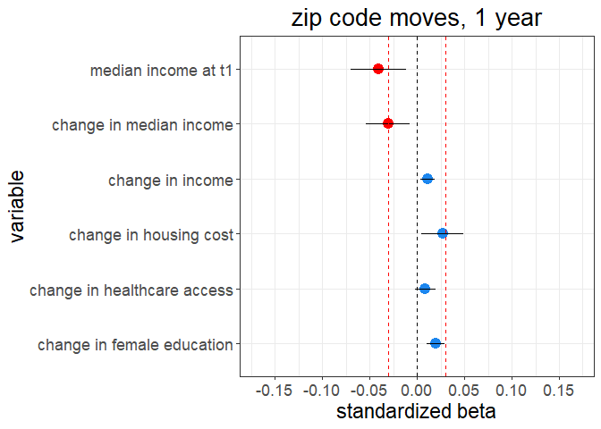<!-- -->

``` r
ggsave(
  "G:/My Drive/research/projects/niel/nielsen_analysis/relative_status_analysis/plots/calorie_budget_zip_code_moves_1yr.png",
  calorie_budget_zip_code_moves_1yr,
  width = 8,
  height = 6,
  dpi = 500
)
```

#### 2 years

``` r
 lm_z2 <-
    lmer(
      scale(yes_scale_t2) ~
        scale(yes_scale_t1) +
        
        scale(I(median_income_county_t2 - median_income_county_t1)) +
        median_income_county_scale_t1 +
        
        scale(I(physicians_scale_t2 - physicians_scale_t1)) +
        physicians_scale_t1 +
        
        # scale(I(dentists_t2 - dentists_t1)) +
        # scale(dentists_t1) +
        # 
        # scale(I(therapists_t2 - therapists_t1)) +
        # scale(therapists_t1) +
        
        scale(I(median_monthly_housing_cost_county_t2 - median_monthly_housing_cost_county_t1)) +
        median_monthly_housing_cost_county_scale_t1 +
        
        scale(I(income_t2 - income_t1)) +
        income_scale_t1 +
        
        scale(I(Male_Head_Education_t2 - Male_Head_Education_t1)) +
        Male_Head_Education_scale_t1 +
        
        scale(I(Female_Head_Education_t2 - Female_Head_Education_t1)) +
        Female_Head_Education_scale_t1 +
        
        scale(I(Male_Head_Age_t2 - Male_Head_Age_t1)) +
        Male_Head_Age_scale_t1 +
        
        scale(I(Female_Head_Age_t2 - Female_Head_Age_t1)) +
        Female_Head_Age_scale_t1 +
        
        scale(I(total_pop_county_t2 - total_pop_county_t1)) +
        total_pop_county_scale_t1 +
        
        scale(I(land_area_2010_t2 - land_area_2010_t1)) +
        land_area_2010_scale_t1 +
        
        scale(I(Household_Size_t2 - Household_Size_t1)) +
        Household_Size_scale_t1 +
        
        Race_t1 +
        
        Male_Head_Employment_t1 +
        Female_Head_Employment_t1 +
        Marital_Status_t1 +
        
        Male_Head_Employment_t2 +
        Female_Head_Employment_t2 +
        Marital_Status_t2 +
        
        year_t1 +
        
        (1 + scale(I(median_income_county_t2 - median_income_county_t1))|fips_code_t2) +
        (1|fips_code_t1) +
        (1|household_code) +
        (1|quarter),
      data =
        zip_movers_2yr_calorie_data
    )
```

    ## Warning in checkConv(attr(opt, "derivs"), opt$par, ctrl = control$checkConv, :
    ## Model failed to converge with max|grad| = 0.0270201 (tol = 0.002, component 1)

``` r
summary(lm_z2)
```

    ## Linear mixed model fit by REML ['lmerMod']
    ## Formula: 
    ## scale(yes_scale_t2) ~ scale(yes_scale_t1) + scale(I(median_income_county_t2 -  
    ##     median_income_county_t1)) + median_income_county_scale_t1 +  
    ##     scale(I(physicians_scale_t2 - physicians_scale_t1)) + physicians_scale_t1 +  
    ##     scale(I(median_monthly_housing_cost_county_t2 - median_monthly_housing_cost_county_t1)) +  
    ##     median_monthly_housing_cost_county_scale_t1 + scale(I(income_t2 -  
    ##     income_t1)) + income_scale_t1 + scale(I(Male_Head_Education_t2 -  
    ##     Male_Head_Education_t1)) + Male_Head_Education_scale_t1 +  
    ##     scale(I(Female_Head_Education_t2 - Female_Head_Education_t1)) +  
    ##     Female_Head_Education_scale_t1 + scale(I(Male_Head_Age_t2 -  
    ##     Male_Head_Age_t1)) + Male_Head_Age_scale_t1 + scale(I(Female_Head_Age_t2 -  
    ##     Female_Head_Age_t1)) + Female_Head_Age_scale_t1 + scale(I(total_pop_county_t2 -  
    ##     total_pop_county_t1)) + total_pop_county_scale_t1 + scale(I(land_area_2010_t2 -  
    ##     land_area_2010_t1)) + land_area_2010_scale_t1 + scale(I(Household_Size_t2 -  
    ##     Household_Size_t1)) + Household_Size_scale_t1 + Race_t1 +  
    ##     Male_Head_Employment_t1 + Female_Head_Employment_t1 + Marital_Status_t1 +  
    ##     Male_Head_Employment_t2 + Female_Head_Employment_t2 + Marital_Status_t2 +  
    ##     year_t1 + (1 + scale(I(median_income_county_t2 - median_income_county_t1)) |  
    ##     fips_code_t2) + (1 | fips_code_t1) + (1 | household_code) +  
    ##     (1 | quarter)
    ##    Data: zip_movers_2yr_calorie_data
    ## 
    ## REML criterion at convergence: 340478.5
    ## 
    ## Scaled residuals: 
    ##     Min      1Q  Median      3Q     Max 
    ## -5.0567 -0.5808 -0.1272  0.4375  9.2016 
    ## 
    ## Random effects:
    ##  Groups         Name                                                       
    ##  household_code (Intercept)                                                
    ##  fips_code_t2   (Intercept)                                                
    ##                 scale(I(median_income_county_t2 - median_income_county_t1))
    ##  fips_code_t1   (Intercept)                                                
    ##  quarter        (Intercept)                                                
    ##  Residual                                                                  
    ##  Variance Std.Dev. Corr
    ##  0.313836 0.56021      
    ##  0.007515 0.08669      
    ##  0.004025 0.06344  0.16
    ##  0.008258 0.09087      
    ##  0.002446 0.04946      
    ##  0.593224 0.77021      
    ## Number of obs: 134721, groups:  
    ## household_code, 17965; fips_code_t2, 2038; fips_code_t1, 2015; quarter, 4
    ## 
    ## Fixed effects:
    ##                                                                                           Estimate
    ## (Intercept)                                                                             -2.3354072
    ## scale(yes_scale_t1)                                                                      0.1101616
    ## scale(I(median_income_county_t2 - median_income_county_t1))                             -0.0397886
    ## median_income_county_scale_t1                                                           -0.0406084
    ## scale(I(physicians_scale_t2 - physicians_scale_t1))                                      0.0057695
    ## physicians_scale_t1                                                                      0.0179706
    ## scale(I(median_monthly_housing_cost_county_t2 - median_monthly_housing_cost_county_t1))  0.0448016
    ## median_monthly_housing_cost_county_scale_t1                                              0.0531802
    ## scale(I(income_t2 - income_t1))                                                          0.0171464
    ## income_scale_t1                                                                          0.0474185
    ## scale(I(Male_Head_Education_t2 - Male_Head_Education_t1))                                0.0250282
    ## Male_Head_Education_scale_t1                                                             0.0669074
    ## scale(I(Female_Head_Education_t2 - Female_Head_Education_t1))                            0.0171969
    ## Female_Head_Education_scale_t1                                                           0.0445085
    ## scale(I(Male_Head_Age_t2 - Male_Head_Age_t1))                                           -0.0037267
    ## Male_Head_Age_scale_t1                                                                   0.0029676
    ## scale(I(Female_Head_Age_t2 - Female_Head_Age_t1))                                       -0.0037514
    ## Female_Head_Age_scale_t1                                                                 0.0116340
    ## scale(I(total_pop_county_t2 - total_pop_county_t1))                                      0.0043628
    ## total_pop_county_scale_t1                                                               -0.0008670
    ## scale(I(land_area_2010_t2 - land_area_2010_t1))                                         -0.0107557
    ## land_area_2010_scale_t1                                                                 -0.0076195
    ## scale(I(Household_Size_t2 - Household_Size_t1))                                         -0.0236412
    ## Household_Size_scale_t1                                                                 -0.0828875
    ## Race_t1                                                                                  0.0360720
    ## Male_Head_Employment_t1                                                                 -0.0028046
    ## Female_Head_Employment_t1                                                                0.0009254
    ## Marital_Status_t1                                                                       -0.0031811
    ## Male_Head_Employment_t2                                                                  0.0038687
    ## Female_Head_Employment_t2                                                                0.0050971
    ## Marital_Status_t2                                                                        0.0088406
    ## year_t1                                                                                  0.0011051
    ##                                                                                         Std. Error
    ## (Intercept)                                                                              1.9369144
    ## scale(yes_scale_t1)                                                                      0.0027476
    ## scale(I(median_income_county_t2 - median_income_county_t1))                              0.0124432
    ## median_income_county_scale_t1                                                            0.0166752
    ## scale(I(physicians_scale_t2 - physicians_scale_t1))                                      0.0055931
    ## physicians_scale_t1                                                                      0.0076568
    ## scale(I(median_monthly_housing_cost_county_t2 - median_monthly_housing_cost_county_t1))  0.0119384
    ## median_monthly_housing_cost_county_scale_t1                                              0.0182469
    ## scale(I(income_t2 - income_t1))                                                          0.0034086
    ## income_scale_t1                                                                          0.0054252
    ## scale(I(Male_Head_Education_t2 - Male_Head_Education_t1))                                0.0055638
    ## Male_Head_Education_scale_t1                                                             0.0089017
    ## scale(I(Female_Head_Education_t2 - Female_Head_Education_t1))                            0.0041770
    ## Female_Head_Education_scale_t1                                                           0.0063330
    ## scale(I(Male_Head_Age_t2 - Male_Head_Age_t1))                                            0.0058964
    ## Male_Head_Age_scale_t1                                                                   0.0100161
    ## scale(I(Female_Head_Age_t2 - Female_Head_Age_t1))                                        0.0042564
    ## Female_Head_Age_scale_t1                                                                 0.0070358
    ## scale(I(total_pop_county_t2 - total_pop_county_t1))                                      0.0094701
    ## total_pop_county_scale_t1                                                                0.0157265
    ## scale(I(land_area_2010_t2 - land_area_2010_t1))                                          0.0061986
    ## land_area_2010_scale_t1                                                                  0.0087872
    ## scale(I(Household_Size_t2 - Household_Size_t1))                                          0.0034600
    ## Household_Size_scale_t1                                                                  0.0054650
    ## Race_t1                                                                                  0.0056272
    ## Male_Head_Employment_t1                                                                  0.0017710
    ## Female_Head_Employment_t1                                                                0.0013762
    ## Marital_Status_t1                                                                        0.0061216
    ## Male_Head_Employment_t2                                                                  0.0017328
    ## Female_Head_Employment_t2                                                                0.0013483
    ## Marital_Status_t2                                                                        0.0062058
    ## year_t1                                                                                  0.0009622
    ##                                                                                         t value
    ## (Intercept)                                                                              -1.206
    ## scale(yes_scale_t1)                                                                      40.094
    ## scale(I(median_income_county_t2 - median_income_county_t1))                              -3.198
    ## median_income_county_scale_t1                                                            -2.435
    ## scale(I(physicians_scale_t2 - physicians_scale_t1))                                       1.032
    ## physicians_scale_t1                                                                       2.347
    ## scale(I(median_monthly_housing_cost_county_t2 - median_monthly_housing_cost_county_t1))   3.753
    ## median_monthly_housing_cost_county_scale_t1                                               2.914
    ## scale(I(income_t2 - income_t1))                                                           5.030
    ## income_scale_t1                                                                           8.740
    ## scale(I(Male_Head_Education_t2 - Male_Head_Education_t1))                                 4.498
    ## Male_Head_Education_scale_t1                                                              7.516
    ## scale(I(Female_Head_Education_t2 - Female_Head_Education_t1))                             4.117
    ## Female_Head_Education_scale_t1                                                            7.028
    ## scale(I(Male_Head_Age_t2 - Male_Head_Age_t1))                                            -0.632
    ## Male_Head_Age_scale_t1                                                                    0.296
    ## scale(I(Female_Head_Age_t2 - Female_Head_Age_t1))                                        -0.881
    ## Female_Head_Age_scale_t1                                                                  1.654
    ## scale(I(total_pop_county_t2 - total_pop_county_t1))                                       0.461
    ## total_pop_county_scale_t1                                                                -0.055
    ## scale(I(land_area_2010_t2 - land_area_2010_t1))                                          -1.735
    ## land_area_2010_scale_t1                                                                  -0.867
    ## scale(I(Household_Size_t2 - Household_Size_t1))                                          -6.833
    ## Household_Size_scale_t1                                                                 -15.167
    ## Race_t1                                                                                   6.410
    ## Male_Head_Employment_t1                                                                  -1.584
    ## Female_Head_Employment_t1                                                                 0.672
    ## Marital_Status_t1                                                                        -0.520
    ## Male_Head_Employment_t2                                                                   2.233
    ## Female_Head_Employment_t2                                                                 3.780
    ## Marital_Status_t2                                                                         1.425
    ## year_t1                                                                                   1.149

    ## 
    ## Correlation matrix not shown by default, as p = 32 > 12.
    ## Use print(x, correlation=TRUE)  or
    ##     vcov(x)        if you need it

    ## convergence code: 0
    ## Model failed to converge with max|grad| = 0.0270201 (tol = 0.002, component 1)

``` r
tidy_lm_z2 <- tidy(lm_z2)
tidy_lm_z2
```

    ## # A tibble: 39 x 6
    ##    effect group term                                estimate std.error statistic
    ##    <chr>  <chr> <chr>                                  <dbl>     <dbl>     <dbl>
    ##  1 fixed  <NA>  (Intercept)                         -2.34      1.94        -1.21
    ##  2 fixed  <NA>  scale(yes_scale_t1)                  0.110     0.00275     40.1 
    ##  3 fixed  <NA>  scale(I(median_income_county_t2 - ~ -0.0398    0.0124      -3.20
    ##  4 fixed  <NA>  median_income_county_scale_t1       -0.0406    0.0167      -2.44
    ##  5 fixed  <NA>  scale(I(physicians_scale_t2 - phys~  0.00577   0.00559      1.03
    ##  6 fixed  <NA>  physicians_scale_t1                  0.0180    0.00766      2.35
    ##  7 fixed  <NA>  scale(I(median_monthly_housing_cos~  0.0448    0.0119       3.75
    ##  8 fixed  <NA>  median_monthly_housing_cost_county~  0.0532    0.0182       2.91
    ##  9 fixed  <NA>  scale(I(income_t2 - income_t1))      0.0171    0.00341      5.03
    ## 10 fixed  <NA>  income_scale_t1                      0.0474    0.00543      8.74
    ## # ... with 29 more rows

``` r
tidy_lm_z2 <- tidy(lm_z2)

tidy_lm_z2 <-
  tidy_lm_z2 %>% 
  mutate(
    dot_color = ifelse(estimate < 0, "red1", ifelse(estimate > 0, "dodgerblue2", NA)),
    se = std.error
  )

tidy_lm_z2 <-
  tidy_lm_z2 %>% 
  filter(
    term == "scale(I(median_income_county_t2 - median_income_county_t1))" |
    term == "median_income_county_scale_t1" |
    term == "scale(I(physicians_scale_t2 - physicians_scale_t1))" | 
    term == "scale(I(median_monthly_housing_cost_county_t2 - median_monthly_housing_cost_county_t1))" | 
    term == "scale(I(income_t2 - income_t1))" | 
    term == "scale(I(Female_Head_Education_t2 - Female_Head_Education_t1))" 
  ) %>% 
  mutate(
    variable = 
      case_when(
        term == "scale(I(median_income_county_t2 - median_income_county_t1))" ~ "change in median income",
        term == "median_income_county_scale_t1"  ~ "median income at t1",
        term == "scale(I(physicians_scale_t2 - physicians_scale_t1))"  ~ "change in healthcare access",
        term == "scale(I(median_monthly_housing_cost_county_t2 - median_monthly_housing_cost_county_t1))"  ~ "change in housing cost", 
        term == "scale(I(income_t2 - income_t1))"  ~ "change in income",
        term == "scale(I(Female_Head_Education_t2 - Female_Head_Education_t1))"  ~ "change in female education"
      )
  ) 

col <- as.character(tidy_lm_z2$dot_color)
names(col) <- as.character(tidy_lm_z2$dot_color)

grocery_spend_zipcode_moves_2yr <-
  tidy_lm_z2 %>% 
  ggplot(aes(variable, estimate)) +
  geom_point(aes(color = dot_color), size = 4) +
  geom_errorbar(aes(ymin = estimate - 2 * se, ymax = estimate + 2 * se), width = 0) + 
  scale_color_manual(values = col) +
  geom_hline(yintercept = -abs(est$estimate), linetype = "dashed") +
  geom_hline(yintercept = 0, linetype = "dashed") +
  geom_hline(yintercept = abs(est$estimate), linetype = "dashed") +
  labs(
    y = "standardized beta",
    title = "zip code move, 2 year"
  ) +
  theme_bw() +
  theme(
    text = element_text(size = 17),
    plot.title = element_text(hjust = 0.5),
    legend.position = "none"
  ) +
  ylim(-0.11, 0.11) +
  coord_flip()

grocery_spend_zipcode_moves_2yr
```

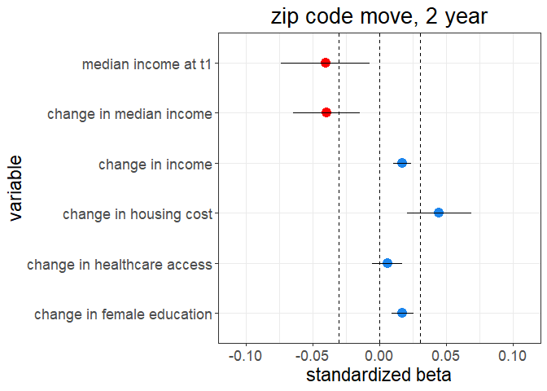<!-- -->

``` r
ggsave(
  "G:/My Drive/research/projects/niel/nielsen_analysis/relative_status_analysis/plots/grocery_spend_zipcode_moves_2yr.png",
  grocery_spend_zipcode_moves_2yr,
  width = 8,
  height = 6,
  dpi = 500
)
```

##### Plotting coefficients

``` r
est <- 
  tidy_lm_z2 %>% 
  dplyr::filter(term == "scale(I(median_income_county_t2 - median_income_county_t1))") %>% 
  dplyr::select(estimate)

sjPlot::plot_model(lm_z2) +
  ylim(-0.15, 0.15) +
  labs(title = "predicting % of calorie consumption in healthy categories") +
  geom_hline(yintercept = -abs(est$estimate), linetype = "dashed") +
  geom_hline(yintercept = abs(est$estimate), linetype = "dashed")
```

    ## Scale for 'y' is already present. Adding another scale for 'y', which will
    ## replace the existing scale.

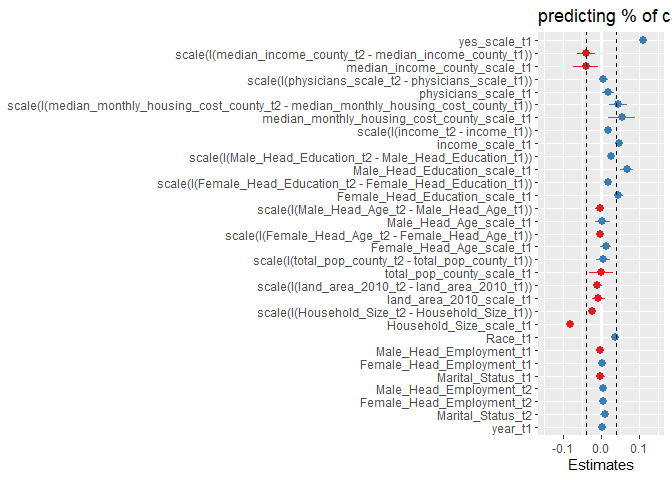<!-- -->

``` r
tidy_lm_z2 <- tidy(lm_z2)

est <- 
  tidy_lm_z2 %>% 
  dplyr::filter(term == "scale(I(median_income_county_t2 - median_income_county_t1))") %>% 
  dplyr::select(estimate)

tidy_lm_z2 <-
  tidy_lm_z2 %>% 
  mutate(
    dot_color = ifelse(estimate < 0, "red1", ifelse(estimate > 0, "dodgerblue2", NA)),
    se = std.error
  )

tidy_lm_z2 <-
  tidy_lm_z2 %>% 
  filter(
    term == "scale(I(median_income_county_t2 - median_income_county_t1))" |
    term == "median_income_county_scale_t1" |
    term == "scale(I(physicians_scale_t2 - physicians_scale_t1))" | 
    term == "scale(I(median_monthly_housing_cost_county_t2 - median_monthly_housing_cost_county_t1))" | 
    term == "scale(I(income_t2 - income_t1))" | 
    term == "scale(I(Female_Head_Education_t2 - Female_Head_Education_t1))" 
  ) %>% 
  mutate(
    variable = 
      case_when(
        term == "scale(I(median_income_county_t2 - median_income_county_t1))" ~ "change in median income",
        term == "median_income_county_scale_t1"  ~ "median income at t1",
        term == "scale(I(physicians_scale_t2 - physicians_scale_t1))"  ~ "change in healthcare access",
        term == "scale(I(median_monthly_housing_cost_county_t2 - median_monthly_housing_cost_county_t1))"  ~ "change in housing cost", 
        term == "scale(I(income_t2 - income_t1))"  ~ "change in income",
        term == "scale(I(Female_Head_Education_t2 - Female_Head_Education_t1))"  ~ "change in female education"
      )
  ) 

col <- as.character(tidy_lm_z2$dot_color)
names(col) <- as.character(tidy_lm_z2$dot_color)

calorie_budget_zip_code_moves_2yr <-
  tidy_lm_z2 %>% 
  ggplot(aes(variable, estimate)) +
  geom_point(aes(color = dot_color), size = 4) +
  geom_errorbar(aes(ymin = estimate - 2 * se, ymax = estimate + 2 * se), width = 0) + 
  scale_color_manual(values = col) +
  geom_hline(yintercept = -abs(est$estimate), linetype = "dashed", color = "red") +
  geom_hline(yintercept = 0, linetype = "dashed") +
  geom_hline(yintercept = abs(est$estimate), linetype = "dashed", color = "red") +
  scale_y_continuous(
    breaks = c(-0.15, -0.1, -0.05, 0, 0.05, 0.1, 0.15),
    limits = c(-0.17, 0.17)
  ) +
  labs(
    y = "standardized beta",
    title = "zip code moves, 2 year"
  ) +
  theme_bw() +
  theme(
    text = element_text(size = 17),
    plot.title = element_text(hjust = 0.5),
    legend.position = "none"
  ) +
  coord_flip()

calorie_budget_zip_code_moves_2yr
```

<!-- -->

``` r
ggsave(
  "G:/My Drive/research/projects/niel/nielsen_analysis/relative_status_analysis/plots/calorie_budget_zip_code_moves_2yr.png",
  calorie_budget_zip_code_moves_2yr,
  width = 8,
  height = 6,
  dpi = 500
)
```

### County moves

#### 1 year

``` r
 lm_f1 <-
    lmer(
      scale(yes_scale_t2) ~
        scale(yes_scale_t1) +
        
        scale(I(median_income_county_t2 - median_income_county_t1)) +
        median_income_county_scale_t1 +
        
        scale(I(physicians_scale_t2 - physicians_scale_t1)) +
        physicians_scale_t1 +
        
        # scale(I(dentists_t2 - dentists_t1)) +
        # scale(dentists_t1) +
        # 
        # scale(I(therapists_t2 - therapists_t1)) +
        # scale(therapists_t1) +
        
        scale(I(median_monthly_housing_cost_county_t2 - median_monthly_housing_cost_county_t1)) +
        median_monthly_housing_cost_county_scale_t1 +
        
        scale(I(income_t2 - income_t1)) +
        income_scale_t1 +
        
        scale(I(Male_Head_Education_t2 - Male_Head_Education_t1)) +
        Male_Head_Education_scale_t1 +
        
        scale(I(Female_Head_Education_t2 - Female_Head_Education_t1)) +
        Female_Head_Education_scale_t1 +
        
        scale(I(Male_Head_Age_t2 - Male_Head_Age_t1)) +
        Male_Head_Age_scale_t1 +
        
        scale(I(Female_Head_Age_t2 - Female_Head_Age_t1)) +
        Female_Head_Age_scale_t1 +
        
        scale(I(total_pop_county_t2 - total_pop_county_t1)) +
        total_pop_county_scale_t1 +
        
        scale(I(land_area_2010_t2 - land_area_2010_t1)) +
        land_area_2010_scale_t1 +
        
        scale(I(Household_Size_t2 - Household_Size_t1)) +
        Household_Size_scale_t1 +
        
        Race_t1 +
        
        Male_Head_Employment_t1 +
        Female_Head_Employment_t1 +
        Marital_Status_t1 +
        
        Male_Head_Employment_t2 +
        Female_Head_Employment_t2 +
        Marital_Status_t2 +
        
        year_t1 +
        
        (1 + scale(I(median_income_county_t2 - median_income_county_t1))|fips_code_t2) +
        (1|fips_code_t1) +
        (1|household_code) +
        (1|quarter),
      data =
        fips_movers_1yr_calorie_data
    )
```

    ## Warning in checkConv(attr(opt, "derivs"), opt$par, ctrl = control$checkConv, :
    ## Model failed to converge with max|grad| = 0.00560505 (tol = 0.002, component 1)

``` r
summary(lm_f1)
```

    ## Linear mixed model fit by REML ['lmerMod']
    ## Formula: 
    ## scale(yes_scale_t2) ~ scale(yes_scale_t1) + scale(I(median_income_county_t2 -  
    ##     median_income_county_t1)) + median_income_county_scale_t1 +  
    ##     scale(I(physicians_scale_t2 - physicians_scale_t1)) + physicians_scale_t1 +  
    ##     scale(I(median_monthly_housing_cost_county_t2 - median_monthly_housing_cost_county_t1)) +  
    ##     median_monthly_housing_cost_county_scale_t1 + scale(I(income_t2 -  
    ##     income_t1)) + income_scale_t1 + scale(I(Male_Head_Education_t2 -  
    ##     Male_Head_Education_t1)) + Male_Head_Education_scale_t1 +  
    ##     scale(I(Female_Head_Education_t2 - Female_Head_Education_t1)) +  
    ##     Female_Head_Education_scale_t1 + scale(I(Male_Head_Age_t2 -  
    ##     Male_Head_Age_t1)) + Male_Head_Age_scale_t1 + scale(I(Female_Head_Age_t2 -  
    ##     Female_Head_Age_t1)) + Female_Head_Age_scale_t1 + scale(I(total_pop_county_t2 -  
    ##     total_pop_county_t1)) + total_pop_county_scale_t1 + scale(I(land_area_2010_t2 -  
    ##     land_area_2010_t1)) + land_area_2010_scale_t1 + scale(I(Household_Size_t2 -  
    ##     Household_Size_t1)) + Household_Size_scale_t1 + Race_t1 +  
    ##     Male_Head_Employment_t1 + Female_Head_Employment_t1 + Marital_Status_t1 +  
    ##     Male_Head_Employment_t2 + Female_Head_Employment_t2 + Marital_Status_t2 +  
    ##     year_t1 + (1 + scale(I(median_income_county_t2 - median_income_county_t1)) |  
    ##     fips_code_t2) + (1 | fips_code_t1) + (1 | household_code) +  
    ##     (1 | quarter)
    ##    Data: fips_movers_1yr_calorie_data
    ## 
    ## REML criterion at convergence: 136042.3
    ## 
    ## Scaled residuals: 
    ##     Min      1Q  Median      3Q     Max 
    ## -4.7813 -0.5820 -0.1242  0.4383  8.4856 
    ## 
    ## Random effects:
    ##  Groups         Name                                                       
    ##  household_code (Intercept)                                                
    ##  fips_code_t2   (Intercept)                                                
    ##                 scale(I(median_income_county_t2 - median_income_county_t1))
    ##  fips_code_t1   (Intercept)                                                
    ##  quarter        (Intercept)                                                
    ##  Residual                                                                  
    ##  Variance Std.Dev. Corr
    ##  0.243397 0.49335      
    ##  0.002413 0.04913      
    ##  0.001871 0.04325  1.00
    ##  0.006196 0.07872      
    ##  0.001988 0.04459      
    ##  0.604173 0.77729      
    ## Number of obs: 53125, groups:  
    ## household_code, 10889; fips_code_t2, 1919; fips_code_t1, 1895; quarter, 4
    ## 
    ## Fixed effects:
    ##                                                                                           Estimate
    ## (Intercept)                                                                              1.259e+00
    ## scale(yes_scale_t1)                                                                      2.144e-01
    ## scale(I(median_income_county_t2 - median_income_county_t1))                             -3.824e-02
    ## median_income_county_scale_t1                                                           -2.757e-02
    ## scale(I(physicians_scale_t2 - physicians_scale_t1))                                      2.168e-02
    ## physicians_scale_t1                                                                      2.996e-02
    ## scale(I(median_monthly_housing_cost_county_t2 - median_monthly_housing_cost_county_t1))  3.480e-02
    ## median_monthly_housing_cost_county_scale_t1                                              4.077e-02
    ## scale(I(income_t2 - income_t1))                                                          5.427e-03
    ## income_scale_t1                                                                          2.909e-02
    ## scale(I(Male_Head_Education_t2 - Male_Head_Education_t1))                                3.720e-02
    ## Male_Head_Education_scale_t1                                                             7.958e-02
    ## scale(I(Female_Head_Education_t2 - Female_Head_Education_t1))                            2.114e-02
    ## Female_Head_Education_scale_t1                                                           5.774e-02
    ## scale(I(Male_Head_Age_t2 - Male_Head_Age_t1))                                           -2.055e-02
    ## Male_Head_Age_scale_t1                                                                  -1.527e-02
    ## scale(I(Female_Head_Age_t2 - Female_Head_Age_t1))                                       -6.064e-05
    ## Female_Head_Age_scale_t1                                                                 4.097e-03
    ## scale(I(total_pop_county_t2 - total_pop_county_t1))                                      1.127e-02
    ## total_pop_county_scale_t1                                                                1.916e-02
    ## scale(I(land_area_2010_t2 - land_area_2010_t1))                                         -5.870e-03
    ## land_area_2010_scale_t1                                                                 -1.179e-02
    ## scale(I(Household_Size_t2 - Household_Size_t1))                                         -2.593e-02
    ## Household_Size_scale_t1                                                                 -8.652e-02
    ## Race_t1                                                                                  4.018e-02
    ## Male_Head_Employment_t1                                                                 -1.843e-04
    ## Female_Head_Employment_t1                                                               -4.682e-04
    ## Marital_Status_t1                                                                       -9.390e-03
    ## Male_Head_Employment_t2                                                                  8.529e-05
    ## Female_Head_Employment_t2                                                                4.239e-03
    ## Marital_Status_t2                                                                        2.517e-03
    ## year_t1                                                                                 -6.741e-04
    ##                                                                                         Std. Error
    ## (Intercept)                                                                              2.489e+00
    ## scale(yes_scale_t1)                                                                      4.306e-03
    ## scale(I(median_income_county_t2 - median_income_county_t1))                              1.720e-02
    ## median_income_county_scale_t1                                                            1.964e-02
    ## scale(I(physicians_scale_t2 - physicians_scale_t1))                                      8.187e-03
    ## physicians_scale_t1                                                                      9.626e-03
    ## scale(I(median_monthly_housing_cost_county_t2 - median_monthly_housing_cost_county_t1))  1.646e-02
    ## median_monthly_housing_cost_county_scale_t1                                              2.108e-02
    ## scale(I(income_t2 - income_t1))                                                          5.307e-03
    ## income_scale_t1                                                                          7.164e-03
    ## scale(I(Male_Head_Education_t2 - Male_Head_Education_t1))                                8.005e-03
    ## Male_Head_Education_scale_t1                                                             1.134e-02
    ## scale(I(Female_Head_Education_t2 - Female_Head_Education_t1))                            6.379e-03
    ## Female_Head_Education_scale_t1                                                           8.060e-03
    ## scale(I(Male_Head_Age_t2 - Male_Head_Age_t1))                                            8.454e-03
    ## Male_Head_Age_scale_t1                                                                   1.306e-02
    ## scale(I(Female_Head_Age_t2 - Female_Head_Age_t1))                                        6.471e-03
    ## Female_Head_Age_scale_t1                                                                 9.077e-03
    ## scale(I(total_pop_county_t2 - total_pop_county_t1))                                      1.040e-02
    ## total_pop_county_scale_t1                                                                1.556e-02
    ## scale(I(land_area_2010_t2 - land_area_2010_t1))                                          7.448e-03
    ## land_area_2010_scale_t1                                                                  9.284e-03
    ## scale(I(Household_Size_t2 - Household_Size_t1))                                          5.339e-03
    ## Household_Size_scale_t1                                                                  7.341e-03
    ## Race_t1                                                                                  7.911e-03
    ## Male_Head_Employment_t1                                                                  3.178e-03
    ## Female_Head_Employment_t1                                                                2.475e-03
    ## Marital_Status_t1                                                                        1.209e-02
    ## Male_Head_Employment_t2                                                                  3.208e-03
    ## Female_Head_Employment_t2                                                                2.465e-03
    ## Marital_Status_t2                                                                        1.236e-02
    ## year_t1                                                                                  1.237e-03
    ##                                                                                         t value
    ## (Intercept)                                                                               0.506
    ## scale(yes_scale_t1)                                                                      49.776
    ## scale(I(median_income_county_t2 - median_income_county_t1))                              -2.224
    ## median_income_county_scale_t1                                                            -1.404
    ## scale(I(physicians_scale_t2 - physicians_scale_t1))                                       2.648
    ## physicians_scale_t1                                                                       3.112
    ## scale(I(median_monthly_housing_cost_county_t2 - median_monthly_housing_cost_county_t1))   2.114
    ## median_monthly_housing_cost_county_scale_t1                                               1.934
    ## scale(I(income_t2 - income_t1))                                                           1.022
    ## income_scale_t1                                                                           4.061
    ## scale(I(Male_Head_Education_t2 - Male_Head_Education_t1))                                 4.647
    ## Male_Head_Education_scale_t1                                                              7.020
    ## scale(I(Female_Head_Education_t2 - Female_Head_Education_t1))                             3.315
    ## Female_Head_Education_scale_t1                                                            7.164
    ## scale(I(Male_Head_Age_t2 - Male_Head_Age_t1))                                            -2.431
    ## Male_Head_Age_scale_t1                                                                   -1.169
    ## scale(I(Female_Head_Age_t2 - Female_Head_Age_t1))                                        -0.009
    ## Female_Head_Age_scale_t1                                                                  0.451
    ## scale(I(total_pop_county_t2 - total_pop_county_t1))                                       1.083
    ## total_pop_county_scale_t1                                                                 1.232
    ## scale(I(land_area_2010_t2 - land_area_2010_t1))                                          -0.788
    ## land_area_2010_scale_t1                                                                  -1.269
    ## scale(I(Household_Size_t2 - Household_Size_t1))                                          -4.858
    ## Household_Size_scale_t1                                                                 -11.786
    ## Race_t1                                                                                   5.079
    ## Male_Head_Employment_t1                                                                  -0.058
    ## Female_Head_Employment_t1                                                                -0.189
    ## Marital_Status_t1                                                                        -0.777
    ## Male_Head_Employment_t2                                                                   0.027
    ## Female_Head_Employment_t2                                                                 1.720
    ## Marital_Status_t2                                                                         0.204
    ## year_t1                                                                                  -0.545

    ## 
    ## Correlation matrix not shown by default, as p = 32 > 12.
    ## Use print(x, correlation=TRUE)  or
    ##     vcov(x)        if you need it

    ## convergence code: 0
    ## Model failed to converge with max|grad| = 0.00560505 (tol = 0.002, component 1)

``` r
tidy_lm_f1 <- tidy(lm_f1)
tidy_lm_f1
```

    ## # A tibble: 39 x 6
    ##    effect group term                                estimate std.error statistic
    ##    <chr>  <chr> <chr>                                  <dbl>     <dbl>     <dbl>
    ##  1 fixed  <NA>  (Intercept)                          1.26      2.49        0.506
    ##  2 fixed  <NA>  scale(yes_scale_t1)                  0.214     0.00431    49.8  
    ##  3 fixed  <NA>  scale(I(median_income_county_t2 - ~ -0.0382    0.0172     -2.22 
    ##  4 fixed  <NA>  median_income_county_scale_t1       -0.0276    0.0196     -1.40 
    ##  5 fixed  <NA>  scale(I(physicians_scale_t2 - phys~  0.0217    0.00819     2.65 
    ##  6 fixed  <NA>  physicians_scale_t1                  0.0300    0.00963     3.11 
    ##  7 fixed  <NA>  scale(I(median_monthly_housing_cos~  0.0348    0.0165      2.11 
    ##  8 fixed  <NA>  median_monthly_housing_cost_county~  0.0408    0.0211      1.93 
    ##  9 fixed  <NA>  scale(I(income_t2 - income_t1))      0.00543   0.00531     1.02 
    ## 10 fixed  <NA>  income_scale_t1                      0.0291    0.00716     4.06 
    ## # ... with 29 more rows

##### Plotting coefficients

``` r
est <- 
  tidy_lm_f1 %>% 
  dplyr::filter(term == "scale(I(median_income_county_t2 - median_income_county_t1))") %>% 
  dplyr::select(estimate)

sjPlot::plot_model(lm_f1) +
  ylim(-0.15, 0.15) +
  labs(title = "predicting % of calorie consumption in healthy categories") +
  geom_hline(yintercept = -abs(est$estimate), linetype = "dashed") +
  geom_hline(yintercept = abs(est$estimate), linetype = "dashed")
```

    ## Scale for 'y' is already present. Adding another scale for 'y', which will
    ## replace the existing scale.

    ## Warning: Removed 1 rows containing missing values (geom_point).

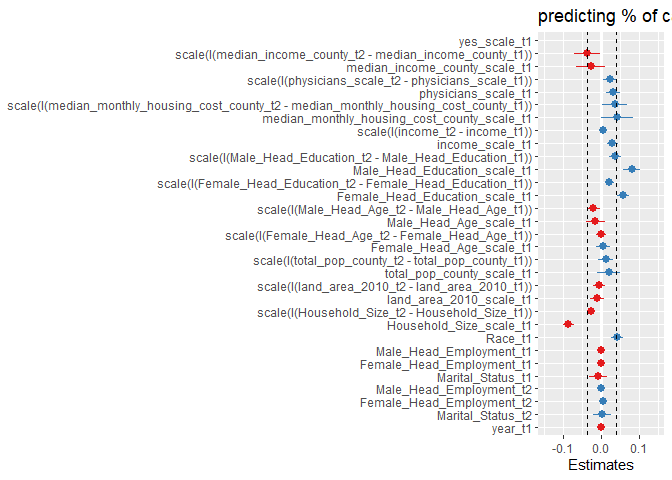<!-- -->

``` r
tidy_lm_f1 <- tidy(lm_f1)

est <- 
  tidy_lm_f1 %>% 
  dplyr::filter(term == "scale(I(median_income_county_t2 - median_income_county_t1))") %>% 
  dplyr::select(estimate)

tidy_lm_f1 <-
  tidy_lm_f1 %>% 
  mutate(
    dot_color = ifelse(estimate < 0, "red1", ifelse(estimate > 0, "dodgerblue2", NA)),
    se = std.error
  )

tidy_lm_f1 <-
  tidy_lm_f1 %>% 
  filter(
    term == "scale(I(median_income_county_t2 - median_income_county_t1))" |
    term == "median_income_county_scale_t1" |
    term == "scale(I(physicians_scale_t2 - physicians_scale_t1))" | 
    term == "scale(I(median_monthly_housing_cost_county_t2 - median_monthly_housing_cost_county_t1))" | 
    term == "scale(I(income_t2 - income_t1))" | 
    term == "scale(I(Female_Head_Education_t2 - Female_Head_Education_t1))" 
  ) %>% 
  mutate(
    variable = 
      case_when(
        term == "scale(I(median_income_county_t2 - median_income_county_t1))" ~ "change in median income",
        term == "median_income_county_scale_t1"  ~ "median income at t1",
        term == "scale(I(physicians_scale_t2 - physicians_scale_t1))"  ~ "change in healthcare access",
        term == "scale(I(median_monthly_housing_cost_county_t2 - median_monthly_housing_cost_county_t1))"  ~ "change in housing cost", 
        term == "scale(I(income_t2 - income_t1))"  ~ "change in income",
        term == "scale(I(Female_Head_Education_t2 - Female_Head_Education_t1))"  ~ "change in female education"
      )
  ) 

col <- as.character(tidy_lm_f1$dot_color)
names(col) <- as.character(tidy_lm_f1$dot_color)

calorie_budget_county_moves_1yr <-
  tidy_lm_f1 %>% 
  ggplot(aes(variable, estimate)) +
  geom_point(aes(color = dot_color), size = 4) +
  geom_errorbar(aes(ymin = estimate - 2 * se, ymax = estimate + 2 * se), width = 0) + 
  scale_color_manual(values = col) +
  geom_hline(yintercept = -abs(est$estimate), linetype = "dashed", color = "red") +
  geom_hline(yintercept = 0, linetype = "dashed") +
  geom_hline(yintercept = abs(est$estimate), linetype = "dashed", color = "red") +
  scale_y_continuous(
    breaks = c(-0.15, -0.1, -0.05, 0, 0.05, 0.1, 0.15),
    limits = c(-0.17, 0.17)
  ) +
  labs(
    y = "standardized beta",
    title = "county moves, 1 year"
  ) +
  theme_bw() +
  theme(
    text = element_text(size = 17),
    plot.title = element_text(hjust = 0.5),
    legend.position = "none"
  ) +
  coord_flip()

calorie_budget_county_moves_1yr
```

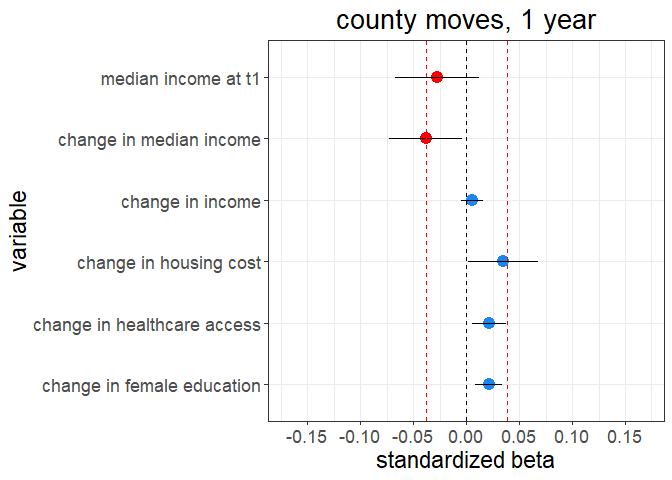<!-- -->

``` r
ggsave(
  "G:/My Drive/research/projects/niel/nielsen_analysis/relative_status_analysis/plots/calorie_budget_county_moves_1yr.png",
  calorie_budget_county_moves_1yr,
  width = 8,
  height = 6,
  dpi = 500
)
```

#### 2 years

``` r
 lm_f2 <-
    lmer(
      scale(yes_scale_t2) ~
        scale(yes_scale_t1) +
        
        scale(I(median_income_county_t2 - median_income_county_t1)) +
        median_income_county_scale_t1 +
        
        scale(I(physicians_scale_t2 - physicians_scale_t1)) +
        physicians_scale_t1 +
        
        # scale(I(dentists_t2 - dentists_t1)) +
        # scale(dentists_t1) +
        # 
        # scale(I(therapists_t2 - therapists_t1)) +
        # scale(therapists_t1) +
        
        scale(I(median_monthly_housing_cost_county_t2 - median_monthly_housing_cost_county_t1)) +
        median_monthly_housing_cost_county_scale_t1 +
        
        scale(I(income_t2 - income_t1)) +
        income_scale_t1 +
        
        scale(I(Male_Head_Education_t2 - Male_Head_Education_t1)) +
        Male_Head_Education_scale_t1 +
        
        scale(I(Female_Head_Education_t2 - Female_Head_Education_t1)) +
        Female_Head_Education_scale_t1 +
        
        scale(I(Male_Head_Age_t2 - Male_Head_Age_t1)) +
        Male_Head_Age_scale_t1 +
        
        scale(I(Female_Head_Age_t2 - Female_Head_Age_t1)) +
        Female_Head_Age_scale_t1 +
        
        scale(I(total_pop_county_t2 - total_pop_county_t1)) +
        total_pop_county_scale_t1 +
        
        scale(I(land_area_2010_t2 - land_area_2010_t1)) +
        land_area_2010_scale_t1 +
        
        scale(I(Household_Size_t2 - Household_Size_t1)) +
        Household_Size_scale_t1 +
        
        Race_t1 +
        
        Male_Head_Employment_t1 +
        Female_Head_Employment_t1 +
        Marital_Status_t1 +
        
        Male_Head_Employment_t2 +
        Female_Head_Employment_t2 +
        Marital_Status_t2 +
        
        year_t1 +
        
        (1 + scale(I(median_income_county_t2 - median_income_county_t1))|fips_code_t2) +
        (1|fips_code_t1) +
        (1|household_code) +
        (1|quarter),
      data =
        fips_movers_2yr_calorie_data
    )
```

    ## Warning in checkConv(attr(opt, "derivs"), opt$par, ctrl = control$checkConv, :
    ## Model failed to converge with max|grad| = 0.00371616 (tol = 0.002, component 1)

``` r
summary(lm_f2)
```

    ## Linear mixed model fit by REML ['lmerMod']
    ## Formula: 
    ## scale(yes_scale_t2) ~ scale(yes_scale_t1) + scale(I(median_income_county_t2 -  
    ##     median_income_county_t1)) + median_income_county_scale_t1 +  
    ##     scale(I(physicians_scale_t2 - physicians_scale_t1)) + physicians_scale_t1 +  
    ##     scale(I(median_monthly_housing_cost_county_t2 - median_monthly_housing_cost_county_t1)) +  
    ##     median_monthly_housing_cost_county_scale_t1 + scale(I(income_t2 -  
    ##     income_t1)) + income_scale_t1 + scale(I(Male_Head_Education_t2 -  
    ##     Male_Head_Education_t1)) + Male_Head_Education_scale_t1 +  
    ##     scale(I(Female_Head_Education_t2 - Female_Head_Education_t1)) +  
    ##     Female_Head_Education_scale_t1 + scale(I(Male_Head_Age_t2 -  
    ##     Male_Head_Age_t1)) + Male_Head_Age_scale_t1 + scale(I(Female_Head_Age_t2 -  
    ##     Female_Head_Age_t1)) + Female_Head_Age_scale_t1 + scale(I(total_pop_county_t2 -  
    ##     total_pop_county_t1)) + total_pop_county_scale_t1 + scale(I(land_area_2010_t2 -  
    ##     land_area_2010_t1)) + land_area_2010_scale_t1 + scale(I(Household_Size_t2 -  
    ##     Household_Size_t1)) + Household_Size_scale_t1 + Race_t1 +  
    ##     Male_Head_Employment_t1 + Female_Head_Employment_t1 + Marital_Status_t1 +  
    ##     Male_Head_Employment_t2 + Female_Head_Employment_t2 + Marital_Status_t2 +  
    ##     year_t1 + (1 + scale(I(median_income_county_t2 - median_income_county_t1)) |  
    ##     fips_code_t2) + (1 | fips_code_t1) + (1 | household_code) +  
    ##     (1 | quarter)
    ##    Data: fips_movers_2yr_calorie_data
    ## 
    ## REML criterion at convergence: 202066.8
    ## 
    ## Scaled residuals: 
    ##     Min      1Q  Median      3Q     Max 
    ## -5.0814 -0.5788 -0.1230  0.4400  8.9874 
    ## 
    ## Random effects:
    ##  Groups         Name                                                       
    ##  household_code (Intercept)                                                
    ##  fips_code_t2   (Intercept)                                                
    ##                 scale(I(median_income_county_t2 - median_income_county_t1))
    ##  fips_code_t1   (Intercept)                                                
    ##  quarter        (Intercept)                                                
    ##  Residual                                                                  
    ##  Variance Std.Dev. Corr
    ##  0.309740 0.55654      
    ##  0.010672 0.10331      
    ##  0.006644 0.08151  0.25
    ##  0.014955 0.12229      
    ##  0.002757 0.05251      
    ##  0.589298 0.76766      
    ## Number of obs: 79772, groups:  
    ## household_code, 11192; fips_code_t2, 1945; fips_code_t1, 1915; quarter, 4
    ## 
    ## Fixed effects:
    ##                                                                                           Estimate
    ## (Intercept)                                                                              3.1359079
    ## scale(yes_scale_t1)                                                                      0.1174217
    ## scale(I(median_income_county_t2 - median_income_county_t1))                             -0.0513441
    ## median_income_county_scale_t1                                                           -0.0316216
    ## scale(I(physicians_scale_t2 - physicians_scale_t1))                                      0.0222474
    ## physicians_scale_t1                                                                      0.0373975
    ## scale(I(median_monthly_housing_cost_county_t2 - median_monthly_housing_cost_county_t1))  0.0561998
    ## median_monthly_housing_cost_county_scale_t1                                              0.0439889
    ## scale(I(income_t2 - income_t1))                                                          0.0141166
    ## income_scale_t1                                                                          0.0356858
    ## scale(I(Male_Head_Education_t2 - Male_Head_Education_t1))                                0.0224346
    ## Male_Head_Education_scale_t1                                                             0.0712828
    ## scale(I(Female_Head_Education_t2 - Female_Head_Education_t1))                            0.0141592
    ## Female_Head_Education_scale_t1                                                           0.0515402
    ## scale(I(Male_Head_Age_t2 - Male_Head_Age_t1))                                           -0.0005116
    ## Male_Head_Age_scale_t1                                                                   0.0048552
    ## scale(I(Female_Head_Age_t2 - Female_Head_Age_t1))                                        0.0069840
    ## Female_Head_Age_scale_t1                                                                 0.0176778
    ## scale(I(total_pop_county_t2 - total_pop_county_t1))                                      0.0235036
    ## total_pop_county_scale_t1                                                                0.0227719
    ## scale(I(land_area_2010_t2 - land_area_2010_t1))                                         -0.0097871
    ## land_area_2010_scale_t1                                                                 -0.0072417
    ## scale(I(Household_Size_t2 - Household_Size_t1))                                         -0.0245162
    ## Household_Size_scale_t1                                                                 -0.0783667
    ## Race_t1                                                                                  0.0347834
    ## Male_Head_Employment_t1                                                                 -0.0033535
    ## Female_Head_Employment_t1                                                                0.0018512
    ## Marital_Status_t1                                                                        0.0157506
    ## Male_Head_Employment_t2                                                                  0.0027562
    ## Female_Head_Employment_t2                                                                0.0062095
    ## Marital_Status_t2                                                                       -0.0091732
    ## year_t1                                                                                 -0.0016285
    ##                                                                                         Std. Error
    ## (Intercept)                                                                              2.5429665
    ## scale(yes_scale_t1)                                                                      0.0035734
    ## scale(I(median_income_county_t2 - median_income_county_t1))                              0.0192812
    ## median_income_county_scale_t1                                                            0.0219175
    ## scale(I(physicians_scale_t2 - physicians_scale_t1))                                      0.0089204
    ## physicians_scale_t1                                                                      0.0103987
    ## scale(I(median_monthly_housing_cost_county_t2 - median_monthly_housing_cost_county_t1))  0.0183846
    ## median_monthly_housing_cost_county_scale_t1                                              0.0238741
    ## scale(I(income_t2 - income_t1))                                                          0.0045173
    ## income_scale_t1                                                                          0.0071177
    ## scale(I(Male_Head_Education_t2 - Male_Head_Education_t1))                                0.0071694
    ## Male_Head_Education_scale_t1                                                             0.0114904
    ## scale(I(Female_Head_Education_t2 - Female_Head_Education_t1))                            0.0054427
    ## Female_Head_Education_scale_t1                                                           0.0082037
    ## scale(I(Male_Head_Age_t2 - Male_Head_Age_t1))                                            0.0076060
    ## Male_Head_Age_scale_t1                                                                   0.0131670
    ## scale(I(Female_Head_Age_t2 - Female_Head_Age_t1))                                        0.0055433
    ## Female_Head_Age_scale_t1                                                                 0.0092609
    ## scale(I(total_pop_county_t2 - total_pop_county_t1))                                      0.0153327
    ## total_pop_county_scale_t1                                                                0.0214475
    ## scale(I(land_area_2010_t2 - land_area_2010_t1))                                          0.0095274
    ## land_area_2010_scale_t1                                                                  0.0115857
    ## scale(I(Household_Size_t2 - Household_Size_t1))                                          0.0045813
    ## Household_Size_scale_t1                                                                  0.0073336
    ## Race_t1                                                                                  0.0076568
    ## Male_Head_Employment_t1                                                                  0.0022927
    ## Female_Head_Employment_t1                                                                0.0017577
    ## Marital_Status_t1                                                                        0.0084778
    ## Male_Head_Employment_t2                                                                  0.0022016
    ## Female_Head_Employment_t2                                                                0.0016928
    ## Marital_Status_t2                                                                        0.0086967
    ## year_t1                                                                                  0.0012635
    ##                                                                                         t value
    ## (Intercept)                                                                               1.233
    ## scale(yes_scale_t1)                                                                      32.860
    ## scale(I(median_income_county_t2 - median_income_county_t1))                              -2.663
    ## median_income_county_scale_t1                                                            -1.443
    ## scale(I(physicians_scale_t2 - physicians_scale_t1))                                       2.494
    ## physicians_scale_t1                                                                       3.596
    ## scale(I(median_monthly_housing_cost_county_t2 - median_monthly_housing_cost_county_t1))   3.057
    ## median_monthly_housing_cost_county_scale_t1                                               1.843
    ## scale(I(income_t2 - income_t1))                                                           3.125
    ## income_scale_t1                                                                           5.014
    ## scale(I(Male_Head_Education_t2 - Male_Head_Education_t1))                                 3.129
    ## Male_Head_Education_scale_t1                                                              6.204
    ## scale(I(Female_Head_Education_t2 - Female_Head_Education_t1))                             2.602
    ## Female_Head_Education_scale_t1                                                            6.283
    ## scale(I(Male_Head_Age_t2 - Male_Head_Age_t1))                                            -0.067
    ## Male_Head_Age_scale_t1                                                                    0.369
    ## scale(I(Female_Head_Age_t2 - Female_Head_Age_t1))                                         1.260
    ## Female_Head_Age_scale_t1                                                                  1.909
    ## scale(I(total_pop_county_t2 - total_pop_county_t1))                                       1.533
    ## total_pop_county_scale_t1                                                                 1.062
    ## scale(I(land_area_2010_t2 - land_area_2010_t1))                                          -1.027
    ## land_area_2010_scale_t1                                                                  -0.625
    ## scale(I(Household_Size_t2 - Household_Size_t1))                                          -5.351
    ## Household_Size_scale_t1                                                                 -10.686
    ## Race_t1                                                                                   4.543
    ## Male_Head_Employment_t1                                                                  -1.463
    ## Female_Head_Employment_t1                                                                 1.053
    ## Marital_Status_t1                                                                         1.858
    ## Male_Head_Employment_t2                                                                   1.252
    ## Female_Head_Employment_t2                                                                 3.668
    ## Marital_Status_t2                                                                        -1.055
    ## year_t1                                                                                  -1.289

    ## 
    ## Correlation matrix not shown by default, as p = 32 > 12.
    ## Use print(x, correlation=TRUE)  or
    ##     vcov(x)        if you need it

    ## convergence code: 0
    ## Model failed to converge with max|grad| = 0.00371616 (tol = 0.002, component 1)

``` r
tidy_lm_f2 <- tidy(lm_f2)
tidy_lm_f2
```

    ## # A tibble: 39 x 6
    ##    effect group term                                estimate std.error statistic
    ##    <chr>  <chr> <chr>                                  <dbl>     <dbl>     <dbl>
    ##  1 fixed  <NA>  (Intercept)                           3.14     2.54         1.23
    ##  2 fixed  <NA>  scale(yes_scale_t1)                   0.117    0.00357     32.9 
    ##  3 fixed  <NA>  scale(I(median_income_county_t2 - ~  -0.0513   0.0193      -2.66
    ##  4 fixed  <NA>  median_income_county_scale_t1        -0.0316   0.0219      -1.44
    ##  5 fixed  <NA>  scale(I(physicians_scale_t2 - phys~   0.0222   0.00892      2.49
    ##  6 fixed  <NA>  physicians_scale_t1                   0.0374   0.0104       3.60
    ##  7 fixed  <NA>  scale(I(median_monthly_housing_cos~   0.0562   0.0184       3.06
    ##  8 fixed  <NA>  median_monthly_housing_cost_county~   0.0440   0.0239       1.84
    ##  9 fixed  <NA>  scale(I(income_t2 - income_t1))       0.0141   0.00452      3.13
    ## 10 fixed  <NA>  income_scale_t1                       0.0357   0.00712      5.01
    ## # ... with 29 more rows

##### Plotting coefficients

``` r
est <- 
  tidy_lm_f2 %>% 
  dplyr::filter(term == "scale(I(median_income_county_t2 - median_income_county_t1))") %>% 
  dplyr::select(estimate)

sjPlot::plot_model(lm_f2) +
  ylim(-0.15, 0.15) +
  labs(title = "predicting % of calorie consumption in healthy categories") +
  geom_hline(yintercept = -abs(est$estimate), linetype = "dashed") +
  geom_hline(yintercept = abs(est$estimate), linetype = "dashed")
```

    ## Scale for 'y' is already present. Adding another scale for 'y', which will
    ## replace the existing scale.

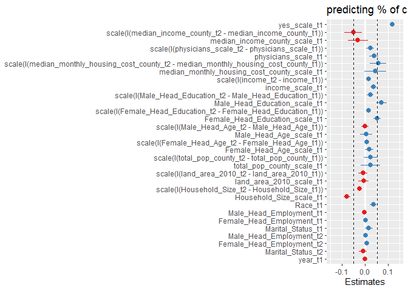<!-- -->

``` r
tidy_lm_f2 <- tidy(lm_f2)

est <- 
  tidy_lm_f2 %>% 
  dplyr::filter(term == "scale(I(median_income_county_t2 - median_income_county_t1))") %>% 
  dplyr::select(estimate)

tidy_lm_f2 <-
  tidy_lm_f2 %>% 
  mutate(
    dot_color = ifelse(estimate < 0, "red1", ifelse(estimate > 0, "dodgerblue2", NA)),
    se = std.error
  )

tidy_lm_f2 <-
  tidy_lm_f2 %>% 
  filter(
    term == "scale(I(median_income_county_t2 - median_income_county_t1))" |
    term == "median_income_county_scale_t1" |
    term == "scale(I(physicians_scale_t2 - physicians_scale_t1))" | 
    term == "scale(I(median_monthly_housing_cost_county_t2 - median_monthly_housing_cost_county_t1))" | 
    term == "scale(I(income_t2 - income_t1))" | 
    term == "scale(I(Female_Head_Education_t2 - Female_Head_Education_t1))" 
  ) %>% 
  mutate(
    variable = 
      case_when(
        term == "scale(I(median_income_county_t2 - median_income_county_t1))" ~ "change in median income",
        term == "median_income_county_scale_t1"  ~ "median income at t1",
        term == "scale(I(physicians_scale_t2 - physicians_scale_t1))"  ~ "change in healthcare access",
        term == "scale(I(median_monthly_housing_cost_county_t2 - median_monthly_housing_cost_county_t1))"  ~ "change in housing cost", 
        term == "scale(I(income_t2 - income_t1))"  ~ "change in income",
        term == "scale(I(Female_Head_Education_t2 - Female_Head_Education_t1))"  ~ "change in female education"
      )
  ) 

col <- as.character(tidy_lm_f2$dot_color)
names(col) <- as.character(tidy_lm_f2$dot_color)

calorie_budget_county_moves_2yr <-
  tidy_lm_f2 %>% 
  ggplot(aes(variable, estimate)) +
  geom_point(aes(color = dot_color), size = 4) +
  geom_errorbar(aes(ymin = estimate - 2 * se, ymax = estimate + 2 * se), width = 0) + 
  scale_color_manual(values = col) +
  geom_hline(yintercept = -abs(est$estimate), linetype = "dashed", color = "red") +
  geom_hline(yintercept = 0, linetype = "dashed") +
  geom_hline(yintercept = abs(est$estimate), linetype = "dashed", color = "red") +
  scale_y_continuous(
    breaks = c(-0.15, -0.1, -0.05, 0, 0.05, 0.1, 0.15),
    limits = c(-0.17, 0.17)
  ) +
  labs(
    y = "standardized beta",
    title = "county moves, 2 year"
  ) +
  theme_bw() +
  theme(
    text = element_text(size = 17),
    plot.title = element_text(hjust = 0.5),
    legend.position = "none"
  ) +
  coord_flip()

calorie_budget_county_moves_2yr
```

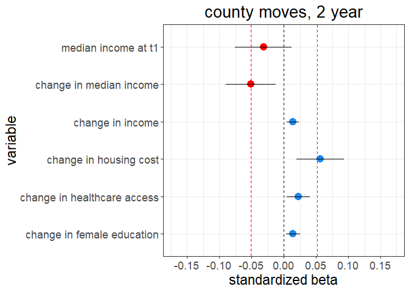<!-- -->

``` r
ggsave(
  "G:/My Drive/research/projects/niel/nielsen_analysis/relative_status_analysis/plots/calorie_budget_county_moves_2yr.png",
  calorie_budget_county_moves_2yr,
  width = 8,
  height = 6,
  dpi = 500
)
```

## Outcome = % of food spend in healthy category

### Zipcode moves

#### 1 year

``` r
 lm_z1 <-
    lmer(
      scale(yes_scale_t2) ~
        scale(yes_scale_t1) +
        
        scale(I(median_income_county_t2 - median_income_county_t1)) +
        median_income_county_scale_t1 +
        
        scale(I(physicians_scale_t2 - physicians_scale_t1)) +
        physicians_scale_t1 +
        
        # scale(I(dentists_t2 - dentists_t1)) +
        # scale(dentists_t1) +
        # 
        # scale(I(therapists_t2 - therapists_t1)) +
        # scale(therapists_t1) +
        
        scale(I(median_monthly_housing_cost_county_t2 - median_monthly_housing_cost_county_t1)) +
        median_monthly_housing_cost_county_scale_t1 +
        
        scale(I(income_t2 - income_t1)) +
        income_scale_t1 +
        
        scale(I(Male_Head_Education_t2 - Male_Head_Education_t1)) +
        Male_Head_Education_scale_t1 +
        
        scale(I(Female_Head_Education_t2 - Female_Head_Education_t1)) +
        Female_Head_Education_scale_t1 +
        
        scale(I(Male_Head_Age_t2 - Male_Head_Age_t1)) +
        Male_Head_Age_scale_t1 +
        
        scale(I(Female_Head_Age_t2 - Female_Head_Age_t1)) +
        Female_Head_Age_scale_t1 +
        
        scale(I(total_pop_county_t2 - total_pop_county_t1)) +
        total_pop_county_scale_t1 +
        
        scale(I(land_area_2010_t2 - land_area_2010_t1)) +
        land_area_2010_scale_t1 +
        
        scale(I(Household_Size_t2 - Household_Size_t1)) +
        Household_Size_scale_t1 +
        
        Race_t1 +
        
        Male_Head_Employment_t1 +
        Female_Head_Employment_t1 +
        Marital_Status_t1 +
        
        Male_Head_Employment_t2 +
        Female_Head_Employment_t2 +
        Marital_Status_t2 +
        
        year_t1 +
        
        (1 + scale(I(median_income_county_t2 - median_income_county_t1))|fips_code_t2) +
        (1|fips_code_t1) +
        (1|household_code) +
        (1|quarter),
      data =
        zip_movers_1yr_spend_data
    )
```

    ## Warning in checkConv(attr(opt, "derivs"), opt$par, ctrl = control$checkConv, :
    ## Model failed to converge with max|grad| = 0.00578053 (tol = 0.002, component 1)

``` r
summary(lm_z1)
```

    ## Linear mixed model fit by REML ['lmerMod']
    ## Formula: 
    ## scale(yes_scale_t2) ~ scale(yes_scale_t1) + scale(I(median_income_county_t2 -  
    ##     median_income_county_t1)) + median_income_county_scale_t1 +  
    ##     scale(I(physicians_scale_t2 - physicians_scale_t1)) + physicians_scale_t1 +  
    ##     scale(I(median_monthly_housing_cost_county_t2 - median_monthly_housing_cost_county_t1)) +  
    ##     median_monthly_housing_cost_county_scale_t1 + scale(I(income_t2 -  
    ##     income_t1)) + income_scale_t1 + scale(I(Male_Head_Education_t2 -  
    ##     Male_Head_Education_t1)) + Male_Head_Education_scale_t1 +  
    ##     scale(I(Female_Head_Education_t2 - Female_Head_Education_t1)) +  
    ##     Female_Head_Education_scale_t1 + scale(I(Male_Head_Age_t2 -  
    ##     Male_Head_Age_t1)) + Male_Head_Age_scale_t1 + scale(I(Female_Head_Age_t2 -  
    ##     Female_Head_Age_t1)) + Female_Head_Age_scale_t1 + scale(I(total_pop_county_t2 -  
    ##     total_pop_county_t1)) + total_pop_county_scale_t1 + scale(I(land_area_2010_t2 -  
    ##     land_area_2010_t1)) + land_area_2010_scale_t1 + scale(I(Household_Size_t2 -  
    ##     Household_Size_t1)) + Household_Size_scale_t1 + Race_t1 +  
    ##     Male_Head_Employment_t1 + Female_Head_Employment_t1 + Marital_Status_t1 +  
    ##     Male_Head_Employment_t2 + Female_Head_Employment_t2 + Marital_Status_t2 +  
    ##     year_t1 + (1 + scale(I(median_income_county_t2 - median_income_county_t1)) |  
    ##     fips_code_t2) + (1 | fips_code_t1) + (1 | household_code) +  
    ##     (1 | quarter)
    ##    Data: zip_movers_1yr_spend_data
    ## 
    ## REML criterion at convergence: 199855.4
    ## 
    ## Scaled residuals: 
    ##     Min      1Q  Median      3Q     Max 
    ## -6.4240 -0.5520 -0.0309  0.5220 10.2260 
    ## 
    ## Random effects:
    ##  Groups         Name                                                       
    ##  household_code (Intercept)                                                
    ##  fips_code_t2   (Intercept)                                                
    ##                 scale(I(median_income_county_t2 - median_income_county_t1))
    ##  fips_code_t1   (Intercept)                                                
    ##  quarter        (Intercept)                                                
    ##  Residual                                                                  
    ##  Variance  Std.Dev. Corr 
    ##  0.2957812 0.54386       
    ##  0.0070534 0.08398       
    ##  0.0041033 0.06406  -0.22
    ##  0.0057218 0.07564       
    ##  0.0008273 0.02876       
    ##  0.3865497 0.62173       
    ## Number of obs: 90830, groups:  
    ## household_code, 17725; fips_code_t2, 2016; fips_code_t1, 1999; quarter, 4
    ## 
    ## Fixed effects:
    ##                                                                                           Estimate
    ## (Intercept)                                                                             -4.8397512
    ## scale(yes_scale_t1)                                                                      0.3058763
    ## scale(I(median_income_county_t2 - median_income_county_t1))                             -0.0347808
    ## median_income_county_scale_t1                                                           -0.0552408
    ## scale(I(physicians_scale_t2 - physicians_scale_t1))                                      0.0052269
    ## physicians_scale_t1                                                                      0.0207436
    ## scale(I(median_monthly_housing_cost_county_t2 - median_monthly_housing_cost_county_t1))  0.0583721
    ## median_monthly_housing_cost_county_scale_t1                                              0.1083978
    ## scale(I(income_t2 - income_t1))                                                          0.0028734
    ## income_scale_t1                                                                          0.0500360
    ## scale(I(Male_Head_Education_t2 - Male_Head_Education_t1))                                0.0221453
    ## Male_Head_Education_scale_t1                                                             0.1005237
    ## scale(I(Female_Head_Education_t2 - Female_Head_Education_t1))                            0.0230702
    ## Female_Head_Education_scale_t1                                                           0.0737641
    ## scale(I(Male_Head_Age_t2 - Male_Head_Age_t1))                                           -0.0015247
    ## Male_Head_Age_scale_t1                                                                  -0.0308061
    ## scale(I(Female_Head_Age_t2 - Female_Head_Age_t1))                                       -0.0014971
    ## Female_Head_Age_scale_t1                                                                -0.0120062
    ## scale(I(total_pop_county_t2 - total_pop_county_t1))                                     -0.0025506
    ## total_pop_county_scale_t1                                                               -0.0018567
    ## scale(I(land_area_2010_t2 - land_area_2010_t1))                                         -0.0009623
    ## land_area_2010_scale_t1                                                                 -0.0011791
    ## scale(I(Household_Size_t2 - Household_Size_t1))                                         -0.0278485
    ## Household_Size_scale_t1                                                                 -0.0897800
    ## Race_t1                                                                                 -0.0034955
    ## Male_Head_Employment_t1                                                                 -0.0006212
    ## Female_Head_Employment_t1                                                               -0.0024613
    ## Marital_Status_t1                                                                        0.0034053
    ## Male_Head_Employment_t2                                                                  0.0006508
    ## Female_Head_Employment_t2                                                                0.0062728
    ## Marital_Status_t2                                                                       -0.0073323
    ## year_t1                                                                                  0.0023836
    ##                                                                                         Std. Error
    ## (Intercept)                                                                              1.8356039
    ## scale(yes_scale_t1)                                                                      0.0032406
    ## scale(I(median_income_county_t2 - median_income_county_t1))                              0.0121489
    ## median_income_county_scale_t1                                                            0.0159629
    ## scale(I(physicians_scale_t2 - physicians_scale_t1))                                      0.0053834
    ## physicians_scale_t1                                                                      0.0072627
    ## scale(I(median_monthly_housing_cost_county_t2 - median_monthly_housing_cost_county_t1))  0.0115459
    ## median_monthly_housing_cost_county_scale_t1                                              0.0173699
    ## scale(I(income_t2 - income_t1))                                                          0.0035851
    ## income_scale_t1                                                                          0.0052882
    ## scale(I(Male_Head_Education_t2 - Male_Head_Education_t1))                                0.0055072
    ## Male_Head_Education_scale_t1                                                             0.0085868
    ## scale(I(Female_Head_Education_t2 - Female_Head_Education_t1))                            0.0042995
    ## Female_Head_Education_scale_t1                                                           0.0061349
    ## scale(I(Male_Head_Age_t2 - Male_Head_Age_t1))                                            0.0058625
    ## Male_Head_Age_scale_t1                                                                   0.0096372
    ## scale(I(Female_Head_Age_t2 - Female_Head_Age_t1))                                        0.0043578
    ## Female_Head_Age_scale_t1                                                                 0.0067575
    ## scale(I(total_pop_county_t2 - total_pop_county_t1))                                      0.0092935
    ## total_pop_county_scale_t1                                                                0.0144542
    ## scale(I(land_area_2010_t2 - land_area_2010_t1))                                          0.0061501
    ## land_area_2010_scale_t1                                                                  0.0081579
    ## scale(I(Household_Size_t2 - Household_Size_t1))                                          0.0035755
    ## Household_Size_scale_t1                                                                  0.0053068
    ## Race_t1                                                                                  0.0057023
    ## Male_Head_Employment_t1                                                                  0.0022006
    ## Female_Head_Employment_t1                                                                0.0017183
    ## Marital_Status_t1                                                                        0.0078484
    ## Male_Head_Employment_t2                                                                  0.0022128
    ## Female_Head_Employment_t2                                                                0.0017192
    ## Marital_Status_t2                                                                        0.0079807
    ## year_t1                                                                                  0.0009118
    ##                                                                                         t value
    ## (Intercept)                                                                              -2.637
    ## scale(yes_scale_t1)                                                                      94.388
    ## scale(I(median_income_county_t2 - median_income_county_t1))                              -2.863
    ## median_income_county_scale_t1                                                            -3.461
    ## scale(I(physicians_scale_t2 - physicians_scale_t1))                                       0.971
    ## physicians_scale_t1                                                                       2.856
    ## scale(I(median_monthly_housing_cost_county_t2 - median_monthly_housing_cost_county_t1))   5.056
    ## median_monthly_housing_cost_county_scale_t1                                               6.241
    ## scale(I(income_t2 - income_t1))                                                           0.801
    ## income_scale_t1                                                                           9.462
    ## scale(I(Male_Head_Education_t2 - Male_Head_Education_t1))                                 4.021
    ## Male_Head_Education_scale_t1                                                             11.707
    ## scale(I(Female_Head_Education_t2 - Female_Head_Education_t1))                             5.366
    ## Female_Head_Education_scale_t1                                                           12.024
    ## scale(I(Male_Head_Age_t2 - Male_Head_Age_t1))                                            -0.260
    ## Male_Head_Age_scale_t1                                                                   -3.197
    ## scale(I(Female_Head_Age_t2 - Female_Head_Age_t1))                                        -0.344
    ## Female_Head_Age_scale_t1                                                                 -1.777
    ## scale(I(total_pop_county_t2 - total_pop_county_t1))                                      -0.274
    ## total_pop_county_scale_t1                                                                -0.128
    ## scale(I(land_area_2010_t2 - land_area_2010_t1))                                          -0.156
    ## land_area_2010_scale_t1                                                                  -0.145
    ## scale(I(Household_Size_t2 - Household_Size_t1))                                          -7.789
    ## Household_Size_scale_t1                                                                 -16.918
    ## Race_t1                                                                                  -0.613
    ## Male_Head_Employment_t1                                                                  -0.282
    ## Female_Head_Employment_t1                                                                -1.432
    ## Marital_Status_t1                                                                         0.434
    ## Male_Head_Employment_t2                                                                   0.294
    ## Female_Head_Employment_t2                                                                 3.649
    ## Marital_Status_t2                                                                        -0.919
    ## year_t1                                                                                   2.614

    ## 
    ## Correlation matrix not shown by default, as p = 32 > 12.
    ## Use print(x, correlation=TRUE)  or
    ##     vcov(x)        if you need it

    ## convergence code: 0
    ## Model failed to converge with max|grad| = 0.00578053 (tol = 0.002, component 1)

``` r
tidy_lm_z1 <- tidy(lm_z1)
tidy_lm_z1
```

    ## # A tibble: 39 x 6
    ##    effect group term                                estimate std.error statistic
    ##    <chr>  <chr> <chr>                                  <dbl>     <dbl>     <dbl>
    ##  1 fixed  <NA>  (Intercept)                         -4.84      1.84       -2.64 
    ##  2 fixed  <NA>  scale(yes_scale_t1)                  0.306     0.00324    94.4  
    ##  3 fixed  <NA>  scale(I(median_income_county_t2 - ~ -0.0348    0.0121     -2.86 
    ##  4 fixed  <NA>  median_income_county_scale_t1       -0.0552    0.0160     -3.46 
    ##  5 fixed  <NA>  scale(I(physicians_scale_t2 - phys~  0.00523   0.00538     0.971
    ##  6 fixed  <NA>  physicians_scale_t1                  0.0207    0.00726     2.86 
    ##  7 fixed  <NA>  scale(I(median_monthly_housing_cos~  0.0584    0.0115      5.06 
    ##  8 fixed  <NA>  median_monthly_housing_cost_county~  0.108     0.0174      6.24 
    ##  9 fixed  <NA>  scale(I(income_t2 - income_t1))      0.00287   0.00359     0.801
    ## 10 fixed  <NA>  income_scale_t1                      0.0500    0.00529     9.46 
    ## # ... with 29 more rows

##### Plotting coefficients

``` r
est <- 
  tidy_lm_z1 %>% 
  dplyr::filter(term == "scale(I(median_income_county_t2 - median_income_county_t1))") %>% 
  dplyr::select(estimate)

sjPlot::plot_model(lm_z1) +
  ylim(-0.15, 0.15) +
  labs(title = "predicting % of spend consumption in healthy categories") +
  geom_hline(yintercept = -abs(est$estimate), linetype = "dashed") +
  geom_hline(yintercept = abs(est$estimate), linetype = "dashed")
```

    ## Scale for 'y' is already present. Adding another scale for 'y', which will
    ## replace the existing scale.

    ## Warning: Removed 1 rows containing missing values (geom_point).

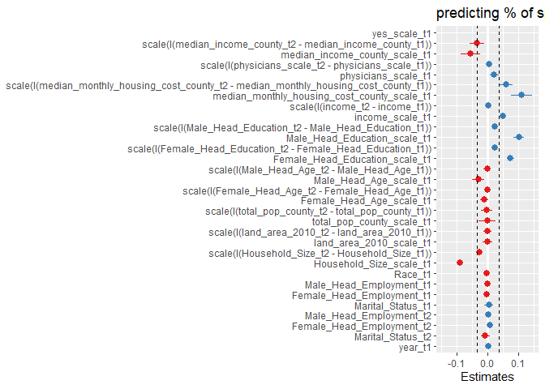<!-- -->

``` r
tidy_lm_z1 <- tidy(lm_z1)

est <- 
  tidy_lm_z1 %>% 
  dplyr::filter(term == "scale(I(median_income_county_t2 - median_income_county_t1))") %>% 
  dplyr::select(estimate)

tidy_lm_z1 <-
  tidy_lm_z1 %>% 
  mutate(
    dot_color = ifelse(estimate < 0, "red1", ifelse(estimate > 0, "dodgerblue2", NA)),
    se = std.error
  )

tidy_lm_z1 <-
  tidy_lm_z1 %>% 
  filter(
    term == "scale(I(median_income_county_t2 - median_income_county_t1))" |
    term == "median_income_county_scale_t1" |
    term == "scale(I(physicians_scale_t2 - physicians_scale_t1))" | 
    term == "scale(I(median_monthly_housing_cost_county_t2 - median_monthly_housing_cost_county_t1))" | 
    term == "scale(I(income_t2 - income_t1))" | 
    term == "scale(I(Female_Head_Education_t2 - Female_Head_Education_t1))" 
  ) %>% 
  mutate(
    variable = 
      case_when(
        term == "scale(I(median_income_county_t2 - median_income_county_t1))" ~ "change in median income",
        term == "median_income_county_scale_t1"  ~ "median income at t1",
        term == "scale(I(physicians_scale_t2 - physicians_scale_t1))"  ~ "change in healthcare access",
        term == "scale(I(median_monthly_housing_cost_county_t2 - median_monthly_housing_cost_county_t1))"  ~ "change in housing cost", 
        term == "scale(I(income_t2 - income_t1))"  ~ "change in income",
        term == "scale(I(Female_Head_Education_t2 - Female_Head_Education_t1))"  ~ "change in female education"
      )
  ) 

col <- as.character(tidy_lm_z1$dot_color)
names(col) <- as.character(tidy_lm_z1$dot_color)

grocery_spend_zip_code_moves_1yr <-
  tidy_lm_z1 %>% 
  ggplot(aes(variable, estimate)) +
  geom_point(aes(color = dot_color), size = 4) +
  geom_errorbar(aes(ymin = estimate - 2 * se, ymax = estimate + 2 * se), width = 0) + 
  scale_color_manual(values = col) +
  geom_hline(yintercept = -abs(est$estimate), linetype = "dashed", color = "red") +
  geom_hline(yintercept = 0, linetype = "dashed") +
  geom_hline(yintercept = abs(est$estimate), linetype = "dashed", color = "red") +
  scale_y_continuous(
    breaks = c(-0.15, -0.1, -0.05, 0, 0.05, 0.1, 0.15),
    limits = c(-0.17, 0.17)
  ) +
  labs(
    y = "standardized beta",
    title = "zip code moves, 1 year"
  ) +
  theme_bw() +
  theme(
    text = element_text(size = 17),
    plot.title = element_text(hjust = 0.5),
    legend.position = "none"
  ) +
  coord_flip()

grocery_spend_zip_code_moves_1yr
```

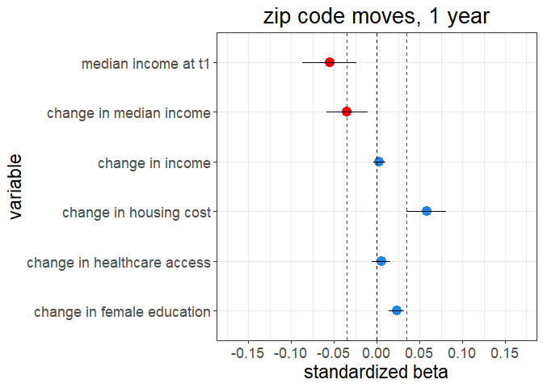<!-- -->

``` r
ggsave(
  "G:/My Drive/research/projects/niel/nielsen_analysis/relative_status_analysis/plots/grocery_spend_zip_code_moves_1yr.png",
  grocery_spend_zip_code_moves_1yr,
  width = 8,
  height = 6,
  dpi = 500
)
```

#### 2 years

``` r
 lm_z2 <-
    lmer(
      scale(yes_scale_t2) ~
        scale(yes_scale_t1) +
        
        scale(I(median_income_county_t2 - median_income_county_t1)) +
        median_income_county_scale_t1 +
        
        scale(I(physicians_scale_t2 - physicians_scale_t1)) +
        physicians_scale_t1 +
        
        # scale(I(dentists_t2 - dentists_t1)) +
        # scale(dentists_t1) +
        # 
        # scale(I(therapists_t2 - therapists_t1)) +
        # scale(therapists_t1) +
        
        scale(I(median_monthly_housing_cost_county_t2 - median_monthly_housing_cost_county_t1)) +
        median_monthly_housing_cost_county_scale_t1 +
        
        scale(I(income_t2 - income_t1)) +
        income_scale_t1 +
        
        scale(I(Male_Head_Education_t2 - Male_Head_Education_t1)) +
        Male_Head_Education_scale_t1 +
        
        scale(I(Female_Head_Education_t2 - Female_Head_Education_t1)) +
        Female_Head_Education_scale_t1 +
        
        scale(I(Male_Head_Age_t2 - Male_Head_Age_t1)) +
        Male_Head_Age_scale_t1 +
        
        scale(I(Female_Head_Age_t2 - Female_Head_Age_t1)) +
        Female_Head_Age_scale_t1 +
        
        scale(I(total_pop_county_t2 - total_pop_county_t1)) +
        total_pop_county_scale_t1 +
        
        scale(I(land_area_2010_t2 - land_area_2010_t1)) +
        land_area_2010_scale_t1 +
        
        scale(I(Household_Size_t2 - Household_Size_t1)) +
        Household_Size_scale_t1 +
        
        Race_t1 +
        
        Male_Head_Employment_t1 +
        Female_Head_Employment_t1 +
        Marital_Status_t1 +
        
        Male_Head_Employment_t2 +
        Female_Head_Employment_t2 +
        Marital_Status_t2 +
        
        year_t1 +
        
        (1 + scale(I(median_income_county_t2 - median_income_county_t1))|fips_code_t2) +
        (1|fips_code_t1) +
        (1|household_code) +
        (1|quarter),
      data =
        zip_movers_2yr_spend_data
    )

summary(lm_z2)
```

    ## Linear mixed model fit by REML ['lmerMod']
    ## Formula: 
    ## scale(yes_scale_t2) ~ scale(yes_scale_t1) + scale(I(median_income_county_t2 -  
    ##     median_income_county_t1)) + median_income_county_scale_t1 +  
    ##     scale(I(physicians_scale_t2 - physicians_scale_t1)) + physicians_scale_t1 +  
    ##     scale(I(median_monthly_housing_cost_county_t2 - median_monthly_housing_cost_county_t1)) +  
    ##     median_monthly_housing_cost_county_scale_t1 + scale(I(income_t2 -  
    ##     income_t1)) + income_scale_t1 + scale(I(Male_Head_Education_t2 -  
    ##     Male_Head_Education_t1)) + Male_Head_Education_scale_t1 +  
    ##     scale(I(Female_Head_Education_t2 - Female_Head_Education_t1)) +  
    ##     Female_Head_Education_scale_t1 + scale(I(Male_Head_Age_t2 -  
    ##     Male_Head_Age_t1)) + Male_Head_Age_scale_t1 + scale(I(Female_Head_Age_t2 -  
    ##     Female_Head_Age_t1)) + Female_Head_Age_scale_t1 + scale(I(total_pop_county_t2 -  
    ##     total_pop_county_t1)) + total_pop_county_scale_t1 + scale(I(land_area_2010_t2 -  
    ##     land_area_2010_t1)) + land_area_2010_scale_t1 + scale(I(Household_Size_t2 -  
    ##     Household_Size_t1)) + Household_Size_scale_t1 + Race_t1 +  
    ##     Male_Head_Employment_t1 + Female_Head_Employment_t1 + Marital_Status_t1 +  
    ##     Male_Head_Employment_t2 + Female_Head_Employment_t2 + Marital_Status_t2 +  
    ##     year_t1 + (1 + scale(I(median_income_county_t2 - median_income_county_t1)) |  
    ##     fips_code_t2) + (1 | fips_code_t1) + (1 | household_code) +  
    ##     (1 | quarter)
    ##    Data: zip_movers_2yr_spend_data
    ## 
    ## REML criterion at convergence: 293493.9
    ## 
    ## Scaled residuals: 
    ##     Min      1Q  Median      3Q     Max 
    ## -9.3353 -0.5588 -0.0283  0.5305 10.1007 
    ## 
    ## Random effects:
    ##  Groups         Name                                                       
    ##  household_code (Intercept)                                                
    ##  fips_code_t2   (Intercept)                                                
    ##                 scale(I(median_income_county_t2 - median_income_county_t1))
    ##  fips_code_t1   (Intercept)                                                
    ##  quarter        (Intercept)                                                
    ##  Residual                                                                  
    ##  Variance Std.Dev. Corr 
    ##  0.448471 0.66968       
    ##  0.016684 0.12917       
    ##  0.011477 0.10713  -0.03
    ##  0.017218 0.13122       
    ##  0.001252 0.03539       
    ##  0.376581 0.61366       
    ## Number of obs: 135329, groups:  
    ## household_code, 17976; fips_code_t2, 2038; fips_code_t1, 2015; quarter, 4
    ## 
    ## Fixed effects:
    ##                                                                                           Estimate
    ## (Intercept)                                                                             -3.0718211
    ## scale(yes_scale_t1)                                                                      0.1433731
    ## scale(I(median_income_county_t2 - median_income_county_t1))                             -0.0489897
    ## median_income_county_scale_t1                                                           -0.0664124
    ## scale(I(physicians_scale_t2 - physicians_scale_t1))                                      0.0079076
    ## physicians_scale_t1                                                                      0.0203665
    ## scale(I(median_monthly_housing_cost_county_t2 - median_monthly_housing_cost_county_t1))  0.0765972
    ## median_monthly_housing_cost_county_scale_t1                                              0.1377144
    ## scale(I(income_t2 - income_t1))                                                          0.0121675
    ## income_scale_t1                                                                          0.0505656
    ## scale(I(Male_Head_Education_t2 - Male_Head_Education_t1))                                0.0433499
    ## Male_Head_Education_scale_t1                                                             0.1083311
    ## scale(I(Female_Head_Education_t2 - Female_Head_Education_t1))                            0.0251101
    ## Female_Head_Education_scale_t1                                                           0.0757223
    ## scale(I(Male_Head_Age_t2 - Male_Head_Age_t1))                                           -0.0172130
    ## Male_Head_Age_scale_t1                                                                  -0.0188770
    ## scale(I(Female_Head_Age_t2 - Female_Head_Age_t1))                                        0.0025008
    ## Female_Head_Age_scale_t1                                                                -0.0022948
    ## scale(I(total_pop_county_t2 - total_pop_county_t1))                                     -0.0202328
    ## total_pop_county_scale_t1                                                               -0.0465070
    ## scale(I(land_area_2010_t2 - land_area_2010_t1))                                         -0.0028034
    ## land_area_2010_scale_t1                                                                  0.0097811
    ## scale(I(Household_Size_t2 - Household_Size_t1))                                         -0.0323429
    ## Household_Size_scale_t1                                                                 -0.0830624
    ## Race_t1                                                                                  0.0046129
    ## Male_Head_Employment_t1                                                                 -0.0038067
    ## Female_Head_Employment_t1                                                                0.0013754
    ## Marital_Status_t1                                                                       -0.0064571
    ## Male_Head_Employment_t2                                                                  0.0006394
    ## Female_Head_Employment_t2                                                                0.0044335
    ## Marital_Status_t2                                                                        0.0148062
    ## year_t1                                                                                  0.0014853
    ##                                                                                         Std. Error
    ## (Intercept)                                                                              1.9057103
    ## scale(yes_scale_t1)                                                                      0.0027391
    ## scale(I(median_income_county_t2 - median_income_county_t1))                              0.0138746
    ## median_income_county_scale_t1                                                            0.0191961
    ## scale(I(physicians_scale_t2 - physicians_scale_t1))                                      0.0060915
    ## physicians_scale_t1                                                                      0.0085695
    ## scale(I(median_monthly_housing_cost_county_t2 - median_monthly_housing_cost_county_t1))  0.0129671
    ## median_monthly_housing_cost_county_scale_t1                                              0.0210393
    ## scale(I(income_t2 - income_t1))                                                          0.0030368
    ## income_scale_t1                                                                          0.0054435
    ## scale(I(Male_Head_Education_t2 - Male_Head_Education_t1))                                0.0049543
    ## Male_Head_Education_scale_t1                                                             0.0091495
    ## scale(I(Female_Head_Education_t2 - Female_Head_Education_t1))                            0.0036918
    ## Female_Head_Education_scale_t1                                                           0.0065891
    ## scale(I(Male_Head_Age_t2 - Male_Head_Age_t1))                                            0.0052533
    ## Male_Head_Age_scale_t1                                                                   0.0101531
    ## scale(I(Female_Head_Age_t2 - Female_Head_Age_t1))                                        0.0037561
    ## Female_Head_Age_scale_t1                                                                 0.0072346
    ## scale(I(total_pop_county_t2 - total_pop_county_t1))                                      0.0125923
    ## total_pop_county_scale_t1                                                                0.0211894
    ## scale(I(land_area_2010_t2 - land_area_2010_t1))                                          0.0075103
    ## land_area_2010_scale_t1                                                                  0.0109754
    ## scale(I(Household_Size_t2 - Household_Size_t1))                                          0.0030800
    ## Household_Size_scale_t1                                                                  0.0054597
    ## Race_t1                                                                                  0.0056033
    ## Male_Head_Employment_t1                                                                  0.0015861
    ## Female_Head_Employment_t1                                                                0.0012404
    ## Marital_Status_t1                                                                        0.0054787
    ## Male_Head_Employment_t2                                                                  0.0015399
    ## Female_Head_Employment_t2                                                                0.0011990
    ## Marital_Status_t2                                                                        0.0055381
    ## year_t1                                                                                  0.0009466
    ##                                                                                         t value
    ## (Intercept)                                                                              -1.612
    ## scale(yes_scale_t1)                                                                      52.344
    ## scale(I(median_income_county_t2 - median_income_county_t1))                              -3.531
    ## median_income_county_scale_t1                                                            -3.460
    ## scale(I(physicians_scale_t2 - physicians_scale_t1))                                       1.298
    ## physicians_scale_t1                                                                       2.377
    ## scale(I(median_monthly_housing_cost_county_t2 - median_monthly_housing_cost_county_t1))   5.907
    ## median_monthly_housing_cost_county_scale_t1                                               6.546
    ## scale(I(income_t2 - income_t1))                                                           4.007
    ## income_scale_t1                                                                           9.289
    ## scale(I(Male_Head_Education_t2 - Male_Head_Education_t1))                                 8.750
    ## Male_Head_Education_scale_t1                                                             11.840
    ## scale(I(Female_Head_Education_t2 - Female_Head_Education_t1))                             6.802
    ## Female_Head_Education_scale_t1                                                           11.492
    ## scale(I(Male_Head_Age_t2 - Male_Head_Age_t1))                                            -3.277
    ## Male_Head_Age_scale_t1                                                                   -1.859
    ## scale(I(Female_Head_Age_t2 - Female_Head_Age_t1))                                         0.666
    ## Female_Head_Age_scale_t1                                                                 -0.317
    ## scale(I(total_pop_county_t2 - total_pop_county_t1))                                      -1.607
    ## total_pop_county_scale_t1                                                                -2.195
    ## scale(I(land_area_2010_t2 - land_area_2010_t1))                                          -0.373
    ## land_area_2010_scale_t1                                                                   0.891
    ## scale(I(Household_Size_t2 - Household_Size_t1))                                         -10.501
    ## Household_Size_scale_t1                                                                 -15.214
    ## Race_t1                                                                                   0.823
    ## Male_Head_Employment_t1                                                                  -2.400
    ## Female_Head_Employment_t1                                                                 1.109
    ## Marital_Status_t1                                                                        -1.179
    ## Male_Head_Employment_t2                                                                   0.415
    ## Female_Head_Employment_t2                                                                 3.698
    ## Marital_Status_t2                                                                         2.673
    ## year_t1                                                                                   1.569

    ## 
    ## Correlation matrix not shown by default, as p = 32 > 12.
    ## Use print(x, correlation=TRUE)  or
    ##     vcov(x)        if you need it

``` r
tidy_lm_z2 <- tidy(lm_z2)
tidy_lm_z2
```

    ## # A tibble: 39 x 6
    ##    effect group term                                estimate std.error statistic
    ##    <chr>  <chr> <chr>                                  <dbl>     <dbl>     <dbl>
    ##  1 fixed  <NA>  (Intercept)                         -3.07      1.91        -1.61
    ##  2 fixed  <NA>  scale(yes_scale_t1)                  0.143     0.00274     52.3 
    ##  3 fixed  <NA>  scale(I(median_income_county_t2 - ~ -0.0490    0.0139      -3.53
    ##  4 fixed  <NA>  median_income_county_scale_t1       -0.0664    0.0192      -3.46
    ##  5 fixed  <NA>  scale(I(physicians_scale_t2 - phys~  0.00791   0.00609      1.30
    ##  6 fixed  <NA>  physicians_scale_t1                  0.0204    0.00857      2.38
    ##  7 fixed  <NA>  scale(I(median_monthly_housing_cos~  0.0766    0.0130       5.91
    ##  8 fixed  <NA>  median_monthly_housing_cost_county~  0.138     0.0210       6.55
    ##  9 fixed  <NA>  scale(I(income_t2 - income_t1))      0.0122    0.00304      4.01
    ## 10 fixed  <NA>  income_scale_t1                      0.0506    0.00544      9.29
    ## # ... with 29 more rows

##### Plotting coefficients

``` r
est <- 
  tidy_lm_z2 %>% 
  dplyr::filter(term == "scale(I(median_income_county_t2 - median_income_county_t1))") %>% 
  dplyr::select(estimate)

sjPlot::plot_model(lm_z2) +
  ylim(-0.15, 0.15) +
  labs(title = "predicting % of spend consumption in healthy categories") +
  geom_hline(yintercept = -abs(est$estimate), linetype = "dashed") +
  geom_hline(yintercept = abs(est$estimate), linetype = "dashed")
```

    ## Scale for 'y' is already present. Adding another scale for 'y', which will
    ## replace the existing scale.

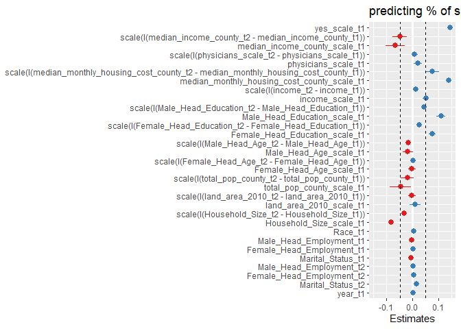<!-- -->

``` r
tidy_lm_z2 <- tidy(lm_z2)

est <- 
  tidy_lm_z2 %>% 
  dplyr::filter(term == "scale(I(median_income_county_t2 - median_income_county_t1))") %>% 
  dplyr::select(estimate)

tidy_lm_z2 <-
  tidy_lm_z2 %>% 
  mutate(
    dot_color = ifelse(estimate < 0, "red1", ifelse(estimate > 0, "dodgerblue2", NA)),
    se = std.error
  )

tidy_lm_z2 <-
  tidy_lm_z2 %>% 
  filter(
    term == "scale(I(median_income_county_t2 - median_income_county_t1))" |
    term == "median_income_county_scale_t1" |
    term == "scale(I(physicians_scale_t2 - physicians_scale_t1))" | 
    term == "scale(I(median_monthly_housing_cost_county_t2 - median_monthly_housing_cost_county_t1))" | 
    term == "scale(I(income_t2 - income_t1))" | 
    term == "scale(I(Female_Head_Education_t2 - Female_Head_Education_t1))" 
  ) %>% 
  mutate(
    variable = 
      case_when(
        term == "scale(I(median_income_county_t2 - median_income_county_t1))" ~ "change in median income",
        term == "median_income_county_scale_t1"  ~ "median income at t1",
        term == "scale(I(physicians_scale_t2 - physicians_scale_t1))"  ~ "change in healthcare access",
        term == "scale(I(median_monthly_housing_cost_county_t2 - median_monthly_housing_cost_county_t1))"  ~ "change in housing cost", 
        term == "scale(I(income_t2 - income_t1))"  ~ "change in income",
        term == "scale(I(Female_Head_Education_t2 - Female_Head_Education_t1))"  ~ "change in female education"
      )
  ) 

col <- as.character(tidy_lm_z2$dot_color)
names(col) <- as.character(tidy_lm_z2$dot_color)

grocery_spend_zip_code_moves_2yr <-
  tidy_lm_z2 %>% 
  ggplot(aes(variable, estimate)) +
  geom_point(aes(color = dot_color), size = 4) +
  geom_errorbar(aes(ymin = estimate - 2 * se, ymax = estimate + 2 * se), width = 0) + 
  scale_color_manual(values = col) +
  geom_hline(yintercept = -abs(est$estimate), linetype = "dashed", color = "red") +
  geom_hline(yintercept = 0, linetype = "dashed") +
  geom_hline(yintercept = abs(est$estimate), linetype = "dashed", color = "red") +
  scale_y_continuous(
    breaks = c(-0.15, -0.1, -0.05, 0, 0.05, 0.1, 0.15),
    limits = c(-0.17, 0.17)
  ) +
  labs(
    y = "standardized beta",
    title = "zip code moves, 2 year"
  ) +
  theme_bw() +
  theme(
    text = element_text(size = 17),
    plot.title = element_text(hjust = 0.5),
    legend.position = "none"
  ) +
  coord_flip()

grocery_spend_zip_code_moves_2yr
```

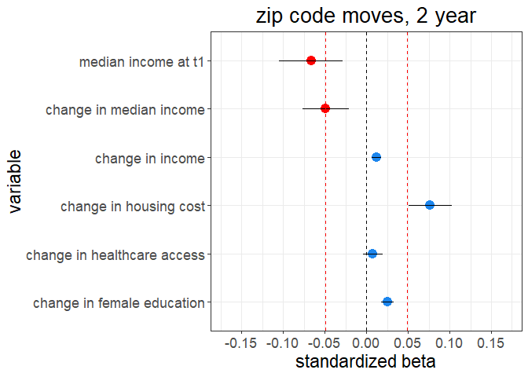<!-- -->

``` r
ggsave(
  "G:/My Drive/research/projects/niel/nielsen_analysis/relative_status_analysis/plots/grocery_spend_zip_code_moves_2yr.png",
  grocery_spend_zip_code_moves_2yr,
  width = 8,
  height = 6,
  dpi = 500
)
```

### County moves

#### 1 year

``` r
 lm_f1 <-
    lmer(
      scale(yes_scale_t2) ~
        scale(yes_scale_t1) +
        
        scale(I(median_income_county_t2 - median_income_county_t1)) +
        median_income_county_scale_t1 +
        
        scale(I(physicians_scale_t2 - physicians_scale_t1)) +
        physicians_scale_t1 +
        
        # scale(I(dentists_t2 - dentists_t1)) +
        # scale(dentists_t1) +
        # 
        # scale(I(therapists_t2 - therapists_t1)) +
        # scale(therapists_t1) +
        
        scale(I(median_monthly_housing_cost_county_t2 - median_monthly_housing_cost_county_t1)) +
        median_monthly_housing_cost_county_scale_t1 +
        
        scale(I(income_t2 - income_t1)) +
        income_scale_t1 +
        
        scale(I(Male_Head_Education_t2 - Male_Head_Education_t1)) +
        Male_Head_Education_scale_t1 +
        
        scale(I(Female_Head_Education_t2 - Female_Head_Education_t1)) +
        Female_Head_Education_scale_t1 +
        
        scale(I(Male_Head_Age_t2 - Male_Head_Age_t1)) +
        Male_Head_Age_scale_t1 +
        
        scale(I(Female_Head_Age_t2 - Female_Head_Age_t1)) +
        Female_Head_Age_scale_t1 +
        
        scale(I(total_pop_county_t2 - total_pop_county_t1)) +
        total_pop_county_scale_t1 +
        
        scale(I(land_area_2010_t2 - land_area_2010_t1)) +
        land_area_2010_scale_t1 +
        
        scale(I(Household_Size_t2 - Household_Size_t1)) +
        Household_Size_scale_t1 +
        
        Race_t1 +
        
        Male_Head_Employment_t1 +
        Female_Head_Employment_t1 +
        Marital_Status_t1 +
        
        Male_Head_Employment_t2 +
        Female_Head_Employment_t2 +
        Marital_Status_t2 +
        
        year_t1 +
        
        (1 + scale(I(median_income_county_t2 - median_income_county_t1))|fips_code_t2) +
        (1|fips_code_t1) +
        (1|household_code) +
        (1|quarter),
      data =
        fips_movers_1yr_spend_data
    )
```

    ## Warning in checkConv(attr(opt, "derivs"), opt$par, ctrl = control$checkConv, :
    ## Model failed to converge with max|grad| = 0.00273402 (tol = 0.002, component 1)

``` r
summary(lm_f1)
```

    ## Linear mixed model fit by REML ['lmerMod']
    ## Formula: 
    ## scale(yes_scale_t2) ~ scale(yes_scale_t1) + scale(I(median_income_county_t2 -  
    ##     median_income_county_t1)) + median_income_county_scale_t1 +  
    ##     scale(I(physicians_scale_t2 - physicians_scale_t1)) + physicians_scale_t1 +  
    ##     scale(I(median_monthly_housing_cost_county_t2 - median_monthly_housing_cost_county_t1)) +  
    ##     median_monthly_housing_cost_county_scale_t1 + scale(I(income_t2 -  
    ##     income_t1)) + income_scale_t1 + scale(I(Male_Head_Education_t2 -  
    ##     Male_Head_Education_t1)) + Male_Head_Education_scale_t1 +  
    ##     scale(I(Female_Head_Education_t2 - Female_Head_Education_t1)) +  
    ##     Female_Head_Education_scale_t1 + scale(I(Male_Head_Age_t2 -  
    ##     Male_Head_Age_t1)) + Male_Head_Age_scale_t1 + scale(I(Female_Head_Age_t2 -  
    ##     Female_Head_Age_t1)) + Female_Head_Age_scale_t1 + scale(I(total_pop_county_t2 -  
    ##     total_pop_county_t1)) + total_pop_county_scale_t1 + scale(I(land_area_2010_t2 -  
    ##     land_area_2010_t1)) + land_area_2010_scale_t1 + scale(I(Household_Size_t2 -  
    ##     Household_Size_t1)) + Household_Size_scale_t1 + Race_t1 +  
    ##     Male_Head_Employment_t1 + Female_Head_Employment_t1 + Marital_Status_t1 +  
    ##     Male_Head_Employment_t2 + Female_Head_Employment_t2 + Marital_Status_t2 +  
    ##     year_t1 + (1 + scale(I(median_income_county_t2 - median_income_county_t1)) |  
    ##     fips_code_t2) + (1 | fips_code_t1) + (1 | household_code) +  
    ##     (1 | quarter)
    ##    Data: fips_movers_1yr_spend_data
    ## 
    ## REML criterion at convergence: 118065.9
    ## 
    ## Scaled residuals: 
    ##     Min      1Q  Median      3Q     Max 
    ## -6.4394 -0.5525 -0.0257  0.5208 10.0714 
    ## 
    ## Random effects:
    ##  Groups         Name                                                       
    ##  household_code (Intercept)                                                
    ##  fips_code_t2   (Intercept)                                                
    ##                 scale(I(median_income_county_t2 - median_income_county_t1))
    ##  fips_code_t1   (Intercept)                                                
    ##  quarter        (Intercept)                                                
    ##  Residual                                                                  
    ##  Variance  Std.Dev. Corr 
    ##  0.2935706 0.54182       
    ##  0.0083712 0.09149       
    ##  0.0072290 0.08502  -0.24
    ##  0.0086420 0.09296       
    ##  0.0009924 0.03150       
    ##  0.3858141 0.62114       
    ## Number of obs: 53336, groups:  
    ## household_code, 10897; fips_code_t2, 1921; fips_code_t1, 1895; quarter, 4
    ## 
    ## Fixed effects:
    ##                                                                                           Estimate
    ## (Intercept)                                                                             -3.6297995
    ## scale(yes_scale_t1)                                                                      0.3029756
    ## scale(I(median_income_county_t2 - median_income_county_t1))                             -0.0539962
    ## median_income_county_scale_t1                                                           -0.0582817
    ## scale(I(physicians_scale_t2 - physicians_scale_t1))                                      0.0221115
    ## physicians_scale_t1                                                                      0.0375476
    ## scale(I(median_monthly_housing_cost_county_t2 - median_monthly_housing_cost_county_t1))  0.0876179
    ## median_monthly_housing_cost_county_scale_t1                                              0.1164237
    ## scale(I(income_t2 - income_t1))                                                         -0.0024256
    ## income_scale_t1                                                                          0.0383088
    ## scale(I(Male_Head_Education_t2 - Male_Head_Education_t1))                                0.0343029
    ## Male_Head_Education_scale_t1                                                             0.1105578
    ## scale(I(Female_Head_Education_t2 - Female_Head_Education_t1))                            0.0269850
    ## Female_Head_Education_scale_t1                                                           0.0827094
    ## scale(I(Male_Head_Age_t2 - Male_Head_Age_t1))                                           -0.0095310
    ## Male_Head_Age_scale_t1                                                                  -0.0264037
    ## scale(I(Female_Head_Age_t2 - Female_Head_Age_t1))                                        0.0006169
    ## Female_Head_Age_scale_t1                                                                -0.0043636
    ## scale(I(total_pop_county_t2 - total_pop_county_t1))                                      0.0022954
    ## total_pop_county_scale_t1                                                                0.0032556
    ## scale(I(land_area_2010_t2 - land_area_2010_t1))                                          0.0031447
    ## land_area_2010_scale_t1                                                                  0.0045980
    ## scale(I(Household_Size_t2 - Household_Size_t1))                                         -0.0289364
    ## Household_Size_scale_t1                                                                 -0.0933697
    ## Race_t1                                                                                  0.0061813
    ## Male_Head_Employment_t1                                                                 -0.0013351
    ## Female_Head_Employment_t1                                                               -0.0005529
    ## Marital_Status_t1                                                                        0.0157180
    ## Male_Head_Employment_t2                                                                 -0.0008527
    ## Female_Head_Employment_t2                                                                0.0048834
    ## Marital_Status_t2                                                                       -0.0198731
    ## year_t1                                                                                  0.0017688
    ##                                                                                         Std. Error
    ## (Intercept)                                                                              2.4128479
    ## scale(yes_scale_t1)                                                                      0.0042474
    ## scale(I(median_income_county_t2 - median_income_county_t1))                              0.0186020
    ## median_income_county_scale_t1                                                            0.0207607
    ## scale(I(physicians_scale_t2 - physicians_scale_t1))                                      0.0085412
    ## physicians_scale_t1                                                                      0.0098952
    ## scale(I(median_monthly_housing_cost_county_t2 - median_monthly_housing_cost_county_t1))  0.0175468
    ## median_monthly_housing_cost_county_scale_t1                                              0.0224793
    ## scale(I(income_t2 - income_t1))                                                          0.0049072
    ## income_scale_t1                                                                          0.0070227
    ## scale(I(Male_Head_Education_t2 - Male_Head_Education_t1))                                0.0074012
    ## Male_Head_Education_scale_t1                                                             0.0112459
    ## scale(I(Female_Head_Education_t2 - Female_Head_Education_t1))                            0.0058888
    ## Female_Head_Education_scale_t1                                                           0.0080160
    ## scale(I(Male_Head_Age_t2 - Male_Head_Age_t1))                                            0.0078366
    ## Male_Head_Age_scale_t1                                                                   0.0128459
    ## scale(I(Female_Head_Age_t2 - Female_Head_Age_t1))                                        0.0059686
    ## Female_Head_Age_scale_t1                                                                 0.0089832
    ## scale(I(total_pop_county_t2 - total_pop_county_t1))                                      0.0147367
    ## total_pop_county_scale_t1                                                                0.0191846
    ## scale(I(land_area_2010_t2 - land_area_2010_t1))                                          0.0093714
    ## land_area_2010_scale_t1                                                                  0.0106170
    ## scale(I(Household_Size_t2 - Household_Size_t1))                                          0.0049179
    ## Household_Size_scale_t1                                                                  0.0072390
    ## Race_t1                                                                                  0.0078113
    ## Male_Head_Employment_t1                                                                  0.0029383
    ## Female_Head_Employment_t1                                                                0.0022988
    ## Marital_Status_t1                                                                        0.0113277
    ## Male_Head_Employment_t2                                                                  0.0029803
    ## Female_Head_Employment_t2                                                                0.0022860
    ## Marital_Status_t2                                                                        0.0115829
    ## year_t1                                                                                  0.0011988
    ##                                                                                         t value
    ## (Intercept)                                                                              -1.504
    ## scale(yes_scale_t1)                                                                      71.333
    ## scale(I(median_income_county_t2 - median_income_county_t1))                              -2.903
    ## median_income_county_scale_t1                                                            -2.807
    ## scale(I(physicians_scale_t2 - physicians_scale_t1))                                       2.589
    ## physicians_scale_t1                                                                       3.795
    ## scale(I(median_monthly_housing_cost_county_t2 - median_monthly_housing_cost_county_t1))   4.993
    ## median_monthly_housing_cost_county_scale_t1                                               5.179
    ## scale(I(income_t2 - income_t1))                                                          -0.494
    ## income_scale_t1                                                                           5.455
    ## scale(I(Male_Head_Education_t2 - Male_Head_Education_t1))                                 4.635
    ## Male_Head_Education_scale_t1                                                              9.831
    ## scale(I(Female_Head_Education_t2 - Female_Head_Education_t1))                             4.582
    ## Female_Head_Education_scale_t1                                                           10.318
    ## scale(I(Male_Head_Age_t2 - Male_Head_Age_t1))                                            -1.216
    ## Male_Head_Age_scale_t1                                                                   -2.055
    ## scale(I(Female_Head_Age_t2 - Female_Head_Age_t1))                                         0.103
    ## Female_Head_Age_scale_t1                                                                 -0.486
    ## scale(I(total_pop_county_t2 - total_pop_county_t1))                                       0.156
    ## total_pop_county_scale_t1                                                                 0.170
    ## scale(I(land_area_2010_t2 - land_area_2010_t1))                                           0.336
    ## land_area_2010_scale_t1                                                                   0.433
    ## scale(I(Household_Size_t2 - Household_Size_t1))                                          -5.884
    ## Household_Size_scale_t1                                                                 -12.898
    ## Race_t1                                                                                   0.791
    ## Male_Head_Employment_t1                                                                  -0.454
    ## Female_Head_Employment_t1                                                                -0.241
    ## Marital_Status_t1                                                                         1.388
    ## Male_Head_Employment_t2                                                                  -0.286
    ## Female_Head_Employment_t2                                                                 2.136
    ## Marital_Status_t2                                                                        -1.716
    ## year_t1                                                                                   1.475

    ## 
    ## Correlation matrix not shown by default, as p = 32 > 12.
    ## Use print(x, correlation=TRUE)  or
    ##     vcov(x)        if you need it

    ## convergence code: 0
    ## Model failed to converge with max|grad| = 0.00273402 (tol = 0.002, component 1)

``` r
tidy_lm_f1 <- tidy(lm_f1)
tidy_lm_f1
```

    ## # A tibble: 39 x 6
    ##    effect group term                                estimate std.error statistic
    ##    <chr>  <chr> <chr>                                  <dbl>     <dbl>     <dbl>
    ##  1 fixed  <NA>  (Intercept)                         -3.63      2.41       -1.50 
    ##  2 fixed  <NA>  scale(yes_scale_t1)                  0.303     0.00425    71.3  
    ##  3 fixed  <NA>  scale(I(median_income_county_t2 - ~ -0.0540    0.0186     -2.90 
    ##  4 fixed  <NA>  median_income_county_scale_t1       -0.0583    0.0208     -2.81 
    ##  5 fixed  <NA>  scale(I(physicians_scale_t2 - phys~  0.0221    0.00854     2.59 
    ##  6 fixed  <NA>  physicians_scale_t1                  0.0375    0.00990     3.79 
    ##  7 fixed  <NA>  scale(I(median_monthly_housing_cos~  0.0876    0.0175      4.99 
    ##  8 fixed  <NA>  median_monthly_housing_cost_county~  0.116     0.0225      5.18 
    ##  9 fixed  <NA>  scale(I(income_t2 - income_t1))     -0.00243   0.00491    -0.494
    ## 10 fixed  <NA>  income_scale_t1                      0.0383    0.00702     5.46 
    ## # ... with 29 more rows

##### Plotting coefficients

``` r
est <- 
  tidy_lm_f1 %>% 
  dplyr::filter(term == "scale(I(median_income_county_t2 - median_income_county_t1))") %>% 
  dplyr::select(estimate)

sjPlot::plot_model(lm_f1) +
  ylim(-0.15, 0.15) +
  labs(title = "predicting % of spend consumption in healthy categories") +
  geom_hline(yintercept = -abs(est$estimate), linetype = "dashed") +
  geom_hline(yintercept = abs(est$estimate), linetype = "dashed")
```

    ## Scale for 'y' is already present. Adding another scale for 'y', which will
    ## replace the existing scale.

    ## Warning: Removed 1 rows containing missing values (geom_point).

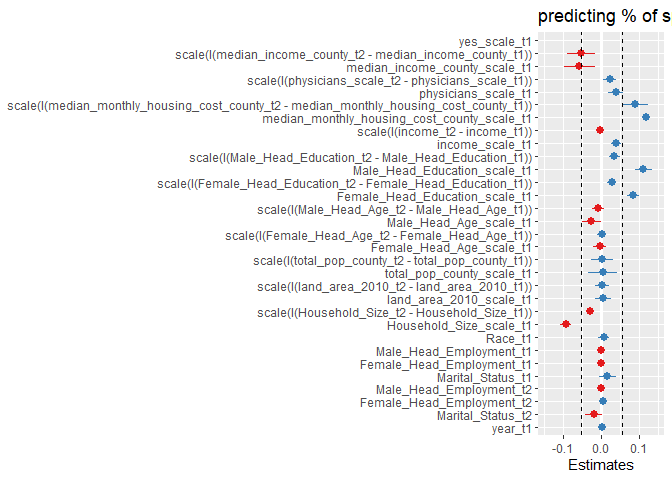<!-- -->

``` r
tidy_lm_f1 <- tidy(lm_f1)

est <- 
  tidy_lm_f1 %>% 
  dplyr::filter(term == "scale(I(median_income_county_t2 - median_income_county_t1))") %>% 
  dplyr::select(estimate)

tidy_lm_f1 <-
  tidy_lm_f1 %>% 
  mutate(
    dot_color = ifelse(estimate < 0, "red1", ifelse(estimate > 0, "dodgerblue2", NA)),
    se = std.error
  )

tidy_lm_f1 <-
  tidy_lm_f1 %>% 
  filter(
    term == "scale(I(median_income_county_t2 - median_income_county_t1))" |
    term == "median_income_county_scale_t1" |
    term == "scale(I(physicians_scale_t2 - physicians_scale_t1))" | 
    term == "scale(I(median_monthly_housing_cost_county_t2 - median_monthly_housing_cost_county_t1))" | 
    term == "scale(I(income_t2 - income_t1))" | 
    term == "scale(I(Female_Head_Education_t2 - Female_Head_Education_t1))" 
  ) %>% 
  mutate(
    variable = 
      case_when(
        term == "scale(I(median_income_county_t2 - median_income_county_t1))" ~ "change in median income",
        term == "median_income_county_scale_t1"  ~ "median income at t1",
        term == "scale(I(physicians_scale_t2 - physicians_scale_t1))"  ~ "change in healthcare access",
        term == "scale(I(median_monthly_housing_cost_county_t2 - median_monthly_housing_cost_county_t1))"  ~ "change in housing cost", 
        term == "scale(I(income_t2 - income_t1))"  ~ "change in income",
        term == "scale(I(Female_Head_Education_t2 - Female_Head_Education_t1))"  ~ "change in female education"
      )
  ) 

col <- as.character(tidy_lm_f1$dot_color)
names(col) <- as.character(tidy_lm_f1$dot_color)

grocery_spend_county_moves_1yr <-
  tidy_lm_f1 %>% 
  ggplot(aes(variable, estimate)) +
  geom_point(aes(color = dot_color), size = 4) +
  geom_errorbar(aes(ymin = estimate - 2 * se, ymax = estimate + 2 * se), width = 0) + 
  scale_color_manual(values = col) +
  geom_hline(yintercept = -abs(est$estimate), linetype = "dashed", color = "red") +
  geom_hline(yintercept = 0, linetype = "dashed") +
  geom_hline(yintercept = abs(est$estimate), linetype = "dashed", color = "red") +
  scale_y_continuous(
    breaks = c(-0.15, -0.1, -0.05, 0, 0.05, 0.1, 0.15),
    limits = c(-0.17, 0.17)
  ) +
  labs(
    y = "standardized beta",
    title = "county moves, 1 year"
  ) +
  theme_bw() +
  theme(
    text = element_text(size = 17),
    plot.title = element_text(hjust = 0.5),
    legend.position = "none"
  ) +
  coord_flip()

grocery_spend_county_moves_1yr
```

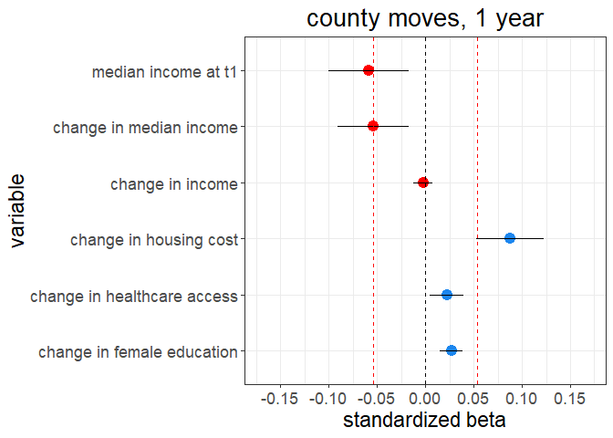<!-- -->

``` r
ggsave(
  "G:/My Drive/research/projects/niel/nielsen_analysis/relative_status_analysis/plots/grocery_spend_county_moves_1yr.png",
  grocery_spend_county_moves_1yr,
  width = 8,
  height = 6,
  dpi = 500
)
```

#### 2 years

``` r
 lm_f2 <-
    lmer(
      scale(yes_scale_t2) ~
        scale(yes_scale_t1) +
        
        scale(I(median_income_county_t2 - median_income_county_t1)) +
        median_income_county_scale_t1 +
        
        scale(I(physicians_scale_t2 - physicians_scale_t1)) +
        physicians_scale_t1 +
        
        # scale(I(dentists_t2 - dentists_t1)) +
        # scale(dentists_t1) +
        # 
        # scale(I(therapists_t2 - therapists_t1)) +
        # scale(therapists_t1) +
        
        scale(I(median_monthly_housing_cost_county_t2 - median_monthly_housing_cost_county_t1)) +
        median_monthly_housing_cost_county_scale_t1 +
        
        scale(I(income_t2 - income_t1)) +
        income_scale_t1 +
        
        scale(I(Male_Head_Education_t2 - Male_Head_Education_t1)) +
        Male_Head_Education_scale_t1 +
        
        scale(I(Female_Head_Education_t2 - Female_Head_Education_t1)) +
        Female_Head_Education_scale_t1 +
        
        scale(I(Male_Head_Age_t2 - Male_Head_Age_t1)) +
        Male_Head_Age_scale_t1 +
        
        scale(I(Female_Head_Age_t2 - Female_Head_Age_t1)) +
        Female_Head_Age_scale_t1 +
        
        scale(I(total_pop_county_t2 - total_pop_county_t1)) +
        total_pop_county_scale_t1 +
        
        scale(I(land_area_2010_t2 - land_area_2010_t1)) +
        land_area_2010_scale_t1 +
        
        scale(I(Household_Size_t2 - Household_Size_t1)) +
        Household_Size_scale_t1 +
        
        Race_t1 +
        
        Male_Head_Employment_t1 +
        Female_Head_Employment_t1 +
        Marital_Status_t1 +
        
        Male_Head_Employment_t2 +
        Female_Head_Employment_t2 +
        Marital_Status_t2 +
        
        year_t1 +
        
        (1 + scale(I(median_income_county_t2 - median_income_county_t1))|fips_code_t2) +
        (1|fips_code_t1) +
        (1|household_code) +
        (1|quarter),
      data =
        fips_movers_2yr_spend_data
    )
```

    ## Warning in checkConv(attr(opt, "derivs"), opt$par, ctrl = control$checkConv, :
    ## Model failed to converge with max|grad| = 0.00325565 (tol = 0.002, component 1)

``` r
summary(lm_f2)
```

    ## Linear mixed model fit by REML ['lmerMod']
    ## Formula: 
    ## scale(yes_scale_t2) ~ scale(yes_scale_t1) + scale(I(median_income_county_t2 -  
    ##     median_income_county_t1)) + median_income_county_scale_t1 +  
    ##     scale(I(physicians_scale_t2 - physicians_scale_t1)) + physicians_scale_t1 +  
    ##     scale(I(median_monthly_housing_cost_county_t2 - median_monthly_housing_cost_county_t1)) +  
    ##     median_monthly_housing_cost_county_scale_t1 + scale(I(income_t2 -  
    ##     income_t1)) + income_scale_t1 + scale(I(Male_Head_Education_t2 -  
    ##     Male_Head_Education_t1)) + Male_Head_Education_scale_t1 +  
    ##     scale(I(Female_Head_Education_t2 - Female_Head_Education_t1)) +  
    ##     Female_Head_Education_scale_t1 + scale(I(Male_Head_Age_t2 -  
    ##     Male_Head_Age_t1)) + Male_Head_Age_scale_t1 + scale(I(Female_Head_Age_t2 -  
    ##     Female_Head_Age_t1)) + Female_Head_Age_scale_t1 + scale(I(total_pop_county_t2 -  
    ##     total_pop_county_t1)) + total_pop_county_scale_t1 + scale(I(land_area_2010_t2 -  
    ##     land_area_2010_t1)) + land_area_2010_scale_t1 + scale(I(Household_Size_t2 -  
    ##     Household_Size_t1)) + Household_Size_scale_t1 + Race_t1 +  
    ##     Male_Head_Employment_t1 + Female_Head_Employment_t1 + Marital_Status_t1 +  
    ##     Male_Head_Employment_t2 + Female_Head_Employment_t2 + Marital_Status_t2 +  
    ##     year_t1 + (1 + scale(I(median_income_county_t2 - median_income_county_t1)) |  
    ##     fips_code_t2) + (1 | fips_code_t1) + (1 | household_code) +  
    ##     (1 | quarter)
    ##    Data: fips_movers_2yr_spend_data
    ## 
    ## REML criterion at convergence: 174193.6
    ## 
    ## Scaled residuals: 
    ##     Min      1Q  Median      3Q     Max 
    ## -9.5034 -0.5574 -0.0268  0.5282 10.3209 
    ## 
    ## Random effects:
    ##  Groups         Name                                                       
    ##  household_code (Intercept)                                                
    ##  fips_code_t2   (Intercept)                                                
    ##                 scale(I(median_income_county_t2 - median_income_county_t1))
    ##  fips_code_t1   (Intercept)                                                
    ##  quarter        (Intercept)                                                
    ##  Residual                                                                  
    ##  Variance Std.Dev. Corr 
    ##  0.445515 0.66747       
    ##  0.019729 0.14046       
    ##  0.015360 0.12393  -0.06
    ##  0.026392 0.16246       
    ##  0.001336 0.03655       
    ##  0.371239 0.60929       
    ## Number of obs: 80091, groups:  
    ## household_code, 11194; fips_code_t2, 1945; fips_code_t1, 1915; quarter, 4
    ## 
    ## Fixed effects:
    ##                                                                                           Estimate
    ## (Intercept)                                                                             -0.7481878
    ## scale(yes_scale_t1)                                                                      0.1429031
    ## scale(I(median_income_county_t2 - median_income_county_t1))                             -0.0761069
    ## median_income_county_scale_t1                                                           -0.0748147
    ## scale(I(physicians_scale_t2 - physicians_scale_t1))                                      0.0305164
    ## physicians_scale_t1                                                                      0.0375349
    ## scale(I(median_monthly_housing_cost_county_t2 - median_monthly_housing_cost_county_t1))  0.1227210
    ## median_monthly_housing_cost_county_scale_t1                                              0.1599982
    ## scale(I(income_t2 - income_t1))                                                          0.0130692
    ## income_scale_t1                                                                          0.0494292
    ## scale(I(Male_Head_Education_t2 - Male_Head_Education_t1))                                0.0398860
    ## Male_Head_Education_scale_t1                                                             0.1063723
    ## scale(I(Female_Head_Education_t2 - Female_Head_Education_t1))                            0.0234425
    ## Female_Head_Education_scale_t1                                                           0.0834297
    ## scale(I(Male_Head_Age_t2 - Male_Head_Age_t1))                                           -0.0168708
    ## Male_Head_Age_scale_t1                                                                  -0.0088816
    ## scale(I(Female_Head_Age_t2 - Female_Head_Age_t1))                                        0.0024943
    ## Female_Head_Age_scale_t1                                                                 0.0096160
    ## scale(I(total_pop_county_t2 - total_pop_county_t1))                                     -0.0131668
    ## total_pop_county_scale_t1                                                               -0.0177787
    ## scale(I(land_area_2010_t2 - land_area_2010_t1))                                          0.0007698
    ## land_area_2010_scale_t1                                                                  0.0066286
    ## scale(I(Household_Size_t2 - Household_Size_t1))                                         -0.0278866
    ## Household_Size_scale_t1                                                                 -0.0857120
    ## Race_t1                                                                                  0.0086836
    ## Male_Head_Employment_t1                                                                 -0.0034093
    ## Female_Head_Employment_t1                                                                0.0017069
    ## Marital_Status_t1                                                                        0.0071472
    ## Male_Head_Employment_t2                                                                  0.0011250
    ## Female_Head_Employment_t2                                                                0.0054700
    ## Marital_Status_t2                                                                        0.0015224
    ## year_t1                                                                                  0.0003142
    ##                                                                                         Std. Error
    ## (Intercept)                                                                              2.5859772
    ## scale(yes_scale_t1)                                                                      0.0035753
    ## scale(I(median_income_county_t2 - median_income_county_t1))                              0.0210729
    ## median_income_county_scale_t1                                                            0.0244185
    ## scale(I(physicians_scale_t2 - physicians_scale_t1))                                      0.0095806
    ## physicians_scale_t1                                                                      0.0112677
    ## scale(I(median_monthly_housing_cost_county_t2 - median_monthly_housing_cost_county_t1))  0.0198762
    ## median_monthly_housing_cost_county_scale_t1                                              0.0267812
    ## scale(I(income_t2 - income_t1))                                                          0.0040661
    ## income_scale_t1                                                                          0.0072279
    ## scale(I(Male_Head_Education_t2 - Male_Head_Education_t1))                                0.0064412
    ## Male_Head_Education_scale_t1                                                             0.0120074
    ## scale(I(Female_Head_Education_t2 - Female_Head_Education_t1))                            0.0048672
    ## Female_Head_Education_scale_t1                                                           0.0086488
    ## scale(I(Male_Head_Age_t2 - Male_Head_Age_t1))                                            0.0068507
    ## Male_Head_Age_scale_t1                                                                   0.0135308
    ## scale(I(Female_Head_Age_t2 - Female_Head_Age_t1))                                        0.0049444
    ## Female_Head_Age_scale_t1                                                                 0.0096556
    ## scale(I(total_pop_county_t2 - total_pop_county_t1))                                      0.0190714
    ## total_pop_county_scale_t1                                                                0.0266465
    ## scale(I(land_area_2010_t2 - land_area_2010_t1))                                          0.0112113
    ## land_area_2010_scale_t1                                                                  0.0137091
    ## scale(I(Household_Size_t2 - Household_Size_t1))                                          0.0041323
    ## Household_Size_scale_t1                                                                  0.0074752
    ## Race_t1                                                                                  0.0077663
    ## Male_Head_Employment_t1                                                                  0.0020963
    ## Female_Head_Employment_t1                                                                0.0016141
    ## Marital_Status_t1                                                                        0.0077170
    ## Male_Head_Employment_t2                                                                  0.0019744
    ## Female_Head_Employment_t2                                                                0.0015131
    ## Marital_Status_t2                                                                        0.0079112
    ## year_t1                                                                                  0.0012849
    ##                                                                                         t value
    ## (Intercept)                                                                              -0.289
    ## scale(yes_scale_t1)                                                                      39.970
    ## scale(I(median_income_county_t2 - median_income_county_t1))                              -3.612
    ## median_income_county_scale_t1                                                            -3.064
    ## scale(I(physicians_scale_t2 - physicians_scale_t1))                                       3.185
    ## physicians_scale_t1                                                                       3.331
    ## scale(I(median_monthly_housing_cost_county_t2 - median_monthly_housing_cost_county_t1))   6.174
    ## median_monthly_housing_cost_county_scale_t1                                               5.974
    ## scale(I(income_t2 - income_t1))                                                           3.214
    ## income_scale_t1                                                                           6.839
    ## scale(I(Male_Head_Education_t2 - Male_Head_Education_t1))                                 6.192
    ## Male_Head_Education_scale_t1                                                              8.859
    ## scale(I(Female_Head_Education_t2 - Female_Head_Education_t1))                             4.816
    ## Female_Head_Education_scale_t1                                                            9.646
    ## scale(I(Male_Head_Age_t2 - Male_Head_Age_t1))                                            -2.463
    ## Male_Head_Age_scale_t1                                                                   -0.656
    ## scale(I(Female_Head_Age_t2 - Female_Head_Age_t1))                                         0.504
    ## Female_Head_Age_scale_t1                                                                  0.996
    ## scale(I(total_pop_county_t2 - total_pop_county_t1))                                      -0.690
    ## total_pop_county_scale_t1                                                                -0.667
    ## scale(I(land_area_2010_t2 - land_area_2010_t1))                                           0.069
    ## land_area_2010_scale_t1                                                                   0.484
    ## scale(I(Household_Size_t2 - Household_Size_t1))                                          -6.748
    ## Household_Size_scale_t1                                                                 -11.466
    ## Race_t1                                                                                   1.118
    ## Male_Head_Employment_t1                                                                  -1.626
    ## Female_Head_Employment_t1                                                                 1.057
    ## Marital_Status_t1                                                                         0.926
    ## Male_Head_Employment_t2                                                                   0.570
    ## Female_Head_Employment_t2                                                                 3.615
    ## Marital_Status_t2                                                                         0.192
    ## year_t1                                                                                   0.245

    ## 
    ## Correlation matrix not shown by default, as p = 32 > 12.
    ## Use print(x, correlation=TRUE)  or
    ##     vcov(x)        if you need it

    ## convergence code: 0
    ## Model failed to converge with max|grad| = 0.00325565 (tol = 0.002, component 1)

``` r
tidy_lm_f2 <- tidy(lm_f2)
tidy_lm_f2
```

    ## # A tibble: 39 x 6
    ##    effect group term                                estimate std.error statistic
    ##    <chr>  <chr> <chr>                                  <dbl>     <dbl>     <dbl>
    ##  1 fixed  <NA>  (Intercept)                          -0.748    2.59       -0.289
    ##  2 fixed  <NA>  scale(yes_scale_t1)                   0.143    0.00358    40.0  
    ##  3 fixed  <NA>  scale(I(median_income_county_t2 - ~  -0.0761   0.0211     -3.61 
    ##  4 fixed  <NA>  median_income_county_scale_t1        -0.0748   0.0244     -3.06 
    ##  5 fixed  <NA>  scale(I(physicians_scale_t2 - phys~   0.0305   0.00958     3.19 
    ##  6 fixed  <NA>  physicians_scale_t1                   0.0375   0.0113      3.33 
    ##  7 fixed  <NA>  scale(I(median_monthly_housing_cos~   0.123    0.0199      6.17 
    ##  8 fixed  <NA>  median_monthly_housing_cost_county~   0.160    0.0268      5.97 
    ##  9 fixed  <NA>  scale(I(income_t2 - income_t1))       0.0131   0.00407     3.21 
    ## 10 fixed  <NA>  income_scale_t1                       0.0494   0.00723     6.84 
    ## # ... with 29 more rows

##### Plotting coefficients

``` r
est <- 
  tidy_lm_f2 %>% 
  dplyr::filter(term == "scale(I(median_income_county_t2 - median_income_county_t1))") %>% 
  dplyr::select(estimate)

sjPlot::plot_model(lm_f2) +
  ylim(-0.15, 0.15) +
  labs(title = "predicting % of spend consumption in healthy categories") +
  geom_hline(yintercept = -abs(est$estimate), linetype = "dashed") +
  geom_hline(yintercept = abs(est$estimate), linetype = "dashed")
```

    ## Scale for 'y' is already present. Adding another scale for 'y', which will
    ## replace the existing scale.

    ## Warning: Removed 1 rows containing missing values (geom_point).

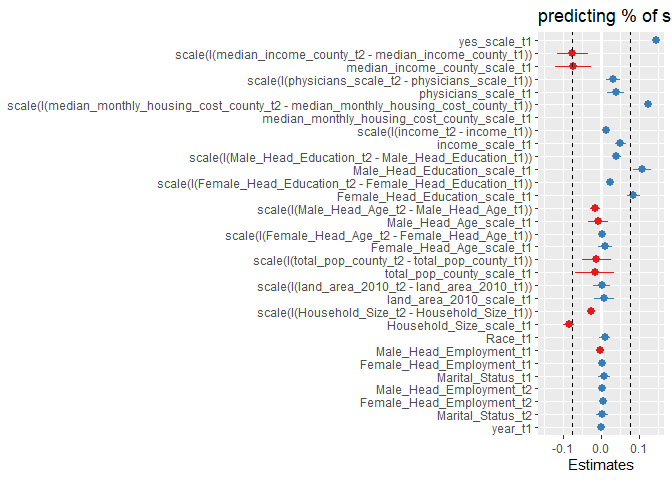<!-- -->

``` r
tidy_lm_f2 <- tidy(lm_f2)

est <- 
  tidy_lm_f2 %>% 
  dplyr::filter(term == "scale(I(median_income_county_t2 - median_income_county_t1))") %>% 
  dplyr::select(estimate)

tidy_lm_f2 <-
  tidy_lm_f2 %>% 
  mutate(
    dot_color = ifelse(estimate < 0, "red1", ifelse(estimate > 0, "dodgerblue2", NA)),
    se = std.error
  )

tidy_lm_f2 <-
  tidy_lm_f2 %>% 
  filter(
    term == "scale(I(median_income_county_t2 - median_income_county_t1))" |
    term == "median_income_county_scale_t1" |
    term == "scale(I(physicians_scale_t2 - physicians_scale_t1))" | 
    term == "scale(I(median_monthly_housing_cost_county_t2 - median_monthly_housing_cost_county_t1))" | 
    term == "scale(I(income_t2 - income_t1))" | 
    term == "scale(I(Female_Head_Education_t2 - Female_Head_Education_t1))" 
  ) %>% 
  mutate(
    variable = 
      case_when(
        term == "scale(I(median_income_county_t2 - median_income_county_t1))" ~ "change in median income",
        term == "median_income_county_scale_t1"  ~ "median income at t1",
        term == "scale(I(physicians_scale_t2 - physicians_scale_t1))"  ~ "change in healthcare access",
        term == "scale(I(median_monthly_housing_cost_county_t2 - median_monthly_housing_cost_county_t1))"  ~ "change in housing cost", 
        term == "scale(I(income_t2 - income_t1))"  ~ "change in income",
        term == "scale(I(Female_Head_Education_t2 - Female_Head_Education_t1))"  ~ "change in female education"
      )
  ) 

col <- as.character(tidy_lm_f2$dot_color)
names(col) <- as.character(tidy_lm_f2$dot_color)

grocery_spend_county_moves_2yr <-
  tidy_lm_f2 %>% 
  ggplot(aes(variable, estimate)) +
  geom_point(aes(color = dot_color), size = 4) +
  geom_errorbar(aes(ymin = estimate - 2 * se, ymax = estimate + 2 * se), width = 0) + 
  scale_color_manual(values = col) +
  geom_hline(yintercept = -abs(est$estimate), linetype = "dashed", color = "red") +
  geom_hline(yintercept = 0, linetype = "dashed") +
  geom_hline(yintercept = abs(est$estimate), linetype = "dashed", color = "red") +
  scale_y_continuous(
    breaks = c(-0.15, -0.1, -0.05, 0, 0.05, 0.1, 0.15),
    limits = c(-0.17, 0.17)
  ) +
  labs(
    y = "standardized beta",
    title = "county moves, 2 year"
  ) +
  theme_bw() +
  theme(
    text = element_text(size = 17),
    plot.title = element_text(hjust = 0.5),
    legend.position = "none"
  ) +
  coord_flip()

grocery_spend_county_moves_2yr
```

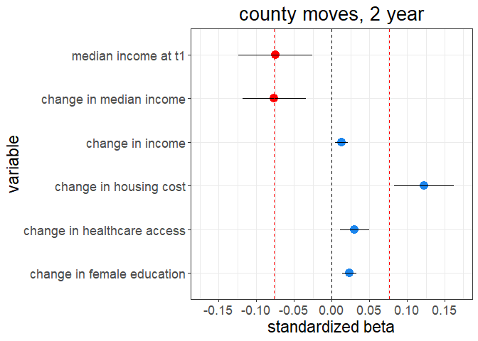<!-- -->

``` r
ggsave(
  "G:/My Drive/research/projects/niel/nielsen_analysis/relative_status_analysis/plots/grocery_spend_county_moves_2yr.png",
  grocery_spend_county_moves_2yr,
  width = 8,
  height = 6,
  dpi = 500
)
```
